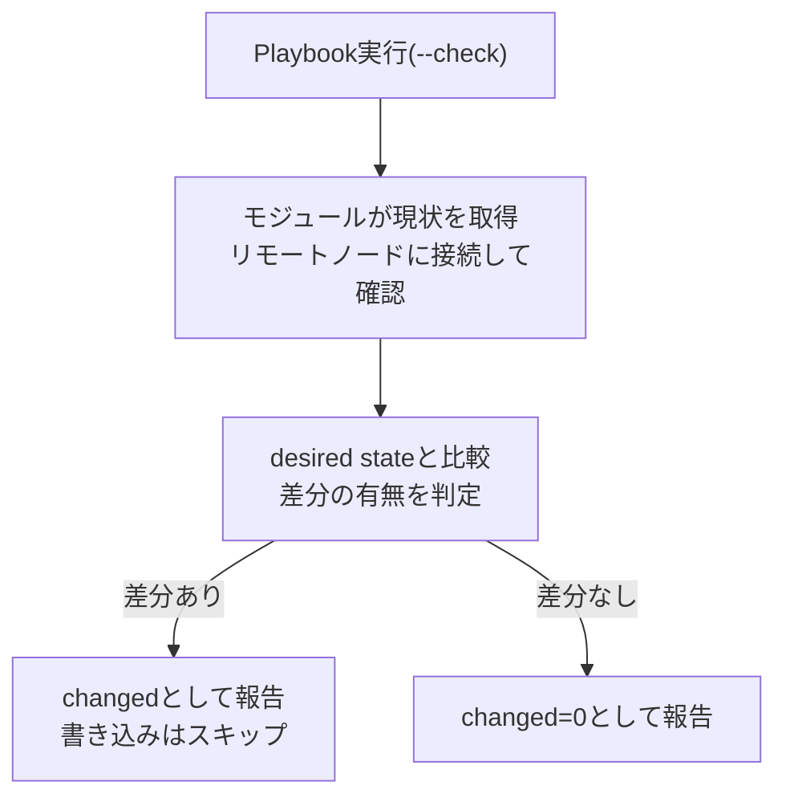

> **🗺️ 初めての方・シリーズの全体像を知りたい方はこちら**
> 
> シリーズ全体については、以下のまとめブログで整理しています。
> 
> → **「Ansibleは冪等なのに、なぜサーバは壊れていくのか」シリーズまとめブログ** **※近日公開予定**

---

## 📋 目次

1. [はじめに](#1-はじめに)
2. [`--check`モードはドリフト検知として使えるのか](#2---checkモードはドリフト検知として使えるのか)
3. [`--check`がドリフトを検知できるケース](#3---checkがドリフトを検知できるケース)
4. [`--check`がドリフトを検知できないケース](#4---checkがドリフトを検知できないケース)
5. [`--diff`モードの用途と限界](#5---diffモードの用途と限界)
6. [「`--check`で問題が出なかった＝ドリフトがない」ではない](#6---checkで問題が出なかったドリフトがないではない)
7. [まとめ](#7-まとめ)
8. [次回予告](#8-次回予告)
9. [連載一覧：「Ansibleは冪等なのに、なぜサーバは壊れていくのか」](#9-連載一覧ansibleは冪等なのになぜサーバは壊れていくのか)

---

## 1. はじめに

**[第1回](https://juehara-crypto.github.io/blog/infra/ansible/ansible-drift/ansible-drift-01/)** では、手動変更によるドリフトの構造を確認しました。templateモジュールで管理しているファイルは、Playbook再実行時に手動変更を検出して上書きします。lineinfileモジュールは、管理している行は上書きしますが、管理していない行の手動変更はそのまま残します。どちらのケースも、「次のAnsible実行まで気づかれない」という時間的な空白が問題の本質でした。

第2回はその続きとして、「ドリフトが起きているかどうかを`--check`で確認しようとしたときに、何が分かり、何が分からないか」を扱います。

**[冪等性シリーズ第9回](https://juehara-crypto.github.io/blog/infra/ansible/ansible-idempotency/ansible-idempotency-09/)** でも`--check`の限界を扱いましたが、あちらは「Playbookの冪等性確認ツールとしての限界」という文脈でした。shell/commandモジュールが`--check`時にスキップされること、`register`や`when`を使った構成で実行経路がずれることを確認しています。

この回はその内容を前提として引き継ぎながら、「ドリフト検知ツールとしての限界」という別の角度から整理します。

---

[↑ 目次に戻る](#-目次)

---

## 2. `--check`モードはドリフト検知として使えるのか

ドリフトが起きているかどうかを確認したいとき、`--check`モードを使うことを思い浮かべる人は多いと思います。この回では、「使えるケースと使えないケースがある」という立場で整理します。

まず、`--check`モードが何をしているかを確認します。`--check`は`ansible-playbook`に指定するコマンドラインオプションで、Playbookの実行フロー自体は通常実行と同じです。各モジュールはリモートノードに接続し、現在の状態を通常通り取得した上で、desired stateとの差分を判定します。異なるのは、差分があると判定された場合でも、実際の変更(ファイルへの書き込みなど)は行わないという点です。判定の結果は通常実行と同じように`changed`として返されます。

この流れを図に整理します。



「現状取得」と「差分判定」は通常実行と同じ経路をたどり、分岐が発生するのは最後の「実際に書き込みを行うかどうか」という一点だけです。この「現状取得と差分判定は行うが、実際の変更は行わない」という仕組みが、ドリフト検知として有効に機能するケースと、機能しないケースの両方を生みます。次のセクションから、この2つを分けて整理します。

---

[↑ 目次に戻る](#-目次)

---

## 3. `--check`がドリフトを検知できるケース

templateモジュールで管理しているファイルが手動変更された場合を取り上げます。

**[第1回](https://juehara-crypto.github.io/blog/infra/ansible/ansible-drift/ansible-drift-01/)** の検証で、templateモジュールはファイル全体をdesired stateとして管理しているため、手動変更による差分を正しく検出することを確認しました。この特性は`--check`実行時にも同様に働きます。手動変更されたファイルに対して`--check`を実行すると、モジュールが差分を検出して`changed=1`を返します。

このケースでは、`--check`はドリフト検知として有効に機能することを実機で確認します。「Ansibleが管理しているファイルに差分がある」という条件が揃っていれば、`--check`はドリフトの存在を示す手がかりとして使えます。

検証には、**[第1回](https://juehara-crypto.github.io/blog/infra/ansible/ansible-drift/ansible-drift-01/)** セクション4で使用した`playbooks/configure_nginx.yml`(templateモジュール、`worker_connections`を管理)をそのまま使用します。**[第1回](https://juehara-crypto.github.io/blog/infra/ansible/ansible-drift/ansible-drift-01/)** の検証により、現時点で全ノードの`worker_connections`は`768`(desired state)に揃っている状態です。


```plaintext
1.【事前確認（1回目の実行）】
↓
2.【手動設定】
↓
3.【2回目の実行（--checkモード）】
```

の順に検証します。今回は「2回目の実行」を通常実行ではなく`--check`オプション付きで行い、ファイルへの書き込みを行わずに差分を検知できるかを確認する点が、**[第1回](https://juehara-crypto.github.io/blog/infra/ansible/ansible-drift/ansible-drift-01/)** の検証との違いです。

---

### ■ 検証内容（templateモジュール管理下のファイルに対する手動変更後、`--check`実行で検知できるか）

#### 1.【事前確認（1回目の実行）】

【コントローラーノード側】  
**ファイル名:** playbooks/configure_nginx.yml(**[第1回](https://juehara-crypto.github.io/blog/infra/ansible/ansible-drift/ansible-drift-01/)** で使用したものと同一)

**実行コマンド**

```plaintext
ansible-playbook -i inventory.ini playbooks/configure_nginx.yml
```

第1回の検証で全ノードのdesired stateへの復元が確認済みのため、ここでは`changed=0`になることの再確認のみ行います。

**▼ 実行結果**

```
PLAY [Configure nginx worker settings] ******************************************************************************************************************************************************

TASK [nginx.confをtemplateで配置する] *******************************************************************************************************************************************************
ok: [ubuntu-node3]
ok: [ubuntu-node2]
ok: [ubuntu-node1]

PLAY RECAP **********************************************************************************************************************************************************************************
ubuntu-node1               : ok=1    changed=0    unreachable=0    failed=0    skipped=0    rescued=0    ignored=0
ubuntu-node2               : ok=1    changed=0    unreachable=0    failed=0    skipped=0    rescued=0    ignored=0
ubuntu-node3               : ok=1    changed=0    unreachable=0    failed=0    skipped=0    rescued=0    ignored=0
```

【リモートノード側】  
※以下の通り、`worker_connections 768;`で3ノードともに値が揃っていることを確認済み

・ubuntu-node1（192.168.56.31）
```
events {
        worker_connections 768;
        # multi_accept on;
}
```

・ubuntu-node2（192.168.56.32）
```
events {
        worker_connections 768;
        # multi_accept on;
}
```

・ubuntu-node3（192.168.56.33）
```
events {
        worker_connections 768;
        # multi_accept on;
}
```

---

#### 2.【手動設定】

ubuntu-node1上で、障害対応を想定し`worker_connections`を手動で書き換えます。**[第1回](https://juehara-crypto.github.io/blog/infra/ansible/ansible-drift/ansible-drift-01/)** と同じ操作内容ですが、`--check`の検知確認という別の検証目的のため、あらためて実施します。

実行コマンド：

```plaintext
sudo sed -i 's/worker_connections 768;/worker_connections 2048;/' /etc/nginx/nginx.conf
sudo systemctl reload nginx
```

変更前のファイル内容（該当行）：

```plaintext
events {
        worker_connections 768;
        # multi_accept on;
}
```

変更後のファイル内容（該当行）：

```plaintext
events {
        worker_connections 2048;
        # multi_accept on;
}
```

---

#### 3.【2回目の実行（--checkモード）】

実行コマンド：

```plaintext
ansible-playbook -i inventory.ini playbooks/configure_nginx.yml --check
```

**▼ 実行結果**

```plaintext
PLAY [Configure nginx worker settings] ******************************************************************************************************************************************************

TASK [nginx.confをtemplateで配置する] *******************************************************************************************************************************************************
changed: [ubuntu-node1]
ok: [ubuntu-node2]
ok: [ubuntu-node3]

RUNNING HANDLER [reload nginx] **************************************************************************************************************************************************************
changed: [ubuntu-node1]

PLAY RECAP **********************************************************************************************************************************************************************************
ubuntu-node1               : ok=2    changed=2    unreachable=0    failed=0    skipped=0    rescued=0    ignored=0
ubuntu-node2               : ok=1    changed=0    unreachable=0    failed=0    skipped=0    rescued=0    ignored=0
ubuntu-node3               : ok=1    changed=0    unreachable=0    failed=0    skipped=0    rescued=0    ignored=0
```

【リモートノード側】  
・ubuntu-node1（192.168.56.31）

**※`--check`実行後のファイル内容（該当行）：**

```plaintext
events {
        worker_connections 2048;
        # multi_accept on;
}
```

---

#### ■ 結果

`--check`実行後、手動変更を加えたubuntu-node1のみ`changed=2`となり、変更を加えていないubuntu-node2・ubuntu-node3は`changed=0`のままでした。

この`changed=2`の内訳は、templateタスク自体の判定結果(1)と、そのタスクに`notify`で紐づいているhandler(reload nginx)の分(1)です。`--check`モードであっても、templateタスクが差分を検出すると`changed`と判定され、`notify`の仕組み上、`changed`になったタスクに紐づくhandlerは「実行される予定」として扱われるため、こちらも`changed`としてカウントされます。ただし`--check`モードでは実際の書き込みが行われないため、handler自体(nginxのreload)も実際には実行されていません。この`changed=2`という内訳は、通常実行時にubuntu-node1で発生する`changed`の内容(**[第1回](https://juehara-crypto.github.io/blog/infra/ansible/ansible-drift/ansible-drift-01/)** セクション4)と一致します。

一方、リモートノード側でubuntu-node1の`/etc/nginx/nginx.conf`を確認すると、`worker_connections`は`2048`のままであり、手動変更は書き込まれていませんでした。`--check`モードは実際の変更を加えないため、templateタスクが検出した差分は判定結果としてのみ返され、handlerによるnginxのreloadも実際には行われていません。

この結果から、`--check`はtemplateモジュールが管理しているファイルの手動変更を、`changed`という形で正しく検知できることが分かります。同時に、`changed=2`という数字は「変更が必要な箇所の数」を示しているのであって、「実際に変更された箇所の数」ではないという点も、この検証から確認できます。「Ansibleが管理しているファイルに差分がある」という条件が揃っていれば、`--check`はドリフトの存在を示す手がかりとして有効に機能します。

---

[↑ 目次に戻る](#-目次)

---

## 4. `--check`がドリフトを検知できないケース

`--check`を実行しても`changed=0`になり、ドリフトが検知されないケースを整理します。

> **shellモジュールで管理している処理**

shellモジュールはデフォルトで`--check`時にスキップされます。**[冪等性シリーズ第9回](https://juehara-crypto.github.io/blog/infra/ansible/ansible-idempotency/ansible-idempotency-09/)** で確認した動作が、ここでも同様に現れます。

セクション2で確認した仕組みは、「現状取得と差分判定は行うが、実際の変更だけを行わない」というものでした。shellモジュールはこの前提に当てはまりません。`--check`時は現状取得や差分判定そのものが行われず、タスクが`skipping`として実行自体をスキップされます。shellモジュールが管理している状態に変化があっても、判定のプロセスに乗らないため、`--check`では検知されません。

> **Ansible管理外のファイルやプロセスの変化**

Playbookに記述されていない要素は、そもそも`--check`の確認対象になりません。Ansibleが知らない変化は検知できません。**[第0回](https://juehara-crypto.github.io/blog/infra/ansible/ansible-drift/ansible-drift-00/)** で整理したドリフトの発生経路のうち、「Ansible以外のツールによる変更」「ソフトウェアの自己書き換え」はこのケースに該当します。

> **パッケージのマイナーアップデート**

`state: present`で管理しているパッケージがマイナーアップデートされても、「インストール済みである」という条件を満たしているため、差分としては検出されません。**[冪等性シリーズ第4回](https://juehara-crypto.github.io/blog/infra/ansible/ansible-idempotency/ansible-idempotency-04/)** で扱った`state: present`の動作が、ここでも関係します。

これらを表に整理します。

|ケース|`--check`での検知|理由|
|---|---|---|
|templateで管理しているファイルの手動変更|検知できる|モジュールがファイル全体の差分を検出する|
|shellモジュールで管理している処理の変化|検知できない|現状取得・差分判定自体が行われず、タスクがスキップされる|
|Ansible管理外のファイル・プロセスの変化|検知できない|Playbookの確認対象外である|
|パッケージのマイナーアップデート|検知できない|インストール済みの条件を満たしているため差分なしと判断される|

---

[↑ 目次に戻る](#-目次)

---

## 5. `--diff`モードの用途と限界

`--diff`モードは、`template`や`copy`、`file`モジュールが`changed=1`になったとき、変更前後のファイル差分を表示するモードです。

`--check`と組み合わせることで、「実際の変更を加えずに何がずれているかを可視化する」という用途で使えます。ドリフトがある場合に、「何がずれているか」の内容を確認する手段として有用です。

`--diff`には次の限界があります。

- Ansible管理外のファイルやプロセスの変化は表示されない
- 差分の内容が意図通りかどうかの判断は、人間が行う必要がある
- `--check`と組み合わせた場合は、`--check`の限界をそのまま引き継ぐ

`--diff`は「差分の存在」を確認するツールではなく、「差分の内容」を確認するためのツールです。この位置づけを踏まえた上で、次のセクションでは「`--check`で問題が出なかったこと」がドリフトの不在を意味するかどうかを確認します。

---

[↑ 目次に戻る](#-目次)

---

## 6. 「`--check`で問題が出なかった＝ドリフトがない」ではない


Ansible管理外の変化に対して`--check`が機能しないことを実機で確認します。

検証には、**[第1回](https://juehara-crypto.github.io/blog/infra/ansible/ansible-drift/ansible-drift-01/)** セクション5で使用した`playbooks/configure_nginx_worker_processes.yml`(lineinfileモジュール、`worker_processes`の行のみを管理)をそのまま使用します。このPlaybookが管理しているのは`worker_processes`の行だけであり、同じファイル内の`# multi_accept on;`の行は管理範囲外です。**[第1回](https://juehara-crypto.github.io/blog/infra/ansible/ansible-drift/ansible-drift-01/)** の検証では、この管理外の行への手動変更が通常実行後も残り続けることを確認しました。今回は同じ管理外の行を使い、`--check`実行でもその変化が検知されないことを確認します。


```plaintext
1.【事前確認（1回目の実行）】
↓
2.【手動設定（管理外の行のみ変更）】
↓
3.【2回目の実行（--checkモード）】
```

の順に検証します。今回は`worker_processes`(管理下の行)には触れず、`# multi_accept on;`(管理外の行)のみを手動変更する点が、セクション3の検証との違いです。

---

### ■ 検証内容（lineinfile管理外の行に対する手動変更が、`--check`で検知されるか）

#### 1.【事前確認（1回目の実行）】

【コントローラーノード側】  
**ファイル名:** playbooks/configure_nginx_worker_processes.yml(※**[第1回](https://juehara-crypto.github.io/blog/infra/ansible/ansible-drift/ansible-drift-01/)** で使用したものと同一)

```plaintext
- name: Configure nginx worker_processes (lineinfile)
  hosts: nodes
  become: true
  gather_facts: false
  tasks:
    - name: worker_processesの値を管理する
      ansible.builtin.lineinfile:
        path: /etc/nginx/nginx.conf
        regexp: '^worker_processes\s+.*;'
        line: 'worker_processes auto;'
      notify: reload nginx

  handlers:
    - name: reload nginx
      ansible.builtin.systemd:
        name: nginx
        state: reloaded
```


**実行コマンド**

```plaintext
ansible-playbook -i inventory.ini playbooks/configure_nginx_worker_processes.yml
```

**[第1回](https://juehara-crypto.github.io/blog/infra/ansible/ansible-drift/ansible-drift-01/)** の検証で全ノードのdesired stateへの復元が確認済みのため、ここでは`changed=0`になることの再確認のみ行います。

**▼ 実行結果**

```plaintext
PLAY [Configure nginx worker_processes (lineinfile)] ****************************************************************************************************************************************

TASK [worker_processesの値を管理する] *******************************************************************************************************************************************************
ok: [ubuntu-node1]
ok: [ubuntu-node3]
ok: [ubuntu-node2]

PLAY RECAP **********************************************************************************************************************************************************************************
ubuntu-node1               : ok=1    changed=0    unreachable=0    failed=0    skipped=0    rescued=0    ignored=0
ubuntu-node2               : ok=1    changed=0    unreachable=0    failed=0    skipped=0    rescued=0    ignored=0
ubuntu-node3               : ok=1    changed=0    unreachable=0    failed=0    skipped=0    rescued=0    ignored=0
```

【リモートノード側】  
・ubuntu-node1〜3：`worker_processes auto;`(管理下)、`# multi_accept on;`(管理外)がともに揃っていることを確認

・ubuntu-node1（192.168.56.31）
```plaintext
worker_processes auto;
pid /run/nginx.pid;
include /etc/nginx/modules-enabled/*.conf;

events {
        worker_connections 768;
        # multi_accept on;
}
```

・ubuntu-node2（192.168.56.32）
```plaintext
worker_processes auto;
pid /run/nginx.pid;
include /etc/nginx/modules-enabled/*.conf;

events {
        worker_connections 768;
        # multi_accept on;
}
```

・ubuntu-node3（192.168.56.33）
```
worker_processes auto;
pid /run/nginx.pid;
include /etc/nginx/modules-enabled/*.conf;

events {
        worker_connections 768;
        # multi_accept on;
}
```


---

#### 2.【手動設定】

ubuntu-node1上で、`# multi_accept on;`(管理外の行)のみコメントを解除します。`worker_processes`(管理下の行)は変更しません。

実行コマンド：

```plaintext
sudo sed -i 's/^        # multi_accept on;/        multi_accept on;/' /etc/nginx/nginx.conf
sudo systemctl reload nginx
```

変更前のファイル内容（該当行）：

```
worker_processes auto;
pid /run/nginx.pid;
include /etc/nginx/modules-enabled/*.conf;

events {
        worker_connections 768;
        # multi_accept on;
}
```

変更後のファイル内容（該当行）：

```
worker_processes auto;
pid /run/nginx.pid;
include /etc/nginx/modules-enabled/*.conf;

events {
        worker_connections 768;
        multi_accept on;
}
```

---

#### ３．【2回目の実行（--checkモード）】

実行コマンド：

```plaintext
ansible-playbook -i inventory.ini playbooks/configure_nginx_worker_processes.yml --check
```

**▼ 実行結果**

```plaintext
PLAY [Configure nginx worker_processes (lineinfile)] ****************************************************************************************************************************************

TASK [worker_processesの値を管理する] *******************************************************************************************************************************************************
ok: [ubuntu-node1]
ok: [ubuntu-node2]
ok: [ubuntu-node3]

PLAY RECAP **********************************************************************************************************************************************************************************
ubuntu-node1               : ok=1    changed=0    unreachable=0    failed=0    skipped=0    rescued=0    ignored=0
ubuntu-node2               : ok=1    changed=0    unreachable=0    failed=0    skipped=0    rescued=0    ignored=0
ubuntu-node3               : ok=1    changed=0    unreachable=0    failed=0    skipped=0    rescued=0    ignored=0
```

【リモートノード側】  
・ubuntu-node1（192.168.56.31）

**※`--check`実行後のファイル内容（該当行）：**

```
worker_processes auto;
pid /run/nginx.pid;
include /etc/nginx/modules-enabled/*.conf;

events {
        worker_connections 768;
        multi_accept on;
}
```

---

#### ■ 結果

`--check`実行後、`multi_accept on;`の手動変更を加えたubuntu-node1を含め、全ノードが`changed=0`のままでした。事前確認(1回目の実行)と同じ結果であり、`--check`はこの手動変更を差分として一切検出しませんでした。

一方、リモートノード側でubuntu-node1の`/etc/nginx/nginx.conf`を確認すると、`multi_accept on;`のコメント解除はそのまま残っていました。`worker_processes`(管理下の行)には手を加えていないため、そちらも`auto`のまま変化していません。

この結果から、`--check`が確認しているのはあくまで「Playbookが管理している範囲」の差分であり、その範囲外で起きた変化は`--check`の確認対象にすら含まれないことが分かります。セクション3の検証(templateモジュール・管理下の変更)では`--check`が`changed=2`として差分を正しく検知しましたが、今回のケースでは同じ`--check`でありながら`changed=0`という正反対の結果になりました。この違いを分けているのは、手動変更が「管理下にあるか、管理外にあるか」という一点だけです。

`--check`で`changed=0`という結果が返ってきたとしても、それは「Playbookが管理している範囲に限って差分がなかった」ことを意味するのであって、サーバ全体がdesired stateと一致していることを意味しません。「`--check`で問題が出なかった」は、ドリフトがないことの証明にはならないことが、この検証で確認できました。

---

[↑ 目次に戻る](#-目次)

---

## 7. まとめ

この回で整理した内容を確認します。

- `--check`はAnsibleが管理している範囲の差分しか検知できない
- templateモジュールで管理しているファイルの手動変更は、`--check`で検知できる。ただし`changed`の数字は「変更が必要と判定された箇所の数」であり、「実際に書き込まれた箇所の数」ではない
- shellモジュールが管理している処理、Ansible管理外の変化、パッケージのマイナーアップデートは、`--check`では検知できない
- `--diff`は差分の内容を可視化できるが、Ansible管理外の変化には機能しない
- 「`--check`で問題が出なかった」は、ドリフトがないことを意味しない
---

[↑ 目次に戻る](#-目次)

---

## 8. 次回予告

次回は、「なぜドリフトは気づかれないまま進むのか」を扱います。

`--check`が機能しない場面の中でも、特に`changed`が出ない「静かなドリフト」がどのように放置されていくのかを整理します。

**[次回：第3回：なぜドリフトは気づかれないまま進むのか](https://juehara-crypto.github.io/blog/infra/ansible/ansible-drift/ansible-drift-03/)**

---

📑 連載の移動　**[前の記事：【構成ドリフト編】 第1回](https://juehara-crypto.github.io/blog/infra/ansible/ansible-drift/ansible-drift-01/)　｜　[次の記事：【構成ドリフト編】 第3回](https://juehara-crypto.github.io/blog/infra/ansible/ansible-drift/ansible-drift-03/)**

---

> **🗺️ 初めての方・シリーズの全体像を知りたい方はこちら**
> 
> シリーズ全体については、以下のまとめブログで整理しています。
> 
> → **「Ansibleは冪等なのに、なぜサーバは壊れていくのか」シリーズまとめブログ** **※近日公開予定**

---

[↑ 目次に戻る](#-目次)

---

## 9. 連載一覧：「Ansibleは冪等なのに、なぜサーバは壊れていくのか」

| 回                                                                                              | タイトル                          | 内容（概要）                                                                                                                  |
| ---------------------------------------------------------------------------------------------- | ----------------------------- | ----------------------------------------------------------------------------------------------------------------------- |
| **[第0回](https://juehara-crypto.github.io/blog/infra/ansible/ansible-drift/ansible-drift-00/)** | なぜAnsibleで管理しているのにサーバはずれていくのか | 構成ドリフトを「Playbookで定義したdesired stateと実際のサーバの状態がずれていく現象」として定義し、冪等性シリーズとの違いを整理する。ドリフトが「Ansibleが実行されていない時間」に起きる問題であることを理解する。 |
| **[第1回](https://juehara-crypto.github.io/blog/infra/ansible/ansible-drift/ansible-drift-01/)** | なぜ手動変更はAnsibleの管理を壊すのか        | 障害対応や一時的な直接編集がドリフトを生む構造を、`template`と`lineinfile`の挙動の違いを通して理解する。手動変更が「次にAnsibleが実行されるまで気づかれない」空白を作ることを整理する。              |
| **[第2回](https://juehara-crypto.github.io/blog/infra/ansible/ansible-drift/ansible-drift-02/)**                                                                                            | なぜdriftは`--check`で検知できないのか    | `--check`/`--diff`モードをドリフト検知の手段として使う場合の限界を整理する。検知できるケースと検知できないケースを実機で切り分け、「`--check`で問題が出ない＝ドリフトがない」ではないことを理解する。        |
| **[第3回](https://juehara-crypto.github.io/blog/infra/ansible/ansible-drift/ansible-drift-03/)**                                                                                            | なぜドリフトは気づかれないまま進むのか           | `changed`が出ない「静かなドリフト」の構造を扱う。cronジョブやアプリケーションの自己書き換え、パッケージの自動更新など、Ansible管理外で起きる変化がPlaybook実行結果に現れない理由を理解する。            |
| 第4回                                                                                            | ドリフトを検知して修正する設計               | シリーズの結論として、ドリフトを「防ぐ」「検知する」「修正する」の3つの設計パターンを整理する。定期実行・アラート化・自動修正フローなど、運用に組み込むための具体的な設計を扱う。                               |

---

[↑ 目次に戻る](#-目次)

---
