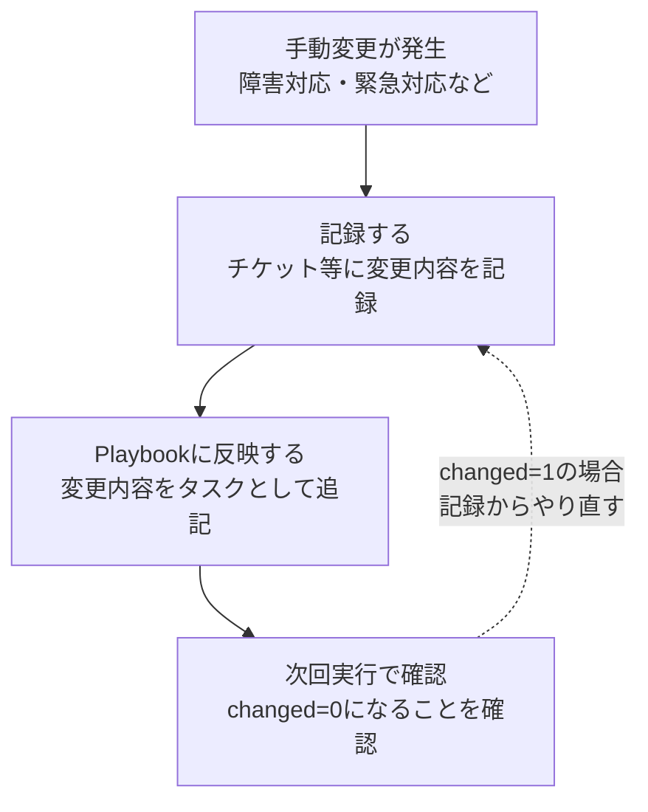

> **🗺️ 初めての方・シリーズの全体像を知りたい方はこちら**
> 
> シリーズ全体については、以下のまとめブログで整理しています。
> 
> → **「Ansibleは冪等なのに、なぜサーバは壊れていくのか」シリーズまとめブログ** **※近日公開予定**

---

## 📋 目次

1. [はじめに](#1-はじめに)
2. [ドリフトへの対処は3つの設計がセットで必要である](#2-ドリフトへの対処は3つの設計がセットで必要である)
3. [ドリフトを防ぐ設計](#3-ドリフトを防ぐ設計)
4. [ドリフトを検知する設計](#4-ドリフトを検知する設計)
5. [ドリフトを修正する設計](#5-ドリフトを修正する設計)
6. [ドリフトの問題はAnsible単体では完結しない](#6-ドリフトの問題はansible単体では完結しない)
7. [まとめ](#7-まとめ)
8. [おわりに](#8-おわりに)
9. [連載一覧：「Ansibleは冪等なのに、なぜサーバは壊れていくのか」](#9-連載一覧ansibleは冪等なのになぜサーバは壊れていくのか)

---

## 1. はじめに

**[第0回](https://juehara-crypto.github.io/blog/infra/ansible/ansible-drift/ansible-drift-00/)** でドリフトの定義と発生経路を整理しました。**[第1回](https://juehara-crypto.github.io/blog/infra/ansible/ansible-drift/ansible-drift-01/)** で手動変更によるドリフトの構造を確認しました。**[第2回](https://juehara-crypto.github.io/blog/infra/ansible/ansible-drift/ansible-drift-02/)** で`--check`モードがドリフト検知ツールとして機能する範囲の限界を整理しました。**[第3回](https://juehara-crypto.github.io/blog/infra/ansible/ansible-drift/ansible-drift-03/)** でchangedが出ない静かなドリフトの存在を確認しました。

第4回はシリーズの結論として、「では何をすればよいか」という問いに答えます。

出発点となる前提を先に示します。ドリフトを完全に防ぐことはできません。手動変更・他ツールの介入・自動更新・ソフトウェアの自己書き換えは、いずれもAnsibleの管理外で起きるため、Playbookの設計だけでは防ぎきれません。だからこそ、「防ぐ」だけでなく「検知する」「修正する」の3つがセットで必要になります。この回では、この3つの設計パターンを整理します。

---

[↑ 目次に戻る](#-目次)

---

## 2. ドリフトへの対処は3つの設計がセットで必要である

このセクションでは、「防ぐ」「検知する」「修正する」という3つの設計パターンの全体像を先に示します。それぞれの詳細はセクション3〜5で扱います。

```
防ぐ設計      → ドリフトが発生する余地を減らす
検知する設計  → ドリフトが発生したことを把握する
修正する設計  → 検知したドリフトにどう対処するかのフローを持つ
```

3つがセットで必要な理由を整理します。

「防ぐ設計」だけでは、発生を完全に防ぎきることはできません。手動変更や他ツールの介入はAnsibleの管理外で起きるため、防ぐ設計だけでは対処しきれない部分が残ります。

「検知する設計」だけでは、発生したドリフトに対処できません。存在に気づいても、その後どう扱うかが決まっていなければ、ドリフトは放置されたままになります。

「修正する設計」だけでは、何を修正すべきかが分かりません。検知の仕組みがなければ、修正のフローを用意していても発動する機会がありません。

3つが組み合わさって初めて、実運用に耐えるドリフト対策になります。

---

[↑ 目次に戻る](#-目次)

---

## 3. ドリフトを防ぐ設計

このセクションでは、ドリフトが発生する余地を減らすための設計の方向性を整理します。完全な防止は難しいものの、以下の選択が発生頻度を下げます。

> **Ansible管理対象の範囲を明確にする**

Ansibleが管理していない領域を作らないことが出発点になります。管理対象外の領域が増えるほど、**[第3回](https://juehara-crypto.github.io/blog/infra/ansible/ansible-drift/ansible-drift-03/)** で確認したchangedが出ないドリフトのリスクが増えます。「どのファイル・パッケージ・サービスをAnsibleで管理するか」を明示しておくことが、防ぐ設計の基本になります。

> **パッケージの自動更新を制御する**

自動更新を無効にするか、更新を検知できる仕組みを持つことが選択肢になります。**[冪等性シリーズ第4回](https://juehara-crypto.github.io/blog/infra/ansible/ansible-idempotency/ansible-idempotency-04/)** セクション2「state-presentとstate-latestは何が違うのか」で扱ったとおり、`state: latest`はリポジトリの現在の最新バージョンをdesired stateとして参照するため、リポジトリが更新されると同じPlaybookでも結果が変わります。同回セクション5「バージョン未固定も同じ構造を持つ」でも整理されているとおり、`name`にバージョンを固定することで、この種の意図しないアップデートによるドリフトを防げます。ただし、固定したバージョンがリポジトリから削除されると動作しなくなる、セキュリティパッチへの追従が手動になるといったトレードオフもあります。

> **手動変更のルールと記録の仕組みを持つ**

手動変更を禁止するのではなく、変更した場合にPlaybookへの反映を義務づけるプロセスを持つことが選択肢になります。「手動で変更したらチケットに記録する」「次のPlaybook実行までに反映する」というルールを持つことが、手動変更を一時的なものとして扱うための前提になります。

---

[↑ 目次に戻る](#-目次)

---

## 4. ドリフトを検知する設計

このセクションでは、ドリフトが発生したことをどう検知するかの設計パターンを整理します。**[第2回](https://juehara-crypto.github.io/blog/infra/ansible/ansible-drift/ansible-drift-02/)**・**[第3回](https://juehara-crypto.github.io/blog/infra/ansible/ansible-drift/ansible-drift-03/)** で確認した限界を踏まえた上で、それぞれの手段が何を検知できるかを明示します。

> **Playbookを定期実行し`changed=1`をアラートとして扱う**

changedが出るドリフトはこの方法で検知できます。**[第1回](https://juehara-crypto.github.io/blog/infra/ansible/ansible-drift/ansible-drift-01/)** で確認したtemplateモジュールによる上書きがその例で、手動変更を加えたノードのみ`changed`として報告されました。CIやスケジューラから定期実行し、`changed=1`が発生したときに通知を出す仕組みを持つことで、この種のドリフトの存在を把握できます。

ただし、**[第3回](https://juehara-crypto.github.io/blog/infra/ansible/ansible-drift/ansible-drift-03/)** で確認したとおり、changedが出ないドリフトはこの方法では検知できません。定期実行によるアラートは、Ansibleが管理している範囲に対してのみ機能します。

> **`--check`モードを定期的に実行する**

本番環境への変更を加えずにドリフトの存在を確認する手段として使えます。**[第2回](https://juehara-crypto.github.io/blog/infra/ansible/ansible-drift/ansible-drift-02/)** で確認したとおり、`--check`もAnsibleが管理している範囲の差分しか検知できず、Ansible管理外の変化やshellモジュールが管理する処理は検知できません。「`--check`で問題が出ない＝ドリフトがない」ではないという認識を持った上で使う必要があります。

> **Ansible管理外の変化を検知するための補完的な監視**

ファイル整合性監視・ログ監視・サーバ監視ツールとの組み合わせが選択肢になります。Ansibleだけではカバーできない領域を補完する手段として位置づけます。具体的なツールの設定方法はこの回の主題ではないため、「Ansibleと組み合わせる補完的な仕組みが必要である」という設計の方向性を示すにとどめます。

---

[↑ 目次に戻る](#-目次)

---

## 5. ドリフトを修正する設計

このセクションでは、ドリフトが検知されたときにどう対処するかのフロー設計を整理します。

> **定期実行で`changed=1`が出たときのフロー設計**

自動修正か人間が判断するかの選択を整理します。

|選択|メリット|注意点|
|---|---|---|
|自動修正|迅速に対処できる|意図的な変更を意図せず上書きするリスクがある|
|人間が判断|変更内容を確認してから修正できる|対処までの時間的な空白が生まれる|

どちらが正解というわけではありません。重要なのは、ドリフトが検知されたときにどう動くかを事前に決めておくことです。決めていない状態では、検知だけが行われて対処が後手に回ります。

> **手動変更が入った場合のPlaybookへの反映プロセス**

手動変更を一時的なものとして扱い、必ずPlaybookに反映するプロセスを持ちます。「手動変更→記録→Playbookに反映→次回実行で`changed=0`になることを確認する」という流れを図にすると、以下のようになります。




次回実行で`changed=1`が出た場合は、反映漏れがあったことを意味するため、記録・反映のステップからやり直します。この流れを設計として持つことが、ドリフトを蓄積させないための基本になります。

---

[↑ 目次に戻る](#-目次)

---

## 6. ドリフトの問題はAnsible単体では完結しない

セクション3〜5で整理した設計パターンを踏まえて、このシリーズ全体の結論をまとめます。

ドリフトへの対処は「防ぐ」「検知する」「修正する」の3つがセットで必要であり、それぞれの手段が何を対象としているかを明確に持つことが重要です。防ぐ設計だけでは発生を防ぎきれず、検知する設計だけでは対処できず、修正する設計だけでは何を直すべきかが分かりません。

同時に、このシリーズで扱ってきたドリフトの問題は、Ansible単体の範囲にとどまりません。次の2つの問いが残ります。

「Playbookを変更するたびにドリフトが発生しないことをどう継続的に確認するか」という問いは、Moleculeシリーズにつながります。Playbookのテスト文化そのものを扱うシリーズです。

「AnsibleとTerraformを組み合わせた場合、ドリフトの検知・修正はどう複雑化するか」という問いは、Ansible×Terraformシリーズにつながります。インフラの構築とサーバ内部の構成管理という、異なるレイヤーのdesired stateが組み合わさったときにドリフトがどう扱われるかを扱うシリーズです。

---

[↑ 目次に戻る](#-目次)

---

## 7. まとめ

この回で整理した内容を確認します。

- ドリフトを完全に防ぐことはできない。手動変更・他ツールの介入・自動更新・ソフトウェアの自己書き換えはAnsibleの管理外で起きるため、Playbookの設計だけでは防ぎきれない
- ドリフトへの対処は「防ぐ」「検知する」「修正する」の3つの設計パターンがセットで必要である
- 防ぐ設計は、Ansible管理対象の範囲を明確にすること、パッケージの自動更新を制御すること、手動変更のルールと記録の仕組みを持つことで、ドリフトが発生する余地を減らす
- 検知する設計は、Playbookの定期実行によるchangedアラート、`--check`の定期実行、Ansible管理外の変化を補完する監視を組み合わせる。ただしそれぞれの手段には検知できる範囲の限界がある
- 修正する設計は、検知されたドリフトに対して自動修正か人間の判断かを事前に決めたフローと、手動変更を必ずPlaybookに反映するプロセスを持つことである
- ドリフトの問題はAnsible単体では完結せず、Moleculeシリーズ・Ansible×Terraformシリーズでさらに扱う問いが残る

---

[↑ 目次に戻る](#-目次)

---

## 8. おわりに

全5回を振り返ります。**[第0回](https://juehara-crypto.github.io/blog/infra/ansible/ansible-drift/ansible-drift-00/)** でドリフトを「Playbookで定義したdesired stateと実際のサーバの状態がずれていく現象」として定義し、冪等性シリーズとの違いを整理しました。**[第1回](https://juehara-crypto.github.io/blog/infra/ansible/ansible-drift/ansible-drift-01/)** で手動変更がドリフトを生む構造を、template・lineinfileという2つのモジュールの挙動の違いを通して確認しました。**[第2回](https://juehara-crypto.github.io/blog/infra/ansible/ansible-drift/ansible-drift-02/)** で`--check`モードがドリフト検知ツールとして機能する範囲の限界を実機で切り分けました。**[第3回](https://juehara-crypto.github.io/blog/infra/ansible/ansible-drift/ansible-drift-03/)** でchangedが出ない静かなドリフトの存在を確認し、Playbookが正常終了していることとサーバ全体が正しい状態にあることは別の話であると整理しました。そして第4回で、これらを踏まえた「防ぐ」「検知する」「修正する」という3つの設計パターンを整理しました。

「Ansibleは冪等なのに、なぜサーバは壊れていくのか」という問いに対するこのシリーズの答えは、Ansibleの冪等性はPlaybookが実行されている瞬間にしか働かないという点にあります。Ansibleが実行されていない時間には、手動変更・他ツールの介入・自動更新といった、Ansibleの管理が及ばない変化が起き続けます。冪等性はこの時間的な空白を埋めるものではなく、ドリフトへの対処には冪等性とは別に、検知と修正の仕組みを設計として持つ必要があります。

ここまでお読みいただきありがとうございました。

---

📑 連載の移動　**[前の記事：【構成ドリフト編】 第3回](https://juehara-crypto.github.io/blog/infra/ansible/ansible-drift/ansible-drift-02/)　｜　[次の記事：【Molecule編】 第0回](https://juehara-crypto.github.io/blog/infra/ansible/ansible-molecule/ansible-molecule-00/)**

---


> **🗺️ 初めての方・シリーズの全体像を知りたい方はこちら**
> 
> シリーズ全体については、以下のまとめブログで整理しています。
> 
> → **「Ansibleは冪等なのに、なぜサーバは壊れていくのか」シリーズまとめブログ** **※近日公開予定**

---

[↑ 目次に戻る](#-目次)

---

## 9. 連載一覧：「Ansibleは冪等なのに、なぜサーバは壊れていくのか」

| 回                                                                                              | タイトル                          | 内容（概要）                                                                                                                  |
| ---------------------------------------------------------------------------------------------- | ----------------------------- | ----------------------------------------------------------------------------------------------------------------------- |
| **[第0回](https://juehara-crypto.github.io/blog/infra/ansible/ansible-drift/ansible-drift-00/)** | なぜAnsibleで管理しているのにサーバはずれていくのか | 構成ドリフトを「Playbookで定義したdesired stateと実際のサーバの状態がずれていく現象」として定義し、冪等性シリーズとの違いを整理する。ドリフトが「Ansibleが実行されていない時間」に起きる問題であることを理解する。 |
| **[第1回](https://juehara-crypto.github.io/blog/infra/ansible/ansible-drift/ansible-drift-01/)** | なぜ手動変更はAnsibleの管理を壊すのか        | 障害対応や一時的な直接編集がドリフトを生む構造を、`template`と`lineinfile`の挙動の違いを通して理解する。手動変更が「次にAnsibleが実行されるまで気づかれない」空白を作ることを整理する。              |
| **[第2回](https://juehara-crypto.github.io/blog/infra/ansible/ansible-drift/ansible-drift-02/)** | なぜdriftは`--check`で検知できないのか    | `--check`/`--diff`モードをドリフト検知の手段として使う場合の限界を整理する。検知できるケースと検知できないケースを実機で切り分け、「`--check`で問題が出ない＝ドリフトがない」ではないことを理解する。        |
| **[第3回](https://juehara-crypto.github.io/blog/infra/ansible/ansible-drift/ansible-drift-03/)**                                                                                            | なぜドリフトは気づかれないまま進むのか           | `changed`が出ない「静かなドリフト」の構造を扱う。cronジョブやアプリケーションの自己書き換え、パッケージの自動更新など、Ansible管理外で起きる変化がPlaybook実行結果に現れない理由を理解する。            |
| **[第4回](https://juehara-crypto.github.io/blog/infra/ansible/ansible-drift/ansible-drift-04/)**                                                                                            | ドリフトを検知して修正する設計               | シリーズの結論として、ドリフトを「防ぐ」「検知する」「修正する」の3つの設計パターンを整理する。定期実行・アラート化・自動修正フローなど、運用に組み込むための具体的な設計を扱う。                               |
---

[↑ 目次に戻る](#-目次)

---

