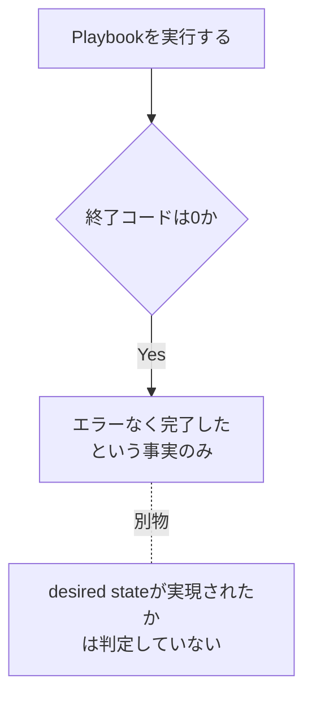
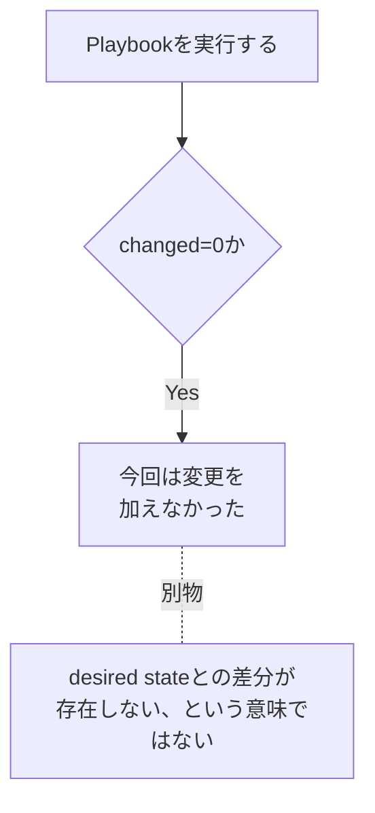
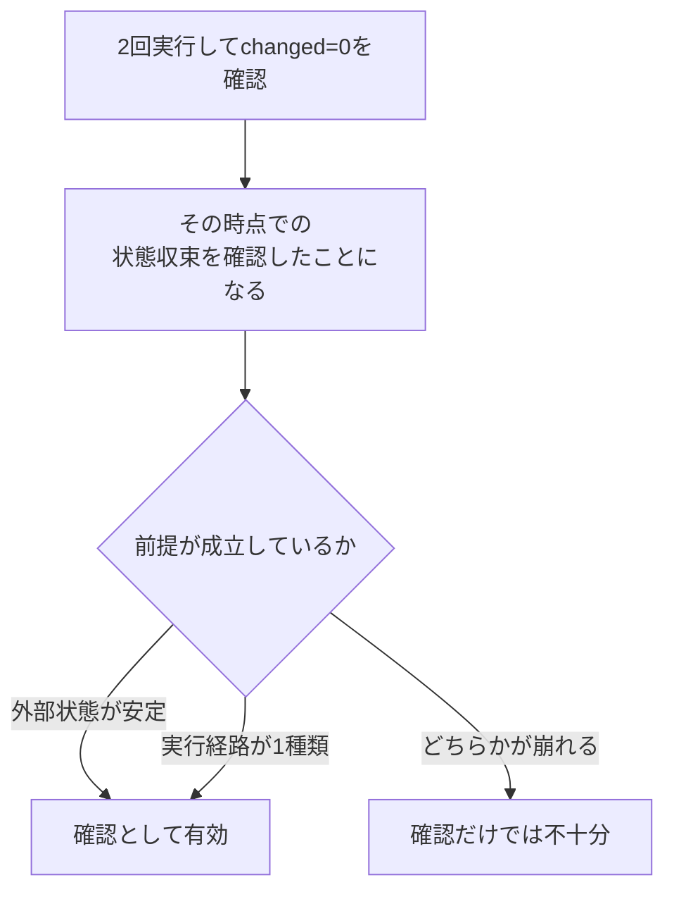

> **🗺️ 初めての方・シリーズの全体像を知りたい方はこちら**
> 
> シリーズ全体については、以下のまとめブログで整理しています。
> 
> → **「AnsibleのPlaybookが壊れる理由はテスト文化にあった」 シリーズまとめブログ** **※近日公開予定**

---

## 📋 目次

1. [はじめに](#1-はじめに)
2. [「実行して成功した」と「正しい」は別の話である](#2-実行して成功したと正しいは別の話である)
3. [手動確認の構造的な限界](#3-手動確認の構造的な限界)
4. [テストを持つとはどういうことか](#4-テストを持つとはどういうことか)
5. [冪等性シリーズ・ドリフトシリーズとの接続](#5-冪等性シリーズドリフトシリーズとの接続)
6. [まとめ](#6-まとめ)
7. [次回予告](#7-次回予告)
8. [連載一覧：「AnsibleのPlaybookが壊れる理由はテスト文化にあった」](#8-連載一覧ansibleのplaybookが壊れる理由はテスト文化にあった)

---

## 1. はじめに

筆者はこれまで、Ansibleに関する2つのシリーズを書いてきました。**[冪等性シリーズ](https://qiita.com/juehara-crypto/items/d77fa93e82ea4a33ef4f)** では「Playbookを実行しても壊れないようにするには、どう設計すればよいか」を扱いました。ドリフトシリーズでは「Playbookの設計が正しくても、Ansibleが実行されていない時間にサーバの状態がずれていく」という問題を扱いました。

このMoleculeシリーズは、その2つに続く3つ目のシリーズです。「壊れる構造」と「ずれていく問題」を理解した上で、それが今のPlaybookに起きていないことをどう継続的に確認するかという問いに進みます。前2シリーズを読んでいなくてもこのシリーズ単独で読み進められますが、より詳しい背景を知りたい場合はあわせて参照してください。

「Playbookを実行して成功した」という事実は、「そのPlaybookが正しい」ことを意味しません。この違いから話を始めます。

このシリーズは、Moleculeというツールの使い方を説明するシリーズではありません。「なぜPlaybookにテストが必要なのか」という設計思想から入ります。第0回である今回は、ツールの名前よりも先に、この問いに答えます。

---

[↑ 目次に戻る](#-目次)

---

## 2. 「実行して成功した」と「正しい」は別の話である

Playbookの実行が成功したことと、Playbookが期待通りの状態を作ったことは、別の概念です。

`ansible-playbook`を実行してエラーなく終了した場合、終了コードは0になります。しかしこの終了コード0が示しているのは、タスクがエラーで止まらなかったという事実だけです。desired stateが実際に実現されたかどうかを、終了コードそのものは判定していません。

`changed=0`という結果についても同じことが言えます。`changed=0`は「今回の実行では変更を加えなかった」ことを示しますが、「サーバが正しい状態にある」ことを示すものではありません。すでにdesired stateとの差分が実際には存在していても、その差分をAnsibleのタスクが検出できない構成であれば、`changed=0`のまま実行が終わることがあります（例えば、比較の基準となるdesired stateの一部がPlaybookの外に置かれている場合などです）。

**[冪等性シリーズ](https://qiita.com/juehara-crypto/items/d77fa93e82ea4a33ef4f)** では設計だけでなく、その設計が正しいことをどう確認するかという手段も扱いました。その一つが「同じPlaybookを2回実行し、2回目が`changed=0`になること」という確認手順です。1回目の実行でdesired stateへ収束し、2回目の実行で追加の変更が発生しなければ、そのPlaybookが少なくともその実行時点において同じ状態への収束をもたらすことを、実際の動作として確認したことになります。

ただしこの確認にも前提があります。外部状態が安定していることと、実行経路が1種類に限られることです（例えば、パッケージのバージョンを固定せず最新版を取得する設定になっている場合や、実行結果によって後続タスクの分岐先が変わる構成になっている場合です）。この前提が崩れる場合、2回実行による確認だけでは不十分になります。

ここまでの内容から分かるのは、「実行して成功した」という事実だけでは、Playbookの正しさを確認したことにはならないという点です。正しさを確認するには、成功したかどうかとは別の観点での確認が必要です。

---

[↑ 目次に戻る](#-目次)

---

## 3. 手動確認の構造的な限界

「2回実行して`changed=0`になること」という確認は有効ですが、これを手動でやり続けることには限界があります。確認の内容が間違っているわけではなく、手動で行うという運用のやり方に構造的な問題があります。

この限界は、大きく3つに整理できます。

|問題|内容|
|---|---|
|確認を忘れる|Playbookを変更するたびに手動で2回実行する運用は、忙しいときや小さな変更のときに省略されやすくなります|
|毎回やらなければならない|Playbookは一度確認すれば終わりではなく、変更が加わるたびに同じ確認を繰り返す必要があります|
|確認したことが記録されない|「このPlaybookは確認済みである」という事実は、手順書やコメントに依存し、実行のたびに自動的に残るわけではありません|

これらはいずれも、確認する人の注意力や記憶に依存しています。Playbookへの変更が小さいほど、あるいは変更した本人が「今回は大丈夫だろう」と判断した場合ほど、確認は省略されやすくなります。そして一度省略された確認は、次に誰かがそのPlaybookを触るまで、実施されないまま残り続けます。

「確認を忘れないように気をつける」という運用上の対応は、この問題の根本的な解決にはなりません。人が確認する限り、確認の実施は人の判断に依存し続けるためです。この限界を解決するには、確認するかどうかを人の判断に委ねない仕組みが必要になります。

---

[↑ 目次に戻る](#-目次)

---

## 4. テストを持つとはどういうことか

テストを持つことの本質は、確認を仕組みに組み込むことです。手動確認との違いを、以下の対比で整理します。

|手動確認|テストを持つ|
|---|---|
|実行するかどうかは人に依存する|Playbookに変更があれば自動で実行される|
|確認したことは記録されない|テストの通過・失敗が記録として残る|
|一度確認したら次の変更まで確認されない|変更のたびに自動で確認される|

手動確認とテストの違いは、確認の中身が変わることではありません。「2回実行して`changed=0`になること」を確認するという内容自体は、手動でもテストでも変わりません。変わるのは、その確認を実行するかどうかが人の判断に依存するか、Playbookへの変更をきっかけに自動で実行されるかという点です。

この移行を一言で表すなら、「一度確認した」から「変更のたびに確認し続ける」への移行です。前のセクションで整理した3つの限界は、いずれもこの移行によって解消されます。実行を忘れることはなくなり、確認は変更のたびに自動で行われ、その結果は記録として残ります。

こうした仕組みを実現するツールの一つがMoleculeです。ただし今回はMoleculeが何をしているかという内部構造には踏み込みません。それは **[第1回](https://juehara-crypto.github.io/blog/infra/ansible/ansible-molecule/ansible-molecule-01/)** で扱います。ここで押さえておきたいのは、Moleculeというツールを導入することで確認の内容そのものが変わるわけではなく、その確認を仕組みとして持てるようになるという点です。

---

[↑ 目次に戻る](#-目次)

---

## 5. 冪等性シリーズ・ドリフトシリーズとの接続

このシリーズが前2シリーズとどう接続しているかを整理します。

|シリーズ|扱う問い|
|---|---|
|**[冪等性シリーズ](https://qiita.com/juehara-crypto/items/d77fa93e82ea4a33ef4f)**|Playbookはなぜ壊れるのか・壊れない設計とは何か|
|ドリフトシリーズ|設計が正しくても環境はなぜずれていくのか|
|Moleculeシリーズ|ずれていないことをどう継続的に確認し続けるか|

**[冪等性シリーズ](https://qiita.com/juehara-crypto/items/d77fa93e82ea4a33ef4f)** では、Playbookの設計の中に問題があるケースを扱いました。shellモジュールが状態を観測しないこと、desired stateがリポジトリやファイルの現在の内容といった外部に委譲されること、タスク間の依存が実行履歴への依存を生むことなどです。そしてその確認手段として、2回実行・`--check`・Moleculeを挙げ、Moleculeについては仕組みの概念にとどめて次のシリーズに引き継ぐ形で終えていました。

ドリフトシリーズでは、Playbookの設計が正しくても、Ansibleが実行されていない時間にサーバの状態がずれていく問題を扱いました。手動変更・他ツールによる変更・パッケージの自動更新・ソフトウェアの自己書き換えといった経路が扱われましたが、これらはPlaybookの設計の問題ではなく、Ansibleがプッシュ型のツールであることに起因する構造上の限界でした。

このシリーズが直接引き継ぐのは、主に **[冪等性シリーズ](https://qiita.com/juehara-crypto/items/d77fa93e82ea4a33ef4f)** で扱った確認手段の側です。「2回実行して`changed=0`になること」という確認を、どう仕組みとして持つかという問いに答えるのがこのシリーズの役割です。一方でドリフトシリーズが扱った「Ansibleの管理外で起きる変化」への対応は、このシリーズの範囲には含まれません。両者は別の問題であり、冪等な設計とドリフトへの対応が両方揃って初めて運用が成立するのと同じように、Playbookの設計とその確認の仕組みも、それぞれ別に扱う必要があります。

---

[↑ 目次に戻る](#-目次)

---

## 6. まとめ

この回で整理した内容を確認します。

- **Playbookの実行が成功したことと、Playbookが正しいことは別の概念**です。終了コード0や`changed=0`は、desired stateが実現されたことを保証するものではありません。
- **「2回実行して`changed=0`になること」という確認を手動でやり続けることには、3つの構造的な限界**があります。確認を忘れる、毎回やらなければならない、確認したことが記録されない、という3点です。
- **テストを持つことの本質は、確認を仕組みに組み込むこと**です。確認の内容が変わるのではなく、その確認が人の判断に依存するか、変更のたびに自動で実行されるかが変わります。
- このシリーズは、**[冪等性シリーズ](https://qiita.com/juehara-crypto/items/d77fa93e82ea4a33ef4f)** で扱った確認手段を仕組みとして持つことを主題とします。ドリフトシリーズが扱った管理外の変化への対応とは、別の問題として区別します。

---

[↑ 目次に戻る](#-目次)

---

## 7. 次回予告

今回は、Playbookにテストが必要な理由を整理しました。実行の成功と正しさは別の概念であること、手動確認には構造的な限界があること、そしてテストを持つことの意味が「確認を仕組みに組み込むこと」であることを見てきました。

次回は、「その仕組みがどう動いているか」という問いに答えます。Moleculeが内部で何をしているのかを、create・converge・idempotency・verify・destroyという各フェーズに分けて整理します。

**[次回：第1回：Moleculeは何をしているのか](https://juehara-crypto.github.io/blog/infra/ansible/ansible-molecule/ansible-molecule-01/)**

---

📑 連載の移動　**[前の記事：【構成ドリフト編】 第4回](https://juehara-crypto.github.io/blog/infra/ansible/ansible-drift/ansible-drift-04/)　｜　[次の記事：【Molecule編】 第1回](https://juehara-crypto.github.io/blog/infra/ansible/ansible-molecule/ansible-molecule-01/)**

---

> **🗺️ 初めての方・シリーズの全体像を知りたい方はこちら**
> 
> シリーズ全体については、以下のまとめブログで整理しています。
> 
> → **「AnsibleのPlaybookが壊れる理由はテスト文化にあった」 シリーズまとめブログ** **※近日公開予定**

---

[↑ 目次に戻る](#-目次)

---

## 8. 連載一覧：「AnsibleのPlaybookが壊れる理由はテスト文化にあった」

|回|タイトル|内容（概要）|
|---|---|---|
|**[第0回](https://juehara-crypto.github.io/blog/infra/ansible/ansible-molecule/ansible-molecule-00/)**|なぜPlaybookにテストが必要なのか|「実行して成功した」と「正しい」は別の概念であることを整理し、手動確認の構造的な限界を理解する。テストを持つことの本質が「確認を仕組みに組み込むこと」であることを理解する。|
|**[第1回](https://juehara-crypto.github.io/blog/infra/ansible/ansible-molecule/ansible-molecule-01/)**|Moleculeは何をしているのか|create・converge・idempotency・verify・destroyという各フェーズが何のためにあるかを、冪等性の文脈と接続しながら理解する。「2回実行してchanged=0」という手動確認をMoleculeが自動化している構造であることを整理する。|
|**[第2回](https://juehara-crypto.github.io/blog/infra/ansible/ansible-molecule/ansible-molecule-02/)**|冪等性テストを自動化する|冪等性シリーズで作成したPlaybookをMoleculeでテストする構成を実機で確認し、1回目と2回目の実行で何が確認されているかを読み取る。idempotencyフェーズで`changed`が発生した場合の表示を意図的に再現し、テストが失敗するとはどういう状態かを理解する。|
|**[第3回](https://juehara-crypto.github.io/blog/infra/ansible/ansible-molecule/ansible-molecule-03/)**|ansible-lintはなぜそのルールを定めているのか|ansible-lintのルールを設計品質の静的確認として位置づけ、代表的なルールカテゴリが冪等性・ドリフトの問題とどう接続しているかを理解する。MoleculeのverifyフェーズにAnsible-lintを組み込み、テストパイプラインの一部として位置づける。|
|**[第4回](https://juehara-crypto.github.io/blog/infra/ansible/ansible-molecule/ansible-molecule-04/)**|テストが失敗したとき何が分かるのか・CIに組み込む|Moleculeのテスト失敗パターンを、設計上の何が問題なのかというフィードバックとして読む視点を理解する。GitHub ActionsなどのCIにMoleculeとansible-lintを組み込み、「変更のたびに確認し続ける」仕組みを整理する。|

---

[↑ 目次に戻る](#-目次)

---