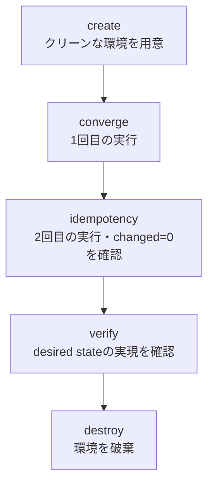

> **🗺️ 初めての方・シリーズの全体像を知りたい方はこちら**
> 
> シリーズ全体については、以下のまとめブログで整理しています。
> 
> → **「AnsibleのPlaybookが壊れる理由はテスト文化にあった」 シリーズまとめブログ**  **※近日公開予定**

---

## 📋 目次
1. [はじめに](#1-はじめに)
2. [Moleculeが自動化している確認の正体](#2-moleculeが自動化している確認の正体)
3. [各フェーズの役割と冪等性との接続](#3-各フェーズの役割と冪等性との接続)
4. [クリーンな環境から始めることの意味](#4-クリーンな環境から始めることの意味)
5. [「確認内容は変わらない」という前提](#5-確認内容は変わらないという前提)
6. [まとめ](#6-まとめ)
7. [次回予告](#7-次回予告)
8. [連載一覧：「AnsibleのPlaybookが壊れる理由はテスト文化にあった」](#8-連載一覧ansibleのplaybookが壊れる理由はテスト文化にあった)

---

## 1. はじめに

**[前回](https://juehara-crypto.github.io/blog/infra/ansible/ansible-molecule/ansible-molecule-00/)** は、「実行して成功した」と「正しい」は別の概念であることを整理しました。手動確認には3つの構造的な限界があり、テストを持つことの本質は確認を仕組みに組み込むことにあるという結論に至りました。Moleculeという名前をそこで出しましたが、内部で何をしているかには踏み込みませんでした。

今回はその続きです。「Moleculeは何をするツールか」ではなく、「Moleculeは何をしているか」という問いから入ります。

Moleculeにはcreate・converge・idempotency・verify・destroyという5つのフェーズがあります。これから各フェーズを順に見ていきますが、コマンドの使い方や設定ファイルの書き方は扱いません。それぞれのフェーズが何のために存在し、冪等性の確認とどう対応しているかを整理します。

---

[↑ 目次に戻る](#-目次)

---

## 2. Moleculeが自動化している確認の正体

各フェーズの説明に入る前に、Moleculeが自動化している確認の中身を先に示します。

**[冪等性シリーズ第9回](https://juehara-crypto.github.io/blog/infra/ansible/ansible-idempotency/ansible-idempotency-09/)** で、「同じPlaybookを2回実行し、2回目が`changed=0`になること」という確認手順を整理しました。この確認を人手で行う場合、テスト用サーバの用意から後片付けまでを含めて、次のような手順になります。

|手動でやっていたこと|Moleculeが自動でやること|
|---|---|
|テスト用のサーバを用意する|createフェーズで環境を用意する|
|Playbookを1回目実行する|convergeフェーズで実行する|
|同じPlaybookを2回目実行してchanged=0を確認する|idempotencyフェーズで確認する|
|期待する状態になっているかを確認する|verifyフェーズで確認する|
|テスト用のサーバを片付ける|destroyフェーズで環境を破棄する|

この対応から分かるのは、Moleculeが新しい確認方法を持ち込んでいるわけではないという点です。手動で行っていた一連の手順に、Moleculeが用意したフェーズの名前がそれぞれ対応しています。確認している内容自体は変わりません。

この前提を踏まえて、次のセクションから各フェーズを順に見ていきます。

---

[↑ 目次に戻る](#-目次)

---

## 3. 各フェーズの役割と冪等性との接続

5つのフェーズを、何をしているかと冪等性確認との接続で整理します。

|フェーズ|何をしているか|冪等性確認との接続|
|---|---|---|
|create|テスト用のクリーンな環境を起動する|前回の実行結果が残らない状態を作る|
|converge|Playbookを1回目実行する|初回適用の動作を確認する|
|idempotency|同じPlaybookを2回目実行する|changed=0になることを確認する|
|verify|期待する状態になっているかを確認する|desired stateの実現を検証する|
|destroy|テスト環境を破棄する|次のテストへの影響を遮断する|

このフェーズは順序に意味があります。create抜きにconvergeを行うと、前回の実行結果が残った環境への適用になり、初回適用の動作を確認したことになりません。converge抜きにidempotencyを行うことはできません。2回目の実行を確認するには、その前提として1回目の実行が必要だからです。verifyがidempotencyの後に置かれているのも、「changed=0になったこと」と「desired stateが実現されていること」は別の確認だからです。changed=0はタスクが変更を加えなかったという事実を示すだけであり、その状態が期待通りかどうかは別途確認する必要があります。destroyが最後に置かれているのは、そのテストで使った環境を次のテストに持ち越さないためです。

5つのフェーズは、それぞれ独立した機能の寄せ集めではなく、「クリーンな状態から始めて、1回目と2回目の実行を確認し、期待する状態になっているかを確認して、後片付けをする」という一連の流れとして設計されています。

---

[↑ 目次に戻る](#-目次)

---

## 4. クリーンな環境から始めることの意味

createフェーズでクリーンな環境を用意することの意味を、もう少し掘り下げます。

前回の実行結果が残った環境でPlaybookを実行すると、そのタスクにとっては「初回適用」ではなく「N回目の適用」になります。convergeフェーズが確認したいのは初回適用の動作であるため、前回の結果が残っていない環境から始める必要があります。

これはPlaybookが冪等かどうかの確認にも関わります。冪等性の確認は、クリーンな環境への初回適用(converge)と、その直後の2回目適用(idempotency)の両方があって初めて成立します。片方だけでは、初回適用が正しく動くかの確認か、2回目以降の挙動の確認か、どちらか一方しか行えません。

ドリフトシリーズで扱った「手動変更が加わった環境」とは対照的な状態です。ドリフトシリーズでは、Ansibleの管理外で状態が変化した環境にPlaybookを適用したときに何が起きるかを扱いました。Moleculeのcreateフェーズが用意するのは、そうした管理外の変化が一切ない、まっさらな環境です。テストのたびにこの状態から始めることで、「今回のテスト結果が、前回のテストや管理外の変化の影響を受けていない」ことが担保されます。

destroyフェーズで環境を破棄するのも同じ理由です。テストで使った環境を残したまま次のテストを実行すると、次のテストのcreateがクリーンな環境を用意したことにならなくなります。テストのたびに環境を破棄することで、それぞれのテストが独立した状態から始まることを保証しています。

---

[↑ 目次に戻る](#-目次)

---

## 5. 「確認内容は変わらない」という前提

ここまで見てきたフェーズについて、確認の中身という観点から整理し直します。

idempotencyフェーズで確認しているのは、**[冪等性シリーズ第9回](https://juehara-crypto.github.io/blog/infra/ansible/ansible-idempotency/ansible-idempotency-09/)** で扱った「2回実行してchanged=0になること」と同じ内容です。Moleculeを使ったからといって、新しい確認項目が追加されるわけではありません。

変わるのは、その確認を実行するかどうかが人の判断に依存するか、Playbookを実行するたびに自動で行われるかという点です。前回整理した手動確認の3つの限界(確認を忘れる・毎回やらなければならない・確認したことが記録されない)は、この違いによって解消されます。

一方で、確認内容そのものの限界はMoleculeでも引き継がれます。**[冪等性シリーズ第9回](https://juehara-crypto.github.io/blog/infra/ansible/ansible-idempotency/ansible-idempotency-09/)** で整理したとおり、「2回実行してchanged=0」という確認が成立するには、外部状態が安定していることと実行経路が1種類に限られることが前提になります。この前提が崩れるケース(外部状態に依存する構成や、実行経路が複数あるケース)では、Moleculeのidempotencyフェーズで問題が検出できるとは限りません。Moleculeは確認を自動化する仕組みであって、確認そのものの限界を解消する仕組みではないためです。

ここで整理しておきたいのは、「Moleculeを使えば冪等性の問題がなくなる」という理解は正確ではないという点です。Moleculeが解決するのは、確認を仕組みに組み込むという運用上の問題です。Playbookの設計そのものに問題がある場合、その問題はPlaybook側で解決する必要があります。Moleculeはその問題を検出する頻度と確実性を高めますが、設計の問題そのものを肩代わりするものではありません。

---

[↑ 目次に戻る](#-目次)

---

## 6. まとめ

この回で整理した内容を確認します。

- **Moleculeは新しい確認方法を持ち込んでいるわけではなく、手動で行っていた確認手順にフェーズの名前が対応しています。** create・converge・idempotency・verify・destroyの5フェーズは、それぞれテスト用サーバの用意・1回目実行・2回目実行の確認・期待状態の確認・後片付けに対応します。
- **5つのフェーズには順序の意味があります。** クリーンな状態から始めて、1回目と2回目の実行を確認し、期待する状態になっているかを確認して、後片付けをするという一連の流れです。
- **createフェーズがクリーンな環境を用意するのは、初回適用の動作を正しく確認するためです。** 前回の実行結果や管理外の変化が残った環境では、冪等性の確認が成立しません。
- **idempotencyフェーズが確認している内容は、手動確認と同じです。** 変わるのは、その確認が人の判断に依存するか、実行のたびに自動で行われるかという点です。
- **確認内容そのものの限界はMoleculeでも引き継がれます。** 外部状態への依存や複数の実行経路がある構成では、Moleculeでも問題を検出できるとは限りません。Moleculeは確認を自動化する仕組みであり、Playbookの設計問題を解決する仕組みではありません。

---

[↑ 目次に戻る](#-目次)

---

## 7. 次回予告

今回は、Moleculeの5つのフェーズがそれぞれ何をしているかを、冪等性の確認と接続しながら整理しました。手動確認との対応関係、フェーズの順序に意味があること、そして確認内容そのものは手動確認と変わらないことを見てきました。

次回は、「構造として理解した」を「実際に動かして確認する」に進めます。冪等性シリーズで作成したPlaybookをMoleculeでテストする構成を実機で確認し、1回目と2回目の実行で何が確認されているかを見ていきます。

**次回：第2回：冪等性テストを自動化する**

---

📑 連載の移動　**[前の記事：【Molecule編】 第0回](https://juehara-crypto.github.io/blog/infra/ansible/ansible-molecule/ansible-molecule-00/)　｜　次の記事：【Molecule編】 第2回** **近日公開予定**

---

> **🗺️ 初めての方・シリーズの全体像を知りたい方はこちら**
> 
> シリーズ全体については、以下のまとめブログで整理しています。
> 
> → **「AnsibleのPlaybookが壊れる理由はテスト文化にあった」 シリーズまとめブログ** **※近日公開予定**

---

[↑ 目次に戻る](#-目次)

---

## 8. 連載一覧：「AnsibleのPlaybookが壊れる理由はテスト文化にあった」

|回|タイトル|内容（概要）|
|---|---|---|
|**[第0回](https://juehara-crypto.github.io/blog/infra/ansible/ansible-molecule/ansible-molecule-00/)**|なぜPlaybookにテストが必要なのか|「実行して成功した」と「正しい」は別の概念であることを整理し、手動確認の構造的な限界を理解する。テストを持つことの本質が「確認を仕組みに組み込むこと」であることを理解する。|
|第1回|Moleculeは何をしているのか|create・converge・idempotency・verify・destroyという各フェーズが何のためにあるかを、冪等性の文脈と接続しながら理解する。「2回実行してchanged=0」という手動確認をMoleculeが自動化している構造であることを整理する。|
|第2回|冪等性テストを自動化する|冪等性シリーズで作成したPlaybookをMoleculeでテストする構成を実機で確認し、1回目と2回目の実行で何が確認されているかを読み取る。idempotencyフェーズで`changed`が発生した場合の表示を意図的に再現し、テストが失敗するとはどういう状態かを理解する。|
|第3回|ansible-lintはなぜそのルールを定めているのか|ansible-lintのルールを設計品質の静的確認として位置づけ、代表的なルールカテゴリが冪等性・ドリフトの問題とどう接続しているかを理解する。MoleculeのverifyフェーズにAnsible-lintを組み込み、テストパイプラインの一部として位置づける。|
|第4回|テストが失敗したとき何が分かるのか・CIに組み込む|Moleculeのテスト失敗パターンを、設計上の何が問題なのかというフィードバックとして読む視点を理解する。GitHub ActionsなどのCIにMoleculeとansible-lintを組み込み、「変更のたびに確認し続ける」仕組みを整理する。|

---

[↑ 目次に戻る](#-目次)

---
