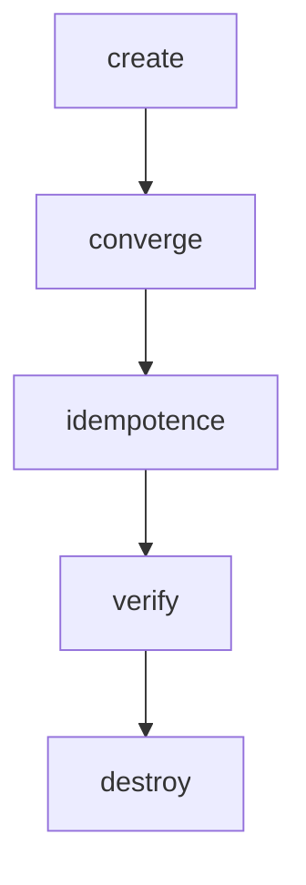
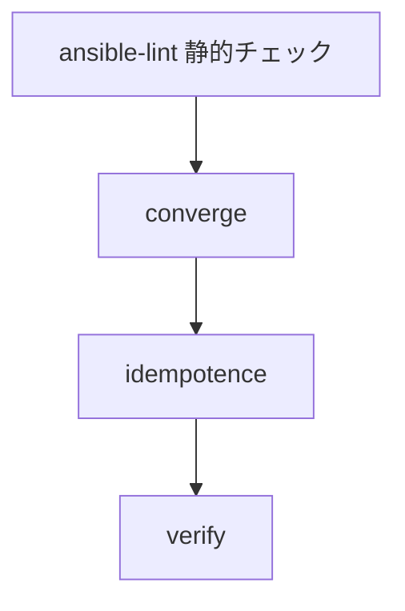

> **🗺️ 初めての方・シリーズの全体像を知りたい方はこちら**
> 
> シリーズ全体については、以下のまとめブログで整理しています。
> 
> → **「AnsibleのPlaybookが壊れる理由はテスト文化にあった」 シリーズまとめブログ** **※近日公開予定**

---

## 目次

1. [はじめに](#1-はじめに)
2. [静的チェックと動的テストの役割分担](#2-静的チェックと動的テストの役割分担)
3. [ルールは何を守るために存在するのか](#3-ルールは何を守るために存在するのか)
4. [代表的なルールカテゴリと設計思想上の意味](#4-代表的なルールカテゴリと設計思想上の意味)
5. [MoleculeのverifyフェーズにAnsible-lintを組み込む](#5-moleculeのverifyフェーズにansible-lintを組み込む)
6. [まとめ](#6-まとめ)
7. [次回予告](#7-次回予告)
8. [連載一覧：「AnsibleのPlaybookが壊れる理由はテスト文化にあった」](#8-連載一覧ansibleのplaybookが壊れる理由はテスト文化にあった)


---

## 1. はじめに

**[第2回](http://localhost:4321/blog/infra/ansible/ansible-molecule/ansible-molecule-02/)** では、Moleculeによる動的なテスト（プレイブックを実際に実行して確認する方法）を実機で確認しました。converge・idempotenceの2つのフェーズを実行し、正常系・異常系それぞれの出力を実際に読みました。

今回はその前段階に位置する、静的チェックを扱います。プレイブックを実行する前に、設計上の問題を検出するansible-lintです。

「ansible-lintとは何か」ではなく、「ansible-lintはなぜそのルールを定めているのか」という問いから入ります。ルール一覧を眺めるのではなく、それぞれのルールが何を守るために存在しているのかを、これまでのシリーズで確認してきた内容と接続しながら整理します。

---

[↑ 目次に戻る](#目次)

---

## 2. 静的チェックと動的テストの役割分担

個別のルールを見る前に、ansible-lintとMoleculeの役割分担を整理します。

|ツール|種別|何を確認するか|
|---|---|---|
|ansible-lint|静的チェック|プレイブックを実行せずに設計上の問題を検出する|
|Molecule|動的テスト|プレイブックをテスト対象環境で実際に実行して動作を確認する|

Moleculeが確認するのは、「Playbookをテスト対象環境に適用した結果、期待通りに動くか」です。**[第2回](http://localhost:4321/blog/infra/ansible/ansible-molecule/ansible-molecule-02/)** で見た通り、converge・idempotenceは、Playbookをテスト対象環境へ実際に適用した上で判定します。ここでいうテスト対象環境とは、本番環境とは分離された検証用の環境を指します。

一方でansible-lintは、プレイブックを実行しません。ファイルの記述内容だけを見て、設計上の問題がないかを判定します。実行する前に問題を発見できるという点で、動的テストを補完する関係にあります。

まずansible-lintで実行前に設計上の問題を検出し、その後Moleculeでテスト対象環境に適用して動作を確認する、という順序が一般的なテストパイプラインになります。本番環境へ適用する前に、静的チェックと動的テストの両方を通すことで、Playbookの品質を段階的に確認できます。

この位置づけを踏まえた上で、次のセクション以降、個別のルールを見ていきます。

---

[↑ 目次に戻る](#目次)

---

## 3. ルールは何を守るために存在するのか

ansible-lintのルールは多数存在しますが、その全体が何を守るために存在するかを先に整理しておきます。

|目的|内容|
|---|---|
|冪等性の維持|実行するたびに同じ結果になることを静的に確認する|
|保守性の維持|プレイブックを読みやすく・変更しやすい状態に保つ|

「lintに怒られるから直す」という受け止め方をすると、ルールは単なる制約として現れます。しかし個々のルールを見ていくと、その多くは「冪等性を維持するため」あるいは「保守しやすい設計にするため」という理由から定められています。

この視点を持った上で、次のセクションで代表的なルールカテゴリを見ていきます。

---

[↑ 目次に戻る](#目次)

---

## 4. 代表的なルールカテゴリと設計思想上の意味

代表的な4つのルールカテゴリを、これまでのシリーズで確認してきた内容と接続しながら整理します。

|ルールカテゴリ|設計思想上の意味|前シリーズとの接続|
|---|---|---|
|command-instead-of-module|shellより宣言型モジュールを使う|冪等性シリーズ第 **[1](http://localhost:4321/blog/infra/ansible/ansible-idempotency/ansible-idempotency-01/)**・**[2](http://localhost:4321/blog/infra/ansible/ansible-idempotency/ansible-idempotency-02/)** 回|
|no-changed-when|changed_whenなしのshellは非冪等|**[冪等性シリーズ第1回](http://localhost:4321/blog/infra/ansible/ansible-idempotency/ansible-idempotency-01/)**|
|risky-file-permissions|パーミッション関連の設定未指定は差分の原因|**[冪等性シリーズ第3回](http://localhost:4321/blog/infra/ansible/ansible-idempotency/ansible-idempotency-03/)**|
|yaml構文ルール|読みやすいプレイブックが保守しやすい|直接の接続元なし（独立して整理）|

### command-instead-of-module

shellモジュール・commandモジュールは、現在の状態を観測する仕組みを持ちません。そのため実行するたびに`changed`として報告されるか、状態が変わったかどうかを判断できないまま実行されます。対応する宣言型モジュール（file・copy・templateなど）が存在する場合は、そちらを使うべきという設計思想がこのルールの背景にあります。

**[冪等性シリーズ第1回](http://localhost:4321/blog/infra/ansible/ansible-idempotency/ansible-idempotency-01/)** で確認した通り、shellモジュールに渡せる情報はコマンド文字列だけであり、実行前後の状態を判断する仕組みを持っていません。**[冪等性シリーズ第2回](http://localhost:4321/blog/infra/ansible/ansible-idempotency/ansible-idempotency-02/)** で確認したfile・copy・templateモジュールは、実行前に現在の状態を観測し、desired stateと比較した上で変更の要否を判断します。command-instead-of-moduleは、この構造的な違いを静的に検出するルールです。

### no-changed-when

shellタスクに`changed_when`を指定しない場合、実行のたびに`changed=1`が返り続けます。この状態では、Moleculeのidempotenceフェーズを実行しても、冪等性の確認そのものが成立しません。

このルールが守っているのは「冪等性の確認を意味のあるものにすること」です。**[冪等性シリーズ第1回](http://localhost:4321/blog/infra/ansible/ansible-idempotency/ansible-idempotency-01/)** で確認した通り、`changed_when: false`を付けたとしても、それは表示の制御であり、実際の動作（例えばサービスの再起動）が変わるわけではありません。no-changed-whenは、この点への注意を静的な段階で促すルールです。

### risky-file-permissions

file・templateモジュール等でowner・group・modeといったパーミッション関連の設定を明示しない場合、実行環境によって異なる状態が設定される可能性があります。

**[冪等性シリーズ第3回](http://localhost:4321/blog/infra/ansible/ansible-idempotency/ansible-idempotency-03/)** では、owner/groupの名前解決がノード間でずれる問題を扱いました。同じ名前を指定していても、ノードごとにUID/GIDが異なれば、Ansibleの観測上は別の状態として検出されます。これは「意味的には同じ設定のはずが、Ansibleの観測上は別状態になる」という構造の一つであり、risky-file-permissionsが検出しようとしているのも同じ種類の問題です。パーミッション関連の設定を明示しておくことが、この種の差分を防ぐ基本になります。

### yaml構文ルール

インデント・クォートの統一などの構文ルールは、①〜③とは異なり冪等性そのものには直接関わりません。プレイブックの読みやすさが保守性に影響するという観点から定められています。

このルールについては、前シリーズで扱った内容との直接の接続元はありません。冪等性・ドリフトいずれのシリーズでも、yaml構文そのものを扱った回はなかったため、ここでは前シリーズとは独立したルールとして整理します。

---

[↑ 目次に戻る](#目次)

---

## 5. MoleculeのverifyフェーズにAnsible-lintを組み込む

**[第1回](http://localhost:4321/blog/infra/ansible/ansible-molecule/ansible-molecule-01/)** では、Molecule全体の5フェーズを整理しました。



本シリーズでは以降、Playbook品質を高める流れとして、次の4段階を中心に扱います。



destroyについて一言触れておきます。destroyはテスト環境のライフサイクル管理を含めた完全なテストサイクルで利用されるフェーズです。本シリーズでは、Playbook品質を確認する流れに焦点を当てるため、以降は上記4段階を中心に扱います。

この4段階のうち、今回新たに扱うのはansible-lintとverifyの接続です。verifyフェーズにansible-lintを組み込むことで、Moleculeを実行するとansible-lintも自動で走る構成にできます。

なお、**[第2回](https://juehara-crypto.github.io/blog/infra/ansible/ansible-molecule/ansible-molecule-02/)** まで使用してきたプレイブックに対し、本章ではansible-lintの`name[casing]`ルールへ対応するため、タスク名およびハンドラ名を英語・先頭大文字へ変更しています。その他の構成は **[第2回](https://juehara-crypto.github.io/blog/infra/ansible/ansible-molecule/ansible-molecule-02/)** から変更していません。`no-relative-paths`についてはディレクトリ構成上の都合により、本記事では`.ansible-lint`で検査対象から除外しています。

---

### verifyフェーズの構成

`molecule.yml`の`verifier`設定は、**[第2回](https://juehara-crypto.github.io/blog/infra/ansible/ansible-molecule/ansible-molecule-02/)** から変更していません。

**ファイル名：`molecule.yml`（該当部分）**

```yaml
verifier:
  name: ansible
```

`verify.yml`を`molecule/default/`配下に配置しておくことで、`molecule verify`実行時に自動的にこのファイルが読み込まれます。

**ファイル名：`verify.yml`**


```yaml
---
- name: Verify Playbook with ansible-lint
  hosts: localhost
  gather_facts: false

  tasks:
    - name: Run ansible-lint
      ansible.builtin.command:
        cmd: >
          ansible-lint
          --project-dir ../../
          ../../playbooks/configure_nginx.yml
      changed_when: false
```

`ansible-lint`をAnsibleの`command`タスクとして実行しています。`changed_when: false`を指定しているため、lintが正常終了した場合は`changed`ではなく`ok`として扱われます。`--project-dir ../../`は、後述する`.ansible-lint`設定ファイルを認識させるためのオプションです。

`no-relative-paths`を除外するため、以下の設定ファイルを用意しました。

**ファイル名：`.ansible-lint`**


```yaml
skip_list:
  - no-relative-paths
```

これ以外のルールは通常どおり有効です。

---

### 実行結果を読む：正常系の出力

対象のプレイブックは、**[第2回](https://juehara-crypto.github.io/blog/infra/ansible/ansible-molecule/ansible-molecule-02/)** から使用している`configure_nginx.yml`です。タスク名・ハンドラ名を英語表記に変更した以外、内容は変わっていません。

**ファイル名：`configure_nginx.yml`**

```yaml
---
- name: Configure nginx worker settings
  hosts: nodes
  become: true
  gather_facts: false

  vars:
    nginx_worker_connections: 768

  tasks:
    - name: Deploy nginx.conf from template
      ansible.builtin.template:
        src: "{{ playbook_dir }}/../templates/nginx.conf.j2"
        dest: /etc/nginx/nginx.conf
        owner: root
        group: root
        mode: "0644"
      notify: Reload nginx

  handlers:
    - name: Reload nginx
      ansible.builtin.systemd:
        name: nginx
        state: reloaded
```

この状態で`molecule verify`を実行します。

- **`verify`実行**

```plaintext
(ansible-env) control@ubuntu-controller:~/iac/ansible$ molecule verify
INFO     default ➜ discovery: scenario test matrix: verify
INFO     default ➜ prerun: Performing prerun with role_name_check=0...
INFO     default ➜ verify: Executing
  ┌──────────────────────────────────────────────────────────────────────────────────
  │ ansible-playbook --inventory /home/control/.ansible/tmp/molecule.DLh_.default/inventory
  │   --skip-tags molecule-notest,notest
  │   /home/control/iac/ansible/molecule/default/verify.yml
  │
  │
  │ PLAY [Verify Playbook with ansible-lint] ***************************************
  │
  │ TASK [Run ansible-lint] ********************************************************
  │ ok: [localhost]
  │
  │ PLAY RECAP *********************************************************************
  │ localhost                  : ok=1    changed=0    unreachable=0    failed=0    skipped=0    rescued=0    ignored=0
  │
  └─ Return code: 0 ─────────────────────────────────────────────────────────────────
INFO     default ➜ verify: Executed: Successful
INFO     Molecule executed 1 scenario (1 successful)

DETAILS
default ➜ verify: Executed: Successful

SCENARIO RECAP
default                   : actions=1  successful=1  disabled=0  skipped=0  missing=0  failed=0
```

`TASK [Run ansible-lint]`が`ok`となっており、ansible-lintが違反を検出せず正常終了したことが分かります。末尾の`verify: Executed: Successful`、および`SCENARIO RECAP`の`successful=1`・`failed=0`から、verifyフェーズ全体が正常終了したことも確認できます。

---

### ルール違反を意図的に再現する：異常系の出力

対象のプレイブックに、**[第2回](https://juehara-crypto.github.io/blog/infra/ansible/ansible-molecule/ansible-molecule-02/)** のセクション6でも使用した`command`モジュールのタスクを追加します。

**＜追加内容＞**

```yaml
    - name: Always changed task (for Molecule test)
      ansible.builtin.command: date
```

**＜追加後＞**

**ファイル名：`configure_nginx.yml`**

```yaml
---
- name: Configure nginx worker settings
  hosts: nodes
  become: true
  gather_facts: false

  vars:
    nginx_worker_connections: 768

  tasks:
    - name: Deploy nginx.conf from template
      ansible.builtin.template:
        src: "{{ playbook_dir }}/../templates/nginx.conf.j2"
        dest: /etc/nginx/nginx.conf
        owner: root
        group: root
        mode: "0644"
      notify: Reload nginx

    - name: Always changed task (for Molecule test)
      ansible.builtin.command: date

  handlers:
    - name: Reload nginx
      ansible.builtin.systemd:
        name: nginx
        state: reloaded
```

この状態で`molecule verify`を実行します。

- **`verify`実行**

```plaintext
(ansible-env) control@ubuntu-controller:~/iac/ansible$ molecule verify
INFO     default ➜ discovery: scenario test matrix: verify
INFO     default ➜ prerun: Performing prerun with role_name_check=0...
INFO     default ➜ verify: Executing
  ┌──────────────────────────────────────────────────────────────────────────────────
  │ ansible-playbook --inventory /home/control/.ansible/tmp/molecule.DLh_.default/inventory
  │   --skip-tags molecule-notest,notest
  │   /home/control/iac/ansible/molecule/default/verify.yml
  │
  │
  │ PLAY [Verify Playbook with ansible-lint] ***************************************
  │
  │ TASK [Run ansible-lint] ********************************************************
  │ fatal: [localhost]: FAILED! => {"changed": false, "cmd": ["ansible-lint", "--project-dir", "../../", "../../playbooks/configure_nginx.yml"], "delta": "0:00:04.460313", "end":
  │   "2026-07-22 07:35:00.691250", "msg": "non-zero return code", "rc": 2, "start": "2026-07-22 07:34:56.230937", "stderr": "\u001b[2mWARNING  Listing 1 violation(s) that are
  │   fatal\u001b[0m\nRead \u001b[34m\u001b]8;;https://docs.ansible.com/projects/lint/configuring/#ignoring-rules-for-entire-files\u001b\\documentation\u001b]8;;\u001b\\\u001b[0m for
  │   instructions on how to ignore specific rule violations.\n\n# Rule Violation Summary\n\n  1
  │   \u001b[34m\u001b]8;;https://docs.ansible.com/projects/lint/rules/\u001b\\no-changed-when\u001b]8;;\u001b\\\u001b[0m \u001b[2mprofile:shared
  │   tags:command-shell,idempotency\u001b[0m\n\n\u001b[31m\u001b[1mFailed\u001b[0m\u001b[0m: 1 failure(s), 0 warning(s) in 1 files processed of 1 encountered. Last profile that met the
  │   validation criteria was 'safety'. Rating: 3/5 star", "stderr_lines": ["\u001b[2mWARNING  Listing 1 violation(s) that are fatal\u001b[0m", "Read
  │   \u001b[34m\u001b]8;;https://docs.ansible.com/projects/lint/configuring/#ignoring-rules-for-entire-files\u001b\\documentation\u001b]8;;\u001b\\\u001b[0m for instructions on how to
  │   ignore specific rule violations.", "", "# Rule Violation Summary", "", "  1
  │   \u001b[34m\u001b]8;;https://docs.ansible.com/projects/lint/rules/\u001b\\no-changed-when\u001b]8;;\u001b\\\u001b[0m \u001b[2mprofile:shared tags:command-shell,idempotency\u001b[0m",
  │   "", "\u001b[31m\u001b[1mFailed\u001b[0m\u001b[0m: 1 failure(s), 0 warning(s) in 1 files processed of 1 encountered. Last profile that met the validation criteria was 'safety'.
  │   Rating: 3/5 star"], "stdout":
  │   "\u001b[31m\u001b[34m\u001b]8;;https://docs.ansible.com/projects/lint/rules/no-changed-when/\u001b\\no-changed-when\u001b]8;;\u001b\\\u001b[0m\u001b[2m:\u001b[0m \u001b[31mCommands
  │   should not change things if nothing needs doing.\u001b[0m\n\u001b[35m~/iac/ansible/playbooks/configure_nginx.yml\u001b[0m:20 \u001b[2mTask/Handler: Always changed task (for Molecule
  │   test)\u001b[0m\n\u001b[0m", "stdout_lines":
  │   ["\u001b[31m\u001b[34m\u001b]8;;https://docs.ansible.com/projects/lint/rules/no-changed-when/\u001b\\no-changed-when\u001b]8;;\u001b\\\u001b[0m\u001b[2m:\u001b[0m \u001b[31mCommands
  │   should not change things if nothing needs doing.\u001b[0m", "\u001b[35m~/iac/ansible/playbooks/configure_nginx.yml\u001b[0m:20 \u001b[2mTask/Handler: Always changed task (for
  │   Molecule test)\u001b[0m", "\u001b[0m"]}
  │
  │ PLAY RECAP *********************************************************************
  │ localhost                  : ok=0    changed=0    unreachable=0    failed=1    skipped=0    rescued=0    ignored=0
  │
  └─ Return code: 2 ─────────────────────────────────────────────────────────────────
CRITICAL Ansible return code was 2, command was: ansible-playbook --inventory /home/control/.ansible/tmp/molecule.DLh_.default/inventory --skip-tags molecule-notest,notest /home/control/iac/ansible/molecule/default/verify.yml
ERROR    default ➜ verify: Executed: Failed
ERROR    Ansible return code was 2, command was: ansible-playbook --inventory /home/control/.ansible/tmp/molecule.DLh_.default/inventory --skip-tags molecule-notest,notest /home/control/iac/ansible/molecule/default/verify.yml
```

`TASK [Run ansible-lint]`が`fatal`となり、`rc: 2`で終了しています。

出力には`\u001b[...]`という制御文字が含まれています。これはターミナル上で色付け表示するための記号で、実際の画面ではルール名やメッセージが色付きで見やすく表示されます。この制御文字を除いて内容を確認すると、検出されたルールと該当箇所は以下の通りです。

```plaintext
no-changed-when: Commands should not change things if nothing needs doing.
~/iac/ansible/playbooks/configure_nginx.yml:20 Task/Handler: Always changed task (for Molecule test)
```

`no-changed-when`は、セクション4で扱った通り、shellやcommandモジュールに`changed_when`が指定されていない場合、実行のたびに`changed`が返り続ける非冪等な状態になることを検出するルールです。今回追加した`Always changed task`は、まさにこのパターンに該当するため、ansible-lintの段階で検出されました。

**[第2回](https://juehara-crypto.github.io/blog/infra/ansible/ansible-molecule/ansible-molecule-02/)** では、このタスクをMoleculeのidempotenceフェーズで実行し、2回目の実行でも`changed`が発生し続けることを実機で確認しました。今回はプレイブックを実行する前の段階で、同じ問題がansible-lintによって静的に検出されることが分かります。動的テストで見つかる問題の一部は、実行前の静的チェックでも検出できるという例です。

`PLAY RECAP`は`failed=1`となり、末尾の`verify: Executed: Failed`から、Moleculeのverifyフェーズ全体も失敗と判定されたことが分かります。

この4段階の流れ（ansible-lint→converge→idempotence→verify）は、第4回のCI統合でもそのまま軸として使います。

---

[↑ 目次に戻る](#目次)

---

## 6. まとめ

- ansible-lintは静的チェック、Moleculeは動的テストという役割分担を持ち、両者は補完関係にある
- ansible-lintのルールは大きく「冪等性の維持」と「保守性の維持」という2つの目的に分類できる
- command-instead-of-module・no-changed-when・risky-file-permissionsは、いずれも冪等性シリーズで確認してきた問題と直接接続している。このうちno-changed-whenは、verifyフェーズの実機検証でも実際に検出を確認した
- yaml構文ルールは冪等性そのものには関わらず、前シリーズとの直接の接続元もない。保守性の観点から独立したルールとして整理した
- **[第1回](http://localhost:4321/blog/infra/ansible/ansible-molecule/ansible-molecule-01/)** で整理したMolecule全体の5フェーズのうち、本シリーズでは以降ansible-lint→converge→idempotence→verifyの4段階を中心に扱う。destroyの役割自体は否定しない
---

[↑ 目次に戻る](#目次)

---

## 7. 次回予告

今回は、プレイブックを実行する前に設計上の問題を検出する静的チェックの役割を扱いました。

次回は、静的チェックと動的テストの両方を整えた状態を前提として、テストが失敗したときに何が分かるのかを扱います。GitHub ActionsなどのCIにMoleculeとansible-lintを組み込み、「変更のたびに確認し続ける」仕組みについても整理します。

**[次回：第4回：テストが失敗したとき何が分かるのか・CIに組み込む](https://juehara-crypto.github.io/blog/infra/ansible/ansible-molecule/ansible-molecule-04/)**

---

📑 連載の移動　**[前の記事：【Molecule編】 第2回](https://juehara-crypto.github.io/blog/infra/ansible/ansible-molecule/ansible-molecule-02/)　｜　[次の記事：【Molecule編】 第4回](https://juehara-crypto.github.io/blog/infra/ansible/ansible-molecule/ansible-molecule-04/)**

---

> **🗺️ 初めての方・シリーズの全体像を知りたい方はこちら**
> 
> シリーズ全体については、以下のまとめブログで整理しています。
> 
> → **「AnsibleのPlaybookが壊れる理由はテスト文化にあった」 シリーズまとめブログ** **※近日公開予定**

---

[↑ 目次に戻る](#目次)

---

## 8. 連載一覧：「AnsibleのPlaybookが壊れる理由はテスト文化にあった」

|回|タイトル|内容（概要）|
|---|---|---|
|**[第0回](https://juehara-crypto.github.io/blog/infra/ansible/ansible-molecule/ansible-molecule-00/)**|なぜPlaybookにテストが必要なのか|「実行して成功した」と「正しい」は別の概念であることを整理し、手動確認の構造的な限界を理解する。テストを持つことの本質が「確認を仕組みに組み込むこと」であることを理解する。|
|**[第1回](https://juehara-crypto.github.io/blog/infra/ansible/ansible-molecule/ansible-molecule-01/)**|Moleculeは何をしているのか|create・converge・idempotency・verify・destroyという各フェーズが何のためにあるかを、冪等性の文脈と接続しながら理解する。「2回実行してchanged=0」という手動確認をMoleculeが自動化している構造であることを整理する。|
|**[第2回](https://juehara-crypto.github.io/blog/infra/ansible/ansible-molecule/ansible-molecule-02/)**|冪等性テストを自動化する|冪等性シリーズで作成したPlaybookをMoleculeでテストする構成を実機で確認し、1回目と2回目の実行で何が確認されているかを読み取る。idempotencyフェーズで`changed`が発生した場合の表示を意図的に再現し、テストが失敗するとはどういう状態かを理解する。|
|**[第3回](http://localhost:4321/blog/infra/ansible/ansible-molecule/ansible-molecule-03/)**|ansible-lintはなぜそのルールを定めているのか|ansible-lintのルールを設計品質の静的確認として位置づけ、代表的なルールカテゴリが冪等性・ドリフトの問題とどう接続しているかを理解する。MoleculeのverifyフェーズにAnsible-lintを組み込み、テストパイプラインの一部として位置づける。|
|**[第4回](https://juehara-crypto.github.io/blog/infra/ansible/ansible-molecule/ansible-molecule-04/)**|テストが失敗したとき何が分かるのか・CIに組み込む|Moleculeのテスト失敗パターンを、設計上の何が問題なのかというフィードバックとして読む視点を理解する。GitHub ActionsなどのCIにMoleculeとansible-lintを組み込み、「変更のたびに確認し続ける」仕組みを整理する。|

---

[↑ 目次に戻る](#目次)

---
