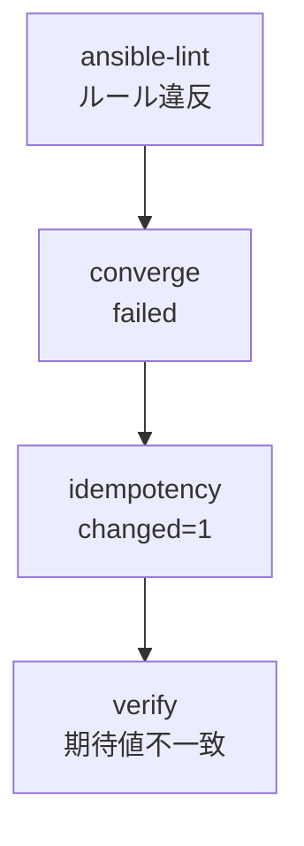
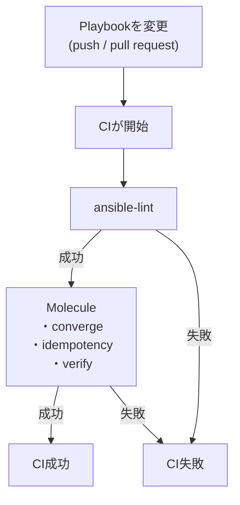

<style> table th, table td { word-break: normal; } table td:first-child { white-space: nowrap; } </style>


> **🗺️ 初めての方・シリーズの全体像を知りたい方はこちら**
> 
> シリーズ全体については、以下のまとめブログで整理しています。
> 
> → **「AnsibleのPlaybookが壊れる理由はテスト文化にあった」 シリーズまとめブログ** **※近日公開予定**

---

## 📋 目次

1. [はじめに](#1-はじめに)
2. [テストの失敗を「設計フィードバック」として読む](#2-テストの失敗を設計フィードバックとして読む)
3. [失敗パターンと設計上の意味](#3-失敗パターンと設計上の意味)
4. [MoleculeをGitHub ActionsのCIに組み込む](#4-moleculeをgithub-actionsのciに組み込む)
5. [静的チェックと動的テストの役割分担](#5-静的チェックと動的テストの役割分担)
6. [まとめ](#6-まとめ)
7. [次回予告](#7-次回予告)
8. [連載一覧：「AnsibleのPlaybookが壊れる理由はテスト文化にあった」](#8-連載一覧ansibleのplaybookが壊れる理由はテスト文化にあった)

---

## 1. はじめに

**[第3回](https://juehara-crypto.github.io/blog/infra/ansible/ansible-molecule/ansible-molecule-03/)** では、プレイブックを実行する前に設計上の問題を検出する静的チェック、ansible-lintを扱いました。ansible-lintとMoleculeの役割分担を整理した上で、Moleculeのverifyフェーズにansible-lintを組み込み、ansible-lint→converge→idempotence→verifyという4段階をテストパイプラインとして位置づけました。

今回はその続きです。静的チェックと動的テストの両方を整えた状態を前提として、「テストが失敗したとき何が分かるのか」という出力の読み方を扱います。その上で、Moleculeとansible-lintをCIに組み込み、「変更のたびに自動で確認し続ける」仕組みを整理します。

**[第0回](https://juehara-crypto.github.io/blog/infra/ansible/ansible-molecule/ansible-molecule-00/)** で、テストを持つことの本質は「一度確認した」から「変更のたびに確認し続ける」への移行にあると整理しました。この移行は、CIへの組み込みによって完結します。今回はシリーズの最終回として、この移行を締めくくります。

---

[↑ 目次に戻る](#-目次)

---

## 2. テストの失敗を「設計フィードバック」として読む

テストが失敗したとき、その出力をどう読むかという視点を先に整理します。

|読み方|視点|
|---|---|
|「テストが失敗した」|何かが動かなかったという事実の確認|
|「設計フィードバックとして読む」|どの設計上の問題がテストで検出されたかの確認|

「テストが失敗した」という読み方は、失敗という結果そのものに注目します。この読み方では、テストは「直せば消えるエラー」として扱われ、失敗の原因がどのような設計上の問題に由来するかまでは意識されません。

一方で「設計フィードバックとして読む」という読み方は、失敗という結果ではなく、その失敗が何を検出したのかに注目します。**[第2回](https://juehara-crypto.github.io/blog/infra/ansible/ansible-molecule/ansible-molecule-02/)**・**[第3回](https://juehara-crypto.github.io/blog/infra/ansible/ansible-molecule/ansible-molecule-03/)** で確認してきた通り、Moleculeやansible-lintの失敗は、Playbookの設計に存在していた問題が可視化された状態です。冪等でないタスクがあった、静的チェックで検出できる非推奨パターンが残っていた、といった問題は、テストが失敗する前から存在していました。テストはその問題を新たに作り出したのではなく、それまで見えていなかった問題を出力として表面化させたにすぎません。

この視点を持つと、テストの失敗は「直すべきエラー」ではなく「設計の問題が可視化された状態」として読めるようになります。次のセクションでは、この視点に立って、代表的な失敗パターンをそれぞれの設計上の意味と対応づけて整理します。

---

[↑ 目次に戻る](#-目次)

---

## 3. 失敗パターンと設計上の意味

4つの失敗パターンを、**[第3回](https://juehara-crypto.github.io/blog/infra/ansible/ansible-molecule/ansible-molecule-03/)** で確定したパイプライン順（ansible-lint→converge→idempotence→verify）に沿って整理します。

|失敗パターン|設計上の意味|
|---|---|
|①ansible-lintでルール違反|設計上の問題が静的に検出された|
|②convergeフェーズでfailed|Playbookの構文または実行に問題がある|
|③idempotencyフェーズでchanged=1|Playbookに冪等でないタスクがある|
|④verifyフェーズで期待値不一致|desired stateの定義と実際の動作がずれている|



### ①ansible-lintでルール違反

ansible-lintは、Playbookを実行する前の段階で設計上の問題を検出します。**[第3回](https://juehara-crypto.github.io/blog/infra/ansible/ansible-molecule/ansible-molecule-03/)** セクション5では、`changed_when`を指定しないcommandタスクを追加した状態でMoleculeのverifyフェーズを実行し、`no-changed-when`ルールが実行前の段階で検出されることを確認しました。

このパターンがパイプラインの最初に位置しているのは、Playbookを一切実行せずに問題を発見できるためです。実行して初めて分かる問題（②〜④）よりも早い段階で、設計上の問題を検出できます。

---

### ②convergeフェーズでfailed

convergeフェーズは、Playbookをテスト対象環境に対して1回目実行するフェーズです。ここで`failed`になる場合、原因は構文エラー・モジュールの引数誤り・対象ノードへの接続エラーなど、Playbook自体が実行として成立しない状態にあることを示します。

ansible-lintを通過していても、実際に実行してみないと分からない問題があるという点が、このパターンの位置づけです。idempotencyフェーズに到達する前に失敗するため、「冪等性の問題」ではなく「Playbook自体が実行として成立するかどうかの問題」として切り分けられます。

##### convergeフェーズを失敗させる：異常系の出力

対象のプレイブックに、以下の変更を加えます。

**＜変更内容＞**

**※以下のタスクを削除します**

```yaml
    - name: Always changed task (for Molecule test)
      ansible.builtin.command: date
```

**※以下の内容を変更します**

```plaintext
notify: Reload nginxを「notify: Reload Nginx Service」に変更

nginx_worker_connections: 768から「1024」に変更

```

`notify`はタスクが`changed`を返した場合にのみhandlerを呼び出す仕組みです。`notify`の変更だけでは、対象のtemplateタスクがすでにdesired stateへ収束済みで`changed`を返さない場合、handlerの呼び出し自体が発生せず、存在しないhandler名を指定していてもエラーになりません。実際に一度この状態で検証したところ、`converge`はエラーなく完了しました。そのため、`nginx_worker_connections`の値も変更し、templateタスクを確実に`changed`にしています。


**＜変更後＞**

**ファイル名：`playbooks/configure_nginx.yml`**


```yaml
---
- name: Configure nginx worker settings
  hosts: nodes
  become: true
  gather_facts: false

  vars:
    nginx_worker_connections: 1024

  tasks:
    - name: Deploy nginx.conf from template
      ansible.builtin.template:
        src: "{{ playbook_dir }}/../templates/nginx.conf.j2"
        dest: /etc/nginx/nginx.conf
        owner: root
        group: root
        mode: "0644"
      notify: Reload Nginx Service


  handlers:
    - name: Reload nginx
      ansible.builtin.systemd:
        name: nginx
        state: reloaded
```
〔実機ログ全文〕

```
(ansible-env) control@ubuntu-controller:~/iac/ansible$ molecule converge
INFO     default ➜ discovery: scenario test matrix: dependency, create, prepare, converge
INFO     default ➜ prerun: Performing prerun with role_name_check=0...
INFO     default ➜ dependency: Executing
WARNING  default ➜ dependency: Missing roles requirements file: requirements.yml
WARNING  default ➜ dependency: Missing collections requirements file: collections.yml
WARNING  default ➜ dependency: Executed: 2 missing (Remove from converge_sequence to suppress)
INFO     default ➜ create: Executing
WARNING  default ➜ create: Skipping, instances already created.
INFO     default ➜ create: Executed: Skipped (Skipping, instances already created.)
INFO     default ➜ prepare: Executing
WARNING  default ➜ prepare: Executed: Missing playbook (Remove from converge_sequence to suppress)
INFO     default ➜ converge: Executing
  ┌──────────────────────────────────────────────────────────────────────────────────
  │ ansible-playbook --inventory /home/control/.ansible/tmp/molecule.DLh_.default/inventory
  │   --skip-tags molecule-notest,notest
  │   /home/control/iac/ansible/molecule/default/converge.yml
  │
  │
  │ PLAY [Configure nginx worker settings] *****************************************
  │
  │ TASK [Deploy nginx.conf from template] *****************************************
  │ ERROR! The requested handler 'Reload Nginx Service' was not found in either the main handlers list nor in the listening handlers list
  └─ Return code: 1 ─────────────────────────────────────────────────────────────────
CRITICAL Ansible return code was 1, command was: ansible-playbook --inventory /home/control/.ansible/tmp/molecule.DLh_.default/inventory --skip-tags molecule-notest,notest /home/control/iac/ansible/molecule/default/converge.yml
ERROR    default ➜ converge: Executed: Failed
ERROR    Ansible return code was 1, command was: ansible-playbook --inventory /home/control/.ansible/tmp/molecule.DLh_.default/inventory --skip-tags molecule-notest,notest /home/control/iac/ansible/molecule/default/converge.yml
```

`ERROR! The requested handler 'Reload Nginx Service' was not found in either the main handlers list nor in the listening handlers list`という行から、指定したhandler名が解決できず、タスクの完了直後に処理が止まったことが分かります。`Return code: 1`、末尾の`converge: Executed: Failed`から、Moleculeもこの結果をconvergeフェーズの失敗として判定しています。

idempotencyフェーズに到達する前にconvergeの時点で処理が止まっており、「冪等性の問題」ではなく「Playbook自体が実行として成立するかどうかの問題」として切り分けられることが、この出力からも確認できます。

---

### ③idempotencyフェーズでchanged=1

idempotencyフェーズは、convergeフェーズを通過した後、同じPlaybookを2回目実行するフェーズです。**[第2回](https://juehara-crypto.github.io/blog/infra/ansible/ansible-molecule/ansible-molecule-02/)** セクション6では、冪等でないcommandタスクを追加した状態でidempotenceフェーズを実行し、2回目の実行でも`changed`が発生し続けるタスクを`CRITICAL Idempotence test failed because of the following tasks:`という行から特定できることを確認しました。

convergeフェーズを通過した後で初めて到達できるフェーズであるため、このパターンが示すのは「Playbookの実行自体は成立するが、冪等性が満たされていない」という設計上の問題です。

---

### ④verifyフェーズで期待値不一致

verifyフェーズは、convergeとidempotencyの両方を通過した後、期待する状態が実際に実現されているかを確認するフェーズです。ここで不一致が検出される場合、「Playbookは成功し、冪等性も満たしているが、desired stateとして定義した状態が実際には実現されていない」という状態を示します。

**[第0回](https://juehara-crypto.github.io/blog/infra/ansible/ansible-molecule/ansible-molecule-00/)** で整理した「実行して成功した」ことと「正しい」ことは別の概念であるという構造と、このパターンは直接つながります。convergeとidempotencyの両方を通過してもなお検出すべき問題が残っているという点が、verifyがパイプラインの最後に置かれている理由です。

##### verifyフェーズで期待値不一致を再現する：異常系の出力

対象のファイルに、以下の変更を加えます。

**＜変更内容＞**

**※「playbooks/configure_nginx.yml」ファイルの以下タスクを削除します**

```yaml
    - name: Always changed task (for Molecule test)
      ansible.builtin.command: date
```

**※「molecule/default/verify.yml」ファイルに以下のタスクを追加します。**

```yaml
- name: Check worker_connections value on the node
      ansible.builtin.command:
        cmd: grep worker_connections /etc/nginx/nginx.conf
      register: worker_connections_check
      changed_when: false
      delegate_to: ubuntu-node1

    - name: Assert expected worker_connections value
      ansible.builtin.assert:
        that:
          - "'1024' in worker_connections_check.stdout"
        fail_msg: "worker_connectionsの値が期待値(1024)と一致しません: {{ worker_connections_check.stdout }}"
```


**＜変更後＞**

* **「playbooks/configure_nginx.yml」ファイル**
```yaml
---
- name: Configure nginx worker settings
  hosts: nodes
  become: true
  gather_facts: false
  vars:
    nginx_worker_connections: 768
  tasks:
    - name: Deploy nginx.conf from template
      ansible.builtin.template:
        src: "{{ playbook_dir }}/../templates/nginx.conf.j2"
        dest: /etc/nginx/nginx.conf
        owner: root
        group: root
        mode: "0644"
      notify: Reload nginx
  handlers:
    - name: Reload nginx
      ansible.builtin.systemd:
        name: nginx
        state: reloaded
```


*  **「molecule/default/verify.yml」ファイル**

```yaml
---
- name: Verify Playbook with ansible-lint
  hosts: localhost
  gather_facts: false
  tasks:
    - name: Run ansible-lint
      ansible.builtin.command:
        cmd: >
          ansible-lint
          --project-dir ../../
          ../../playbooks/configure_nginx.yml
      changed_when: false

    - name: Check worker_connections value on the node
      ansible.builtin.command:
        cmd: grep worker_connections /etc/nginx/nginx.conf
      register: worker_connections_check
      changed_when: false
      delegate_to: ubuntu-node1

    - name: Assert expected worker_connections value
      ansible.builtin.assert:
        that:
          - "'1024' in worker_connections_check.stdout"
        fail_msg: "worker_connectionsの値が期待値(1024)と一致しません: {{ worker_connections_check.stdout }}"
```


この状態で`molecule verify`を実行します。

- **`verify`実行**

```plaintext
(ansible-env) control@ubuntu-controller:~/iac/ansible$ molecule verify
INFO     default ➜ discovery: scenario test matrix: verify
INFO     default ➜ prerun: Performing prerun with role_name_check=0...
INFO     default ➜ verify: Executing
  ┌──────────────────────────────────────────────────────────────────────────────────
  │ ansible-playbook --inventory /home/control/.ansible/tmp/molecule.DLh_.default/inventory
  │   --skip-tags molecule-notest,notest
  │   /home/control/iac/ansible/molecule/default/verify.yml
  │
  │
  │ PLAY [Verify Playbook with ansible-lint] ***************************************
  │
  │ TASK [Run ansible-lint] ********************************************************
  │ ok: [localhost]
  │
  │ TASK [Check worker_connections value on the node] ******************************
  │ ok: [localhost -> ubuntu-node1(192.168.56.31)]
  │
  │ TASK [Assert expected worker_connections value] ********************************
  │ fatal: [localhost]: FAILED! => {
  │     "assertion": "'1024' in worker_connections_check.stdout",
  │     "changed": false,
  │     "evaluated_to": false,
  │     "msg": "worker_connectionsの値が期待値(1024)と一致しません:         worker_connections 768;"
  │ }
  │
  │ PLAY RECAP *********************************************************************
  │ localhost                  : ok=2    changed=0    unreachable=0    failed=1    skipped=0    rescued=0    ignored=0
  │
  └─ Return code: 2 ─────────────────────────────────────────────────────────────────
CRITICAL Ansible return code was 2, command was: ansible-playbook --inventory /home/control/.ansible/tmp/molecule.DLh_.default/inventory --skip-tags molecule-notest,notest /home/control/iac/ansible/molecule/default/verify.yml
ERROR    default ➜ verify: Executed: Failed
ERROR    Ansible return code was 2, command was: ansible-playbook --inventory /home/control/.ansible/tmp/molecule.DLh_.default/inventory --skip-tags molecule-notest,notest /home/control/iac/ansible/molecule/default/verify.yml

```

`TASK [Run ansible-lint]`と`TASK [Check worker_connections value on the node]`はいずれも`ok`となっており、静的チェックとノードの値の取得自体は問題なく成功しています。一方で`TASK [Assert expected worker_connections value]`が`fatal`となり、`msg`に「worker_connectionsの値が期待値(1024)と一致しません」という内容とともに、実際の値`worker_connections 768;`が表示されています。

`PLAY RECAP`は`failed=1`、末尾の`verify: Executed: Failed`から、Moleculeもverifyフェーズ全体を失敗と判定していることが分かります。

ansible-lintのタスクとworker_connectionsの取得タスクはいずれも成功している一方、期待値の比較タスクだけが失敗しているため、「静的チェックは通過し、値の取得自体も問題なく行えたが、実際の値がdesired stateとして定義した値と一致しない」という④の構図が、このログからそのまま読み取れます。

---

[↑ 目次に戻る](#-目次)

---

## 4. MoleculeをGitHub ActionsのCIに組み込む

ここまでの4つの失敗パターンを踏まえて、Moleculeとansible-lintをCIに組み込む意味を整理します。

CIへの組み込みは、これまでのセクションで見てきた「テストを実行する」という行為そのものを変えるものではありません。変わるのは、そのテストを実行するタイミングです。

|実行のきっかけ|実行する主体|
|---|---|
|手動でMolecule・ansible-lintを実行する|人が判断してコマンドを打つ|
|CIに組み込む|Playbookリポジトリへのpush・pull requestが実行の引き金になる|

CIに組み込む構成では、GitHub ActionsのようなCIサービス上で、push・pull requestをトリガーにansible-lintとMoleculeが自動的に実行されます。



セクション3で整理した4つの失敗パターン（①ansible-lintでルール違反・②convergeフェーズでfailed・③idempotencyフェーズでchanged=1・④verifyフェーズで期待値不一致）のいずれかが発生した場合、CI全体が失敗として扱われ、その結果がマージの可否に反映されます。

「CIが失敗するとマージされない」という仕組みにより、冪等でないPlaybookや設計上の問題を含んだPlaybookがリポジトリに混入することを防ぐ構造になります。**[第0回](https://juehara-crypto.github.io/blog/infra/ansible/ansible-molecule/ansible-molecule-00/)** で整理した手動確認の限界のうち、「確認を忘れる」「確認したことが記録されない」という2点は、この仕組みによって解消されます。確認はPlaybookへの変更をきっかけに自動で実行され、その結果はCIの実行履歴として記録として残ります。

CIツールの選定や、GitHub Actionsのワークフローファイルの作成方法については、本連載の対象外とします。ここでは、**MoleculeによるテストをCIから自動実行するという考え方**のみを扱います。

重要なのは、テストの実行が「人の判断」から「変更という事実」に紐づくようになることです。この移行によって、**[第0回](https://juehara-crypto.github.io/blog/infra/ansible/ansible-molecule/ansible-molecule-00/)** で示した「一度確認した」から「変更のたびに確認し続ける」への移行が完結します。

---

[↑ 目次に戻る](#-目次)

---

## 5. 静的チェックと動的テストの役割分担

シリーズを通じて整理してきたansible-lintとMoleculeの役割分担を、最終的にまとめます。

|ツール|種別|タイミング|検出できる問題|
|---|---|---|---|
|ansible-lint|静的チェック|実行前|設計上の問題・非推奨パターン|
|Molecule|動的テスト|実行時|実際の動作・冪等性・desired stateの実現|

両者は補完関係にあります。ansible-lintは実行前に設計上の問題を発見できますが、実際にPlaybookを対象環境へ適用した結果までは確認できません。Moleculeは実際の動作を確認できますが、実行して初めて分かる問題であるため、発見のタイミングはansible-lintより後になります。どちらか一方だけでは、Playbookの品質を十分に確認したことにはなりません。

このシリーズでは、**[冪等性シリーズ](https://qiita.com/juehara-crypto/items/d77fa93e82ea4a33ef4f)** で「壊れない設計」を、ドリフトシリーズで「それでもずれていく理由」を整理してきました。そして本シリーズでは、その2つを踏まえた上で「ずれていないことを継続的に確認する仕組み」を扱ってきました。この3つのシリーズを重ねると、次のような構造として整理できます。

|層|担う役割|
|---|---|
|設計（**[冪等性シリーズ](https://qiita.com/juehara-crypto/items/d77fa93e82ea4a33ef4f)**）|壊れない設計にする|
|運用（ドリフトシリーズ）|管理外の変化を検知する|
|テスト（Moleculeシリーズ）|変更のたびに継続的に確認する|

テストを持つことは、この三層構造のうち「継続的に確認する」という役割を担う仕組みです。設計と運用だけでは、Playbookが実際に冪等であり続けているかどうかを、変更のたびに保証することはできません。

---

[↑ 目次に戻る](#-目次)

---

## 6. まとめ

この回で整理した内容を確認します。

- **テストの失敗は「直すべきエラー」ではなく「設計の問題が可視化された状態」として読める**ことを整理しました。この視点に立つことで、失敗そのものではなく、失敗が示す設計上の問題に注目できます。
- **4つの失敗パターン（ansible-lint・converge・idempotency・verify）は、それぞれ異なる設計上の問題を示します。** パイプラインの早い段階ほど、Playbookを実行せずに、あるいは実行のより早い時点で問題を発見できます。
- **Moleculeとansible-lintをCIに組み込むことで、確認がPlaybookへの変更をきっかけに自動実行され、結果が記録として残る構造になります。** これにより、手動確認が抱えていた「確認を忘れる」「記録されない」という限界が解消されます。
- **ansible-lint（静的チェック）とMolecule（動的テスト）は補完関係にあり、両方を組み合わせて初めてPlaybookの品質を段階的に確認できます。**
- **[冪等性シリーズ](https://qiita.com/juehara-crypto/items/d77fa93e82ea4a33ef4f)**・ドリフトシリーズ・Moleculeシリーズを重ねると、「設計で防ぎ・運用で検知し・テストで継続的に確認する」という三層の構造として整理できます。

---

[↑ 目次に戻る](#-目次)

---

## 7. 次回予告

本シリーズでは「ずれていないことを継続的に確認する仕組み」として、テストを持つことの意味を扱ってきました。次のシリーズでは、その先にある別の問いを扱います。

**「AnsibleとTerraformの連携が壊れる理由はライフサイクルにあった」**

このシリーズでは、Ansible単体では扱いきれなかった**複数のツールが連携する場面でのトラブル**を扱います。Terraformがインフラリソースを生成し、その完了後にAnsibleが構成管理を行うという連携は、一見単純に見えても、リソースの生成完了・ネットワークの初期化・SSH接続の確立・実行環境の差異といった複数の段階を経て初めて成立します。第1部（環境構築・連携編）では、この連携の中で起きる9つのトラブルを、実機検証を交えながら扱います。

|回|タイトル|内容（概要）|
|---|---|---|
|**[第1回](https://juehara-crypto.github.io/blog/infra/ansible/ansible-terraform/ansible-terraform-part1/ansible-terraform-part1-01/)**|AnsibleとTerraformの連携目的と設計思想の違い|リソース生成（Terraform）と構成管理（Ansible）の役割分担と、連携時における設計のアンチパターンを俯瞰。冪等性シリーズ・ドリフトシリーズとの接続を示す。|
|**[第2回](https://juehara-crypto.github.io/blog/infra/ansible/ansible-terraform/ansible-terraform-part1/ansible-terraform-part1-02/)**|Terraform完了直後のプロビジョニング失敗を防ぐSSH待機制御|TerraformのAPIレスポンスとターゲット側のSSHDが実際にリクエストを受け付けられる状態になるまでのタイムラグによる接続失敗と解決策。|
|**[第3回](https://juehara-crypto.github.io/blog/infra/ansible/ansible-terraform/ansible-terraform-part1/ansible-terraform-part1-03/)**|動的インベントリ生成時における出力データのパースエラー|TerraformのJSON出力とAnsibleが期待する動的インベントリのJSONスキーマとの構造的な差異を整理し、変換スクリプトによる解決方法を解説する。|
|**[第4回](https://juehara-crypto.github.io/blog/infra/ansible/ansible-terraform/ansible-terraform-part1/ansible-terraform-part1-04/)**|自動生成されたSSH鍵のパーミッション設定エラー|Terraformで自動生成した秘密鍵ファイルの権限設定が不適切なため、AnsibleのSSH実行時に接続を拒否されるトラブルへの対応。|
|**[第5回](https://juehara-crypto.github.io/blog/infra/ansible/ansible-terraform/ansible-terraform-part1/ansible-terraform-part1-05/)**|仮想環境におけるIPアドレス変動対策|Terraformがリソースを再生成する際に発生するIPアドレス変動を実機で検証し、TerraformリソースレベルでのIP固定と動的インベントリという2つのアプローチを比較する。|
|**[第6回](https://juehara-crypto.github.io/blog/infra/ansible/ansible-terraform/ansible-terraform-part1/ansible-terraform-part1-06/)**|ネットワーク初期化完了前に発生する接続タイムアウト|ネットワークの構築完了と実際に通信可能な状態が別のタイミングであるという構造から生じる接続タイムアウトを整理し、対策設計を解説する。|
|**[第7回](https://juehara-crypto.github.io/blog/infra/ansible/ansible-terraform/ansible-terraform-part1/ansible-terraform-part1-07/)**|実行環境とターゲットOS間におけるPythonバージョンの不一致|ターゲットOS内のPythonバージョンと、コントロールノード側のPythonの乖離による実行時エラーへの対応。冪等性シリーズ第7回との接続を示す。|
|**[第8回](https://juehara-crypto.github.io/blog/infra/ansible/ansible-terraform/ansible-terraform-part1/ansible-terraform-part1-08/)**|複数インスタンス同時構築時における並列処理の競合|Terraformの並列生成とAnsible側の並列実行数（forks）の噛み合わせによって処理が遅延・競合する問題を整理し、forks調整やバッチ分割といった対策設計を解説する。|
|**[第9回](https://juehara-crypto.github.io/blog/infra/ansible/ansible-terraform/ansible-terraform-part1/ansible-terraform-part1-09/)**|OS固有の初期ユーザーと管理者権限（sudo）への昇格エラー|コンテナイメージごとに異なるデフォルトユーザーに対し、`become`を用いて権限昇格する際の設定ミスと対策。|
|**[第10回](https://juehara-crypto.github.io/blog/infra/ansible/ansible-terraform/ansible-terraform-part1/ansible-terraform-part1-10/)**|環境構築編まとめ：自動連携のためのコードテンプレート化|第1〜9回の課題を踏まえ、TerraformからAnsibleへ一貫して安全に処理を移譲するための実行順序と、統合したコードテンプレートを解説する。|

**[次回：「AnsibleとTerraformの連携が壊れる理由はライフサイクルにあった」第1回：AnsibleとTerraformの連携目的と設計思想の違い](https://juehara-crypto.github.io/blog/infra/ansible/ansible-terraform/ansible-terraform-part1/ansible-terraform-part1-01/)**


---

📑 連載の移動　**[前の記事：【Molecule編】 第3回](https://juehara-crypto.github.io/blog/infra/ansible/ansible-molecule/ansible-molecule-03/)　｜　[次の記事：【「Ansible×Terraform」編】第1回](https://juehara-crypto.github.io/blog/infra/ansible/ansible-terraform/ansible-terraform-part1/ansible-terraform-part1-01/)**

---

> **🗺️ 初めての方・シリーズの全体像を知りたい方はこちら**
> 
> シリーズ全体については、以下のまとめブログで整理しています。
> 
> → **「AnsibleのPlaybookが壊れる理由はテスト文化にあった」 シリーズまとめブログ** **※近日公開予定**

---

[↑ 目次に戻る](#-目次)

---

## 8. 連載一覧：「AnsibleのPlaybookが壊れる理由はテスト文化にあった」

|回|タイトル|内容（概要）|
|---|---|---|
|**[第0回](https://juehara-crypto.github.io/blog/infra/ansible/ansible-molecule/ansible-molecule-00/)**|なぜPlaybookにテストが必要なのか|「実行して成功した」と「正しい」は別の概念であることを整理し、手動確認の構造的な限界を理解する。テストを持つことの本質が「確認を仕組みに組み込むこと」であることを理解する。|
|**[第1回](https://juehara-crypto.github.io/blog/infra/ansible/ansible-molecule/ansible-molecule-01/)**|Moleculeは何をしているのか|create・converge・idempotency・verify・destroyという各フェーズが何のためにあるかを、冪等性の文脈と接続しながら理解する。「2回実行してchanged=0」という手動確認をMoleculeが自動化している構造であることを整理する。|
|**[第2回](https://juehara-crypto.github.io/blog/infra/ansible/ansible-molecule/ansible-molecule-02/)**|冪等性テストを自動化する|冪等性シリーズで作成したPlaybookをMoleculeでテストする構成を実機で確認し、1回目と2回目の実行で何が確認されているかを読み取る。idempotencyフェーズで`changed`が発生した場合の表示を意図的に再現し、テストが失敗するとはどういう状態かを理解する。|
|**[第3回](https://juehara-crypto.github.io/blog/infra/ansible/ansible-molecule/ansible-molecule-03/)**|ansible-lintはなぜそのルールを定めているのか|ansible-lintのルールを設計品質の静的確認として位置づけ、代表的なルールカテゴリが冪等性・ドリフトの問題とどう接続しているかを理解する。MoleculeのverifyフェーズにAnsible-lintを組み込み、テストパイプラインの一部として位置づける。|
|**[第4回](https://juehara-crypto.github.io/blog/infra/ansible/ansible-molecule/ansible-molecule-04/)**|テストが失敗したとき何が分かるのか・CIに組み込む|Moleculeのテスト失敗パターンを、設計上の何が問題なのかというフィードバックとして読む視点を理解する。GitHub ActionsなどのCIにMoleculeとansible-lintを組み込み、「変更のたびに確認し続ける」仕組みを整理する。|

---

[↑ 目次に戻る](#-目次)

---
