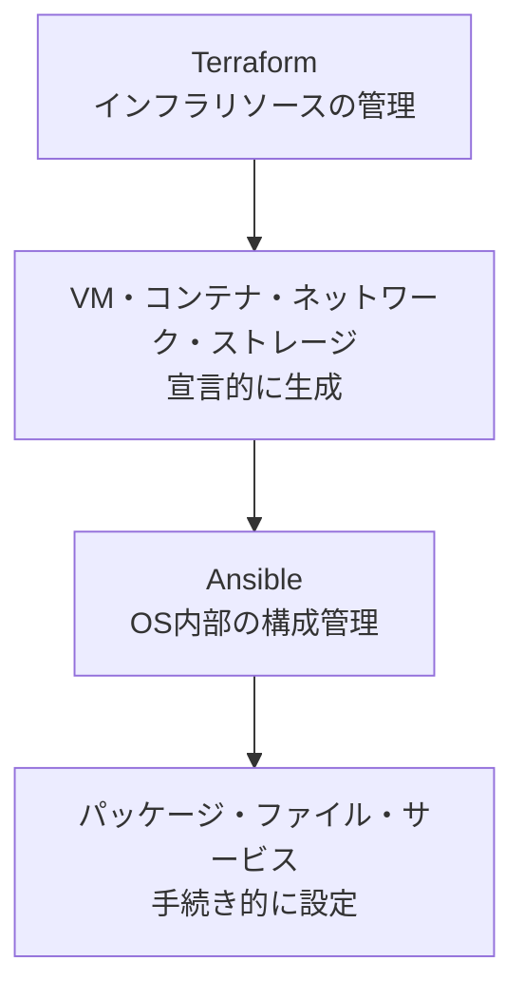

<style>
table th,
table td {
    word-break: normal;
}
table td:first-child {
    white-space: nowrap;
}
</style>


> **🗺️ 初めての方・シリーズの全体像を知りたい方はこちら**
> 
> シリーズ全体については、以下のまとめブログで整理しています。
> 
> → **「AnsibleとTerraformの連携が壊れる理由はライフサイクルにあった」第1部まとめブログ：環境構築・連携編で直面する9つのトラブル** **※近日公開予定**

---

## 📋 目次

1. [はじめに](#1-はじめに)
2. [AnsibleとTerraformの管理範囲](#2-ansibleとterraformの管理範囲)
3. [連携時の設計アンチパターン](#3-連携時の設計アンチパターン)
4. [アンチパターンが引き起こす問題](#4-アンチパターンが引き起こす問題)
5. [冪等性・ドリフトシリーズとの接続](#5-冪等性ドリフトシリーズとの接続)
6. [このシリーズで扱う内容の全体像](#6-このシリーズで扱う内容の全体像)
7. [まとめ](#7-まとめ)
8. [次回予告](#8-次回予告)
9. [連載一覧：「AnsibleとTerraformの連携が壊れる理由はライフサイクルにあった」](#9-連載一覧ansibleとterraformの連携が壊れる理由はライフサイクルにあった)

---

## 1. はじめに

「TerraformでVMやコンテナを作って、Ansibleで中身を設定すればいい」という話を聞いたことがあると思います。

実際、多くの入門記事やチュートリアルはこの通りに進みます。`terraform apply`でリソースを作り、続けて`ansible-playbook`を流す。一見するとシンプルで、この2つを組み合わせれば自動化は完成するように見えます。

しかし実際に運用を始めると、そうとは限らない場面にぶつかります。

- Terraformの実行が終わった直後にAnsibleを動かすと、なぜか接続できない
- コードを少し直して`apply`し直しただけなのに、Ansibleで設定したはずの内容が消えている
- 同じ設定項目をTerraform側とAnsible側の両方で定義していて、実行するたびに値が入れ替わる
- エラーが出たとき、原因がTerraform側にあるのかAnsible側にあるのか切り分けられない

こうした問題に共通しているのは、「AnsibleとTerraformを繋げれば自動化できる」という前提そのものではなく、その前提の中にある見落としです。

正確に言うと、**AnsibleとTerraformはそれぞれ管理しているレイヤーが異なり、その境界を意識せずに設計すると、どちらのツールが何に責任を持っているのかが曖昧になります**。この曖昧さが、接続タイミングのずれ・設定の消失・二重管理といった具体的なトラブルの温床になります。

このシリーズでは、その「境界が崩れる構造」を具体的に掘り下げていきます。第1回は、そのための土台として、AnsibleとTerraformがそれぞれ何を管理するツールなのかを整理します。

なお、このシリーズは冪等性シリーズ・ドリフトシリーズ・Moleculeシリーズと内容的なつながりがあります。冪等性シリーズが「壊れない設計」を、ドリフトシリーズが「それでもずれていく理由」を、Moleculeシリーズが「ずれていないことを継続的に確認する仕組み」を扱ったのに対し、本シリーズはこれらを踏まえた上で、「複数ツールが連携する環境で何が起きるか」を扱います。前3シリーズを読まれた方には、そこで整理した内容がAnsible×Terraform環境でどう現れるかの答え合わせとして、初めて読まれる方には、これから整理していく内容の入り口として、読み進めていただけます。

---

[↑ 目次に戻る](#-目次)

---

## 2. AnsibleとTerraformの管理範囲

AnsibleとTerraformは、どちらもインフラを自動化するツールですが、管理している対象のレイヤーが異なります。

|ツール|管理対象|管理方式|
|---|---|---|
|Terraform|VM・コンテナ・ネットワーク・ストレージ等のインフラリソース|宣言的（あるべき状態を定義）|
|Ansible|OS・パッケージ・ファイル・サービス等の構成|手続き的（タスクを順に実行）|

Terraformは、HCLで書かれたコードをもとに「このリソースがこの状態で存在すること」を宣言し、現在のインフラの状態（tfstate）と比較して差分を適用します。VMを作る・コンテナを起動する・ネットワークを構築するといった、インフラそのものの生成・変更・削除がTerraformの管理範囲です。

Ansibleは、Terraformが生成したリソースの上で動くOSに対して、パッケージのインストール・設定ファイルの配置・サービスの起動といったタスクを順に実行します。冪等性シリーズで見てきた通り、Ansibleのモジュールは現在の状態を観測してから動作しますが、その観測対象はあくまで「リソースの中」です。リソース自体の生成・削除はAnsibleの管理範囲に含まれません。

この2つのレイヤーは、次のように整理できます。




図で示した通り、Terraformが担うのは「リソースを用意するところまで」であり、Ansibleが担うのは「用意されたリソースの中身を整えるところから」です。両者は連続した処理として繋がっていますが、管理しているレイヤー自体は別物です。

この対応関係は、VMかコンテナかによって変わるものではありません。Terraformが`kreuzwerker/docker`のようなプロバイダーでコンテナを生成する場合も、AWSやGCPでVMを生成する場合も、「リソースを生成するのがTerraform」「その中身を整えるのがAnsible」という役割分担そのものは変わりません。本シリーズの検証では主にDockerコンテナを使いますが、これから示す構造はプロバイダーに依存しない話として読み進めていただけます。

この管理レイヤーの違いを意識せずに設計すると、次のセクションで扱うようなアンチパターンが生まれます。「Terraformで作ったリソースの中身も、なんとなくTerraform側で完結させたい」「Ansible側でインフラの状態まで面倒を見てしまえば早い」といった発想が、役割の境界を曖昧にする出発点になります。

---

[↑ 目次に戻る](#-目次)

---

## 3. 連携時の設計アンチパターン

前セクションで整理した管理レイヤーの境界を意識せずに設計した場合、現場でよく見られるアンチパターンが3つあります。

### ① Terraformの初期化スクリプトにPlaybook実行を直書きする構成

リソース起動時の初期化スクリプトに、Ansible Playbookの実行コマンドを直接埋め込む構成です。VMであればcloud-initのUser Data、コンテナであればENTRYPOINTやコンテナ起動時のスクリプトがこれにあたります。

```hcl
resource "docker_container" "target" {
  # ...
  entrypoint = ["/bin/sh", "-c", "ansible-playbook /path/to/playbook.yml"]
}
```

一見すると「リソース起動と同時に構成も終わらせられる」ため効率的に見えます。しかし、この構成ではTerraformの管理範囲（リソース生成）とAnsibleの管理範囲（構成管理）がひとつのリソース定義の中に混在します。リソースを作り直すたびに初期化スクリプト経由でPlaybookが実行されるため、「インフラの変更」と「構成の変更」が同じタイミングで強制的に結びつき、どちらのツールが何に責任を持っているのかが不明確になります。この問題は、VM・コンテナ・クラウドプロバイダーのいずれであっても同じ構造で発生します。

### ② local-execでAnsible実行を全て賄う構成

`local-exec`プロビジョナーでAnsibleを呼び出し、インフラ生成から構成管理までをひとつの`terraform apply`にまとめる構成です。

```hcl
resource "docker_container" "target" {
  # ...
}

resource "null_resource" "provision" {
  depends_on = [docker_container.target]

  provisioner "local-exec" {
    command = "ansible-playbook -i inventory.ini playbook.yml"
  }
}
```

この構成は現場でもよく見られるパターンです。`local-exec`はTerraformのリソースが作成されたタイミングで一度だけ実行されるプロビジョナーであり、SSH接続のタイミング・Ansible側の冪等性の制御・エラーハンドリングのいずれもTerraform側の実行フローに依存することになります。第2回では、この構成を前提としたSSH接続タイミングの問題を扱います。

### ③ 同一リソースの同一設定をAnsibleとTerraformが二重管理する構成

ホスト名やユーザー設定など、同じ設定項目をTerraform側とAnsible側の両方で定義してしまうケースです。

```hcl
# Terraform側
resource "docker_container" "target" {
  hostname = "target-node1"
}
```


```yaml
# Ansible側
- name: ホスト名を設定する
  ansible.builtin.hostname:
    name: target-node1
```

一見どちらも同じ値を設定しているだけに見えますが、どちらの定義が正とされるのかが構成上どこにも示されていません。`terraform apply`と`ansible-playbook`の実行タイミングがずれると、片方が設定した値をもう片方が意識せずに上書きする状態になります。

---

この3つのアンチパターンに共通しているのは、Terraformの管理範囲とAnsibleの管理範囲のどちらか一方に処理を寄せすぎる、あるいは同じ対象を両方が触ってしまうという点です。第2節で示したレイヤーの境界が、実際のコード上では簡単に崩れることが分かります。

---

[↑ 目次に戻る](#-目次)

---

## 4. アンチパターンが引き起こす問題

前セクションで示した3つのアンチパターンは、それぞれ個別の設計ミスに見えますが、引き起こす問題には共通点があります。

- **冪等性の崩壊**：local-exec経由でAnsibleを呼ぶ構成では、`terraform apply`を再実行するたびにPlaybookも再実行されます。Playbook自体が冪等に書かれていたとしても、呼び出しの回数そのものはTerraform側の実行フローに支配されるため、冪等でないタスク（shellモジュールによる操作など）が含まれていれば、apply のたびにその影響が累積します。
- **構成ドリフト**：AnsibleとTerraformが同一設定を二重管理する構成では、どちらか一方が実行されるたびに、もう一方が設定した値が意識されないまま上書きされます。表面上は「最新の実行結果」が反映されているように見えても、実際にはどちらの定義が正なのかが構成上定まっていないため、実行順序によって最終的な状態が変わり続けます。
- **デバッグの困難**：エラーが発生した場合、Terraformの実行ログとAnsibleの実行ログにまたがって出力されるため、原因がリソース生成側にあるのか構成管理側にあるのかを切り分けるのに時間がかかります。特にlocal-exec経由でAnsibleを呼んでいる構成では、Ansible側のタスクエラーがTerraformの`apply`失敗としてまとめて報告されるため、Terraformのログだけを見ても原因が分かりません。

これらの問題は、第3節で示したアンチパターンのいずれか一つに起因するとは限りません。実際には複数のアンチパターンが組み合わさって発生することが多く、「local-execで冪等性が崩れているうえに、二重管理でドリフトも起きている」という状態になることも珍しくありません。

この3つの問題が、本シリーズの第2回以降で扱う個別のトラブルの背景にあります。どの回がどのアンチパターンに起因しているかは、第6節の全体像で改めて整理します。

---

[↑ 目次に戻る](#-目次)

---

## 5. 冪等性・ドリフトシリーズとの接続

前セクションで整理した「冪等性の崩壊」と「構成ドリフト」は、実は新しい問題ではありません。冪等性シリーズ・ドリフトシリーズですでに扱った問題が、Ansible×Terraform連携という別の文脈で発現しているだけです。対応関係を整理します。

| 過去シリーズ          | 連携での発現文脈                               |
| --------------- | -------------------------------------- |
| 冪等性シリーズ第1・4回    | local-exec経由でAnsibleを複数回呼び出す構成で、冪等でないタスクが累積して実行される       |
| ドリフトシリーズ第0・1・3回 | terraform applyによるリソース再生成後にAnsible設定が消失する・二重管理による上書きでドリフトが発生する |
| ドリフトシリーズ第2回     | AnsibleとTerraformの管理範囲が重複する領域では、どちらのツールでも状態の全体像を把握できない       |

1行目は、**[冪等性シリーズ第1回](https://juehara-crypto.github.io/blog/infra/ansible/ansible-idempotency/ansible-idempotency-01/)** で確認した「shellモジュールは現在の状態を観測する仕組みを持たない」という構造がそのまま当てはまります。local-exec経由でAnsibleが繰り返し呼び出される構成では、Playbook内にshellモジュールや`state: latest`のような非冪等な要素が含まれていた場合、その影響がterraform applyのたびに積み重なります。冪等性シリーズが扱っていたのは「Playbook単体の設計問題」でしたが、ここではそれがTerraformの実行フローによって繰り返される回数までコントロールできなくなる、という形で現れます。

2行目は、ドリフトシリーズ **[第0回](https://juehara-crypto.github.io/blog/infra/ansible/ansible-drift/ansible-drift-00/)**・**[第1回](https://juehara-crypto.github.io/blog/infra/ansible/ansible-drift/ansible-drift-01/)** で整理した「Ansibleが実行されていない時間に起きる変化」という構造の延長です。ただしAnsible×Terraform環境では、変化の原因が手動変更だけでなく、Terraform自身のリソース再生成にもなります。**[ドリフトシリーズ第1回](https://juehara-crypto.github.io/blog/infra/ansible/ansible-drift/ansible-drift-01/)** で確認したtemplateモジュールの「手動変更を区別せず上書きする」という挙動と同じ構造が、ここでは「terraform applyによるリソース再生成が、Ansibleが投入した設定を区別せず消し去る」という形で現れます。

3行目は、**[ドリフトシリーズ第2回](https://juehara-crypto.github.io/blog/infra/ansible/ansible-drift/ansible-drift-02/)** で確認した「`--check`が確認しているのはあくまでPlaybookが管理している範囲の差分であり、その範囲外は確認対象にすら含まれない」という構造の延長です。AnsibleとTerraformの管理範囲が重複する領域では、Ansibleの`--check`もTerraformの`plan`も、それぞれ自分が管理している範囲の差分しか示しません。どちらか一方の確認結果だけでは、連携環境全体の状態を把握したことにはなりません。

なお、Moleculeシリーズとの接続は第34回（Testinfraによる状態検証をパイプラインに組み込む回）で扱うため、ここでは触れません。

---

[↑ 目次に戻る](#-目次)

---

## 6. このシリーズで扱う内容の全体像

ここまでで、AnsibleとTerraformの管理レイヤーの違い、それを意識しない設計が引き起こすアンチパターン、そして冪等性シリーズ・ドリフトシリーズで扱った問題との対応関係を見てきました。ここからは、このシリーズ全体が何を扱っていくのかを整理します。

本シリーズは全50回、5部構成です。

```
第1部（第1〜10回）：環境構築・連携編              → 連携の基本構成と初期トラブルの解消
第2部（第11〜20回）：運用・ライフサイクル編          → 継続運用で発生する構成ズレと状態管理
第3部（第21〜30回）：トラブルシューティング・デバッグ編   → 原因特定と解析手法
第4部（第31〜40回）：改善・CI/CD自動化編          → パイプライン統合と設計の改善
第5部（第41〜50回）：Terraformライフサイクル破壊編    → Terraformのライフサイクル操作がAnsible設定に与える破壊的影響と対策
```

第1部（環境構築・連携編）は、今回の第1回を含む10回で構成されます。第2回以降で扱うSSH接続タイミング・インベントリのパースエラー・秘密鍵のパーミッション・IPアドレス変動・ネットワーク初期化のラグ・Pythonバージョンの不一致・並列実行の競合・権限昇格のエラーは、いずれも「Terraformでリソースを生成してからAnsibleが構成管理を始めるまで」という、初回構築時に直面する問題です。

第2部（運用・ライフサイクル編）では、視点が「構築時」から「構築後の継続運用」に移ります。手動変更による構成ドリフトの検知、`terraform apply`実行時の初期化処理によるOS設定の上書き、コード修正に伴うリソースの強制再生成とそれによるAnsible投入データの消失など、第5節で整理した「Ansibleの設定がTerraform側の操作によって消える」問題は、主にこの部で具体的に扱います。

第3部（トラブルシューティング・デバッグ編）は、第4節で触れた「デバッグの困難」という問題に正面から取り組みます。TerraformとAnsibleのログが混在する中でどう原因を切り分けるか、ネットワーク・リソース・実行環境それぞれのレイヤーで起きるエラーをどう解析するかを扱います。

第4部（改善・CI/CD自動化編）では、ここまでの個別トラブルへの対処を踏まえて、パイプライン全体の設計に視点を広げます。Moleculeシリーズで扱った継続的テストの考え方をCI/CDに統合し、ドリフトの自動検知・自動収束までを扱います。

第5部（Terraformライフサイクル破壊編）は、TerraformのState管理とライフサイクル制御（`lifecycle`ブロックや`prevent_destroy`など）が、Ansibleが投入した設定やデータにどう影響するかを、より根本的なところから掘り下げます。

この5部構成を通じて一貫しているのは、「AnsibleとTerraformという2つのツールが、それぞれ独立して動いているようで、実際には互いの実行結果に依存し合っている」という構造です。第1回で示したレイヤーの境界、第4節で示した3つの問題、第5節で示した過去シリーズとの対応関係は、いずれもこの構造の異なる断面を見ているにすぎません。

---

[↑ 目次に戻る](#-目次)

---

## 7. まとめ

この回で整理した内容を確認します。

- **AnsibleとTerraformの管理レイヤーは異なる**。Terraformはインフラリソースを宣言的に管理し、Ansibleはそのリソース上のOS・パッケージ・ファイル・サービスを手続き的に管理する。この境界を混在させるとトラブルになる。
- **役割の境界を意識しない設計には3つの典型的なアンチパターンがある**。初期化スクリプトへのPlaybook直書き、local-execによる一括処理、AnsibleとTerraformの二重管理である。
- **これらのアンチパターンは冪等性の崩壊・構成ドリフト・デバッグの困難という3つの問題を引き起こす**。「とりあえずlocal-execで繋げた」構成が、後続回で扱うトラブルの構造的な原因になっている。
- **過去シリーズで扱った問題はAnsible×Terraform連携でも同じ構造で現れる**。冪等性シリーズのshellモジュール・state: latestの問題はlocal-exec経由の複数回実行で累積し、ドリフトシリーズの手動変更・管理外変化の問題はリソース再生成による設定消失という形で現れる。
- **本シリーズは全50回・5部構成で、初回構築時のトラブルから継続運用・デバッグ・CI/CD統合・ライフサイクル制御まで段階的に扱っていく**。

役割の境界を意識するというこの回の内容は、抽象的な設計論にとどまるものではありません。次回以降で扱う個別のトラブルは、すべてこの境界がどこかで崩れたときに発生します。

---

[↑ 目次に戻る](#-目次)

---

## 8. 次回予告

今回は、AnsibleとTerraformがそれぞれ何を管理するツールなのかという役割分担の設計思想を整理し、その境界を意識しない設計がどのようなアンチパターンを生むかを見てきました。

次回は、この役割分担を踏まえたうえで、連携の実装段階で最初に直面する問題を扱います。

第2回では、Terraformがリソースの生成完了を報告した直後にAnsibleを実行すると、SSH接続に失敗するという問題を取り上げます。TerraformのAPIレスポンスが返ってくるタイミングと、ターゲット側でSSHDが実際に接続を受け付けられる状態になるタイミングには、構造的なズレがあります。本シリーズの検証環境であるDockerコンテナでのSSHD起動待ちを実機で再現しながら、この問題がVM環境（EC2・VirtualBox）でのOSブート待ちとも同じ構造で発生することを整理します。

**[次回：第2回：Terraform完了直後のプロビジョニング失敗を防ぐSSH待機制御](https://juehara-crypto.github.io/blog/infra/ansible/ansible-terraform/ansible-terraform-part1/ansible-terraform-part1-02/)**

---

📑 連載の移動　**前の記事：[【Moleculeシリーズ】第4回](https://juehara-crypto.github.io/blog/infra/ansible/ansible-molecule/ansible-molecule-04/)　｜　[次の記事：【Ansible×Terraform編】第2回](https://juehara-crypto.github.io/blog/infra/ansible/ansible-terraform/ansible-terraform-part1/ansible-terraform-part1-02/)**

---

> **🗺️ 初めての方・シリーズの全体像を知りたい方はこちら**
> 
> シリーズ全体については、以下のまとめブログで整理しています。
> 
> → **「AnsibleとTerraformの連携が壊れる理由はライフサイクルにあった」第1部まとめブログ：環境構築・連携編で直面する9つのトラブル** **※近日公開予定**

---

[↑ 目次に戻る](#-目次)

---

## 9. 連載一覧：「AnsibleとTerraformの連携が壊れる理由はライフサイクルにあった」

### 第1部：環境構築・連携編


|回数|テーマ・記事タイトル|概要|
|---|---|---|
|**[第1回](https://juehara-crypto.github.io/blog/infra/ansible/ansible-terraform/ansible-terraform-part1/ansible-terraform-part1-01/)**|AnsibleとTerraformの連携目的と設計思想の違い|リソース生成（Terraform）と構成管理（Ansible）の役割分担と、連携時における設計のアンチパターンを俯瞰。冪等性シリーズ・ドリフトシリーズとの接続を示す。|
|**[第2回](https://juehara-crypto.github.io/blog/infra/ansible/ansible-terraform/ansible-terraform-part1/ansible-terraform-part1-02/)**|Terraform完了直後のプロビジョニング失敗を防ぐSSH待機制御|TerraformのAPIレスポンスとSSHDが接続を受け付けられる状態になるまでのタイムラグによる接続失敗と解決策。VM環境（EC2・VirtualBox）でのOSブート待ち・Docker環境でのSSHD初期化待ちなど、環境を問わず発生する構造として示す。|
|第3回|動的インベントリ生成時における出力データのパースエラー|TerraformのJSON出力とAnsibleが期待する動的インベントリのJSONスキーマの構造的な差異を整理し、生の出力をそのまま渡した際の「静かな失敗」を実機再現したうえで、変換スクリプトによる解決方法を解説する。|
|第4回|自動生成されたSSH鍵のパーミッション設定エラー|Terraformで自動生成した秘密鍵ファイルの権限設定が不適切なため、AnsibleのSSH実行時に接続を拒否されるトラブルへの対応。|
|第5回|仮想環境におけるIPアドレス変動対策|Terraformのリソース再生成で発生するIPアドレス変動を実機検証する。applyとAnsible実行のタイミングが分離すると、SSH接続自体は成功するのに意図しないホストへ接続する危険があることを示し、IP固定と動的インベントリという2つの解決アプローチを比較する。|
|第6回|ネットワーク初期化完了前に発生する接続タイムアウト|ネットワーク構築完了直後にAnsibleが接続を試み、反映待ちでSSH接続がタイムアウトする問題。Dockerネットワークのブリッジ・AWSのSecurity Group・VPCルーターの伝播ラグなど、実装方式が違っても「構築完了」と「通信可能」が別タイミングである共通構造から生じることを整理し、対策を解説する。|
|第7回|実行環境とターゲットOS間におけるPythonバージョンの不一致|ターゲットOS内のPythonバージョンと、Ansibleを実行するコントロールノード側のPythonの乖離による実行時エラーへの対応。冪等性シリーズ第7回との接続を示す。|
|第8回|複数インスタンス同時構築時における並列処理の競合|Terraformで複数リソースを同時生成する際、Ansible側のforks制限によって処理が遅延・競合しうる問題。同時生成数が実行環境のキャパシティに対して相対的に多い場合に起こる構造的な問題として整理し、forks調整やバッチ分割の対策を解説する。|
|第9回|OS固有の初期ユーザーと管理者権限（sudo）への昇格エラー|コンテナイメージごとに異なるデフォルトユーザーに対し、Ansibleから`become`を用いて権限昇格する際の設定ミスと対策。Docker・VM・クラウドを問わず同じ構造で発生することを示す。|
|第10回|環境構築編まとめ：自動連携のためのコードテンプレート化|第1回〜9回の課題を踏まえ、TerraformからAnsibleへ一貫して安全に処理を移譲するためのコードのテンプレート化を解説。|

---

[↑ 目次に戻る](#-目次)

---

