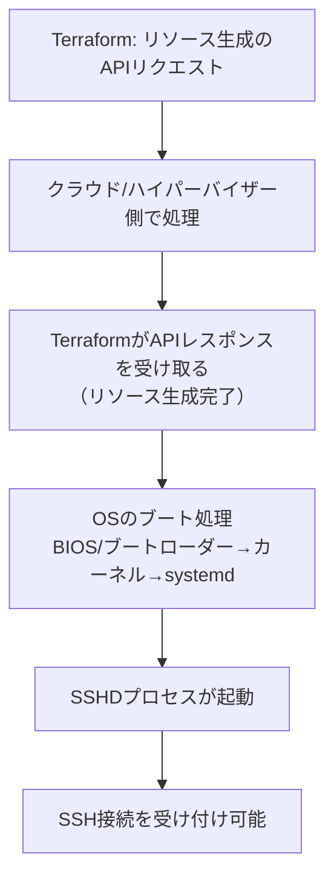
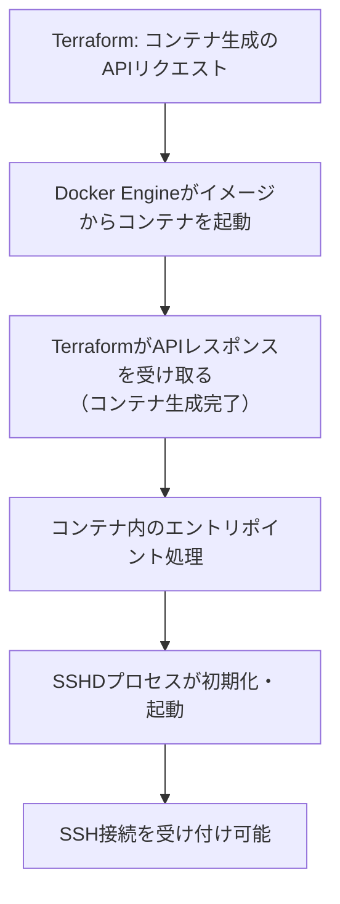

<style>
table th,
table td {
    word-break: normal;
}
table td:first-child {
    white-space: nowrap;
}
</style>


> **🗺️ 初めての方・シリーズの全体像を知りたい方はこちら**
> 
> シリーズ全体については、以下のまとめブログで整理しています。
> 
> → **「AnsibleとTerraformの連携が壊れる理由はライフサイクルにあった」第1部まとめブログ：環境構築・連携編で直面する9つのトラブル** **※近日公開予定**

---

## 📋 目次

1. [はじめに](#1-はじめに)
2. [TerraformのAPIレスポンスとSSHD起動完了のタイムラグ](#2-terraformのapiレスポンスとsshd起動完了のタイムラグ)
3. [実装方式によるタイムラグの顕在化しやすさの違い](#3-実装方式によるタイムラグの顕在化しやすさの違い)
4. [sleepによる待機とその限界](#4-sleepによる待機とその限界)
5. [wait_for_connectionによる接続待機](#5-wait_for_connectionによる接続待機)
6. [remote-execを使った接続確認後のAnsible起動](#6-remote-execを使った接続確認後のansible起動)
7. [まとめ](#7-まとめ)
8. [次回予告](#8-次回予告)
9. [連載一覧：「AnsibleとTerraformの連携が壊れる理由はライフサイクルにあった」](#9-連載一覧ansibleとterraformの連携が壊れる理由はライフサイクルにあった)

---

### 1. はじめに

「`terraform apply`の直後に`ansible-playbook`を実行すれば、そのままインフラの構築が完了する」という話を聞いたことがあると思います。

**[第1回](https://juehara-crypto.github.io/blog/infra/ansible/ansible-terraform/ansible-terraform-part1/ansible-terraform-part1-01/)** で見た通り、`local-exec`プロビジョナーを使えば、リソース生成からAnsible実行までをひとつの`terraform apply`にまとめることができます。コンテナやVMを立てて、そのまま続けて構成管理まで済ませてしまう。一見すると効率的で、これで環境構築は一発で終わるように見えます。

しかし、実際にこの構成を使おうとすると、次のような場面に遭遇することがあります。

- Terraformが「リソースの生成が完了した」と報告した直後にAnsibleを動かすと、なぜか接続に失敗する
- ローカル環境で試したときは問題なかったのに、EC2などのクラウド環境に持っていったら同じコードで接続エラーが出る
- 何度か試すうちに、成功する時と失敗する時があることに気づく

こうした問題に共通しているのは、「リソースが生成された」ことと「そのリソースが実際に使える状態になった」ことを、同じタイミングだと思い込んでいる点です。

正確に言うと、**Terraformが完了を報告する基準は、あくまでAPIからレスポンスが返ってきたことであり、そのリソースの内部でSSHDが実際に接続を受け付けられる状態になっているかどうかは、Terraformの管理範囲の外にあります**。この管理範囲の外側にあるタイミングのズレが、接続失敗という形で表面化します。

この回では、このタイムラグがなぜ生まれるのか、その構造を整理します。あわせて、このズレはOSのブート工程を経る環境(VMなど)ほど顕在化しやすく、軽量なプロセスとして起動する環境ではズレそのものが縮小する、という実装方式による違いも見ていきます。そのうえで、`sleep`による対処がなぜ不十分なのか、そして接続確立を条件にした待機制御をどう実装するかを整理します。

---

[↑ 目次に戻る](#-目次)

---

## 2. TerraformのAPIレスポンスとSSHD起動完了のタイムラグ

前セクションで触れた「リソースが生成された」ことと「そのリソースが実際に使える状態になった」ことのズレを、環境ごとに整理します。

VM環境とコンテナ環境では、リソース生成完了からSSHDが接続を受け付けるまでの間に、次のような流れがあります。

---

**【VM環境のタイムライン】**



---


**【コンテナ環境のタイムライン】**



---


どちらの図にも共通しているのは、「TerraformのAPIレスポンス」と「SSH接続を受け付け可能」が別のステップとして存在している点です。TerraformのAPIレスポンスが示しているのは、あくまでリソース（VMやコンテナ）そのものが生成された、という事実であり、その中で動くプロセス（SSHD）がどこまで初期化されているかは、APIレスポンスの範囲外です。

VM環境ではBIOS起動からsystemdによるサービス起動までのブート処理全体がこのズレの要因になり、コンテナ環境ではコンテナ内のエントリポイント処理からSSHD起動までがこのズレの要因になります。かかる時間の長さは環境によって大きく異なりますが、「リソース生成完了」と「SSHD起動完了」が別のイベントである、という構造そのものは共通しています。

次のセクションでは、この構造が実装方式によってどれだけ顕在化しやすいかの違いを整理します。

---

[↑ 目次に戻る](#-目次)

---

## 3. 実装方式によるタイムラグの顕在化しやすさの違い

セクション2で解説した「管理レイヤーの違い」は、コードの実行タイミングにもそのまま現れます。

Terraformが「リソース作成完了」と判断する基準は、あくまでAPIからレスポンスが返ってきた瞬間です。そのリソース内部でSSHDが実際に接続を受け付けられる状態になっているかどうかは、Terraformの管理範囲の外（Ansible側の領域）にあります。この管理範囲のギャップを無視し、`local-exec`プロビジョナーでAnsibleを即座に起動すると、リソース生成直後にAnsibleが実行されます。

ただし、このタイムラグがどれだけ問題として顕在化しやすいかは、リソースの実装方式によって大きく異なります。

VM環境では、リソース生成完了からSSHD起動完了までの間に、BIOS起動・ブートローダー・カーネル起動・systemdによる各サービス起動という多段階のブート工程を経ます。この一連の工程には数十秒単位の時間がかかることが珍しくなく、その間はSSHDもまだ起動していません。`local-exec`で即座にAnsibleを起動すれば、この工程の途中でAnsibleが接続を試みることになり、接続失敗が実務上ごく普通に起こり得ます。

一方、コンテナ環境では事情が異なります。SSHDプロセスがコンテナのエントリポイントとして直接起動する構成であれば、OSのブート工程そのものが存在しません。コンテナプロセスの起動とSSHDプロセスの起動はほぼ地続きで進むため、リソース生成完了からSSHDが接続を受け付けるまでの時間は、VM環境に比べて大幅に短くなります。

つまり、「TerraformのAPIレスポンスとSSHD起動完了は別のイベントである」という構造そのものは、VM環境・コンテナ環境のどちらでも変わりません。変わるのは、そのズレの幅がどれだけの実務上の問題として現れるかという点です。ブート工程を伴う環境ほどこの窓は広くなり、`local-exec`一体型の構成は接続失敗という形で表面化しやすくなります。逆に、軽量なプロセス起動で完結する環境では、この窓は実務上ほとんど意識されないほどに狭くなります。

次のセクションでは、このタイムラグに対する最も単純な対処である`sleep`による待機と、その限界を整理します。

---

[↑ 目次に戻る](#-目次)

---

## 4. sleepによる待機とその限界

タイムラグへの対処として、最も単純なのは固定時間の`sleep`を挟む方法です。

既存の`main.tf`（コンテナ・ネットワーク・インベントリ生成の定義）に、`sleep`を挟んでからAnsibleを実行する`null_resource`を追加する構成です。

**ファイル名: `main.tf`（追記部分）**

```hcl
# 6. Terraform完了直後、固定時間待機してからAnsibleを実行
resource "null_resource" "provision" {
  depends_on = [local_file.ansible_inventory]

  provisioner "local-exec" {
    command = "sleep 30 && ansible-playbook -i inventory.ini site.yml"
  }
}
```

`local-exec`でAnsibleを起動する前に一定時間待つだけの構成であり、実装としては最も手軽です。しかし、この構成には次のような限界があります。

- **待機時間が環境依存である**：VM環境ではブート工程にかかる時間が、マシンスペック・イメージの内容・同時に起動するリソース数によって変動します。コンテナ環境でも、ホストマシンの負荷状況によって起動にかかる時間は変わり得ます。「何秒待てば十分か」という基準は、環境ごとに変わってしまいます。
- **待機時間の設定を誤ると、どちらに転んでも問題が残る**：短すぎれば、セクション3で見たタイムラグの窓に引っかかり、接続失敗が起こり得ます。長すぎれば、実際にはとっくにSSHDが起動可能な状態になっているにもかかわらず、その分の時間をただ浪費することになります。

さらに根本的な問題として、`sleep`はSSHDの状態を一切確認していません。「これくらい待てば、たぶん起動しているだろう」という見積もりに過ぎず、SSHDが実際に接続を受け付けられる状態になったかどうかを条件にしているわけではありません。ある環境ではたまたま十分な時間だったとしても、別の環境やタイミングでは同じ待機時間で足りるとは限らない、という不確実性が常につきまといます。

必要なのは、「時間で見積もる」待機ではなく、「SSHが実際に接続可能になったこと」を条件にした待機です。次のセクションでは、Ansible側でこれを実現する`wait_for_connection`モジュールを見ていきます。

---

[↑ 目次に戻る](#-目次)

---

## 5. wait_for_connectionによる接続待機

`sleep`の限界を踏まえると、必要なのは「SSHが実際に接続可能になったこと」を条件にした待機です。Ansibleには、これを実現する`wait_for_connection`モジュールが用意されています。

Playbookの冒頭でこのモジュールを実行し、SSH接続が確立できるまで待ってから、以降のタスクに進む構成です。

**ファイル名: `site.yml`**

```yaml
---
- name: 接続確認用Playbook
  hosts: target_nodes
  gather_facts: false

  tasks:
    - name: SSHDの起動を待機する
      ansible.builtin.wait_for_connection:
        timeout: 120

    - name: 以降の構成タスク
      # ...
```

`wait_for_connection`は、指定した`timeout`の範囲内でSSH接続の確立を繰り返し試行し、接続が確立できた時点で次のタスクに進みます。接続が確立できないまま`timeout`に達した場合は、タスクが失敗としてPlaybookの実行が止まります。

`sleep`との違いはここにあります。`sleep`は「あらかじめ見積もった時間だけ待つ」という構成でしたが、`wait_for_connection`は「実際に接続できる状態になったかどうか」を条件にしています。SSHDの起動が早ければ短時間で次のタスクに進みますし、遅ければその分だけ長く待ちます。固定時間の見積もりに頼らない分、環境ごとの起動時間のばらつきに影響されにくい構成です。

この構成は、VM環境・コンテナ環境のどちらでも同じPlaybookのまま利用できます。ブート工程を伴う環境では待機時間が自然と長くなり、軽量なプロセス起動で完結する環境では待機時間が自然と短くなるだけで、Playbook側のロジックを環境ごとに書き分ける必要はありません。

なお、この方法はAnsible側で制御する構成であるため、Terraformの`local-exec`から呼び出す場合だけでなく、Playbookを単体で実行する場合にもそのまま機能します。次のセクションでは、これとは対照的に、Terraform側で接続確立を待つ`remote-exec`プロビジョナーを使った構成を見ていきます。

---

[↑ 目次に戻る](#-目次)

---

## 6. remote-execを使った接続確認後のAnsible起動

`wait_for_connection`はAnsible側で接続確立を待つ方法でしたが、Terraform側で接続確立を待つ方法もあります。`remote-exec`プロビジョナーを使う構成です。

既存の`main.tf`に、`remote-exec`でSSH接続確立を確認してから`local-exec`でAnsibleを起動する`null_resource`を追加します。

**ファイル名: `main.tf`（追記部分）**
```hcl
# 6. SSH接続確立を確認してからAnsibleを実行
resource "null_resource" "provision" {
  depends_on = [local_file.ansible_inventory]

  connection {
    type = "ssh"
    host = docker_container.targets["target-node1"].network_data[0].ip_address
    user = "ansible"
    # ...
  }

  provisioner "remote-exec" {
    inline = ["echo 'SSH接続確認'"]
  }

  provisioner "local-exec" {
    command = "ansible-playbook -i inventory.ini site.yml"
  }
}
```

`remote-exec`は、`connection`ブロックで指定した接続先に対してSSH接続を試み、確立できるまで待機します。接続が確立できた時点で`inline`に指定したコマンド（ここでは動作確認用の`echo`）を実行し、その直後に`local-exec`でAnsibleが起動します。つまり、SSH接続が確立できたことを確認してからでなければ、Ansibleが呼ばれない構成になります。

`wait_for_connection`との違いは、待機を制御する場所です。`wait_for_connection`はAnsible側（Playbookの冒頭）で待機を行うのに対し、`remote-exec`はTerraform側で待機を行います。この違いは、どちらを選ぶべきかの判断基準にもなります。

|手法|制御する場所|向いている場面|
|---|---|---|
|`wait_for_connection`|Ansible側（Playbook冒頭）|Playbookを単体でも実行する場合|
|`remote-exec` + `local-exec`|Terraform側|Terraform経由でのみAnsibleを実行する場合|

Playbookを単体でも実行する運用であれば、待機ロジックをPlaybook側に持たせておいた方が、実行経路によらず一貫した挙動になります。逆に、Ansibleの実行が常にTerraform経由に限られるのであれば、`remote-exec`でTerraform側に待機を集約させる方がシンプルです。

---

[↑ 目次に戻る](#-目次)

---

## 7. まとめ

この回で整理した内容を確認します。

- TerraformのAPIレスポンスとSSHD起動完了の間にはタイムラグがあり、これは環境の実装方式を問わず理論上発生しうる構造的な問題である
- ただし顕在化しやすさは実装方式によって異なり、OSのブート工程を伴うVM環境の方が、軽量なプロセス起動で完結する環境より実務上遭遇しやすい
- `sleep`による固定時間待機は環境依存であり、動くことはあっても保証はできない場当たり的な対処である
- `wait_for_connection`はAnsible側で、`remote-exec` + `local-exec`はTerraform側で、それぞれ接続確立を条件にした待機を実現できる
- どちらを使うかは、Playbookを単体実行する可能性があるかどうかで判断できる

---

[↑ 目次に戻る](#-目次)

---

## 8. 次回予告

今回は、TerraformのAPIレスポンスとSSHD起動完了の間に存在するタイムラグの構造と、実装方式によってその顕在化しやすさが異なることを整理しました。あわせて、`sleep`による固定待機の限界と、接続確立を条件にした待機制御の実装方法を見てきました。

SSH接続が確立できたとしても、次に直面するのは別の問題です。第3回では、Terraformが払い出したIPアドレス情報をAnsibleがインベントリとして正しく認識できず、パースエラーになる問題を取り上げます。

**[次回：第3回：動的インベントリ生成時における出力データのパースエラー](https://juehara-crypto.github.io/blog/infra/ansible/ansible-terraform/ansible-terraform-part1/ansible-terraform-part1-03/)**

---

📑 連載の移動　**[前の記事：【Ansible×Terraform編】第1回](https://juehara-crypto.github.io/blog/infra/ansible/ansible-terraform/ansible-terraform-part1/ansible-terraform-part1-01/)　｜　[次の記事：【Ansible×Terraform編】第3回](https://juehara-crypto.github.io/blog/infra/ansible/ansible-terraform/ansible-terraform-part1/ansible-terraform-part1-03/)**

---

> **🗺️ 初めての方・シリーズの全体像を知りたい方はこちら**
> 
> シリーズ全体については、以下のまとめブログで整理しています。
> 
> → **「AnsibleとTerraformの連携が壊れる理由はライフサイクルにあった」第1部まとめブログ：環境構築・連携編で直面する9つのトラブル** **※近日公開予定**

---

[↑ 目次に戻る](#-目次)

---


## 9. 連載一覧：「AnsibleとTerraformの連携が壊れる理由はライフサイクルにあった」

### 第1部：環境構築・連携編

|回数|テーマ・記事タイトル|概要|
|---|---|---|
|**[第1回](https://juehara-crypto.github.io/blog/infra/ansible/ansible-terraform/ansible-terraform-part1/ansible-terraform-part1-01/)**|AnsibleとTerraformの連携目的と設計思想の違い|リソース生成（Terraform）と構成管理（Ansible）の役割分担と、連携時における設計のアンチパターンを俯瞰。冪等性シリーズ・ドリフトシリーズとの接続を示す。|
|**[第2回](https://juehara-crypto.github.io/blog/infra/ansible/ansible-terraform/ansible-terraform-part1/ansible-terraform-part1-02/)**|Terraform完了直後のプロビジョニング失敗を防ぐSSH待機制御|TerraformのAPIレスポンスとSSHDが接続を受け付けられる状態になるまでのタイムラグによる接続失敗と解決策。VM環境（EC2・VirtualBox）でのOSブート待ち・Docker環境でのSSHD初期化待ちなど、環境を問わず発生する構造として示す。|
|**[第3回](https://juehara-crypto.github.io/blog/infra/ansible/ansible-terraform/ansible-terraform-part1/ansible-terraform-part1-03/)**|動的インベントリ生成時における出力データのパースエラー|TerraformのJSON出力とAnsibleが期待する動的インベントリのJSONスキーマの構造的な差異を整理し、生の出力をそのまま渡した際の「静かな失敗」を実機再現したうえで、変換スクリプトによる解決方法を解説する。|
|**[第4回](https://juehara-crypto.github.io/blog/infra/ansible/ansible-terraform/ansible-terraform-part1/ansible-terraform-part1-04/)**|自動生成されたSSH鍵のパーミッション設定エラー|Terraformで自動生成した秘密鍵ファイルの権限設定が不適切なため、AnsibleのSSH実行時に接続を拒否されるトラブルへの対応。|
|第5回|仮想環境におけるIPアドレス変動対策|Terraformのリソース再生成で発生するIPアドレス変動を実機検証する。applyとAnsible実行のタイミングが分離すると、SSH接続自体は成功するのに意図しないホストへ接続する危険があることを示し、IP固定と動的インベントリという2つの解決アプローチを比較する。|
|第6回|ネットワーク初期化完了前に発生する接続タイムアウト|ネットワーク構築完了直後にAnsibleが接続を試み、反映待ちでSSH接続がタイムアウトする問題。Dockerネットワークのブリッジ・AWSのSecurity Group・VPCルーターの伝播ラグなど、実装方式が違っても「構築完了」と「通信可能」が別タイミングである共通構造から生じることを整理し、対策を解説する。|
|第7回|実行環境とターゲットOS間におけるPythonバージョンの不一致|ターゲットOS内のPythonバージョンと、Ansibleを実行するコントロールノード側のPythonの乖離による実行時エラーへの対応。冪等性シリーズ第7回との接続を示す。|
|第8回|複数インスタンス同時構築時における並列処理の競合|Terraformで複数リソースを同時生成する際、Ansible側のforks制限によって処理が遅延・競合しうる問題。同時生成数が実行環境のキャパシティに対して相対的に多い場合に起こる構造的な問題として整理し、forks調整やバッチ分割の対策を解説する。|
|第9回|OS固有の初期ユーザーと管理者権限（sudo）への昇格エラー|コンテナイメージごとに異なるデフォルトユーザーに対し、Ansibleから`become`を用いて権限昇格する際の設定ミスと対策。Docker・VM・クラウドを問わず同じ構造で発生することを示す。|
|第10回|環境構築編まとめ：自動連携のためのコードテンプレート化|第1回〜9回の課題を踏まえ、TerraformからAnsibleへ一貫して安全に処理を移譲するためのコードのテンプレート化を解説。|

---

[↑ 目次に戻る](#目次)

---
