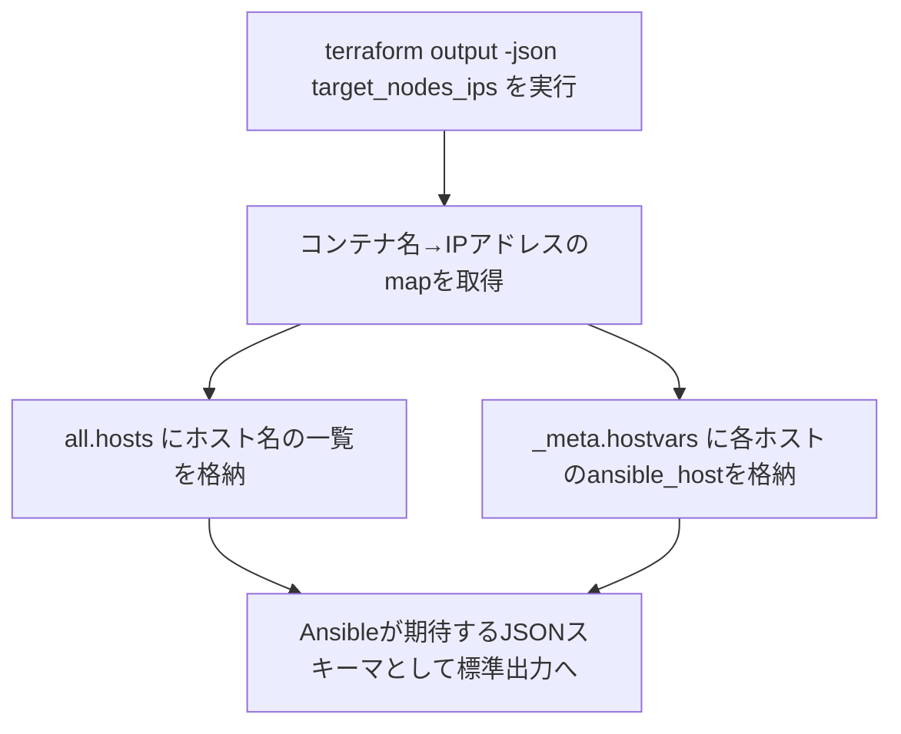

<style>
table th,
table td {
    word-break: normal;
}
table td:first-child {
    white-space: nowrap;
}
</style>

---

> **🗺️ 初めての方・シリーズの全体像を知りたい方はこちら**
>
> シリーズ全体については、以下のまとめブログで整理しています。
>
> → **「AnsibleとTerraformの連携が壊れる理由はライフサイクルにあった」第1部まとめブログ：環境構築・連携編で直面する9つのトラブル** **※近日公開予定**

---

## 目次

1. [はじめに](#1-はじめに)
2. [terraform output -jsonが返すデータ構造](#2-terraform-output--jsonが返すデータ構造)
3. [Ansibleの動的インベントリが期待するJSONスキーマ](#3-ansibleの動的インベントリが期待するjsonスキーマ)
4. [パースエラーの再現](#4-パースエラーの再現)
5. [JSON出力をインベントリ形式に変換する](#5-json出力をインベントリ形式に変換する)
6. [変換後のインベントリの動作確認](#6-変換後のインベントリの動作確認)
7. [まとめ](#7-まとめ)
8. [次回予告](#8-次回予告)
9. [連載一覧：「AnsibleとTerraformの連携が壊れる理由はライフサイクルにあった」](#9-連載一覧ansibleとterraformの連携が壊れる理由はライフサイクルにあった)

---

## 1. はじめに

「TerraformでリソースのIPアドレスを取得して、Ansibleにそのまま渡せばいい」という話を聞いたことがあると思います。

**[第2回](https://juehara-crypto.github.io/blog/infra/ansible/ansible-terraform/ansible-terraform-part1/ansible-terraform-part1-02/)** で、TerraformのAPIレスポンスとSSHD起動完了のタイムラグを解消し、Ansibleが確実にSSH接続できる状態を作りました。接続先の情報さえ正しく渡せれば、あとはAnsibleが自動的に構成管理を進めてくれる、と考えたくなるところです。

しかし、実際にTerraformが出力する情報をAnsibleに渡そうとすると、次のような場面に遭遇することがあります。

- `terraform output -json`でIPアドレスの一覧を取得し、そのままAnsibleのインベントリとして指定したが、エラーメッセージらしいものは出ないのに、Ansibleが対象ホストを1台も認識しない
- warningらしき行は表示されるが、`ansible-playbook`自体は正常終了してしまい、何が起きているのか分かりにくい
- 別の環境で作った変換スクリプトを流用しようとしたら、Ansible側が期待する構造と微妙に噛み合わず、同じようには動かない

こうした問題に共通しているのは、「TerraformがJSON形式で出力すること」と「AnsibleがそのJSONをインベントリとして解釈できること」を、同じ意味だと思い込んでいる点です。

正確に言うと、**TerraformのJSON出力は、あくまでTerraformが管理しているリソースの状態を表現するための構造であり、Ansibleが動的インベントリとして要求するJSONスキーマとは、そもそも設計されている目的が異なります**。この構造の違いを踏まえずに生のJSON出力をAnsibleへ渡すと、多くの場合、派手なエラーにはならず、対象ホストが認識されないまま処理が終わってしまいます。

この回では、TerraformのJSON出力の実際の構造と、Ansibleが動的インベントリとして期待するJSONスキーマを比較し、両者の間にあるギャップを整理します。そのうえで、このギャップが実際にAnsible側でどのような挙動として現れるかを実機で確認し、TerraformのJSON出力をAnsibleが認識できる形式に変換する方法を見ていきます。この問題は、本検証環境で使っているDockerに限らず、AWSやGCPなど他のプロバイダーを使う場合にも共通して発生する構造的な問題です。

---

[↑ 目次に戻る](#目次)

---

## 2. terraform output -jsonが返すデータ構造

`terraform output -json`が実際にどのようなデータ構造を返すのか、本検証環境で確認します。

本検証環境では、`main.tf`に次のような`output`を定義しています。各コンテナ名をキーとして、コンテナのネットワーク上の内部IPアドレスを値に持つmapを返す定義です。

* **ファイル名：`main.tf`（追記部分）**

```hcl
output "target_nodes_ips" {
  value = {
    for name, container in docker_container.targets :
    name => container.network_data[0].ip_address
  }
  description = "Internal IP addresses for target nodes"
}
```

この状態で、出力名を指定して`terraform output -json`を実行すると、次の結果が返ります。

* **実行コマンド**

```bash
terraform output -json target_nodes_ips
```

* **実行結果**


```json
{"target-node1":"172.18.0.2","target-node2":"172.18.0.4","target-node3":"172.18.0.3"}
```

コンテナ名をキーとした、IPアドレス文字列のmapがそのまま返ってきます。一見するとこれをAnsibleに渡せば十分に見える形です。

一方、出力名を指定せずに`terraform output -json`を実行すると、結果は次のようになります。

* **実行コマンド**

```plaintext
terraform output -json
```

* **実行結果**

```json
{
  "target_nodes_ips": {
    "sensitive": false,
    "type": [
      "object",
      {
        "target-node1": "string",
        "target-node2": "string",
        "target-node3": "string"
      }
    ],
    "value": {
      "target-node1": "172.18.0.2",
      "target-node2": "172.18.0.4",
      "target-node3": "172.18.0.3"
    }
  }
}
```

出力名を指定しない場合、各`output`が`sensitive`・`type`・`value`という3つのフィールドを持つ形でラップされます。`sensitive`はその出力が機密情報として扱われるかどうか、`type`はTerraformの型システムにおけるデータ型、`value`が実際の値です。これらはいずれもTerraformが自分自身の状態管理のために持っているメタ情報であり、Ansible側が必要としている情報ではありません。

つまり`terraform output -json`が返す構造は、出力名を指定するかどうかに関わらず、あくまで「Terraformの状態管理の一部としてのデータ」であり、Ansibleがそのままインベントリとして解釈できる形式ではない、という点は共通しています。この構造は、DockerプロバイダーでもAWSプロバイダーでも、Terraformの`output`定義の仕組みそのものに由来するため、使用するプロバイダーを問わず同じです。

---

[↑ 目次に戻る](#目次)

---

## 3. Ansibleの動的インベントリが期待するJSONスキーマ

前セクションで確認したTerraformの出力構造に対し、Ansibleの動的インベントリが期待するJSONスキーマを整理します。

Ansibleの動的インベントリプラグイン・スクリプトが返すべき最小構成は、次のような形です。

```json
{
  "all": {
    "hosts": ["target-node1", "target-node2", "target-node3"],
    "vars": {}
  },
  "_meta": {
    "hostvars": {
      "target-node1": { "ansible_host": "172.18.0.2" },
      "target-node2": { "ansible_host": "172.18.0.4" },
      "target-node3": { "ansible_host": "172.18.0.3" }
    }
  }
}
```

`all`はすべてのホストが属するデフォルトのグループで、`hosts`にホスト名の一覧を持ちます。`_meta.hostvars`は、各ホスト名に対する接続情報（`ansible_host`など）をまとめて持たせるための領域です。Ansibleはこの`_meta.hostvars`があらかじめ含まれていれば、ホストごとに個別で情報を問い合わせる処理を省略します。

前セクションのTerraform出力と比較すると、構造の違いが分かります。

|項目|Terraformの出力|Ansibleが期待する構造|
|---|---|---|
|トップレベルのキー|コンテナ名（`target-node1`など）|`all`・`_meta`という固定のキー|
|値の形|IPアドレスの文字列|`hosts`（配列）や`hostvars`（オブジェクト）といった構造化データ|
|ホスト名とIPアドレスの対応|キーと値がそのまま対応|`_meta.hostvars`の中でホスト名ごとに`ansible_host`として保持|

Terraformの出力は「コンテナ名→IPアドレス」という単純な対応関係を持つだけですが、Ansibleは「どのグループに、どのホストが属し、各ホストにどう接続するか」という、もう一段階組み立てられた構造を必要とします。この2つの構造は、持っている情報自体はほぼ同じ（コンテナ名とIPアドレスの対応）であるにもかかわらず、JSONとしての形が異なるため、そのまま渡すことができません。次のセクションでは、この構造の違いを踏まえずに生のTerraform出力を渡した場合に、実際にどうなるかを確認します。

---

[↑ 目次に戻る](#目次)

---

## 4. パースエラーの再現

TerraformのJSON出力を、変換を挟まずそのままAnsibleに渡すとどうなるかを、本検証環境で再現します。

Ansibleは`-i`で指定されたファイルの実行権限や中身から、インベントリの形式を自動判定します。渡すファイルが実行権限を持たない静的ファイルであれば、AnsibleはYAML・INI等の静的インベントリプラグインで読み込もうとします。JSONはYAMLの文法的なサブセットであるため、`terraform output`の生JSONもYAML形式のインベントリとして解釈されることになりますが、YAML形式のインベントリはトップレベルの各キーを「グループ名」として扱い、その値に`hosts`・`vars`・`children`のいずれかを持つ辞書を要求します。この期待と、Terraformが返す「名前→IPアドレスのmap」という構造が噛み合うかどうかを確認します。

---

### ■ 検証内容（生のTerraform出力をそのままAnsibleに渡した場合の挙動確認）

**【検証の準備】**

`terraform output -json target_nodes_ips`の結果をファイルに書き出します。

**実行コマンド**
```bash
terraform output -json target_nodes_ips > tf_output.json
```

**`tf_output.json`の中身**
```json
{"target-node1":"172.18.0.2","target-node2":"172.18.0.4","target-node3":"172.18.0.3"}
```

このファイルを、変換を挟まずそのままAnsibleのインベントリとして指定します。

---

### ■ 実行内容

**実行コマンド**
```bash
ansible all -i tf_output.json -m ping
echo $?
```

**▼ 実行結果**
```
[WARNING]: Skipping 'target-node1' as this is not a valid group definition
[WARNING]: Skipping 'target-node2' as this is not a valid group definition
[WARNING]: Skipping 'target-node3' as this is not a valid group definition
[WARNING]: provided hosts list is empty, only localhost is available. Note that the implicit localhost does not match 'all'
0
```

---

### ■ 結果

`target-node1`・`target-node2`・`target-node3`のいずれも「有効なグループ定義ではない」と判断され、3つとも黙ってスキップされました。トップレベルの値（`target-node1`に対する`172.18.0.2`など）が、YAML形式のインベントリが要求する`hosts`・`vars`・`children`を持つ辞書ではなく、ただのIPアドレス文字列だったためです。

結果として対象ホストが1台も残らず、`all`にも実質何も含まれない状態で`ping`タスクが呼ばれています。ここで注目すべきは、この一連の処理が**エラーとしては扱われていない**という点です。`ansible`コマンドはwarningを4行出力した後、正常終了コード（`0`）で処理を終えています。

つまりこの問題は、実行が止まる派手な「パースエラー」としてではなく、**何も実行されないまま正常終了する**という形で現れます。CI/CDパイプラインなどで終了コードのみをチェックしている場合、この失敗はエラーとして検知されず、素通りしてしまう可能性があります。ログにwarningとして出力される「not a valid group definition」という文言が、この問題を特定する唯一の手がかりです。

---

[↑ 目次に戻る](#目次)

---

## 5. JSON出力をインベントリ形式に変換する

前セクションで確認した構造の違いを踏まえ、TerraformのJSON出力をAnsibleが認識できる形式に変換する方法を整理します。変換には大きく2通りのアプローチがあります。

1つは、`terraform apply`のタイミングで、あらかじめ変換済みのインベントリファイルを静的に生成しておく方法です。`local_file`リソースと`templatefile`関数を使い、Terraformの出力をテンプレートに流し込んで静的なファイルとして書き出す、という仕組みです。この方法はTerraformの実行結果を静的なファイルとして固定するため、Ansible実行時にTerraformの状態を読みに行く必要がありません。

もう1つは、Ansibleの実行のたびにTerraformの出力を読み込み、その場でAnsibleが期待するJSONスキーマに変換する動的インベントリスクリプトを使う方法です。この回では、こちらの方法を実装します。

---


### 変換スクリプトの構成

処理の流れは次の通りです。

**【変換スクリプトの処理フロー】**


サブプロセスとして`terraform output -json target_nodes_ips`を呼び出し、返ってきたmapから`all.hosts`（ホスト名の配列）と`_meta.hostvars`（ホストごとの`ansible_host`）を組み立て、標準出力にJSONとして返す、という構成です。Ansibleは動的インベントリスクリプトを`--list`引数付きで呼び出すため、スクリプト側でこの引数を受け取れるようにしておきます。

* **ファイル名：`inventory.py`**
```python
#!/usr/bin/env python3
import argparse
import json
import subprocess


def get_terraform_output():
    result = subprocess.run(
        ["terraform", "output", "-json", "target_nodes_ips"],
        capture_output=True, text=True, check=True
    )
    return json.loads(result.stdout)


def build_inventory():
    nodes = get_terraform_output()
    return {
        "all": {
            "hosts": list(nodes.keys()),
            "vars": {}
        },
        "_meta": {
            "hostvars": {
                name: {"ansible_host": ip, "ansible_user": "ansible"}
                for name, ip in nodes.items()
            }
        }
    }


def main():
    parser = argparse.ArgumentParser()
    group = parser.add_mutually_exclusive_group(required=True)
    group.add_argument("--list", action="store_true")
    group.add_argument("--host")
    args = parser.parse_args()

    if args.list:
        print(json.dumps(build_inventory()))
    else:
        print(json.dumps({}))

if __name__ == "__main__":
    main()
```

作成後、実行権限を付与し、Ansibleから動的インベントリスクリプトとして呼び出せる状態にします。

**実行コマンド**
```plaintext
chmod +x inventory.py
```

`_meta.hostvars`にあらかじめ全ホストの接続情報を含めているため、Ansibleが個別にこのスクリプトを`--host <ホスト名>`付きで呼び出すことはありません。`main`関数内の`--host`分岐は、Ansible側の動的インベントリスクリプトの呼び出し規約に合わせて用意していますが、実際には使われません。

---

[↑ 目次に戻る](#目次)

---

## 6. 変換後のインベントリの動作確認

作成した`inventory.py`が、Ansibleから正しく認識されるかを確認します。

---

### ■ 検証内容（変換スクリプトが返すインベントリ構造とAnsible疎通確認）

第5節で作成した`inventory.py`をそのまま使用します。まず`ansible-inventory`コマンドでスクリプトが返すインベントリの構造を確認し、続けて実際に`ping`モジュールで疎通確認を行います。

---

### ■ 実行内容

**実行コマンド**
```bash
ansible-inventory -i ./inventory.py --list
```

**▼ 実行結果**
```json
{
    "_meta": {
        "hostvars": {
            "target-node1": {
                "ansible_host": "172.18.0.2",
                "ansible_user": "ansible"
            },
            "target-node2": {
                "ansible_host": "172.18.0.4",
                "ansible_user": "ansible"
            },
            "target-node3": {
                "ansible_host": "172.18.0.3",
                "ansible_user": "ansible"
            }
        }
    },
    "all": {
        "children": [
            "ungrouped"
        ]
    },
    "ungrouped": {
        "hosts": [
            "target-node1",
            "target-node2",
            "target-node3"
        ]
    }
}
```

**実行コマンド**
```bash
ansible all -i ./inventory.py -m ping
```

**▼ 実行結果**
```
[WARNING]: Platform linux on host target-node1 is using the discovered Python interpreter at /usr/bin/python3.10, but future installation of another Python interpreter could change the
meaning of that path. See https://docs.ansible.com/ansible-core/2.17/reference_appendices/interpreter_discovery.html for more information.
target-node1 | SUCCESS => {
    "ansible_facts": {
        "discovered_interpreter_python": "/usr/bin/python3.10"
    },
    "changed": false,
    "ping": "pong"
}
[WARNING]: Platform linux on host target-node2 is using the discovered Python interpreter at /usr/bin/python3.10, but future installation of another Python interpreter could change the
meaning of that path. See https://docs.ansible.com/ansible-core/2.17/reference_appendices/interpreter_discovery.html for more information.
target-node2 | SUCCESS => {
    "ansible_facts": {
        "discovered_interpreter_python": "/usr/bin/python3.10"
    },
    "changed": false,
    "ping": "pong"
}
[WARNING]: Platform linux on host target-node3 is using the discovered Python interpreter at /usr/bin/python3.10, but future installation of another Python interpreter could change the
meaning of that path. See https://docs.ansible.com/ansible-core/2.17/reference_appendices/interpreter_discovery.html for more information.
target-node3 | SUCCESS => {
    "ansible_facts": {
        "discovered_interpreter_python": "/usr/bin/python3.10"
    },
    "changed": false,
    "ping": "pong"
}

```

---

### ■ 結果

`inventory.py`自体が返しているのは`all.hosts`にホスト名の配列を持つ形ですが、`ansible-inventory --list`の出力では`all.children`に`ungrouped`という配列が入り、`ungrouped.hosts`にホスト名が並ぶ形に変わっています。これはAnsible側が、明示的なグループに属さないホストを自動的に`ungrouped`グループへ振り分け、`all`をその親グループとして扱う仕様によるものです。スクリプトが返した生のJSONそのものではなく、Ansible内部で正規化された後の構造が表示されている点に注意してください。いずれにせよ`_meta.hostvars`の内容はスクリプトが返した通りに保持されており、3台のホストとそれぞれの`ansible_host`が正しく認識されています。

`ping`モジュールの実行結果でも、3台のホストすべてから`"ping": "pong"`が返り、`SUCCESS`になっています。表示されているwarningは、ターゲット側のPythonインタプリタの自動検出に関するもので、今回の検証内容とは別の話です。第4節で確認した「静かな失敗」とは異なり、今回はすべてのホストが`all`グループの配下（実際には`ungrouped`経由）で正しく認識され、`ping`タスクが実行されていることが分かります。

TerraformのJSON出力を直接渡した場合には認識されなかったホストが、変換スクリプトを挟むことで正しく認識されるようになりました。この変換スクリプトが行っているのは、コンテナ名とIPアドレスの対応関係自体を変えることではなく、その対応関係をAnsibleが読める構造に組み替えることだけです。

---

[↑ 目次に戻る](#目次)

---

## 7. まとめ

この回で整理した内容を確認します。

- `terraform output -json`が返す構造は、出力名を指定してもしなくても、あくまでTerraformの状態管理の一部としてのデータであり、Ansibleがそのままインベントリとして解釈できる形式ではない
- Ansibleの動的インベントリは`all.hosts`と`_meta.hostvars`という構造を必要とするが、Terraformの出力は単純な名前→値のmapでしかなく、この構造の違いがそのまま渡せない原因になっている
- 生のTerraform出力をそのままAnsibleに渡すと、派手なエラーにはならず、対象ホストが黙ってスキップされ、終了コード`0`で正常終了してしまう「静かな失敗」として現れる
- TerraformのJSON出力をAnsibleが認識できる形式に変換する方法には、実行のたびに変換する動的インベントリスクリプトと、`apply`時に静的ファイルとして生成しておく方法（本シリーズがこれまで使ってきた`inventory.ini`）の2通りがある
- どちらの方法でも、行っているのはデータの内容を変えることではなく、Terraformが持つ情報をAnsibleが読める構造に組み替えることである

---

[↑ 目次に戻る](#目次)

---

## 8. 次回予告

今回は、TerraformのJSON出力とAnsibleが期待する動的インベントリのJSONスキーマとの構造的な差異を整理し、生のTerraform出力をそのままAnsibleに渡した場合に発生する「静かな失敗」を実機で確認したうえで、変換スクリプトによってこれを解決する方法を見てきました。

インベントリの問題が解決したとしても、次に直面するのは別の問題です。第4回では、Terraformで自動生成したSSH秘密鍵のパーミッション設定が不適切なために、AnsibleがSSH接続を拒否されるトラブルを取り上げます。

**[次回：第4回：自動生成されたSSH鍵のパーミッション設定エラー](https://juehara-crypto.github.io/blog/infra/ansible/ansible-terraform/ansible-terraform-part1/ansible-terraform-part1-04/)**

---

📑 連載の移動　**[前の記事：【Ansible×Terraform編】第2回](https://juehara-crypto.github.io/blog/infra/ansible/ansible-terraform/ansible-terraform-part1/ansible-terraform-part1-02/)　｜　[次の記事：【Ansible×Terraform編】第4回](https://juehara-crypto.github.io/blog/infra/ansible/ansible-terraform/ansible-terraform-part1/ansible-terraform-part1-04/)**

---

> **🗺️ 初めての方・シリーズの全体像を知りたい方はこちら**
>
> シリーズ全体については、以下のまとめブログで整理しています。
>
> → **「AnsibleとTerraformの連携が壊れる理由はライフサイクルにあった」第1部まとめブログ：環境構築・連携編で直面する9つのトラブル** **※近日公開予定**

---

[↑ 目次に戻る](#目次)

---

## 9. 連載一覧：「AnsibleとTerraformの連携が壊れる理由はライフサイクルにあった」

### 第1部：環境構築・連携編

|回数|テーマ・記事タイトル|概要|
|---|---|---|
|**[第1回](https://juehara-crypto.github.io/blog/infra/ansible/ansible-terraform/ansible-terraform-part1/ansible-terraform-part1-01/)**|AnsibleとTerraformの連携目的と設計思想の違い|リソース生成（Terraform）と構成管理（Ansible）の役割分担と、連携時における設計のアンチパターンを俯瞰。冪等性シリーズ・ドリフトシリーズとの接続を示す。|
|**[第2回](https://juehara-crypto.github.io/blog/infra/ansible/ansible-terraform/ansible-terraform-part1/ansible-terraform-part1-02/)**|Terraform完了直後のプロビジョニング失敗を防ぐSSH待機制御|TerraformのAPIレスポンスとSSHDが接続を受け付けられる状態になるまでのタイムラグによる接続失敗と解決策。VM環境（EC2・VirtualBox）でのOSブート待ち・Docker環境でのSSHD初期化待ちなど、環境を問わず発生する構造として示す。|
|**[第3回](https://juehara-crypto.github.io/blog/infra/ansible/ansible-terraform/ansible-terraform-part1/ansible-terraform-part1-03/)**|動的インベントリ生成時における出力データのパースエラー|TerraformのJSON出力とAnsibleが期待する動的インベントリのJSONスキーマの構造的な差異を整理し、生の出力をそのまま渡した際の「静かな失敗」を実機再現したうえで、変換スクリプトによる解決方法を解説する。|
|**[第4回](https://juehara-crypto.github.io/blog/infra/ansible/ansible-terraform/ansible-terraform-part1/ansible-terraform-part1-04/)**|自動生成されたSSH鍵のパーミッション設定エラー|Terraformで自動生成した秘密鍵ファイルの権限設定が不適切なため、AnsibleのSSH実行時に接続を拒否されるトラブルへの対応。|
|**[第5回](https://juehara-crypto.github.io/blog/infra/ansible/ansible-terraform/ansible-terraform-part1/ansible-terraform-part1-05/)**|仮想環境におけるIPアドレス変動対策|Terraformのリソース再生成で発生するIPアドレス変動を実機検証する。applyとAnsible実行のタイミングが分離すると、SSH接続自体は成功するのに意図しないホストへ接続する危険があることを示し、IP固定と動的インベントリという2つの解決アプローチを比較する。|
|**[第6回](https://juehara-crypto.github.io/blog/infra/ansible/ansible-terraform/ansible-terraform-part1/ansible-terraform-part1-06/)**|ネットワーク初期化完了前に発生する接続タイムアウト|ネットワーク構築完了直後にAnsibleが接続を試み、反映待ちでSSH接続がタイムアウトする問題。Dockerネットワークのブリッジ・AWSのSecurity Group・VPCルーターの伝播ラグなど、実装方式が違っても「構築完了」と「通信可能」が別タイミングである共通構造から生じることを整理し、対策を解説する。|
|**[第7回](https://juehara-crypto.github.io/blog/infra/ansible/ansible-terraform/ansible-terraform-part1/ansible-terraform-part1-07/)**|実行環境とターゲットOS間におけるPythonバージョンの不一致|ターゲットOS内のPythonバージョンと、Ansibleを実行するコントロールノード側のPythonの乖離による実行時エラーへの対応。冪等性シリーズ第7回との接続を示す。|
|**[第8回](https://juehara-crypto.github.io/blog/infra/ansible/ansible-terraform/ansible-terraform-part1/ansible-terraform-part1-08/)**|複数インスタンス同時構築時における並列処理の競合|Terraformで複数リソースを同時生成する際、Ansible側のforks制限によって処理が遅延・競合しうる問題。同時生成数が実行環境のキャパシティに対して相対的に多い場合に起こる構造的な問題として整理し、forks調整やバッチ分割の対策を解説する。|
|**[第9回](https://juehara-crypto.github.io/blog/infra/ansible/ansible-terraform/ansible-terraform-part1/ansible-terraform-part1-09/)**|OS固有の初期ユーザーと管理者権限（sudo）への昇格エラー|コンテナイメージごとに異なるデフォルトユーザーに対し、Ansibleから`become`を用いて権限昇格する際の設定ミスと対策。Docker・VM・クラウドを問わず同じ構造で発生することを示す。|
|**[第10回](https://juehara-crypto.github.io/blog/infra/ansible/ansible-terraform/ansible-terraform-part1/ansible-terraform-part1-10/)**|環境構築編まとめ：自動連携のためのコードテンプレート化|第1回〜9回の課題を踏まえ、TerraformからAnsibleへ一貫して安全に処理を移譲するためのコードのテンプレート化を解説。|

---

[↑ 目次に戻る](#目次)

---
