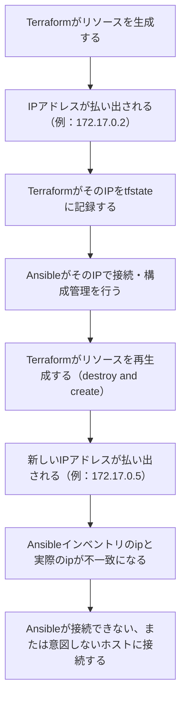

<style>
table th,
table td {
    word-break: normal;
}
table td:first-child {
    white-space: nowrap;
}
</style>

---

> **🗺️ 初めての方・シリーズの全体像を知りたい方はこちら**
>
> シリーズ全体については、以下のまとめブログで整理しています。
>
> → **「AnsibleとTerraformの連携が壊れる理由はライフサイクルにあった」第1部まとめブログ：環境構築・連携編で直面する9つのトラブル** **※近日公開予定**

---


## 目次

1. [はじめに](#1-はじめに)
2. [リソース再生成によるIPアドレス変動の構造](#2-リソース再生成によるipアドレス変動の構造)
3. [tfstateとインベントリの整合性](#3-tfstateとインベントリの整合性)
4. [意図しないホストへの接続の再現](#4-意図しないホストへの接続の再現)
5. [解決パターン①：TerraformのリソースレベルでIPを固定指定する](#5-解決パターンterraformのリソースレベルでipを固定指定する)
6. [解決パターン②：動的インベントリによるIP都度取得](#6-解決パターン動的インベントリによるip都度取得)
7. [まとめ](#7-まとめ)
8. [次回予告](#8-次回予告)
9. [連載一覧：「AnsibleとTerraformの連携が壊れる理由はライフサイクルにあった」](#9-連載一覧ansibleとterraformの連携が壊れる理由はライフサイクルにあった)

## 1. はじめに

**[第4回](https://juehara-crypto.github.io/blog/infra/ansible/ansible-terraform/ansible-terraform-part1/ansible-terraform-part1-04/)** では、Terraformが自動生成したSSH鍵のパーミッション設定が原因で、Ansibleの接続が拒否される問題を扱いました。今回はその続きとして、鍵の問題が解消された後に発生する別の問題を扱います。

Terraformでコンテナやサーバーを作成すると、そのIPアドレスは一度決まればそのまま使い続けられると考えがちです。しかし、Terraformがリソースを再生成すると、多くの環境でIPアドレスが変わります。前回までインベントリに記載されたIPアドレスで接続できていたとしても、リソースが再生成された後に同じインベントリを使うと、接続先が変わってしまっている場合があります。

この状態でAnsibleを実行すると、接続エラーが発生したり、意図しないホストに接続しようとしたりします。これは接続情報が古くなったという話にとどまらず、TerraformがリソースのIPアドレスを管理する仕組みと、Ansibleがその情報をどのタイミングで参照するかという、両ツールの連携の仕方に起因する問題です。

ドリフトシリーズでは、インフラの実態と管理情報がずれていく問題を扱いました。今回扱うIPアドレスの変動も、その一種と捉えることができます。ただし今回は、TerraformとAnsibleが連携する場面に特有の問題として、リソース再生成に伴うIPアドレス変動を取り上げます。検証はDocker環境で行いますが、AWS EC2の再作成やDHCP環境でも同じ構造で発生する問題です。

---

[↑ 目次に戻る](#目次)

---

## 2. リソース再生成によるIPアドレス変動の構造

TerraformがリソースのIPアドレスを払い出し、Ansibleがそれを使って接続するという連携フローの中で、リソースの再生成がどのようにIPアドレスの変動を引き起こすかを整理します。

Terraformでコンテナ（またはVM・インスタンス）を作成すると、DockerネットワークやクラウドのDHCP機能がIPアドレスを割り当てます。このIPアドレスはTerraformのtfstateに記録され、Ansibleのインベントリにもこの値が使われます。ここまでは連携が成立している状態です。

問題は、Terraformがそのリソースを再生成したときに起こります。HCLの定義変更やリソースの依存関係の変化によって、Terraformはリソースを一度破棄し、新しく作り直します。この再生成の際、DockerネットワークやDHCPは新しいIPアドレスを払い出します。多くの環境では、再生成前と同じIPアドレスが再び割り当てられる保証はありません。

その結果、Ansible側が参照しているインベントリのIPアドレスと、実際に起動しているターゲットのIPアドレスがずれます。この状態でAnsibleを実行すると、古いIPアドレス宛てに接続を試みることになり、接続エラーや、意図しないホストへの接続が発生します。

この一連の流れを図にすると、以下のようになります。



この構造は、Dockerネットワークの内部IPアドレス払い出しに限った話ではありません。AWS EC2でインスタンスを再作成した場合や、DHCP環境でIPアドレスがリース更新のたびに変わる場合も、同じ仕組みで発生します。IPアドレスを外部の仕組み（Dockerネットワーク・DHCPサーバーなど）が動的に決めるという条件がある限り、Terraformの再生成はこの問題を引き起こす可能性があります。

---

[↑ 目次に戻る](#目次)

---

## 3. tfstateとインベントリの整合性

実際に`terraform apply`を実行し、リソースが再生成された際にtfstateとAnsibleインベントリ（`inventory.ini`）がどのように追従するかを確認します。

### ■ 検証内容

まず`terraform plan`で差分を確認します。

* **実行コマンド**

```
terraform plan
```

▼実行結果（※ログが長いので、差分の要点のみ抜粋します）

```
（…途中省略…）
  # local_file.ansible_inventory must be replaced
-/+ resource "local_file" "ansible_inventory" {
      ~ content              = <<-EOT
            [target_nodes]
            target-node1 ansible_host=172.18.0.4 ansible_user=ansible
            target-node2 ansible_host=172.18.0.3 ansible_user=ansible
            target-node3 ansible_host=172.18.0.2 ansible_user=ansible
        EOT -> (known after apply) # forces replacement
        # (6 unchanged attributes hidden)
    }

Plan: 4 to add, 0 to change, 1 to destroy.

Changes to Outputs:
  ~ target_nodes_ips = {
      ~ target-node1 = "172.18.0.4" -> (known after apply)
      ~ target-node2 = "172.18.0.3" -> (known after apply)
      ~ target-node3 = "172.18.0.2" -> (known after apply)
    }
```

`local_file.ansible_inventory`の`content`が`(known after apply)`となり、`# forces replacement`という注記が付いています。これは、`inventory.ini`が`docker_container.targets`の`network_data[0].ip_address`を参照しているため、コンテナ側の再生成に連動してこのファイルも作り直される依存関係になっていることを示しています。

続けて`apply`を実行し、実際にIPアドレスとインベントリがどう変わるかを確認します。

* **実行コマンド**

```
terraform apply
```

（確認プロンプトには`yes`と入力）

▼実行結果（※ログが長いので、該当箇所のみ抜粋します）

```
local_file.ansible_inventory: Destroying... [id=b32952a5eab53d0270a235d7bec2c3ad97a17661]
local_file.ansible_inventory: Destruction complete after 0s
（…途中省略…）
local_file.ansible_inventory: Creating...
local_file.ansible_inventory: Creation complete after 0s [id=6e072ed11ad2b1ed4e8c046d43974f769993e2eb]

Apply complete! Resources: 4 added, 0 changed, 1 destroyed.

Outputs:

target_nodes_ips = {
  "target-node1" = "172.18.0.3"
  "target-node2" = "172.18.0.2"
  "target-node3" = "172.18.0.4"
}
```

apply完了後、`inventory.ini`の中身を直接確認します。

* **実行コマンド**

```
cat inventory.ini
```

▼実行結果

```
[target_nodes]
target-node1 ansible_host=172.18.0.3 ansible_user=ansible
target-node2 ansible_host=172.18.0.2 ansible_user=ansible
target-node3 ansible_host=172.18.0.4 ansible_user=ansible
```

### ■ 結果

`terraform apply`のoutput（`target_nodes_ips`）と、`inventory.ini`の内容が完全に一致しました。この検証環境では`local_file.ansible_inventory`が`docker_container.targets`に依存する構成になっているため、リソースが再生成された場合でも、同じ`apply`の実行の中でtfstateとインベントリファイルの両方が新しいIPアドレスに更新されます。

つまり、「`terraform apply`を実行した直後」の時点では、tfstateとインベントリの間に不整合は生じません。この構成における不整合は、この自動追従の仕組みが働かない場面に限って発生します。たとえば、`apply`を実行してからしばらく経ってから生成済みの`inventory.ini`をそのまま使い回す場合や、`apply`の実行とAnsibleの実行が別々のタイミング・別々の運用フローに分かれている場合です。次のセクションでは、こうした不整合が起きた状態でAnsibleを実行するとどうなるかを確認します。

---

[↑ 目次に戻る](#目次)

---

## 4. 意図しないホストへの接続の再現

セクション3で確認した通り、`terraform apply`単体では不整合は起きません。ここでは、applyの実行とAnsibleの実行のタイミングが分離した場合を想定し、古いインベントリファイルを使って接続するとどうなるかを実機で確認します。

### ■ 検証内容

**【検証の準備】**

このDockerネットワーク（`ansible-lab-net`）を他のリソースが使っていない場合、コンテナ再生成時に解放されたIPアドレスがそのまま同じ順序で再利用され、IPアドレスが変わらないことがあります。そこで、アドレスを1つ埋めるための一時的なコンテナを起動したうえで、target-node1を強制的に再生成します。

* **実行コマンド**

```
docker run -d --name ip-occupant --network ansible-lab-net alpine sleep 3600
```

まず、現在の`inventory.ini`を退避します。

* **実行コマンド**

```
cp inventory.ini inventory.ini.old_backup
```

（コマンド自体は正常時は無出力です）

続けて、target-node1を対象にリソースを強制的に再生成します。

* **実行コマンド**

```
terraform apply -replace="docker_container.targets[\"target-node1\"]"
```

（確認プロンプトには`yes`と入力）

▼実行結果（※ログが長いので、該当箇所のみ抜粋します）

```
（…途中省略…）
Plan: 4 to add, 0 to change, 4 to destroy.

Changes to Outputs:
  ~ target_nodes_ips = {
      ~ target-node1 = "172.18.0.3" -> (known after apply)
      ~ target-node2 = "172.18.0.2" -> (known after apply)
      ~ target-node3 = "172.18.0.4" -> (known after apply)
    }

Do you want to perform these actions?
  Terraform will perform the actions described above.
  Only 'yes' will be accepted to approve.

  Enter a value: yes

（…途中省略…）

Apply complete! Resources: 4 added, 0 changed, 4 destroyed.

Outputs:

target_nodes_ips = {
  "target-node1" = "172.18.0.2"
  "target-node2" = "172.18.0.4"
  "target-node3" = "172.18.0.3"
}
```

IPアドレスが変わったことを確認できました。一方、退避しておいた`inventory.ini.old_backup`には、変更前のIPアドレス（target-node1=172.18.0.3、target-node2=172.18.0.2、target-node3=172.18.0.4）がそのまま残っています。

この状態で、あえて古いインベントリを使ってAnsibleを実行します。

* **実行コマンド**

```
ansible all -i inventory.ini.old_backup -m ping
```

▼実行結果

```
target-node2 | SUCCESS => {
    "ansible_facts": {
        "discovered_interpreter_python": "/usr/bin/python3.10"
    },
    "changed": false,
    "ping": "pong"
}
target-node1 | SUCCESS => {
    "ansible_facts": {
        "discovered_interpreter_python": "/usr/bin/python3.10"
    },
    "changed": false,
    "ping": "pong"
}
target-node3 | SUCCESS => {
    "ansible_facts": {
        "discovered_interpreter_python": "/usr/bin/python3.10"
    },
    "changed": false,
    "ping": "pong"
}
```

3ノードともエラーなく`SUCCESS`・`pong`が返りました。IPアドレスが変わっているにもかかわらず接続が成功しているのは、すべてのターゲットが同じDockerイメージ（同じSSH公開鍵を`authorized_keys`に持つ）から作られているためです。接続自体は成立しますが、実際に接続している先が本来意図したホストと同じとは限りません。これを確認します。

* **実行コマンド**

```
ansible all -i inventory.ini.old_backup -m command -a "hostname"
```

▼実行結果

```
target-node1 | CHANGED | rc=0 >>
a12beb183c84
target-node2 | CHANGED | rc=0 >>
4bc0db769831
target-node3 | CHANGED | rc=0 >>
d37694b23081
```

### ■ 結果

返ってきたコンテナIDと、`terraform apply`実行時のコンテナ作成ログを突き合わせると、以下の対応関係になっていました。

|インベントリ上のホスト名|接続先IP（old_backup）|実際に応答したコンテナ|
|---|---|---|
|target-node1|172.18.0.3|本来のtarget-node3|
|target-node2|172.18.0.2|本来のtarget-node1|
|target-node3|172.18.0.4|本来のtarget-node2|

Ansibleは「target-node2」という名前で接続したつもりでも、実際には別のホスト（本来のtarget-node1）に接続していました。`ping`モジュールではエラーが出ないため、この不一致は実行結果を見ただけでは気づけません。この状態で`file`モジュールや`service`モジュールなど、実際に設定を変更するタスクを実行すると、意図しないホストの設定を書き換えてしまう可能性があります。

この現象は、SSH接続そのものは拒否されない一方で、接続先の同一性を保証する仕組みがインベントリ側にないために起こります。次のセクションでは、この問題に対する解決パターンを扱います。

---

[↑ 目次に戻る](#目次)

---

## 5. 解決パターン①：TerraformのリソースレベルでIPを固定指定する

TerraformのリソースレベルでIPアドレスを静的に指定することで、リソース再生成時にIPが変動しない構成にする、という考え方を実機で確認します。

### ■ 検証内容

まず、`docker_network.lab_net`にIPAM（固定IP用のサブネット）を追加します。「2. 検証用ネットワークの作成」の`docker_network`ブロックへの追記です。

* **ファイル名：`main.tf`（追記部分）**

```hcl
resource "docker_network" "lab_net" {
  name = "ansible-lab-net"
  ipam_config {
    subnet  = "172.20.0.0/24"
    gateway = "172.20.0.1"
  }
}
```

続けて、ノードごとの固定IPを定義するmapを追加します。「3. ノードごとの定義 map」の`locals`ブロックへの追記です。

* **ファイル名：`main.tf`（追記部分）**

```hcl
locals {
  target_nodes = {
    "target-node1" = 2221
    "target-node2" = 2222
    "target-node3" = 2223
  }
  target_ips = {
    "target-node1" = "172.20.0.11"
    "target-node2" = "172.20.0.12"
    "target-node3" = "172.20.0.13"
  }
}
```

最後に、`docker_container.targets`の`networks_advanced`ブロックに`ipv4_address`を追加します。

* **ファイル名：`main.tf`（追記部分）**

```hcl
  networks_advanced {
    name         = docker_network.lab_net.name
    ipv4_address = local.target_ips[each.key]
  }
```

これらを反映して`terraform apply`を実行します。

* **実行コマンド**

```plaintext
terraform apply
```

▼実行結果（※ログが長いので、該当箇所のみ抜粋します）

```plaintext
（…途中省略…）
Plan: 5 to add, 0 to change, 5 to destroy.

Do you want to perform these actions?
  Terraform will perform the actions described above.
  Only 'yes' will be accepted to approve.

  Enter a value: yes

（…途中省略…）

Apply complete! Resources: 5 added, 0 changed, 5 destroyed.

Outputs:

target_nodes_ips = {
  "target-node1" = "172.20.0.11"
  "target-node2" = "172.20.0.12"
  "target-node3" = "172.20.0.13"
}
```

指定した固定IPで作成されたことを確認できました。次に、この状態でリソースを強制的に再生成しても、同じIPアドレスが維持されるかを確認します。

* **実行コマンド**

```plaintext
terraform apply -replace="docker_container.targets[\"target-node1\"]"
```

▼実行結果（※ログが長いので、該当箇所のみ抜粋します）

```plaintext
（…途中省略…）
Plan: 4 to add, 0 to change, 4 to destroy.

Changes to Outputs:
  ~ target_nodes_ips = {
      ~ target-node1 = "172.20.0.11" -> (known after apply)
      ~ target-node2 = "172.20.0.12" -> (known after apply)
      ~ target-node3 = "172.20.0.13" -> (known after apply)
    }

Do you want to perform these actions?
  Terraform will perform the actions described above.
  Only 'yes' will be accepted to approve.

  Enter a value: yes

（…途中省略…）

Apply complete! Resources: 4 added, 0 changed, 4 destroyed.

Outputs:

target_nodes_ips = {
  "target-node1" = "172.20.0.11"
  "target-node2" = "172.20.0.12"
  "target-node3" = "172.20.0.13"
}
```

### ■ 結果

target-node1だけを指定して再生成しましたが、これまでと同様に`network_mode`のドリフトの影響で3ノードすべてが再生成されました。それでも、再生成後のIPアドレスは再生成前とまったく同じでした。TerraformのリソースレベルでIPアドレスを静的に指定しておくことで、リソースが再生成されてもtfstateとインベントリのIPアドレスが変わらず、Ansibleの接続先が維持されることが確認できました。

AWS環境では、`aws_instance`リソースの`private_ip`属性に同様の考え方が適用できます。VPC内のサブネット範囲内で固定のプライベートIPを指定しておけば、インスタンスが再作成された場合でも同じIPアドレスで起動します。DockerでもAWSでも、「リソース側でIPを静的に指定し、Terraformの管理下に置く」という考え方は共通です。

一方で、この方法にはトレードオフもあります。IPアドレスをあらかじめ固定で割り当てるため、ノード数が増えるたびに手動でIPを追加する必要があり、環境の規模が大きくなるほど管理コストが増えます。次のセクションでは、IPアドレスの固定を前提とせず、実行のたびに現在のIPを取得する動的インベントリという別のアプローチを扱います。

---

[↑ 目次に戻る](#目次)

---

## 6. 解決パターン②：動的インベントリによるIP都度取得

IPアドレスを固定せず、Ansible実行のたびにTerraformの現在の状態からIPアドレスを取得する動的インベントリの仕組みを実機で確認します。

### ■ 検証内容

この検証環境には、あらかじめ動的インベントリスクリプト（`inventory.py`）が用意されていました。

* **ファイル名：`inventory.py`**

```python
#!/usr/bin/env python3
import argparse
import json
import subprocess
def get_terraform_output():
    result = subprocess.run(
        ["terraform", "output", "-json", "target_nodes_ips"],
        capture_output=True, text=True, check=True
    )
    return json.loads(result.stdout)
def build_inventory():
    nodes = get_terraform_output()
    return {
        "all": {
            "hosts": list(nodes.keys()),
            "vars": {}
        },
        "_meta": {
            "hostvars": {
                name: {"ansible_host": ip, "ansible_user": "ansible"}
                for name, ip in nodes.items()
            }
        }
    }
def main():
    parser = argparse.ArgumentParser()
    group = parser.add_mutually_exclusive_group(required=True)
    group.add_argument("--list", action="store_true")
    group.add_argument("--host")
    args = parser.parse_args()
    if args.list:
        print(json.dumps(build_inventory()))
    else:
        print(json.dumps({}))
if __name__ == "__main__":
    main()
```

Ansibleが`--list`オプション付きでこのスクリプトを呼び出すと、内部で`terraform output -json target_nodes_ips`を実行し、その結果をAnsibleが要求するJSON形式（`_meta.hostvars`に各ホストの接続情報を含む形式）に整形して返します。ファイルに書き出す`local_file.ansible_inventory`とは異なり、呼び出されるたびにTerraformの最新の状態を問い合わせる点が特徴です。

まず、単体で動作を確認します。

* **実行コマンド**

```plaintext
python3 inventory.py --list
```

▼実行結果

```plaintext
{"all": {"hosts": ["target-node1", "target-node2", "target-node3"], "vars": {}}, "_meta": {"hostvars": {"target-node1": {"ansible_host": "172.20.0.3", "ansible_user": "ansible"}, "target-node2": {"ansible_host": "172.20.0.4", "ansible_user": "ansible"}, "target-node3": {"ansible_host": "172.20.0.2", "ansible_user": "ansible"}}}}
```

`terraform apply`のoutputと同じIPアドレスが返っており、正しく動作していることを確認できました。

続けて、target-node1を強制的に再生成し、IPアドレスを変えた直後に、ファイルの更新を待たずにこのスクリプト経由で接続できるかを確認します。

* **実行コマンド**

```plaintext
terraform apply -replace="docker_container.targets[\"target-node1\"]"
```

（確認プロンプトには`yes`と入力）

▼実行結果（※ログが長いので、該当箇所のみ抜粋します）

```plaintext
（…途中省略…）
Plan: 4 to add, 0 to change, 4 to destroy.

Changes to Outputs:
  ~ target_nodes_ips = {
      ~ target-node1 = "172.20.0.3" -> (known after apply)
      ~ target-node2 = "172.20.0.4" -> (known after apply)
      ~ target-node3 = "172.20.0.2" -> (known after apply)
    }

Do you want to perform these actions?
  Terraform will perform the actions described above.
  Only 'yes' will be accepted to approve.

  Enter a value: yes

（…途中省略…）

Apply complete! Resources: 4 added, 0 changed, 4 destroyed.

Outputs:

target_nodes_ips = {
  "target-node1" = "172.20.0.4"
  "target-node2" = "172.20.0.2"
  "target-node3" = "172.20.0.3"
}
```

IPアドレスが変わりました。この状態で、動的インベントリ経由でAnsibleを実行します。

* **実行コマンド**

```plaintext
ansible all -i inventory.py -m ping
```

▼実行結果

```
target-node1 | SUCCESS => {
    "ansible_facts": {
        "discovered_interpreter_python": "/usr/bin/python3.10"
    },
    "changed": false,
    "ping": "pong"
}
target-node2 | SUCCESS => {
    "ansible_facts": {
        "discovered_interpreter_python": "/usr/bin/python3.10"
    },
    "changed": false,
    "ping": "pong"
}
target-node3 | SUCCESS => {
    "ansible_facts": {
        "discovered_interpreter_python": "/usr/bin/python3.10"
    },
    "changed": false,
    "ping": "pong"
}
```

セクション4と同じように、接続先が本当に正しいホストかを`hostname`で確認します。

* **実行コマンド**

```plaintext
ansible all -i inventory.py -m command -a "hostname"
```

▼実行結果

```
target-node3 | CHANGED | rc=0 >>
08f3c93d5f59
target-node1 | CHANGED | rc=0 >>
5a8cd47e9fd5
target-node2 | CHANGED | rc=0 >>
82f9f9b7dee5
```

### ■ 結果

返ってきたコンテナIDは、今回の`apply`で実際に作成されたコンテナのID（target-node1=`5a8cd47e9fd5`、target-node2=`82f9f9b7dee5`、target-node3=`08f3c93d5f59`）とすべて一致しました。IPアドレスが再生成のたびに変わる環境であっても、動的インベントリは実行のたびに最新のTerraformの状態を問い合わせるため、ファイルの更新を待つ必要がなく、取り違えも起こりません。

セクション4で確認した「古いインベントリファイルを使うと意図しないホストに接続する」問題は、接続情報が特定の時点のスナップショットとしてファイルに固定されていることが原因でした。動的インベントリは、接続情報をファイルとして保存せず、都度取得する構成にすることで、この問題を構造的に回避します。

2つの解決パターンの使い分けは、以下のように整理できます。

|解決パターン|考え方|向いている場面|
|---|---|---|
|① TerraformリソースレベルでIP固定|リソース生成時点でIPを確定させる|ノード数が少なく、IPを固定管理しやすい場合|
|② 動的インベントリ|実行時にTerraformの状態からIPを都度取得する|IPが変動することを前提とした環境、ノード数が多く固定管理が煩雑な場合|

どちらの方法も、「Terraformが管理するリソースの状態と、Ansibleが参照する接続情報を、どう一致させ続けるか」という同じ課題に対する、異なるアプローチです。

---

[↑ 目次に戻る](#目次)

---

## 7. まとめ

- Terraformがリソースを再生成すると、多くの環境でIPアドレスが変わります。この変動自体は、Docker・AWS EC2・DHCP環境を問わず起こりうる構造的な問題です
- ただし、`terraform apply`一回の実行の中では、依存関係を持つリソース（インベントリファイルなど）は自動的に追従するため、apply直後にtfstateとインベントリが食い違うことはありません。実際に不整合が起こるのは、applyの実行とAnsibleの実行のタイミングが分かれている場合や、古いインベントリファイルを使い回した場合です
- この不整合は、単純な接続エラーだけでなく、SSH接続自体は成功するのに意図しないホストに接続してしまうという、気づきにくい形で現れることがあります
- 解決策として、Terraformのリソースレベルで固定IPを指定する方法と、実行のたびにTerraformの現在の状態を取得する動的インベントリを使う方法の2つを確認しました。どちらも「Terraformが管理するリソースの状態と、Ansibleが参照する接続情報をどう一致させ続けるか」という共通の課題に対する、異なるアプローチです

---

[↑ 目次に戻る](#目次)

---

## 8. 次回予告

IPアドレスの安定化が図れた後、次に直面するのはネットワーク初期化完了前に発生する接続タイムアウトです。次回は、この問題を扱います。

**次回：第6回：ネットワーク初期化完了前に発生する接続タイムアウト**


---

📑 連載の移動　**[前の記事：【Ansible×Terraform編】第4回](https://juehara-crypto.github.io/blog/infra/ansible/ansible-terraform/ansible-terraform-part1/ansible-terraform-part1-04/)　｜　次の記事：【Ansible×Terraform編】第6回**

---

> **🗺️ 初めての方・シリーズの全体像を知りたい方はこちら**
>
> シリーズ全体については、以下のまとめブログで整理しています。
>
> → **「AnsibleとTerraformの連携が壊れる理由はライフサイクルにあった」第1部まとめブログ：環境構築・連携編で直面する9つのトラブル** **※近日公開予定**

---

[↑ 目次に戻る](#目次)

---

## 9. 連載一覧：「AnsibleとTerraformの連携が壊れる理由はライフサイクルにあった」

### 第1部：環境構築・連携編

|回数|テーマ・記事タイトル|概要|
|---|---|---|
|**[第1回](https://juehara-crypto.github.io/blog/infra/ansible/ansible-terraform/ansible-terraform-part1/ansible-terraform-part1-01/)**|AnsibleとTerraformの連携目的と設計思想の違い|リソース生成（Terraform）と構成管理（Ansible）の役割分担と、連携時における設計のアンチパターンを俯瞰。冪等性シリーズ・ドリフトシリーズとの接続を示す。|
|**[第2回](https://juehara-crypto.github.io/blog/infra/ansible/ansible-terraform/ansible-terraform-part1/ansible-terraform-part1-02/)**|Terraform完了直後のプロビジョニング失敗を防ぐSSH待機制御|TerraformのAPIレスポンスとSSHDが接続を受け付けられる状態になるまでのタイムラグによる接続失敗と解決策。VM環境（EC2・VirtualBox）でのOSブート待ち・Docker環境でのSSHD初期化待ちなど、環境を問わず発生する構造として示す。|
|**[第3回](https://juehara-crypto.github.io/blog/infra/ansible/ansible-terraform/ansible-terraform-part1/ansible-terraform-part1-03/)**|動的インベントリ生成時における出力データのパースエラー|TerraformのJSON出力とAnsibleが期待する動的インベントリのJSONスキーマの構造的な差異を整理し、生の出力をそのまま渡した際の「静かな失敗」を実機再現したうえで、変換スクリプトによる解決方法を解説する。|
|**[第4回](https://juehara-crypto.github.io/blog/infra/ansible/ansible-terraform/ansible-terraform-part1/ansible-terraform-part1-04/)**|自動生成されたSSH鍵のパーミッション設定エラー|Terraformで自動生成した秘密鍵ファイルの権限設定が不適切なため、AnsibleのSSH実行時に接続を拒否されるトラブルへの対応。|
|**[第5回](https://juehara-crypto.github.io/blog/infra/ansible/ansible-terraform/ansible-terraform-part1/ansible-terraform-part1-05/)**|仮想環境におけるIPアドレス変動対策|Terraformのリソース再生成で発生するIPアドレス変動を実機検証する。applyとAnsible実行のタイミングが分離すると、SSH接続自体は成功するのに意図しないホストへ接続する危険があることを示し、IP固定と動的インベントリという2つの解決アプローチを比較する。|
|第6回|ネットワーク初期化完了前に発生する接続タイムアウト|ネットワーク構築完了直後にAnsibleが接続を試み、反映待ちでSSH接続がタイムアウトする問題。Dockerネットワークのブリッジ・AWSのSecurity Group・VPCルーターの伝播ラグなど、実装方式が違っても「構築完了」と「通信可能」が別タイミングである共通構造から生じることを整理し、対策を解説する。|
|第7回|実行環境とターゲットOS間におけるPythonバージョンの不一致|ターゲットOS内のPythonバージョンと、Ansibleを実行するコントロールノード側のPythonの乖離による実行時エラーへの対応。冪等性シリーズ第7回との接続を示す。|
|第8回|複数インスタンス同時構築時における並列処理の競合|Terraformで複数リソースを同時生成する際、Ansible側のforks制限によって処理が遅延・競合しうる問題。同時生成数が実行環境のキャパシティに対して相対的に多い場合に起こる構造的な問題として整理し、forks調整やバッチ分割の対策を解説する。|
|第9回|OS固有の初期ユーザーと管理者権限（sudo）への昇格エラー|コンテナイメージごとに異なるデフォルトユーザーに対し、Ansibleから`become`を用いて権限昇格する際の設定ミスと対策。Docker・VM・クラウドを問わず同じ構造で発生することを示す。|
|第10回|環境構築編まとめ：自動連携のためのコードテンプレート化|第1回〜9回の課題を踏まえ、TerraformからAnsibleへ一貫して安全に処理を移譲するためのコードのテンプレート化を解説。|

---

[↑ 目次に戻る](#目次)

---
