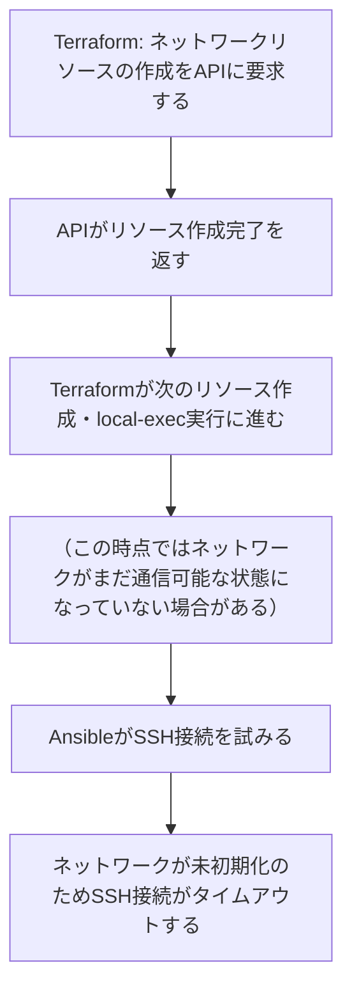

<style>
table th,
table td {
    word-break: normal;
}
table td:first-child {
    white-space: nowrap;
}
</style>


---

> **🗺️ 初めての方・シリーズの全体像を知りたい方はこちら**
> 
> シリーズ全体については、以下のまとめブログで整理しています。
> 
> → **「AnsibleとTerraformの連携が壊れる理由はライフサイクルにあった」第1部まとめブログ：環境構築・連携編で直面する9つのトラブル** **※近日公開予定**

---

## 目次

1. [はじめに](#1-はじめに)
2. [TerraformのAPIレスポンスとネットワーク初期化完了のラグ](#2-terraformのapiレスポンスとネットワーク初期化完了のラグ)
3. [第2回のSSHD起動タイミング問題との違い](#3-第2回のsshd起動タイミング問題との違い)
4. [タイムアウトエラーの構造とエラーログの読み方](#4-タイムアウトエラーの構造とエラーログの読み方)
5. [解決パターン①：wait_forモジュールによるSSHポート疎通待機](#5-解決パターンwait_forモジュールによるsshポート疎通待機)
6. [解決パターン②：depends_onとtime_sleepによるAnsible実行遅延](#6-解決パターンdepends_onとtime_sleepによるansible実行遅延)
7. [まとめ](#7-まとめ)
8. [次回予告](#8-次回予告)
9. [連載一覧：「AnsibleとTerraformの連携が壊れる理由はライフサイクルにあった」](#9-連載一覧ansibleとterraformの連携が壊れる理由はライフサイクルにあった)

---

## 1. はじめに

**[第5回](https://juehara-crypto.github.io/blog/infra/ansible/ansible-terraform/ansible-terraform-part1/ansible-terraform-part1-05/)** では、Terraformがリソースを再生成する際に発生するIPアドレスの変動と、それに対する2つの解決パターンを扱いました。接続先が正しく解決できる状態になった後、次に直面するのは、ネットワーク自体の構築完了と実際の通信可否のタイミングのズレです。

Terraformでネットワークを構築した直後にAnsibleを実行すると、接続がタイムアウトすることがあります。この場面では、次のようなことが起こります。

- `terraform apply`が正常終了し、ネットワークリソースの作成も完了しているはずなのに、直後にAnsibleを実行するとSSH接続がタイムアウトする
- 同じ構成でも、少し時間を置いてから実行すると問題なく接続できる
- コンテナ自体は起動しており、SSHDも動いているはずなのに、接続だけが失敗する

こうした場面に共通しているのは、「ネットワークリソースの作成が完了した」ことと、「そのネットワークを使って実際に通信できる状態になった」ことを、同じタイミングだと思い込んでいる点です。

正確に言うと、**Terraformがネットワークリソースの作成完了と判断する基準は、あくまでAPIからレスポンスが返ってきたことであり、そのネットワークが実際に通信可能な状態になっているかどうかは、Terraformの管理範囲の外にあります**。この構造は、Dockerネットワークのブリッジ構成であっても、AWSのSecurity GroupやVPCルーターであっても、実装方式が異なるだけで同じ位置づけの問題です。

第2回でも、Terraformの完了報告とAnsibleが接続できる状態との間にタイムラグがある問題を扱いました。ただし第2回で扱ったのはSSHDというプロセスの起動タイミングであり、今回扱うのはネットワークそのものの初期化タイミングです。両者は「Ansibleが接続できない」という症状こそ似ていますが、原因のレイヤーが異なります。この違いは第3節で改めて整理します。

この回では、このネットワーク初期化のラグがなぜ生まれるのかという構造を整理したうえで、`wait_for`モジュールと`time_sleep`リソースという2つの待機制御の方法を見ていきます。

---

[↑ 目次に戻る](#目次)

---

## 2. TerraformのAPIレスポンスとネットワーク初期化完了のラグ

TerraformがネットワークリソースのAPIレスポンスとして作成完了を返す時点と、そのネットワークが実際に通信可能な状態になる時点にラグが存在する構造を整理します。

このラグは、以下の流れで発生します。



APIの完了応答が示しているのは、ネットワークリソースがシステム上に登録された、という事実にとどまります。そのネットワークを介して実際にパケットが届く状態になっているかどうかは、APIレスポンスの範囲外です。

この構造は、実装方式が異なっていても共通して発生します。

|環境|ネットワーク初期化ラグの発生箇所|
|---|---|
|Docker環境|Dockerネットワークのブリッジ構成の初期化|
|AWS環境|Security Groupルールの伝播・VPCルーターの経路反映|
|オンプレミス環境|ファイアウォールルールの適用・スイッチのARP解決|

ここで一つ補足しておきます。「構築完了」と「通信可能」が別のイベントであるという構造そのものは、この3つの環境で共通していますが、そのラグの大きさは環境によって大きく異なります。Dockerのブリッジ初期化はホストOS内部で完結する処理であり、通常はミリ秒単位で終わります。一方、AWSのSecurity Groupの伝播やVPCルーターの経路反映は、クラウド側のコントロールプレーンを経由するため、環境によっては数秒から数十秒単位のラグになることがあります。同じ構造の問題であっても、実務上どれだけ意識する必要があるかは、環境によって差があります。

次のセクションでは、この構造が第2回で扱ったSSHD起動タイミング問題とどう違うのかを整理します。

---

[↑ 目次に戻る](#目次)

---

## 3. 第2回のSSHD起動タイミング問題との違い

**[第2回](https://juehara-crypto.github.io/blog/infra/ansible/ansible-terraform/ansible-terraform-part1/ansible-terraform-part1-02/)** で扱ったSSHD起動タイミング問題と、今回扱っているネットワーク初期化ラグの問題は、「Ansibleが接続できない」という症状こそ同じですが、原因のレイヤーが異なります。

対応関係を整理すると、以下のようになります。

|項目|第2回：SSHD起動タイミング|第6回：ネットワーク初期化ラグ|
|---|---|---|
|原因のレイヤー|OS・コンテナ側（SSHDがまだ起動していない）|ネットワーク側（初期化がまだ完了していない）|
|エラーの性質|SSHサービスへの接続拒否|SSHポートへの疎通タイムアウト|
|解消されるタイミング|SSHDの起動完了後|ネットワーク初期化完了後|

**[第2回](https://juehara-crypto.github.io/blog/infra/ansible/ansible-terraform/ansible-terraform-part1/ansible-terraform-part1-02/)** で整理した通り、SSHD起動タイミングの問題は、コンテナやVMの内部でSSHDというプロセスがまだ起動していないことが原因でした。この場合、ネットワーク自体はすでに通信可能な状態にあるため、SSH接続を試みると「サービスが応答していない」という形でエラーが返ってきます。

一方、今回扱っているネットワーク初期化ラグの問題は、SSHDがすでに起動しているかどうかとは無関係です。ネットワークそのものがまだ通信可能な状態になっていないため、SSHDに到達する経路自体が確立していません。この場合、SSH接続を試みても相手からの応答が一切返ってこない状態になります。

この違いは、実際に発生するエラーメッセージの性質にも表れます。SSHDが起動していない場合は「接続を拒否された（Connection refused）」という形でエラーが返ってくるのに対し、ネットワークが未初期化の場合は「接続がタイムアウトした（Connection timed out）」という形でエラーが返ってきます。この違いから、エラーの原因がどちらのレイヤーにあるのかを切り分けられます。次のセクションでは、このタイムアウトエラーの構造とエラーログの読み方を具体的に整理します。

---

[↑ 目次に戻る](#目次)

---

## 4. タイムアウトエラーの構造とエラーログの読み方

ネットワーク初期化ラグによってSSH接続がタイムアウトした場合、どのようなエラーログが出力されるのか、その構造を整理します。

このラグの間にAnsibleがSSH接続を試みると、以下のようなエラーが出力されます。

```
FAILED! => {
    "msg": "Failed to connect to the host via ssh:
    ssh: connect to host 172.20.0.2 port 22: Connection timed out"
}
```

このエラーメッセージの中で注目すべきは、「Connection timed out」という部分です。これは、指定したホストのポート22に対して接続を試みたものの、相手から一切の応答が返ってこないまま、待機時間の上限に達したことを示しています。

第3節で整理した通り、この「応答が返ってこない」という状態は、ネットワーク経路そのものがまだ確立していない場合に起こります。SSHDプロセスがどれだけ正常に起動していても、パケットがそこまで到達する経路が用意されていなければ、SSHDは接続要求を受け取ることすらできません。

一方、SSHDが単に起動していないだけの場合は、ネットワーク経路自体は確立しているため、接続要求はSSHDが動くはずのポートまで届きます。その上でSSHDが応答しないため、この場合のエラーは「Connection refused（接続を拒否された）」という形になり、「Connection timed out」とは異なる文言で出力されます。

ただし、実際の現場では、この2種類のエラーメッセージだけで原因を確定させるのは早計です。「Connection timed out」はネットワーク未初期化以外にも、ファイアウォールによるパケットの遮断など、他の要因でも発生し得るためです。原因のレイヤーを確実に切り分けるには、第2回で整理した`ansible -m ping`やSSHコマンドによる直接確認と合わせて、疎通状況を段階的に確認していく必要があります。

---

[↑ 目次に戻る](#目次)

---

## 5. 解決パターン①：wait_forモジュールによるSSHポート疎通待機

ネットワーク初期化のラグに対する1つ目の解決パターンとして、Ansibleの`wait_for`モジュールを使い、SSHポートへの疎通確認が取れるまで待機する構成を確認します。

Playbookの冒頭でこのモジュールを実行し、SSHポートへの疎通が取れてから、以降のタスクに進む構成です。

* **ファイル名：`site.yml`（追記部分）**

```yaml
---
- name: 接続確認用Playbook
  hosts: target_nodes
  gather_facts: false

  tasks:
    - name: SSHポートの疎通確認を待機する
      ansible.builtin.wait_for:
        host: "{{ ansible_host }}"
        port: 22
        timeout: 120

    - name: 以降の構成タスク
      # ...
```

`wait_for`モジュールは、指定した`host`の`port`に対してTCPレベルでの接続を繰り返し試行し、接続が確立できた時点で次のタスクに進みます。`timeout`で指定した時間内に疎通が確認できなければ、タスクが失敗としてPlaybookの実行が止まります。

ここで、第2回で扱った`wait_for_connection`モジュールとの違いを整理しておきます。名前が似ているため混同しやすいのですが、両者が確認している内容は異なります。

|モジュール|確認する内容|向いている場面|
|---|---|---|
|`wait_for`|指定したポートへのTCPレベルでの疎通確認|ネットワーク初期化の反映待ちに使う|
|`wait_for_connection`|SSH接続そのものの確立確認|SSHDの起動待ちに使う|

`wait_for_connection`は、内部的にSSH接続そのものを試行し、SSHDが実際に認証・セッション確立まで応答できる状態かどうかを確認します。そのため、SSHDが起動していない場合にはこのモジュールで検知できますが、確認の対象がSSHDというプロセスの状態に寄っています。

一方`wait_for`は、TCPレベルでポートへの接続可否だけを見ています。SSHDが実際に応答するかどうかまでは確認しませんが、その分、ネットワーク経路そのものが確立しているかどうかを、SSHDの状態とは切り離して確認できます。今回のようにネットワーク初期化のラグを待ちたい場面では、SSHDの状態ではなく経路の確立そのものを条件にできる`wait_for`の方が、確認したい対象と一致します。

---

[↑ 目次に戻る](#目次)

---

## 6. 解決パターン②：depends_onとtime_sleepによるAnsible実行遅延

2つ目の解決パターンとして、Terraformの`depends_on`と`time_sleep`リソースを組み合わせ、ネットワークリソースの作成後に一定時間待機してからAnsibleを実行する構成を確認します。

既存の`main.tf`に、`time_sleep`リソースと、それに依存する形でAnsibleを実行する`null_resource`を追加します。

* **ファイル名：`main.tf`（追記部分）**

```hcl
resource "time_sleep" "wait_for_network" {
  depends_on      = [docker_network.lab_net]
  create_duration = "10s"
}

resource "null_resource" "provision" {
  depends_on = [time_sleep.wait_for_network, local_file.ansible_inventory]

  provisioner "local-exec" {
    command = "ansible-playbook -i inventory.ini site.yml"
  }
}
```

`time_sleep`リソースは、`depends_on`で指定したリソース（ここでは`docker_network.lab_net`）が作成された後、`create_duration`で指定した時間だけ待機してから、自身の作成完了を報告します。`null_resource.provision`はこの`time_sleep`に依存しているため、ネットワーク作成後、指定した時間が経過してからでなければAnsibleが実行されません。AWS環境であれば、`depends_on`の対象を`docker_network.lab_net`から`aws_security_group`などに置き換えることで、同じ考え方がそのまま適用できます。

ここで一つ触れておく必要があります。このtime_sleepによる待機は、これまでの回で扱ってきた解決策とは異なる種類の対処に見えますが、構造としては第2回で扱ったsleepによる固定時間待機と同じ性質を持っています。`create_duration`で指定する秒数は、あらかじめ見積もった時間にすぎず、ネットワークが実際に通信可能な状態になったことを条件にしているわけではありません。第2回で整理した通り、この種の固定時間待機には、待機時間が環境依存であり、短すぎればラグの窓に引っかかり、長すぎれば時間を浪費するという限界が常につきまといます。

この限界が生じる背景には、Terraform側の事情があります。Terraformには、ネットワークが実際に通信可能かどうかを条件にした待機の仕組みが標準では用意されていません。`remote-exec`プロビジョナーはSSH接続そのものの確立を待てますが、それはSSHDというアプリケーション層の応答を確認しているのであって、ネットワーク層の疎通そのものを条件にしているわけではありません。そのため、Terraform側だけでネットワーク初期化ラグに対する確実な待機を組むことは難しく、`time_sleep`はあくまで保険的な最小待機という位置づけになります。

実務上は、`time_sleep`を単独で使うのではなく、セクション5で扱った`wait_for`モジュールと組み合わせる構成が現実的です。`time_sleep`でごく短い最小限の待機を入れつつ、実際の疎通確認は`wait_for`側に委ねることで、固定時間待機の不確実性を`wait_for`が補う形になります。

|手法|制御する場所|向いている場面|
|---|---|---|
|`wait_for`モジュール|Ansible側（Playbook冒頭）|疎通確認を条件にして待機したい場合|
|`time_sleep` + `depends_on`|Terraform側|Terraform実行フロー内で最小限の遅延を確保したい場合|

---

[↑ 目次に戻る](#目次)

---

## 7. まとめ

この回で整理した内容を確認します。

- TerraformのAPIレスポンスとネットワーク初期化完了の間にはラグが存在し、このラグの間にAnsibleがSSH接続を試みるとタイムアウトが発生します。この構造は、Docker・AWS・オンプレミスを問わず共通して発生しうるものですが、ラグの大きさは環境によって大きく異なります
- 第2回で扱ったSSHD起動タイミング問題と今回のネットワーク初期化ラグ問題は、「Ansibleが接続できない」という症状は同じですが、原因のレイヤーが異なります。「Connection refused」はSSHD未起動、「Connection timed out」はネットワーク未初期化を示すエラーであり、この違いから原因のレイヤーを切り分けられます
- `wait_for`モジュールは、SSHDの状態とは切り離してポートへのTCPレベルの疎通を確認できるため、ネットワーク初期化の反映待ちに向いています
- `time_sleep`リソースはTerraform側で実行を遅延させる構成ですが、固定時間待機である以上、第2回で整理した`sleep`と同様の限界を持ちます。ネットワークの疎通そのものを条件にした待機はTerraform側では組みにくいため、`time_sleep`は保険的な最小待機として位置づけ、実際の疎通確認は`wait_for`モジュールに委ねる構成が現実的です

---

[↑ 目次に戻る](#目次)

---

## 8. 次回予告

今回は、TerraformのAPIレスポンスとネットワーク初期化完了の間に存在するラグの構造と、第2回で扱ったSSHD起動タイミング問題との違いを整理しました。あわせて、`wait_for`モジュールと`time_sleep`リソースという2つの待機制御の方法を見てきました。

ネットワーク初期化のラグが整理された後、次に直面するのは別の種類の問題です。第7回では、Ansibleを実行するコントロールノード側のPythonバージョンと、ターゲットOS内のPythonバージョンが一致しないことによる実行時エラーを取り上げます。

**[次回：第7回：実行環境とターゲットOS間におけるPythonバージョンの不一致](https://juehara-crypto.github.io/blog/infra/ansible/ansible-terraform/ansible-terraform-part1/ansible-terraform-part1-07/)**


---

📑 連載の移動　**[前の記事：【Ansible×Terraform編】第5回](https://juehara-crypto.github.io/blog/infra/ansible/ansible-terraform/ansible-terraform-part1/ansible-terraform-part1-05/)　｜　[次の記事：【Ansible×Terraform編】第7回](https://juehara-crypto.github.io/blog/infra/ansible/ansible-terraform/ansible-terraform-part1/ansible-terraform-part1-07/)**

---

> **🗺️ 初めての方・シリーズの全体像を知りたい方はこちら**
>
> シリーズ全体については、以下のまとめブログで整理しています。
>
> → **「AnsibleとTerraformの連携が壊れる理由はライフサイクルにあった」第1部まとめブログ：環境構築・連携編で直面する9つのトラブル** **※近日公開予定**

---

[↑ 目次に戻る](#目次)

---

## 9. 連載一覧：「AnsibleとTerraformの連携が壊れる理由はライフサイクルにあった」

### 第1部：環境構築・連携編

|回数|テーマ・記事タイトル|概要|
|---|---|---|
|**[第1回](https://juehara-crypto.github.io/blog/infra/ansible/ansible-terraform/ansible-terraform-part1/ansible-terraform-part1-01/)**|AnsibleとTerraformの連携目的と設計思想の違い|リソース生成（Terraform）と構成管理（Ansible）の役割分担と、連携時における設計のアンチパターンを俯瞰。冪等性シリーズ・ドリフトシリーズとの接続を示す。|
|**[第2回](https://juehara-crypto.github.io/blog/infra/ansible/ansible-terraform/ansible-terraform-part1/ansible-terraform-part1-02/)**|Terraform完了直後のプロビジョニング失敗を防ぐSSH待機制御|TerraformのAPIレスポンスとSSHDが接続を受け付けられる状態になるまでのタイムラグによる接続失敗と解決策。VM環境（EC2・VirtualBox）でのOSブート待ち・Docker環境でのSSHD初期化待ちなど、環境を問わず発生する構造として示す。|
|**[第3回](https://juehara-crypto.github.io/blog/infra/ansible/ansible-terraform/ansible-terraform-part1/ansible-terraform-part1-03/)**|動的インベントリ生成時における出力データのパースエラー|TerraformのJSON出力とAnsibleが期待する動的インベントリのJSONスキーマの構造的な差異を整理し、生の出力をそのまま渡した際の「静かな失敗」を実機再現したうえで、変換スクリプトによる解決方法を解説する。|
|**[第4回](https://juehara-crypto.github.io/blog/infra/ansible/ansible-terraform/ansible-terraform-part1/ansible-terraform-part1-04/)**|自動生成されたSSH鍵のパーミッション設定エラー|Terraformで自動生成した秘密鍵ファイルの権限設定が不適切なため、AnsibleのSSH実行時に接続を拒否されるトラブルへの対応。|
|**[第5回](https://juehara-crypto.github.io/blog/infra/ansible/ansible-terraform/ansible-terraform-part1/ansible-terraform-part1-05/)**|仮想環境におけるIPアドレス変動対策|Terraformのリソース再生成で発生するIPアドレス変動を実機検証する。applyとAnsible実行のタイミングが分離すると、SSH接続自体は成功するのに意図しないホストへ接続する危険があることを示し、IP固定と動的インベントリという2つの解決アプローチを比較する。|
|**[第6回](https://juehara-crypto.github.io/blog/infra/ansible/ansible-terraform/ansible-terraform-part1/ansible-terraform-part1-06/)**|ネットワーク初期化完了前に発生する接続タイムアウト|ネットワーク構築完了直後にAnsibleが接続を試み、反映待ちでSSH接続がタイムアウトする問題。Dockerネットワークのブリッジ・AWSのSecurity Group・VPCルーターの伝播ラグなど、実装方式が違っても「構築完了」と「通信可能」が別タイミングである共通構造から生じることを整理し、対策を解説する。|
|**[第7回](https://juehara-crypto.github.io/blog/infra/ansible/ansible-terraform/ansible-terraform-part1/ansible-terraform-part1-07/)**|実行環境とターゲットOS間におけるPythonバージョンの不一致|ターゲットOS内のPythonバージョンと、Ansibleを実行するコントロールノード側のPythonの乖離による実行時エラーへの対応。冪等性シリーズ第7回との接続を示す。|
|**[第8回](https://juehara-crypto.github.io/blog/infra/ansible/ansible-terraform/ansible-terraform-part1/ansible-terraform-part1-08/)**|複数インスタンス同時構築時における並列処理の競合|Terraformで複数リソースを同時生成する際、Ansible側のforks制限によって処理が遅延・競合しうる問題。同時生成数が実行環境のキャパシティに対して相対的に多い場合に起こる構造的な問題として整理し、forks調整やバッチ分割の対策を解説する。|
|第9回|OS固有の初期ユーザーと管理者権限（sudo）への昇格エラー|コンテナイメージごとに異なるデフォルトユーザーに対し、Ansibleから`become`を用いて権限昇格する際の設定ミスと対策。Docker・VM・クラウドを問わず同じ構造で発生することを示す。|
|第10回|環境構築編まとめ：自動連携のためのコードテンプレート化|第1回〜9回の課題を踏まえ、TerraformからAnsibleへ一貫して安全に処理を移譲するためのコードのテンプレート化を解説。|

---

[↑ 目次に戻る](#目次)

---

