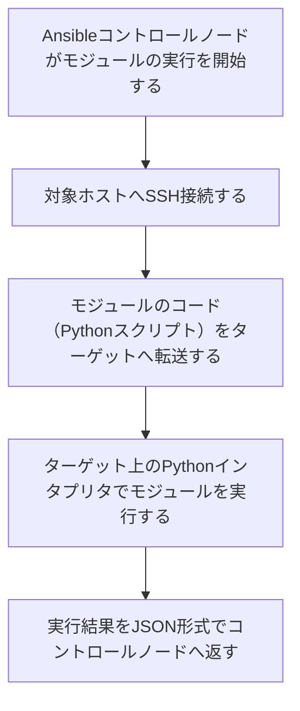

<style>
table th,
table td {
    word-break: normal;
}
table td:first-child {
    white-space: nowrap;
}
</style>


---

> **🗺️ 初めての方・シリーズの全体像を知りたい方はこちら**
> 
> シリーズ全体については、以下のまとめブログで整理しています。
> 
> → **「AnsibleとTerraformの連携が壊れる理由はライフサイクルにあった」第1部まとめブログ：環境構築・連携編で直面する9つのトラブル** **※近日公開予定**

---

## 目次

1. [はじめに](#1-はじめに)
2. [AnsibleがターゲットのPythonを使う構造](#2-ansibleがターゲットのpythonを使う構造)
3. [TerraformがプロビジョニングするコンテナのPythonバージョンが固定されない構造](#3-terraformがプロビジョニングするコンテナのpythonバージョンが固定されない構造)
4. [実行時エラーの再現](#4-実行時エラーの再現)
5. [解決パターン①：ansible_python_interpreterによるPythonパスの明示指定](#5-解決パターンansible_python_interpreterによるpythonパスの明示指定)
6. [解決パターン②：Terraformのプロビジョニングでバージョンを統一する](#6-解決パターンterraformのプロビジョニングでバージョンを統一する)
7. [まとめ](#7-まとめ)
8. [次回予告](#8-次回予告)
9. [連載一覧：「AnsibleとTerraformの連携が壊れる理由はライフサイクルにあった」](#9-連載一覧ansibleとterraformの連携が壊れる理由はライフサイクルにあった)
---

## 1. はじめに

**[第6回](https://juehara-crypto.github.io/blog/infra/ansible/ansible-terraform/ansible-terraform-part1/ansible-terraform-part1-06/)** では、ネットワーク初期化のラグによって発生する接続タイムアウトを扱いました。ネットワーク経路が確立し、SSH接続そのものが安定した後、次に直面するのは、接続はできているのにAnsibleのタスクがエラーで止まる、という別の種類の問題です。

Ansibleを使っていると、次のような場面に出会うことがあります。

- SSH接続そのものは成功しているのに、特定のモジュールを実行した瞬間だけエラーになる
- 同じPlaybookなのに、あるサーバーでは正常に動き、別のサーバーでは動かない
- エラーメッセージに「Python」という単語が出てくるが、自分はPythonのコードを書いた覚えがない

Ansibleは構成管理ツールであり、YAMLでタスクを書くという性質上、実行対象のサーバー側にPythonの知識が必要になる場面は一見なさそうに思えます。しかし実際には、Ansibleはターゲット側にモジュールのコードを転送し、ターゲット上のPythonでそれを実行するという仕組みを持っています。このため、ターゲット側にどのPythonが、どのバージョンで存在するかが、Ansibleの動作に直接影響します。

TerraformでコンテナやVMをプロビジョニングする場合、この点はさらに見落とされやすくなります。Terraformが指定するのはコンテナイメージやAMIといった「土台」であり、そこに含まれるPythonのバージョンまで意識して指定することは多くありません。土台が変われば、その上に乗っているPythonのバージョンも変わります。コントロールノード側の環境を一切変更していなくても、Terraformがプロビジョニングするターゲット側の環境が変われば、Ansibleの実行結果が変わり得るということです。

**[冪等性シリーズ第7回](https://juehara-crypto.github.io/blog/infra/ansible/ansible-idempotency/ansible-idempotency-07/)** では、同じPlaybookを実行しても、OSやディストリビューション、Pythonのバージョンといった環境側の差分によってモジュールの内部動作が変化し、結果が変わってしまう問題を扱いました。今回扱うテーマは、その環境差分の中でも特にPythonバージョンに焦点を当てたものであり、かつ、その差分がTerraformによるプロビジョニングという工程を通じて生まれる、という点に特徴があります。

この回では、AnsibleがターゲットのPythonを使う仕組みを整理したうえで、Terraformがプロビジョニングする環境でPythonバージョンが固定されない理由を確認し、実際に発生するエラーの読み方と、2つの解決パターンを見ていきます。

---

[↑ 目次に戻る](#目次)

---

### 2. AnsibleがターゲットのPythonを使う構造

Ansibleがターゲット側のPythonをどのように使ってモジュールを実行しているか、その仕組みを整理します。

Ansibleがモジュールを実行する際の流れは、以下のようになっています。



ここで重要なのは、モジュールのコードそのものはコントロールノードから転送されますが、そのコードを**実行するPythonインタプリタは、ターゲット側に存在するもの**だという点です。コントロールノード側にどれだけ新しいPythonが入っていても、実行の主体はターゲット側のPythonです。

この構造から、次のことが言えます。

- Ansibleモジュールの動作に影響するのは、コントロールノード側のPythonバージョンではなく、**ターゲット側のPythonバージョン**である
- ターゲットにPythonが存在しない場合、あるいはAnsibleが想定する最低バージョンを満たさない場合、モジュールの転送は成功しても、実行の段階でエラーになる
- YAMLでPlaybookを書いている限り、執筆者が直接Pythonのコードを意識することはないが、実行時にはターゲット側のPython環境が常に介在している

Ansibleは、デフォルトではターゲット上のPythonインタプリタのパスを自動的に探索します。このため、ターゲット側にPythonが標準的な場所に存在していれば、通常は特別な設定なしに動作します。問題は、この探索によって見つかったPythonのバージョンそのものが、Ansibleの実行を支えるコード（`ansible.module_utils`）の要求を満たしていない場合に起こります。この場合、Ansible側でどのパスを使うかを指定し直しても、根本的な解決にはなりません。この点は、セクション5で実機を使って確認します。

**[冪等性シリーズ第7回](https://juehara-crypto.github.io/blog/infra/ansible/ansible-idempotency/ansible-idempotency-07/)** では、同じPlaybookでも実行対象のOSやディストリビューションが異なると、モジュールの内部動作が変わり、結果が変わってしまう問題を扱いました。これは、モジュールのコード自体は同じでも、それを解釈して実行するインタプリタ側の環境（今回で言えばPythonのバージョン）が異なれば、実行結果が変わり得るという、同じ構造の一部です。今回はこの環境差分の中でも、Pythonのバージョンという一点に絞って掘り下げていきます。

次のセクションでは、この「ターゲット側のPython」が、Terraformによるプロビジョニングの過程でどのように決まり、なぜバージョンが固定されないのかを整理します。

---

[↑ 目次に戻る](#目次)

---

## 3. TerraformがプロビジョニングするコンテナのPythonバージョンが固定されない構造

TerraformがプロビジョニングするコンテナやVMに含まれるPythonのバージョンが、なぜ実行のたびに一定しないのかを整理します。

Terraformは、コンテナイメージやAMIといった「土台」を指定してリソースを作成します。この土台の中に何が含まれているか（OSのバージョン、標準でインストールされているパッケージ、Pythonのバージョンなど）は、Terraformのリソース定義の対象外です。Terraformが管理しているのは「どのイメージを使うか」までであり、そのイメージの中身までは踏み込みません。

この結果、次のようなケースでPythonバージョンの乖離が起こりやすくなります。

|ケース|発生しやすい状況|
|---|---|
|ベースイメージのデフォルトPythonが古い|イメージのビルド時期が古く、Python2系やPython3の初期マイナーバージョンのままの場合|
|Python3系でもマイナーバージョンが異なる|コントロールノードとターゲットで、参照しているベースイメージの系統やビルド時期が異なる場合|
|Pythonがインストールされていない|最小構成（minimal・slim系）のイメージで、Pythonが標準では含まれていない場合|

これらはいずれも、Terraform側の設定ミスというより、「イメージの中身をTerraformが管理していない」という構造そのものから生じます。イメージを差し替えれば、Terraform側のHCLを一切変更しなくても、プロビジョニングされるターゲットのPythonバージョンは変わり得ます。逆に言えば、コントロールノード側の環境（Ansibleや、コントロールノード自身のPythonバージョン）を一切変更していなくても、Terraformが参照するイメージが更新されるだけで、ターゲット側の状態が変わり、Ansibleの実行結果に影響することがあります。

この構造は、Docker環境に限った話ではありません。AWSであればAMIの選択、GCPであればイメージファミリーの選択が同様の役割を持ちます。「土台となるイメージにどのPythonが含まれているかは、IaCツールの管理範囲の外にある」という点は、コンテナ・VM・クラウドを問わず共通しています。

---

[↑ 目次に戻る](#目次)

---

## 4. 実行時エラーの再現

Terraformがプロビジョニングするコンテナイメージの違いによって、AnsibleモジュールがどのようなエラーでPythonバージョンの不一致を示すのかを実機で確認します。

### ■ 検証内容

**【検証の準備】**

target-node1のみ、Python 3.6系を含むUbuntu 18.04ベースの別イメージを参照するよう`main.tf`を変更します。

まず、既存の`docker_image.ansible_target`と同じ形で、Ubuntu 18.04版のイメージリソースを新たに追加します。

* **ファイル名：`main.tf`（追記部分）**

```hcl
resource "docker_image" "ansible_target_legacy" {
  name = "ansible-target:ubuntu18.04"
  build {
    context    = "."
    dockerfile = "Dockerfile.legacy"
  }
}
```

次に、コンテナを生成している`docker_container.targets`リソースを変更します。このリソースは`for_each`で3台のノード（target-node1〜3）をまとめて生成しており、変更前は全ノードが同じイメージ（`docker_image.ansible_target`）を参照していました。

* **ファイル名：`main.tf`（変更前）**

```hcl
resource "docker_container" "targets" {
  for_each = local.target_nodes
  name  = each.key
  image = docker_image.ansible_target.image_id
  networks_advanced {
    name = docker_network.lab_net.name
  }
  ports {
    internal = 22
    external = each.value
  }
  upload {
    file    = "/home/ansible/.ssh/authorized_keys"
    content = "${file("${path.module}/id_ed25519.pub")}\n${tls_private_key.generated.public_key_openssh}"
  }
}
```

`image`の行だけを、ノード名がtarget-node1かどうかで参照先を切り替える条件式に変更します。

* **ファイル名：`main.tf`（変更後）**

```hcl
resource "docker_container" "targets" {
  for_each = local.target_nodes
  name  = each.key
  image = each.key == "target-node1" ? docker_image.ansible_target_legacy.image_id : docker_image.ansible_target.image_id
  networks_advanced {
    name = docker_network.lab_net.name
  }
  ports {
    internal = 22
    external = each.value
  }
  upload {
    file    = "/home/ansible/.ssh/authorized_keys"
    content = "${file("${path.module}/id_ed25519.pub")}\n${tls_private_key.generated.public_key_openssh}"
  }
}
```

`each.key`は`for_each`で回っているノード名（"target-node1"など）を指すため、この条件式によってtarget-node1だけが`ansible_target_legacy`イメージを参照し、target-node2・target-node3は従来通り`ansible_target`イメージを参照する構成になります。

この変更を反映するため、`terraform apply`を実行します。`docker_container.targets`はmap全体に対する変更となるため、3台すべてが再生成されます。

* **実行コマンド**

```
terraform apply
```

（確認プロンプトには`yes`と入力）

▼実行結果（※ログが長いので、Outputsのみ抜粋します）

```plaintext
Apply complete! Resources: 5 added, 0 changed, 4 destroyed.

Outputs:

target_nodes_ips = {
  "target-node1" = "172.20.0.2"
  "target-node2" = "172.20.0.4"
  "target-node3" = "172.20.0.3"
}
```

各ノードのPythonバージョンを確認します。

* **実行コマンド**

```plaintext
docker exec target-node1 python3 --version
docker exec target-node2 python3 --version
docker exec target-node3 python3 --version
```

▼実行結果

```plaintext
Python 3.6.9
Python 3.10.12
Python 3.10.12
```

target-node1のみPython 3.6.9、target-node2・target-node3はPython 3.10.12という状態になりました。この状態で、Ansibleの`ping`モジュールを3台まとめて実行します。

* **実行コマンド**

```plaintext
ansible all -i inventory.py -m ping
```

▼実行結果

```
[WARNING]: Unhandled error in Python interpreter discovery for host target-node1: Expecting value: line 1 column 1 (char 0)
An exception occurred during task execution. To see the full traceback, use -vvv. The error was: SyntaxError: future feature annotations is not defined
[WARNING]: Platform linux on host target-node1 is using the discovered Python interpreter at /usr/bin/python3, but future installation of another Python interpreter could change the
meaning of that path. See https://docs.ansible.com/ansible-core/2.17/reference_appendices/interpreter_discovery.html for more information.
target-node1 | FAILED! => {
    "ansible_facts": {
        "discovered_interpreter_python": "/usr/bin/python3"
    },
    "changed": false,
    "module_stderr": "Shared connection to 172.20.0.2 closed.\r\n",
    "module_stdout": "Traceback (most recent call last):\r\n  File \"/home/ansible/.ansible/tmp/ansible-tmp-1786840640.7819579-7438-108439729985992/AnsiballZ_ping.py\", line 107, in <module>\r\n    _ansiballz_main()\r\n  File \"/home/ansible/.ansible/tmp/ansible-tmp-1786840640.7819579-7438-108439729985992/AnsiballZ_ping.py\", line 99, in _ansiballz_main\r\n    invoke_module(zipped_mod, temp_path, ANSIBALLZ_PARAMS)\r\n  File \"/home/ansible/.ansible/tmp/ansible-tmp-1786840640.7819579-7438-108439729985992/AnsiballZ_ping.py\", line 44, in invoke_module\r\n    from ansible.module_utils import basic\r\n  File \"<frozen importlib._bootstrap>\", line 971, in _find_and_load\r\n  File \"<frozen importlib._bootstrap>\", line 951, in _find_and_load_unlocked\r\n  File \"<frozen importlib._bootstrap>\", line 894, in _find_spec\r\n  File \"<frozen importlib._bootstrap_external>\", line 1157, in find_spec\r\n  File \"<frozen importlib._bootstrap_external>\", line 1131, in _get_spec\r\n  File \"<frozen importlib._bootstrap_external>\", line 1112, in _legacy_get_spec\r\n  File \"<frozen importlib._bootstrap>\", line 441, in spec_from_loader\r\n  File \"<frozen importlib._bootstrap_external>\", line 544, in spec_from_file_location\r\n  File \"/tmp/ansible_ping_payload_se7f63yu/ansible_ping_payload.zip/ansible/module_utils/basic.py\", line 5\r\nSyntaxError: future feature annotations is not defined\r\n",
    "msg": "MODULE FAILURE\nSee stdout/stderr for the exact error",
    "rc": 1
}
[WARNING]: Platform linux on host target-node2 is using the discovered Python interpreter at /usr/bin/python3.10, but future installation of another Python interpreter could change the
meaning of that path. See https://docs.ansible.com/ansible-core/2.17/reference_appendices/interpreter_discovery.html for more information.
target-node2 | SUCCESS => {
    "ansible_facts": {
        "discovered_interpreter_python": "/usr/bin/python3.10"
    },
    "changed": false,
    "ping": "pong"
}
[WARNING]: Platform linux on host target-node3 is using the discovered Python interpreter at /usr/bin/python3.10, but future installation of another Python interpreter could change the
meaning of that path. See https://docs.ansible.com/ansible-core/2.17/reference_appendices/interpreter_discovery.html for more information.
target-node3 | SUCCESS => {
    "ansible_facts": {
        "discovered_interpreter_python": "/usr/bin/python3.10"
    },
    "changed": false,
    "ping": "pong"
}
```

### ■ 結果

target-node2・target-node3は`SUCCESS`で`pong`が返っていますが、target-node1だけが`FAILED`になりました。エラーの中身を見ると、単に「Pythonが見つからない」わけではなく、Ansibleのモジュール転送・実行の途中で`SyntaxError: future feature annotations is not defined`という構文エラーが発生しています。

`module_stdout`のトレースバックを追うと、エラーが起きているのは`ansible.module_utils.basic`をインポートしている箇所です。この`basic.py`の中には`from __future__ import annotations`という記述が含まれています。この構文はPython 3.7以降で導入されたものであり、Python 3.6のインタプリタはこの構文自体を解釈できません。その結果、モジュールのコードを実行する以前の、インポートの段階で処理が止まっています。

これは、セクション2で整理した「Ansibleはターゲット側のPythonでモジュールを実行する」という構造が、そのままエラーとして表れた例です。Ansible本体のコード（`ansible.module_utils.basic`）自体が、ある程度新しいPythonの構文を前提に書かれているため、ターゲット側のPythonがそれより古いと、モジュールの実行以前にインポートの段階で失敗します。今回使用した`ansible-core 2.17`は、Python 3.6をターゲットのサポート対象外としており、今回のエラーはその境界を実際に踏み越えたことで発生したものです。

なお、`[WARNING]`として表示されている「Python interpreter discovery」に関する警告は、Ansibleがターゲット上のPythonパスを自動探索した際に、確定的な特定ができなかったことを示しています。次のセクションでは、この自動探索に頼らずPythonのパスを明示的に指定する方法を確認します。

---

[↑ 目次に戻る](#目次)

---

## 5. 解決パターン①：`ansible_python_interpreter`によるPythonパスの明示指定

セクション4で発生したエラーに対して、`ansible_python_interpreter`変数でPythonのパスを明示的に指定した場合、この問題が解決するかどうかを実機で確認します。

`ansible_python_interpreter`は、Ansibleが自動的に行うPythonパスの探索に頼らず、使用するPythonのパスを明示的に指定するための変数です。インベントリの`host_vars`やインベントリファイル自体に記述しておくことで、実行のたびに対象ホストがどのパスのPythonを使うかを固定できます。

* **ファイル名：`inventory.ini`（例）**

```ini
[target_nodes]
target-node1 ansible_host=172.20.0.2 ansible_user=ansible ansible_python_interpreter=/usr/bin/python3
```

### ■ 検証内容

target-node1に対して、`/usr/bin/python3`（このコンテナ内でPython 3.6.9を指しているパス）を明示的に指定したうえで、`ping`モジュールを実行します。

* **実行コマンド**

```plaintext
ansible target-node1 -i inventory.py -m ping -e "ansible_python_interpreter=/usr/bin/python3"
```

▼実行結果

```
An exception occurred during task execution. To see the full traceback, use -vvv. The error was: SyntaxError: future feature annotations is not defined
target-node1 | FAILED! => {
    "changed": false,
    "module_stderr": "Shared connection to 172.20.0.2 closed.\r\n",
    "module_stdout": "Traceback (most recent call last):\r\n  File \"/home/ansible/.ansible/tmp/ansible-tmp-1786845423.8892593-8420-145697281845116/AnsiballZ_ping.py\", line 107, in <module>\r\n    _ansiballz_main()\r\n  File \"/home/ansible/.ansible/tmp/ansible-tmp-1786845423.8892593-8420-145697281845116/AnsiballZ_ping.py\", line 99, in _ansiballz_main\r\n    invoke_module(zipped_mod, temp_path, ANSIBALLZ_PARAMS)\r\n  File \"/home/ansible/.ansible/tmp/ansible-tmp-1786845423.8892593-8420-145697281845116/AnsiballZ_ping.py\", line 44, in invoke_module\r\n    from ansible.module_utils import basic\r\n  File \"<frozen importlib._bootstrap>\", line 971, in _find_and_load\r\n  File \"<frozen importlib._bootstrap>\", line 951, in _find_and_load_unlocked\r\n  File \"<frozen importlib._bootstrap>\", line 894, in _find_spec\r\n  File \"<frozen importlib._bootstrap_external>\", line 1157, in find_spec\r\n  File \"<frozen importlib._bootstrap_external>\", line 1131, in _get_spec\r\n  File \"<frozen importlib._bootstrap_external>\", line 1112, in _legacy_get_spec\r\n  File \"<frozen importlib._bootstrap>\", line 441, in spec_from_loader\r\n  File \"<frozen importlib._bootstrap_external>\", line 544, in spec_from_file_location\r\n  File \"/tmp/ansible_ping_payload_eb_rrn28/ansible_ping_payload.zip/ansible/module_utils/basic.py\", line 5\r\nSyntaxError: future feature annotations is not defined\r\n",
    "msg": "MODULE FAILURE\nSee stdout/stderr for the exact error",
    "rc": 1
}
```

### ■ 結果

`ansible_python_interpreter`でパスを明示的に指定しても、セクション4と同じ`SyntaxError: future feature annotations is not defined`が発生し、エラーは解決しませんでした。

この結果は、`ansible_python_interpreter`が何を解決する変数なのかを考えると、当然の結果です。この変数が制御しているのは「ターゲット上の、どのパスにあるPythonを使うか」という選択の部分であり、「そのPython自体がAnsibleの要求するバージョンを満たしているか」までは関知しません。target-node1には元々Python 3.6.9しか存在しないため、パスを`/usr/bin/python3`と明示しても、指し示す先は変わらず同じPython 3.6.9のままです。

`ansible_python_interpreter`が効果を発揮するのは、ターゲットに複数のPythonが混在していて、Ansibleの自動探索が意図しないバージョンを選んでしまう場合です。たとえば、ターゲットに`/usr/bin/python3.8`と`/usr/bin/python3.10`の両方が存在し、要件の都合で3.8を使わせたいのに自動探索が3.10を選んでしまう、といった場面であれば、パスを明示することで意図したバージョンに固定できます。しかし今回のように、要件を満たすPythonがターゲットに1つも存在しない場合、パスをどう指定してもその状況自体は変わりません。

つまり、`ansible_python_interpreter`は「どのPythonを使うかの選択」を制御する手段であり、「Pythonのバージョンそのものを変える」手段ではありません。target-node1の問題を解決するには、ターゲット側に要件を満たすPythonを用意する必要があります。次のセクションでは、Terraformのプロビジョニングの段階でこれを解決する方法を確認します。

---

[↑ 目次に戻る](#目次)

---

## 6. 解決パターン②：Terraformのプロビジョニングでバージョンを統一する

target-node1のイメージ参照を、要件を満たす既存イメージに戻したうえで、Dockerfile側でPythonバージョンを明示的に固定する構成を実機で確認します。

### ■ 検証内容

まず、target-node1の`image`参照を`docker_image.ansible_target`に戻します。「4. コンテナの作成・起動」の`image`属性です。

* **ファイル名：`main.tf`（変更前）**

```hcl
  image = each.key == "target-node1" ? docker_image.ansible_target_legacy.image_id : docker_image.ansible_target.image_id
```

* **ファイル名：`main.tf`（変更後）**

```hcl
  image = docker_image.ansible_target.image_id
```

あわせて、`docker_image.ansible_target`がビルド元にしている`Dockerfile`側で、Pythonのインストール指定にバージョンを明示します。

* **ファイル名：`Dockerfile`（変更前）**

```dockerfile
RUN apt-get update && apt-get install -y \
    openssh-server \
    python3 \
    sudo \
    iproute2 \
    curl \
    && rm -rf /var/lib/apt/lists/*
```

* **ファイル名：`Dockerfile`（変更後）**

```dockerfile
RUN apt-get update && apt-get install -y \
    openssh-server \
    python3.10 \
    sudo \
    iproute2 \
    curl \
    && rm -rf /var/lib/apt/lists/*
```

`python3`という指定は、apt側のリポジトリでその時点のデフォルトパッケージが何を指しているかに結果が左右されます。`python3.10`と明示することで、ビルドのたびにこのバージョンが確保されるようにします。

この2つの変更を反映するため、`terraform apply`を実行します。

* **実行コマンド**

```
terraform apply
```

（確認プロンプトには`yes`と入力）

▼実行結果（※ログが長いので、該当箇所のみ抜粋します）

```
Plan: 4 to add, 0 to change, 4 to destroy.

Changes to Outputs:
  ~ target_nodes_ips = {
      ~ target-node1 = "172.20.0.2" -> (known after apply)
      ~ target-node2 = "172.20.0.4" -> (known after apply)
      ~ target-node3 = "172.20.0.3" -> (known after apply)
    }

Do you want to perform these actions?
  Terraform will perform the actions described above.
  Only 'yes' will be accepted to approve.

  Enter a value: yes

（…途中省略…）

Apply complete! Resources: 4 added, 0 changed, 4 destroyed.

Outputs:

target_nodes_ips = {
  "target-node1" = "172.20.0.4"
  "target-node2" = "172.20.0.3"
  "target-node3" = "172.20.0.2"
}
```

各ノードのPythonバージョンを確認します。

* **実行コマンド**

```
docker exec target-node1 python3 --version
docker exec target-node2 python3 --version
docker exec target-node3 python3 --version
```

▼実行結果

```
Python 3.10.12
Python 3.10.12
Python 3.10.12
```

最後に、Ansibleが3台とも問題なく実行できることを確認します。

* **実行コマンド**

```
ansible all -i inventory.py -m ping
```

▼実行結果

```
target-node1 | SUCCESS => {
    "ansible_facts": {
        "discovered_interpreter_python": "/usr/bin/python3.10"
    },
    "changed": false,
    "ping": "pong"
}
target-node2 | SUCCESS => {
    "ansible_facts": {
        "discovered_interpreter_python": "/usr/bin/python3.10"
    },
    "changed": false,
    "ping": "pong"
}
target-node3 | SUCCESS => {
    "ansible_facts": {
        "discovered_interpreter_python": "/usr/bin/python3.10"
    },
    "changed": false,
    "ping": "pong"
}
```

### ■ 結果

3台とも`Python 3.10.12`に統一され、`ansible all -m ping`もすべて`SUCCESS`になりました。セクション4で発生した`SyntaxError`は、Terraformが参照するイメージを揃えることで解消されています。

ここで一点、注目しておきたい事実があります。今回`terraform apply`のプランには、`docker_image.ansible_target`自体の再ビルド（変更）は現れませんでした。再生成されたのは3台のコンテナと`local_file.ansible_inventory`のみで、イメージのsha256は変化していません。これは、Ubuntu 22.04のリポジトリでは、`python3`というパッケージ名のデフォルトが、もともと`python3.10`を指しているためです。つまり今回のケースでは、バージョンを明示してもしなくても、実際にインストールされる中身は結果的に同じでした。

ここで重要なのは、この一致が「今のリポジトリの状態だから、たまたま一致している」という点です。`python3`という指定のままでは、将来Ubuntu側のリポジトリでデフォルトパッケージが新しいバージョン（3.11や3.12など）に更新された場合、そのタイミングでイメージを再ビルドすると、意図せずターゲットのPythonバージョンが変わってしまいます。`python3.10`と明示しておけば、リポジトリ側のデフォルトが変わっても、ビルドされるイメージのPythonバージョンは変わりません。

この構造は、ドリフトシリーズで扱った「宣言（コード）と実際の状態が、外部要因によって食い違っていく」問題と近い性質を持っています。ただし、ドリフトシリーズが主に扱ったのは、一度構築された状態が後から手動変更などによってずれていく現象でした。今回の問題は、同じ`Dockerfile`という宣言を元にしていても、ビルドするタイミングによって参照先の外部リポジトリの状態が変われば、最初から異なる結果が生まれ得るという、再現性の問題です。「後からずれる」ドリフトとは厳密には異なりますが、「宣言だけでは実際の状態が一意に定まらず、外部の可変な依存先に結果が左右される」という点では、根っこに共通する構造があると言えます。

セクション5で確認した`ansible_python_interpreter`と、この解決パターンの使い分けを整理します。

|手法|制御する場所|向いている場面|
|---|---|---|
|`ansible_python_interpreter`|Ansible側（インベントリ・実行時の変数）|ターゲットに複数のPythonが存在し、どれを使うか選択したい場合|
|Terraformプロビジョニングでの統一・バージョン固定|Terraform側（イメージ定義）|そもそもターゲットに要件を満たすPythonを、ビルドのたびに確実に用意したい場合|

`ansible_python_interpreter`は「既にターゲットにある複数の選択肢から選ぶ」手段であるのに対し、Terraform側でのバージョン固定は「ターゲットに用意されるPython自体を、ブレなく確定させる」手段です。今回のようにターゲットに要件を満たすPythonが存在しない場合は、後者でなければ根本的な解決にはなりません。

---

[↑ 目次に戻る](#目次)

---

## 7. まとめ

この回で整理した内容を確認します。

* Ansibleはターゲット側のPythonでモジュールを実行するため、Terraformがプロビジョニングするコンテナ・VMのPythonバージョンが、Ansibleの動作に直接影響します。コントロールノード側のPythonバージョンではなく、ターゲット側のPythonバージョンが問題になる点がポイントです
* Terraformが管理しているのはイメージやAMIといった「土台」までであり、その中に含まれるPythonバージョンまでは管理範囲の外にあります。このため、Terraformが参照するイメージが変われば、HCL側を変更していなくてもターゲットのPythonバージョンが変わり得ます
* 実機検証では、target-node1のみ異なるイメージ（Python 3.6.9）を参照させたところ、`ansible.module_utils.basic`のインポート時点で`SyntaxError: future feature annotations is not defined`が発生しました。これは、`ansible-core`がある程度新しいPythonの構文を前提にコードを書いていることが原因です
* `ansible_python_interpreter`は、ターゲットに複数のPythonが存在する場合に、どれを使うかを明示的に選択する手段です。ターゲットに要件を満たすPython自体が存在しない場合は、パスを指定しても解決しません
* 根本的な解決には、Terraform側で参照するイメージを統一し、かつそのイメージのビルド定義（Dockerfile）でPythonバージョンを明示的に固定しておくことが必要です。バージョンを明示しなくても、リポジトリの現在の状態次第では結果が一致することがありますが、これは将来のリポジトリ側の変更によって崩れる可能性がある一致にすぎません

---

[↑ 目次に戻る](#目次)

---

## 8. 次回予告

Pythonバージョンの問題が解消された後、次に直面するのは、Terraformが複数リソースを同時生成する際の並列処理と、Ansible側の並列実行数（forks）の制限が競合する問題です。次回は、この問題を扱います。

**[次回：第8回：複数インスタンス同時構築時における並列処理の競合](https://juehara-crypto.github.io/blog/infra/ansible/ansible-terraform/ansible-terraform-part1/ansible-terraform-part1-08/)**

---

📑 連載の移動　**[前の記事：【Ansible×Terraform編】第6回](http://localhost:4321/blog/infra/ansible/ansible-terraform/ansible-terraform-part1/ansible-terraform-part1-06/)　｜　[次の記事：【Ansible×Terraform編】第8回](https://juehara-crypto.github.io/blog/infra/ansible/ansible-terraform/ansible-terraform-part1/ansible-terraform-part1-08/)**

---

> **🗺️ 初めての方・シリーズの全体像を知りたい方はこちら**
> 
> シリーズ全体については、以下のまとめブログで整理しています。
> 
> → **「AnsibleとTerraformの連携が壊れる理由はライフサイクルにあった」第1部まとめブログ：環境構築・連携編で直面する9つのトラブル** **※近日公開予定**

---

[↑ 目次に戻る](#目次)


---

## 9. 連載一覧：「AnsibleとTerraformの連携が壊れる理由はライフサイクルにあった」

### 第1部：環境構築・連携編

|回数|テーマ・記事タイトル|概要|
|---|---|---|
|**[第1回](https://juehara-crypto.github.io/blog/infra/ansible/ansible-terraform/ansible-terraform-part1/ansible-terraform-part1-01/)**|AnsibleとTerraformの連携目的と設計思想の違い|リソース生成（Terraform）と構成管理（Ansible）の役割分担と、連携時における設計のアンチパターンを俯瞰。冪等性シリーズ・ドリフトシリーズとの接続を示す。|
|**[第2回](https://juehara-crypto.github.io/blog/infra/ansible/ansible-terraform/ansible-terraform-part1/ansible-terraform-part1-02/)**|Terraform完了直後のプロビジョニング失敗を防ぐSSH待機制御|TerraformのAPIレスポンスとSSHDが接続を受け付けられる状態になるまでのタイムラグによる接続失敗と解決策。VM環境（EC2・VirtualBox）でのOSブート待ち・Docker環境でのSSHD初期化待ちなど、環境を問わず発生する構造として示す。|
|**[第3回](https://juehara-crypto.github.io/blog/infra/ansible/ansible-terraform/ansible-terraform-part1/ansible-terraform-part1-03/)**|動的インベントリ生成時における出力データのパースエラー|TerraformのJSON出力とAnsibleが期待する動的インベントリのJSONスキーマの構造的な差異を整理し、生の出力をそのまま渡した際の「静かな失敗」を実機再現したうえで、変換スクリプトによる解決方法を解説する。|
|**[第4回](https://juehara-crypto.github.io/blog/infra/ansible/ansible-terraform/ansible-terraform-part1/ansible-terraform-part1-04/)**|自動生成されたSSH鍵のパーミッション設定エラー|Terraformで自動生成した秘密鍵ファイルの権限設定が不適切なため、AnsibleのSSH実行時に接続を拒否されるトラブルへの対応。|
|**[第5回](https://juehara-crypto.github.io/blog/infra/ansible/ansible-terraform/ansible-terraform-part1/ansible-terraform-part1-05/)**|仮想環境におけるIPアドレス変動対策|Terraformのリソース再生成で発生するIPアドレス変動を実機検証する。applyとAnsible実行のタイミングが分離すると、SSH接続自体は成功するのに意図しないホストへ接続する危険があることを示し、IP固定と動的インベントリという2つの解決アプローチを比較する。|
|**[第6回](https://juehara-crypto.github.io/blog/infra/ansible/ansible-terraform/ansible-terraform-part1/ansible-terraform-part1-06/)**|ネットワーク初期化完了前に発生する接続タイムアウト|ネットワーク構築完了直後にAnsibleが接続を試み、反映待ちでSSH接続がタイムアウトする問題。Dockerネットワークのブリッジ・AWSのSecurity Group・VPCルーターの伝播ラグなど、実装方式が違っても「構築完了」と「通信可能」が別タイミングである共通構造から生じることを整理し、対策を解説する。|
|**[第7回](https://juehara-crypto.github.io/blog/infra/ansible/ansible-terraform/ansible-terraform-part1/ansible-terraform-part1-07/)**|実行環境とターゲットOS間におけるPythonバージョンの不一致|ターゲットOS内のPythonバージョンと、Ansibleを実行するコントロールノード側のPythonの乖離による実行時エラーへの対応。冪等性シリーズ第7回との接続を示す。|
|**[第8回](https://juehara-crypto.github.io/blog/infra/ansible/ansible-terraform/ansible-terraform-part1/ansible-terraform-part1-08/)**|複数インスタンス同時構築時における並列処理の競合|Terraformで複数リソースを同時生成する際、Ansible側のforks制限によって処理が遅延・競合しうる問題。同時生成数が実行環境のキャパシティに対して相対的に多い場合に起こる構造的な問題として整理し、forks調整やバッチ分割の対策を解説する。|
|**[第9回](https://juehara-crypto.github.io/blog/infra/ansible/ansible-terraform/ansible-terraform-part1/ansible-terraform-part1-09/)**|OS固有の初期ユーザーと管理者権限（sudo）への昇格エラー|コンテナイメージごとに異なるデフォルトユーザーに対し、Ansibleから`become`を用いて権限昇格する際の設定ミスと対策。Docker・VM・クラウドを問わず同じ構造で発生することを示す。|
|第10回|環境構築編まとめ：自動連携のためのコードテンプレート化|第1回〜9回の課題を踏まえ、TerraformからAnsibleへ一貫して安全に処理を移譲するためのコードのテンプレート化を解説。|

---

[↑ 目次に戻る](#目次)

---


