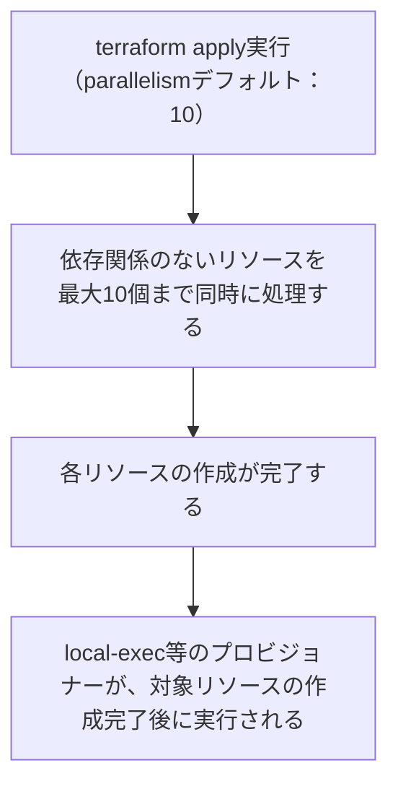
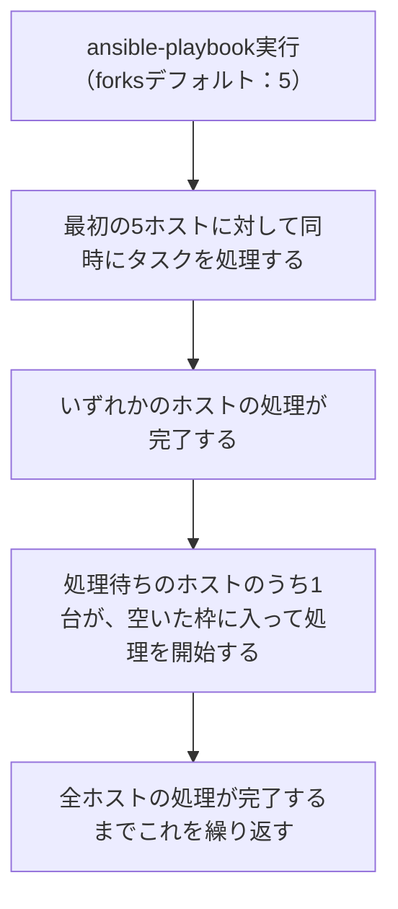
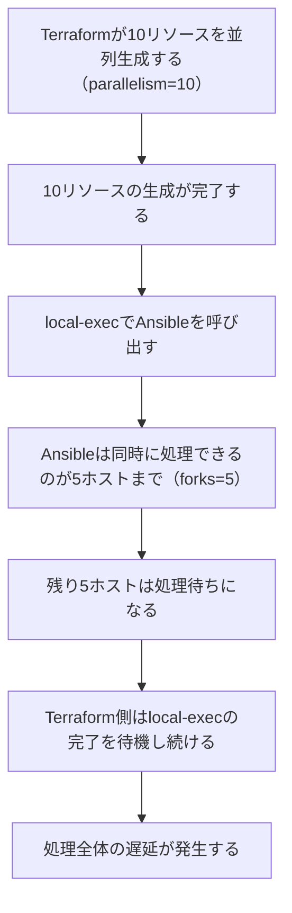

<style>
table th,
table td {
    word-break: normal;
}
table td:first-child {
    white-space: nowrap;
}
</style>


---

> **🗺️ 初めての方・シリーズの全体像を知りたい方はこちら**
> 
> シリーズ全体については、以下のまとめブログで整理しています。
> 
> → **「AnsibleとTerraformの連携が壊れる理由はライフサイクルにあった」第1部まとめブログ：環境構築・連携編で直面する9つのトラブル** **※近日公開予定**

---

## 目次

1. [はじめに](#1-はじめに)
2. [Terraformの並列処理（parallelism）の仕組み](#2-terraformの並列処理parallelismの仕組み)
3. [Ansibleのforks設定の仕組み](#3-ansibleのforks設定の仕組み)
4. [両者の並列度のズレによる遅延・競合の構造](#4-両者の並列度のズレによる遅延競合の構造)
5. [解決パターン①：-parallelismオプションによるTerraform側の並列度制御](#5-解決パターン-parallelismオプションによるterraform側の並列度制御)
6. [解決パターン②：ansible.cfgによるforks数の調整](#6-解決パターンansiblecfgによるforks数の調整)
7. [両者の並列度を合わせる設計の考え方](#7-両者の並列度を合わせる設計の考え方)
8. [まとめ](#8-まとめ)
9. [次回予告](#9-次回予告)
10. [連載一覧：「AnsibleとTerraformの連携が壊れる理由はライフサイクルにあった」](#10-連載一覧ansibleとterraformの連携が壊れる理由はライフサイクルにあった)

---

## 1. はじめに

**[第7回](https://juehara-crypto.github.io/blog/infra/ansible/ansible-terraform/ansible-terraform-part1/ansible-terraform-part1-07/)** では、実行環境とターゲットOS間のPythonバージョンの不一致による実行時エラーを扱いました。ターゲット側のPython環境が揃い、単一のホストへの接続が安定した状態になった後、次に直面するのは、複数のリソースを同時に構築しようとした際に処理が遅くなったり、詰まったりする問題です。

Terraformで複数のリソースをまとめて構築し、そのままAnsibleで構成管理を行おうとすると、次のような場面に出会うことがあります。

- リソース数を増やしただけなのに、全体の処理時間が想定より大幅に伸びる
- Terraformの`apply`は早々に終わっているはずなのに、後続のAnsible実行がなかなか進まない
- 台数の少ない検証環境では問題なく動いていた構成が、台数を増やした環境に持っていった途端に遅延や詰まりが目立つようになる

こうした場面に共通しているのは、「TerraformとAnsibleが、それぞれ独立に持っている並列度の設定」という点への意識が抜け落ちていることです。

Terraformはリソースを構築する際、依存関係のない複数のリソースを同時に処理する仕組みを持っています。一方Ansibleも、複数のホストに対してタスクを実行する際、同時に処理するホスト数を制御する仕組みを持っています。**この2つの並列度は、それぞれ別のツールが別の基準で管理している独立した設定であり、何も意識しなければ揃う保証はありません**。Terraform側が一度に多くのリソースを並列生成しても、Ansible側が同時に処理できるホスト数に上限がある以上、その上限を超えた分は待たされることになります。

この問題は、同時に構築するリソースの数が、実行環境が同時に処理できる規模に対して相対的に多くなったときに顕在化しやすくなります。小規模な検証環境では表面化しにくい一方、本番規模でリソース数が増えるほど、この並列度のズレが処理時間や安定性に影響しやすくなります。この構造自体は、Docker・VM・クラウドといった環境の実装方式を問わず共通しています。

この回では、TerraformのparallelismとAnsibleのforksという2つの並列度の仕組みをそれぞれ整理したうえで、両者がズレることでなぜ遅延・競合が起こるのかを構造として確認し、2つの調整パターンを見ていきます。

---

[↑ 目次に戻る](#目次)

---

## 2. Terraformの並列処理（parallelism）の仕組み

Terraformが複数リソースを並列に処理する仕組みを整理します。

Terraformは`apply`実行時、依存関係のないリソースを同時に処理します。この並列度は`-parallelism`オプションで制御でき、デフォルト値は10です。つまり、依存関係のないリソースが10個以下であれば、理論上すべて同時に処理対象になり得ます。

処理の流れを整理すると、以下のようになります。



ここで押さえておきたいのは、この並列度が制御しているのはあくまで**Terraform自身がリソースをAPIに対して要求する処理の同時実行数**であり、その後段でプロビジョナーが呼び出すAnsibleなど別のツールの並列度までは関与しないという点です。Terraformの並列処理は、HCLで定義されたリソース間の依存関係を解決したうえで、依存されていないリソース同士を同時に処理するだけであり、リソースの数が多くても、依存関係さえなければ、最大10個まで同時に作成が進みます。

依存関係があるリソース同士は、この並列処理の対象になりません。依存先のリソースの作成が完了してから、依存元のリソースの処理が開始されます。

並列度は、`-parallelism`オプションで明示的に指定できます。

* **実行コマンド**

```bash
terraform apply -parallelism=3
```

この場合、同時に処理されるリソースは最大3個に制限されます。この`-parallelism`の調整が、後のセクション5で扱う解決パターンの一つになります。

次のセクションでは、Ansible側の並列処理の仕組みであるforksについて整理します。

---

[↑ 目次に戻る](#目次)

---

## 3. Ansibleのforks設定の仕組み

Ansibleが複数ホストを並列に処理する仕組みを整理します。

Ansibleは`ansible-playbook`や`ansible`コマンドの実行時、インベントリに含まれる複数のホストに対してタスクを同時に処理します。この同時処理数の上限が`forks`であり、デフォルト値は5です。つまり、インベントリに何台のホストが存在していても、Ansibleが一度に処理を進めるのは最大5台までで、それを超えるホストは処理待ちになります。

処理の流れを整理すると、以下のようになります。



たとえばインベントリに8台のホストが存在する場合、forksがデフォルトの5であれば、最初の5台が同時に処理され、残り3台は最初の5台のいずれかが完了するまで待機します。台数がforks数を超えるほど、この待機の発生回数が増えます。

forks数は、`ansible.cfg`で変更できます。

- **ファイル名：`ansible.cfg`（追記部分）**

```ini
[defaults]
forks = 10
```

この場合、同時に処理されるホスト数の上限は10に引き上げられます。この`forks`の調整が、後のセクション6で扱う解決パターンの一つになります。

ここまでで、Terraformの`parallelism`とAnsibleの`forks`は、それぞれ別のツールが独自に持つ並列度の設定であることを確認しました。次のセクションでは、この2つの並列度がズレた場合に、具体的にどのような遅延・競合が発生するのかを整理します。

---

[↑ 目次に戻る](#目次)

---

## 4. 両者の並列度のズレによる遅延・競合の構造

TerraformのparallelismとAnsibleのforksが独立した設定であることから、両者の並列度がズレた場合に、どのような遅延・競合が発生しうるかを構造として整理します。

たとえば、Terraformがデフォルトの`parallelism=10`で10個のリソースを並列生成し、その完了後にlocal-exec経由でAnsibleを呼び出す構成を想定します。この場合、以下のような流れになります。



ここで起きているのは、Terraform側が「10リソース分の構築が完了した」と判断した時点と、Ansible側が「10ホスト分の処理を完了できる」時点が一致しない、という構造です。Terraformの`parallelism`は、あくまでTerraform自身がリソースを生成する処理の同時実行数を制御しているだけであり、その後段でAnsibleが何台のホストを同時に処理できるかまでは関知しません。Ansible側のforksが5である以上、10ホストのうち5ホストは、最初の5ホストの処理が完了するまで待たされることになります。

この待ちは、Ansible単体の実行時間を見ているだけでは気づきにくい点です。Ansibleの実行ログ上は、forksの上限に沿って淡々と処理が進んでいるように見えますが、Terraform側から見ると、local-execプロビジョナーの完了を待っている間、リソース数に対して不釣り合いに長い時間がかかっているように見えます。

検証環境（Docker・3コンテナ構成）では、リソース数がforksのデフォルト値（5）を下回るため、この待ちはほぼ発生せず、問題が顕在化しにくくなっています。一方、本番規模の環境でリソース数がforks数を超えるようになると、この待ちが積み重なり、処理全体の遅延として表面化しやすくなります。この構造自体は、対象がDockerコンテナであってもVMであっても変わらず、同時生成するリソース数とforksの関係だけで決まります。

次のセクションでは、この問題に対する1つ目の解決パターンとして、Terraform側の並列度を調整する方法を確認します。

---

[↑ 目次に戻る](#目次)

---

## 5. 解決パターン①：`-parallelism`オプションによるTerraform側の並列度制御

Terraform側の並列度をAnsibleのforks数に合わせて制御する構成を確認します。

`terraform apply`実行時に`-parallelism`オプションを指定することで、同時に処理するリソース数の上限を明示的に下げることができます。

- **実行コマンド**

```bash
terraform apply -parallelism=5
```

Terraformのデフォルトの並列度は10ですが、ここでAnsibleのforksのデフォルト値である5に合わせることで、Terraform側が一度に生成し終えるリソース数と、Ansible側が一度に処理できるホスト数を揃えることができます。この結果、Ansible側で処理待ちが発生する状況そのものを減らすことができます。

ただし、この方法にはトレードオフがあります。Terraform側の並列度を下げるということは、リソースの生成自体にかかる時間が延びるということでもあります。特に、依存関係のないリソースが多数存在する場合、`-parallelism`を下げるほど、Terraformの`apply`が完了するまでの時間そのものが長くなります。つまり、この解決パターンは「Ansible側の待ちを減らす代わりに、Terraform側の処理時間を犠牲にする」という調整です。

次のセクションでは、逆にAnsible側の並列度を引き上げることで、同じ問題に対処する方法を確認します。

---

[↑ 目次に戻る](#目次)

---

## 6. 解決パターン②：`ansible.cfg`によるforks数の調整

Ansible側のforks数をTerraformの並列生成数に合わせて引き上げる構成を確認します。

`ansible.cfg`の`[defaults]`セクションに`forks`を指定することで、Ansibleが同時に処理できるホスト数の上限を変更できます。

- **ファイル名：`ansible.cfg`（追記部分）**

```ini
[defaults]
forks = 10
```

デフォルトの5から10に引き上げることで、Terraformのデフォルトの並列度である10とAnsible側の同時処理数を揃えることができます。この結果、Terraform側が並列生成したリソース数に対して、Ansible側が処理待ちを発生させることなく、そのまま同時に処理を進められるようになります。

こちらもトレードオフがあります。forks数を増やすということは、Ansibleのコントロールノード側で同時に開くSSH接続やプロセスの数が増えるということです。コントロールノード側のCPU・メモリ・ファイルディスクリプタなどのリソース消費が、forks数に応じて増加します。ホスト数やコントロールノードのスペックによっては、forksを大きくしすぎるとコントロールノード側がボトルネックになる可能性があります。この、コントロールノード側のリソース枯渇そのものを扱う内容は、今回の範囲には含めません。

ここまでで、Terraform側の並列度を下げる方法（セクション5）と、Ansible側の並列度を上げる方法（セクション6）という、2つの逆方向のアプローチを確認しました。次のセクションでは、どちらの方向で調整すべきかを含めて、両者の並列度を合わせる設計の考え方を整理します。

---

[↑ 目次に戻る](#目次)

---

## 7. 両者の並列度を合わせる設計の考え方

セクション5・6で確認した2つの調整方向を踏まえ、TerraformのparallelismとAnsibleのforksを合わせる際の考え方を整理します。

|調整方向|方法|トレードオフ|
|---|---|---|
|Terraform側を下げる|`-parallelism=N`|リソース生成にかかる時間が延びる|
|Ansible側を上げる|`forks=N`|コントロールノードのリソース消費が増える|
|両者を同じ値に揃える|`-parallelism=N`かつ`forks=N`|どちらの値を基準にするかを決める必要がある|

どちらの方向で調整するかは、単純にどちらが「正解」というものではなく、以下のような観点で判断が変わります。

- 同時に構築するリソースの数が多く、Terraform側の処理時間をできるだけ短縮したい場合は、Ansible側のforksを引き上げる方向が向いています。ただしこの場合、コントロールノードのスペックが十分かどうかを事前に確認しておく必要があります
- コントロールノードのスペックに余裕がなく、forksをむやみに増やせない場合は、Terraform側の`-parallelism`を下げて歩調を合わせる方向が現実的です。この場合、リソース生成全体の時間が延びることを許容する必要があります

重要なのは、どちらの方向を選ぶにしても、「TerraformのparallelismとAnsibleのforksは、それぞれ独立した設定であり、意識して揃えない限り一致しない」という前提を踏まえたうえで、意図的に値を選ぶことです。デフォルト値のまま運用し、両者の並列度がズレていることに気づかないまま、同時構築するリソース数だけが増えていくと、セクション4で整理した遅延が徐々に顕在化していきます。

次のセクションでは、この回で整理した内容をまとめます。

---

[↑ 目次に戻る](#目次)

---

## 8. まとめ

この回で整理した内容を確認します。

- TerraformのparallelismとAnsibleのforksは、それぞれ別のツールが独立に管理している並列度の設定であり、両者は意識しない限り揃いません。ズレた場合、Ansible側で処理待ちが発生し、遅延・競合につながります。この構造は、Docker・VM・クラウドを問わずリソースを並列生成するケースに共通して該当します
- この問題は、同時に構築するリソースの数が、実行環境が同時に処理できる規模に対して相対的に多い場合に顕在化しやすくなります
- 解決の方向は大きく2つあり、`-parallelism`でTerraform側の並列度を下げる方法と、`ansible.cfg`の`forks`でAnsible側の並列度を上げる方法があります。前者は処理時間の延長、後者はコントロールノードのリソース消費増加というトレードオフをそれぞれ伴います
- TerraformのparallelismとAnsibleのforksは、リソース数・コントロールノードのスペック・許容できる処理時間に応じて、意識して揃える設計が必要です

---

[↑ 目次に戻る](#目次)

---

## 9. 次回予告

並列処理の競合の構造が整理された後、次に直面するのは、コンテナイメージごとに異なるデフォルトユーザーに対して、Ansibleから管理者権限へ昇格する際の設定ミスです。次回は、この問題を扱います。

**[次回：第9回：OS固有の初期ユーザーと管理者権限（sudo）への昇格エラー](https://juehara-crypto.github.io/blog/infra/ansible/ansible-terraform/ansible-terraform-part1/ansible-terraform-part1-09/)**

---

📑 連載の移動　**[前の記事：【Ansible×Terraform編】第7回](https://juehara-crypto.github.io/blog/infra/ansible/ansible-terraform/ansible-terraform-part1/ansible-terraform-part1-07/)　｜　[次の記事：【Ansible×Terraform編】第9回](https://juehara-crypto.github.io/blog/infra/ansible/ansible-terraform/ansible-terraform-part1/ansible-terraform-part1-09/)**

---

> **🗺️ 初めての方・シリーズの全体像を知りたい方はこちら**
> 
> シリーズ全体については、以下のまとめブログで整理しています。
> 
> → **「AnsibleとTerraformの連携が壊れる理由はライフサイクルにあった」第1部まとめブログ：環境構築・連携編で直面する9つのトラブル** **※近日公開予定**

---

[↑ 目次に戻る](#目次)

---

## 10. 連載一覧：「AnsibleとTerraformの連携が壊れる理由はライフサイクルにあった」

### 第1部：環境構築・連携編

|回数|テーマ・記事タイトル|概要|
|---|---|---|
|**[第1回](https://juehara-crypto.github.io/blog/infra/ansible/ansible-terraform/ansible-terraform-part1/ansible-terraform-part1-01/)**|AnsibleとTerraformの連携目的と設計思想の違い|リソース生成（Terraform）と構成管理（Ansible）の役割分担と、連携時における設計のアンチパターンを俯瞰。冪等性シリーズ・ドリフトシリーズとの接続を示す。|
|**[第2回](https://juehara-crypto.github.io/blog/infra/ansible/ansible-terraform/ansible-terraform-part1/ansible-terraform-part1-02/)**|Terraform完了直後のプロビジョニング失敗を防ぐSSH待機制御|TerraformのAPIレスポンスとSSHDが接続を受け付けられる状態になるまでのタイムラグによる接続失敗と解決策。VM環境（EC2・VirtualBox）でのOSブート待ち・Docker環境でのSSHD初期化待ちなど、環境を問わず発生する構造として示す。|
|**[第3回](https://juehara-crypto.github.io/blog/infra/ansible/ansible-terraform/ansible-terraform-part1/ansible-terraform-part1-03/)**|動的インベントリ生成時における出力データのパースエラー|TerraformのJSON出力とAnsibleが期待する動的インベントリのJSONスキーマの構造的な差異を整理し、生の出力をそのまま渡した際の「静かな失敗」を実機再現したうえで、変換スクリプトによる解決方法を解説する。|
|**[第4回](https://juehara-crypto.github.io/blog/infra/ansible/ansible-terraform/ansible-terraform-part1/ansible-terraform-part1-04/)**|自動生成されたSSH鍵のパーミッション設定エラー|Terraformで自動生成した秘密鍵ファイルの権限設定が不適切なため、AnsibleのSSH実行時に接続を拒否されるトラブルへの対応。|
|**[第5回](https://juehara-crypto.github.io/blog/infra/ansible/ansible-terraform/ansible-terraform-part1/ansible-terraform-part1-05/)**|仮想環境におけるIPアドレス変動対策|Terraformのリソース再生成で発生するIPアドレス変動を実機検証する。applyとAnsible実行のタイミングが分離すると、SSH接続自体は成功するのに意図しないホストへ接続する危険があることを示し、IP固定と動的インベントリという2つの解決アプローチを比較する。|
|**[第6回](https://juehara-crypto.github.io/blog/infra/ansible/ansible-terraform/ansible-terraform-part1/ansible-terraform-part1-06/)**|ネットワーク初期化完了前に発生する接続タイムアウト|ネットワーク構築完了直後にAnsibleが接続を試み、反映待ちでSSH接続がタイムアウトする問題。Dockerネットワークのブリッジ・AWSのSecurity Group・VPCルーターの伝播ラグなど、実装方式が違っても「構築完了」と「通信可能」が別タイミングである共通構造から生じることを整理し、対策を解説する。|
|**[第7回](https://juehara-crypto.github.io/blog/infra/ansible/ansible-terraform/ansible-terraform-part1/ansible-terraform-part1-07/)**|実行環境とターゲットOS間におけるPythonバージョンの不一致|ターゲットOS内のPythonバージョンと、Ansibleを実行するコントロールノード側のPythonの乖離による実行時エラーへの対応。冪等性シリーズ第7回との接続を示す。|
|**[第8回](https://juehara-crypto.github.io/blog/infra/ansible/ansible-terraform/ansible-terraform-part1/ansible-terraform-part1-08/)**|複数インスタンス同時構築時における並列処理の競合|Terraformで複数リソースを同時生成する際、Ansible側のforks制限によって処理が遅延・競合しうる問題。同時生成数が実行環境のキャパシティに対して相対的に多い場合に起こる構造的な問題として整理し、forks調整やバッチ分割の対策を解説する。|
|**[第9回](https://juehara-crypto.github.io/blog/infra/ansible/ansible-terraform/ansible-terraform-part1/ansible-terraform-part1-09/)**|OS固有の初期ユーザーと管理者権限（sudo）への昇格エラー|コンテナイメージごとに異なるデフォルトユーザーに対し、Ansibleから`become`を用いて権限昇格する際の設定ミスと対策。Docker・VM・クラウドを問わず同じ構造で発生することを示す。|
|第10回|環境構築編まとめ：自動連携のためのコードテンプレート化|第1回〜9回の課題を踏まえ、TerraformからAnsibleへ一貫して安全に処理を移譲するためのコードのテンプレート化を解説。|


---

[↑ 目次に戻る](#目次)

---


