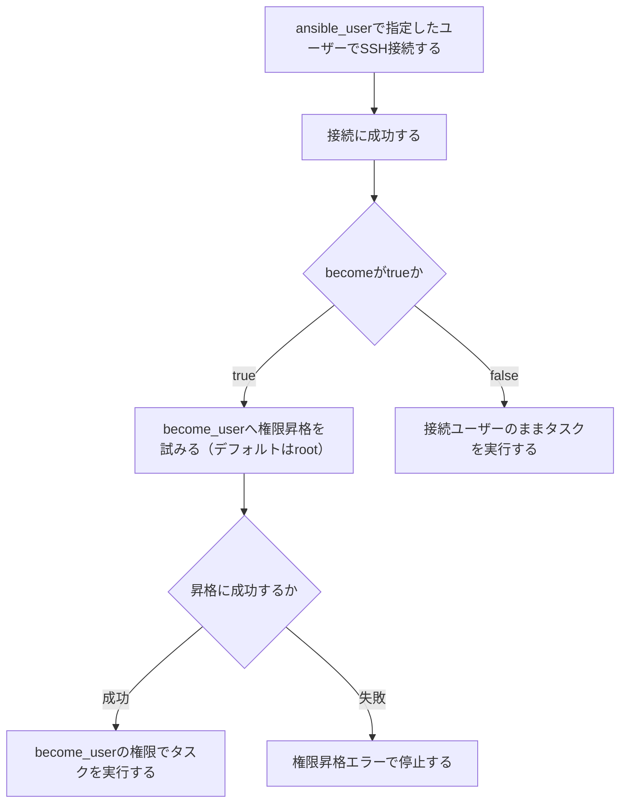

<style>
table th,
table td {
    word-break: normal;
}
table td:first-child {
    white-space: nowrap;
}
</style>


---

> **🗺️ 初めての方・シリーズの全体像を知りたい方はこちら**
> 
> シリーズ全体については、以下のまとめブログで整理しています。
> 
> → **「AnsibleとTerraformの連携が壊れる理由はライフサイクルにあった」第1部まとめブログ：環境構築・連携編で直面する9つのトラブル** **※近日公開予定**

---

## 目次

1. [はじめに](#1-はじめに)
2. [コンテナイメージごとに異なるデフォルトユーザーの構造](#2-コンテナイメージごとに異なるデフォルトユーザーの構造)
3. [ansible_user・become・become_userの関係](#3-ansible_userbecomebecome_userの関係)
4. [権限昇格失敗エラーの再現](#4-権限昇格失敗エラーの再現)
5. [解決パターン①：インベントリ・group_varsでコンテナごとにbecome設定を指定する](#5-解決パターンインベントリgroup_varsでコンテナごとにbecome設定を指定する)
6. [解決パターン②：sudoersのNOPASSWD設定をTerraformのプロビジョニングで行う](#6-解決パターンsudoersのnopasswd設定をterraformのプロビジョニングで行う)
7. [まとめ](#7-まとめ)
8. [次回予告](#8-次回予告)
9. [連載一覧：「AnsibleとTerraformの連携が壊れる理由はライフサイクルにあった」](#9-連載一覧ansibleとterraformの連携が壊れる理由はライフサイクルにあった)

---

## 1. はじめに

**[第8回](https://juehara-crypto.github.io/blog/infra/ansible/ansible-terraform/ansible-terraform-part1/ansible-terraform-part1-08/)** では、TerraformのparallelismとAnsibleのforksという、独立した2つの並列度の設定がズレることで発生する遅延・競合の構造を扱いました。複数のリソースへの接続と並列処理が安定した状態になった後、次に直面するのは、接続そのものはできているのに、管理者権限への昇格だけが失敗するという問題です。

Ansibleでbecomeを使った権限昇格を設定していると、次のような場面に出会うことがあります。

- SSH接続は問題なく成功しているのに、sudoを伴うタスクだけが失敗する
- 同じPlaybookなのに、あるサーバーでは正常にbecomeが通り、別のサーバーでは通らない
- エラーメッセージにパスワードを要求する文言が出るが、そのユーザーのパスワードを設定した覚えがない

「コンテナやVMを作ったら、決まったユーザーでSSH接続してsudoすればいい」という感覚で設定を進めると、こうした場面に行き当たります。この感覚が崩れる背景には、TerraformがプロビジョニングするコンテナイメージやAMIには、それぞれ異なるデフォルトユーザーが設定されているという構造があります。あるイメージでは`ubuntu`ユーザーが用意されていて、別のイメージでは`root`しか存在しない、といった違いは珍しくありません。この違いを意識せずにAnsible側の接続ユーザーや昇格設定を固定してしまうと、イメージによってbecomeが通ったり通らなかったりする状態になります。

この問題は、Docker環境に限った話ではありません。AWSであればAMIごとのデフォルトユーザー(ubuntu・ec2-userなど)、GCPであればイメージファミリーごとのデフォルトユーザー(debianなど)が、それぞれ同じ役割を果たします。「土台となるイメージによって、最初から使えるユーザーが異なる」という構造は、環境の実装方式を問わず共通しています。

この回では、Terraformがプロビジョニングするイメージごとにデフォルトユーザーが異なる構造を整理したうえで、Ansibleの`ansible_user`・`become`・`become_user`の関係を確認し、実際に発生する権限昇格エラーの読み方と、2つの解決パターンを見ていきます。検証環境では、3台のコンテナにそれぞれ異なるデフォルトユーザーを設定し、この問題を実機で再現します。

---

[↑ 目次に戻る](#目次)

---

## 2. コンテナイメージごとに異なるデフォルトユーザーの構造

Terraformがプロビジョニングするコンテナイメージには、ベースイメージごとに異なるデフォルトユーザーが設定されています。この構造を整理します。

Dockerのベースイメージは、イメージのビルド時点でどのユーザーを標準として用意するかが、イメージごとに異なります。同じ「Linuxコンテナ」であっても、ベースにしたディストリビューションやイメージの作り方次第で、最初からログイン可能なユーザーが変わります。

代表的な例を整理すると、以下のようになります。

|環境|イメージ・AMI|デフォルトユーザー|
|---|---|---|
|Docker|`ubuntu:22.04`（素のベースイメージ）|`root`（別途ユーザーを作成しない限り）|
|Docker|Dockerfileで独自にユーザーを作成したイメージ|作成時に指定した任意のユーザー名|
|AWS|Ubuntu AMI|`ubuntu`|
|AWS|Amazon Linux 2 AMI|`ec2-user`|
|GCP|Debianベースのイメージファミリー|`debian`|

Terraformは、このイメージやAMIを「どれを使うか」という単位で指定しますが、そのイメージの中にどのユーザーが用意されているかまでは、Terraformのリソース定義の対象外です。第7回でPythonバージョンについて確認したのと同じように、「土台となるイメージの中身」はTerraformの管理範囲の外にあります。

このため、Terraformが参照するイメージを切り替えると、Ansible側から見た「接続すべきユーザー」も切り替える必要が生じます。イメージAでは`ubuntu`ユーザーで接続できていたのに、イメージBに差し替えた途端、`ubuntu`というユーザー自体が存在せず接続できない、という状況が起こり得ます。

検証環境では、target-node1〜target-node3のそれぞれに異なるデフォルトユーザーを設定し、この「イメージによってユーザーが異なる」状況を再現します。3台それぞれにどのユーザーを割り当てるか、また既存の`main.tf`・`Dockerfile`にどのような変更が必要になるかは、次のセクションでAnsible側の設定項目を整理したうえで、実機検証に入る段階で確認します。

---

[↑ 目次に戻る](#目次)

---

## 3. ansible_user・become・become_userの関係

Ansibleが権限昇格を行う際に関わる3つの設定項目、`ansible_user`・`become`・`become_user`の役割と関係を整理します。

それぞれの役割は、以下のように整理できます。

|設定項目|役割|
|---|---|
|`ansible_user`|SSHでターゲットに接続する際に使用するユーザー|
|`become`|接続後に権限昇格を行うかどうかを制御するフラグ(`true`/`false`)|
|`become_user`|昇格先のユーザー(未指定の場合のデフォルトは`root`)|

この3つは、それぞれ別の段階を制御しています。`ansible_user`は「SSH接続の入口」を決め、`become`は「入口に入った後、権限を上げるかどうか」を決め、`become_user`は「権限を上げた先が誰になるか」を決めます。この3段階が正しく噛み合って初めて、Ansibleは「デフォルトユーザーでログインし、そこから管理者権限のタスクを実行する」という一連の流れを完了できます。

処理の流れを整理すると、以下のようになります。



この3段階のうち、どこか1つでも設定を誤ると、エラーの現れ方が変わります。設定ミスが起きやすいパターンを整理すると、以下のようになります。

**① `ansible_user`とコンテナのデフォルトユーザーが一致していない**

Terraformがプロビジョニングしたコンテナのデフォルトユーザーが`ubuntu`であるのに、`ansible_user`に`root`や別のユーザー名を指定した場合、SSH接続そのものが失敗します。これは「SSH接続する」の段階で止まるパターンで、`become`以前の問題です。

**② `become`をtrueにしているが、sudoers側に設定がない**

`ansible_user`でのSSH接続自体は成功するものの、接続先のユーザーがsudoersに登録されていない、あるいはNOPASSWDが設定されていないため、`become`実行時にパスワードプロンプトが発生し、非対話実行では処理が停止します。「権限昇格を試みる」から「昇格に成功するか」にかけての段階で、昇格に失敗するパターンです。

**③ `become_user`を誤って指定している**

昇格先のユーザー名を`root`ではなく存在しない別のユーザー名にしてしまった場合など、`become_user`自体の指定ミスによって昇格が失敗します。これも「権限昇格を試みる」から「昇格に成功するか」にかけての段階で発生しますが、原因はsudoers側ではなく指定内容そのものにあります。

3つのパターンはいずれも「権限昇格に関するエラー」として現れますが、①はSSH接続の段階、②・③はbecomeの段階と、実際にエラーが発生している場所が異なります。次のセクションでは、これらのうち②のパターンを中心に、検証環境で実際にエラーを再現します。

---

[↑ 目次に戻る](#目次)

---

## 4. 権限昇格失敗エラーの再現

第2セクションでは、ディストリビューションの違いとイメージの作り方の違いの両方が、デフォルトユーザーの差を生む要因になることを整理しました。本検証環境では、ディストリビューションを揃えたまま、Dockerfileでのユーザー作成方法の違いによってデフォルトユーザーが異なる状況を再現することに注力します。target-node1は既存の`ansible`ユーザー、target-node2・target-node3は新しく`deploy`ユーザーを作成したイメージに切り替え、そのうえでtarget-node3のみsudoersのNOPASSWD設定を持たない状態にしています。この状態で、第3セクションで整理した①・②のパターンをそれぞれ実機で再現します。

### ■ 検証内容

**【検証の準備】**

target-node2・target-node3を、`deploy`ユーザーを作成した別イメージに切り替えます。`docker_container.targets`の`image`属性と`upload`属性を変更します。

* **ファイル名：`main.tf`（追記部分）**

```hcl
resource "docker_image" "ansible_target_deploy_nopasswd" {
  name = "ansible-target:deploy-nopasswd"
  build {
    context    = "."
    dockerfile = "Dockerfile.deploy_nopasswd"
  }
}

resource "docker_image" "ansible_target_deploy_passwd" {
  name = "ansible-target:deploy-passwd"
  build {
    context    = "."
    dockerfile = "Dockerfile.deploy_passwd"
  }
}
```

`Dockerfile.deploy_nopasswd`はtarget-node2用で、`deploy`ユーザーを作成したうえでsudoersに`NOPASSWD:ALL`を設定しています。`Dockerfile.deploy_passwd`はtarget-node3用で、同じく`deploy`ユーザーを作成しますが、sudoersへの設定は行いません。

* **ファイル名：`main.tf`（変更前）**

```hcl
resource "docker_container" "targets" {
  for_each = local.target_nodes
  name  = each.key
  image = docker_image.ansible_target.image_id
  networks_advanced {
    name = docker_network.lab_net.name
  }
  ports {
    internal = 22
    external = each.value
  }
  upload {
    file    = "/home/ansible/.ssh/authorized_keys"
    content = "${file("${path.module}/id_ed25519.pub")}\n${tls_private_key.generated.public_key_openssh}"
  }
}
```

* **ファイル名：`main.tf`（変更後）**

```hcl
resource "docker_container" "targets" {
  for_each = local.target_nodes
  name  = each.key
  image = (
    each.key == "target-node2" ? docker_image.ansible_target_deploy_nopasswd.image_id :
    each.key == "target-node3" ? docker_image.ansible_target_deploy_passwd.image_id :
    docker_image.ansible_target.image_id
  )
  networks_advanced {
    name = docker_network.lab_net.name
  }
  ports {
    internal = 22
    external = each.value
  }
  upload {
    file = (
      each.key == "target-node2" || each.key == "target-node3" ?
      "/home/deploy/.ssh/authorized_keys" :
      "/home/ansible/.ssh/authorized_keys"
    )
    content = "${file("${path.module}/id_ed25519.pub")}\n${tls_private_key.generated.public_key_openssh}"
  }
}
```

`image`属性と`upload`属性を、`each.key`に応じてtarget-node2・target-node3のみ異なるイメージ・異なるSSH鍵配置先を参照するよう変更しています。target-node1は既存の`ansible`ユーザーのまま変更していません。

この変更を反映するため、`terraform apply`を実行します。`docker_container.targets`はmap全体に対する変更となるため、3台すべてが再生成されます。

* **実行コマンド**

```plaintext
terraform apply
```

（確認プロンプトには`yes`と入力）

▼実行結果（※ログが長いので、Outputsのみ抜粋します）

```plaintext
Apply complete! Resources: 6 added, 0 changed, 1 destroyed.

Outputs:

target_nodes_ips = {
  "target-node1" = "172.20.0.3"
  "target-node2" = "172.20.0.4"
  "target-node3" = "172.20.0.2"
}
```

各コンテナのユーザー作成とsudoers設定を確認します。

- **実行コマンド**

```plaintext
docker exec target-node1 su - ansible -c whoami
docker exec target-node2 su - deploy -c whoami
docker exec target-node3 su - deploy -c whoami
```

▼実行結果

```plaintext
ansible
deploy
deploy
```

target-node2のsudoers設定を確認します。

* **実行コマンド**

```plaintext
docker exec target-node2 cat /etc/sudoers
```

▼実行結果（※ログが長いので、末尾のみ抜粋します）

```plaintext
@includedir /etc/sudoers.d
deploy ALL=(ALL) NOPASSWD:ALL
```

target-node3では、この`deploy ALL=(ALL) NOPASSWD:ALL`に相当する行が存在しないことを確認済みです。3台とも意図した通りのユーザー・sudoers構成になりました。

**① `ansible_user`不一致によるSSH接続失敗の再現**

3台すべてに、target-node1の実際のユーザーである`ansible`を統一して指定したインベントリで、`ping`モジュールを実行します。

* **ファイル名：`inventory.ini`**

```ini
[target_nodes]
target-node1 ansible_host=172.20.0.3 ansible_user=ansible
target-node2 ansible_host=172.20.0.4 ansible_user=ansible
target-node3 ansible_host=172.20.0.2 ansible_user=ansible
```

* **実行コマンド**

```plaintext
ansible all -i inventory.ini -m ping
```

▼実行結果

```plaintext
target-node3 | UNREACHABLE! => {
    "changed": false,
    "msg": "Failed to connect to the host via ssh: Warning: Permanently added '172.20.0.2' (ED25519) to the list of known hosts.\r\nansible@172.20.0.2: Permission denied (publickey,password).",
    "unreachable": true
}
target-node2 | UNREACHABLE! => {
    "changed": false,
    "msg": "Failed to connect to the host via ssh: Warning: Permanently added '172.20.0.4' (ED25519) to the list of known hosts.\r\nansible@172.20.0.4: Permission denied (publickey,password).",
    "unreachable": true
}
[WARNING]: Platform linux on host target-node1 is using the discovered Python interpreter at /usr/bin/python3.10, but future installation of another Python interpreter could change the
meaning of that path. See https://docs.ansible.com/ansible-core/2.17/reference_appendices/interpreter_discovery.html for more information.
target-node1 | SUCCESS => {
    "ansible_facts": {
        "discovered_interpreter_python": "/usr/bin/python3.10"
    },
    "changed": false,
    "ping": "pong"
}
```

target-node1は`ansible`ユーザーが実在するため`SUCCESS`になりますが、target-node2・target-node3は実際には`deploy`ユーザーしか存在しないため、`ansible`ユーザーでのSSH接続自体が`Permission denied (publickey,password)`で拒否されています。

**② sudoers未設定によるbecome失敗の再現**

`ansible_user`を各コンテナの実際のユーザーに正しく合わせたうえで、`become`を有効にしたコマンドを実行します。

* **ファイル名：`inventory.ini`（更新後）**

```ini
[target_nodes]
target-node1 ansible_host=172.20.0.3 ansible_user=ansible
target-node2 ansible_host=172.20.0.4 ansible_user=deploy
target-node3 ansible_host=172.20.0.2 ansible_user=deploy

[target_nodes:vars]
become=true
become_user=root
```

* **実行コマンド**

```plaintext
ansible all -i inventory.ini -m command -a "whoami" -b
```

▼実行結果

```plaintext
[WARNING]: Found variable using reserved name: become
[WARNING]: Found variable using reserved name: become_user
target-node3 | FAILED | rc=-1 >>
Missing sudo password
[WARNING]: Platform linux on host target-node1 is using the discovered Python interpreter at /usr/bin/python3.10, but future installation of another Python interpreter could change the
meaning of that path. See https://docs.ansible.com/ansible-core/2.17/reference_appendices/interpreter_discovery.html for more information.
target-node1 | CHANGED | rc=0 >>
root
[WARNING]: Platform linux on host target-node2 is using the discovered Python interpreter at /usr/bin/python3.10, but future installation of another Python interpreter could change the
meaning of that path. See https://docs.ansible.com/ansible-core/2.17/reference_appendices/interpreter_discovery.html for more information.
target-node2 | CHANGED | rc=0 >>
root
```

`ansible_user`が正しく指定されたことで、3台ともSSH接続自体は成功しています。しかしtarget-node3では、`become`による権限昇格の段階で`Missing sudo password`が発生し失敗しています。target-node2は同じ`deploy`ユーザーでありながら、sudoersにNOPASSWDが設定されているため、`whoami`が`root`として実行され成功しています。

### ■ 結果

2つの検証から、権限昇格に関わるエラーが異なる段階で発生することが確認できました。

①の検証では、`ansible_user`にコンテナの実際のユーザーと異なる値を指定したことで、SSH接続そのものが`Permission denied`で拒否されました。これは第3セクションで整理した「①`ansible_user`とコンテナのデフォルトユーザーが一致していない」パターンにあたり、`become`の設定以前の問題です。

②の検証では、`ansible_user`を正しく合わせたことでSSH接続は成功しましたが、target-node3のみ`become`実行時に`Missing sudo password`で失敗しました。これは第3セクションで整理した「②`become`をtrueにしているがsudoersに設定がない」パターンにあたります。target-node2は同じ`deploy`ユーザーでありながらsudoersにNOPASSWDが設定されているため成功しており、接続ユーザーが同じであっても、sudoers側の設定次第で結果が変わることが分かります。

なお、`[WARNING]: Found variable using reserved name: become` / `become_user`という警告も出ています。これは、`[target_nodes:vars]`で`become`・`become_user`という変数名をそのまま使うと、Ansibleの予約変数と紛らわしいという警告であり、動作自体には影響していません。正式には`ansible_become`・`ansible_become_user`という接頭辞付きの変数名を使うのが正しい書き方です。次のセクションでは、この正しい書き方も含めて、インベントリでの設定方法を整理します。

---

[↑ 目次に戻る](#目次)

---

## 5. 解決パターン①：インベントリ・group_varsでコンテナごとにbecome設定を指定する

セクション4で確認した通り、`ansible_user`をコンテナの実際のユーザーに正しく合わせることで、SSH接続自体の失敗は解消できます。ここでは、複数コンテナに異なるユーザー・become設定をインベントリ・group_varsで指定する構成を整理します。

### ■ 検証内容

target-node1は`ansible`ユーザー、target-node2・target-node3は`deploy`ユーザーという構成に対し、インベントリでコンテナごとに正しい`ansible_user`を指定したうえで、`become`関連の設定を正式な変数名で指定します。

セクション4の②の検証では、`[target_nodes:vars]`に`become`・`become_user`という変数名をそのまま使ったところ、`Found variable using reserved name`という警告が出ていました。これは、Ansibleが接続・実行に関わる変数には`ansible_`という接頭辞を付けることを前提としているためです。正式には、以下のように`ansible_become`・`ansible_become_user`という接頭辞付きの変数名を使います。

- **ファイル名：`inventory.ini`**

```ini
[target_nodes]
target-node1 ansible_host=172.20.0.3 ansible_user=ansible
target-node2 ansible_host=172.20.0.4 ansible_user=deploy
target-node3 ansible_host=172.20.0.2 ansible_user=deploy

[target_nodes:vars]
ansible_become=true
ansible_become_user=root
```

- **実行コマンド**

```
ansible all -i inventory.ini -m command -a "whoami" -b
```

▼実行結果

```
target-node3 | FAILED | rc=-1 >>
Missing sudo password
[WARNING]: Platform linux on host target-node2 is using the discovered Python interpreter at /usr/bin/python3.10, but future installation of another Python interpreter could change the
meaning of that path. See https://docs.ansible.com/ansible-core/2.17/reference_appendices/interpreter_discovery.html for more information.
target-node2 | CHANGED | rc=0 >>
root
[WARNING]: Platform linux on host target-node1 is using the discovered Python interpreter at /usr/bin/python3.10, but future installation of another Python interpreter could change the
meaning of that path. See https://docs.ansible.com/ansible-core/2.17/reference_appendices/interpreter_discovery.html for more information.
target-node1 | CHANGED | rc=0 >>
root
```

セクション4の②で出ていた`Found variable using reserved name`の警告が、この書き方では出ていません。target-node1・target-node2は`whoami`が`root`として実行され成功していますが、target-node3は引き続き`Missing sudo password`で失敗しています。これは、`ansible_user`とbecomeの設定が正しく指定されていても、target-node3にはsudoersのNOPASSWD設定自体が存在しないため、この設定だけでは解決しないことを示しています。

### ■ 結果

`ansible_user`をコンテナごとの実際のユーザーに合わせ、`ansible_become`・`ansible_become_user`を正式な変数名で指定することで、target-node1・target-node2は正しくbecomeが機能するようになりました。一方target-node3は、sudoers側にNOPASSWD設定がないため、この対応だけでは解決しません。

コンテナ数が多い場合は、インベントリファイルに直接書く代わりに、`group_vars`でグループ単位の設定をまとめる書き方もできます。`[target_nodes:vars]`に書いた内容は、`group_vars/target_nodes.yml`というファイルに切り出しても同じ意味を持ちます。

- **ファイル名：`group_vars/target_nodes.yml`**

```yaml
ansible_become: true
ansible_become_user: root
```

この書き方であれば、インベントリファイル自体はホストの接続情報(`ansible_host`・`ansible_user`)のみに絞り、become関連の設定はgroup_vars側にまとめることができます。設定内容自体は`[target_nodes:vars]`と同じであるため、動作結果はここまでの検証結果と変わりません。

target-node3のsudoers未設定という問題自体は、インベントリ側の設定では解決できません。次のセクションでは、Terraformのプロビジョニングの段階でこの問題を解決する方法を確認します。

---

[↑ 目次に戻る](#目次)

---

## 6. 解決パターン②：sudoersのNOPASSWD設定をTerraformのプロビジョニングで行う

セクション5では、インベントリ側で`ansible_user`・`ansible_become`を正しく指定しても、target-node3のsudoers未設定という問題自体は解決しないことを確認しました。ここでは、Terraform側が参照するイメージ定義そのものにNOPASSWD設定を組み込むことで、この問題を解決します。

### ■ 検証内容

target-node3が参照している`Dockerfile.deploy_passwd`に、sudoersへのNOPASSWD設定を追記します。

- **ファイル名：`Dockerfile.deploy_passwd`（変更前）**

```dockerfile
RUN useradd -m -s /bin/bash deploy && \
    echo 'deploy:deploy' | chpasswd
```

- **ファイル名：`Dockerfile.deploy_passwd`（変更後）**

```dockerfile
RUN useradd -m -s /bin/bash deploy && \
    echo 'deploy:deploy' | chpasswd && \
    echo 'deploy ALL=(ALL) NOPASSWD:ALL' >> /etc/sudoers
```

この変更を反映するため、`terraform apply`を実行します。

- **実行コマンド**

```
terraform apply
```

（確認プロンプトには`yes`と入力）

▼実行結果（※ログが長いので、Outputsのみ抜粋します）

```
Apply complete! Resources: 4 added, 0 changed, 3 destroyed.

Outputs:

target_nodes_ips = {
  "target-node1" = "172.20.0.3"
  "target-node2" = "172.20.0.4"
  "target-node3" = "172.20.0.2"
}
```

`terraform apply`は正常に完了しましたが、この時点でtarget-node3のsudoers設定を確認すると、変更前の内容のままでした。

- **実行コマンド**

```
docker exec target-node3 cat /etc/sudoers
```

▼実行結果（※ログが長いので、末尾のみ抜粋します）

```
@includedir /etc/sudoers.d
```

`deploy ALL=(ALL) NOPASSWD:ALL`の行が反映されていません。これは、Terraformの`docker_image`リソースの挙動によるものです。`build`ブロックの`dockerfile`属性(参照するファイル名)自体は変更していないため、Terraformから見るとリソース定義に差分がなく、Dockerfileの中身が変わったこと自体を検知できません。この結果、`terraform apply`は正常に完了しても、実際にはイメージの再ビルドが行われていませんでした。

イメージの再ビルドを明示的に強制するには、`-replace`オプションで対象のリソースを指定します。

- **実行コマンド**

```
terraform apply -replace="docker_image.ansible_target_deploy_passwd"
```

（確認プロンプトには`yes`と入力）

▼実行結果（※ログが長いので、該当箇所のみ抜粋します）

```
  # docker_image.ansible_target_deploy_passwd will be replaced, as requested
-/+ resource "docker_image" "ansible_target_deploy_passwd" {
      ~ id          = "sha256:9de88aeabcdd5d790674c523eac6c421a0d6b04ad454e1e2841074265429643cansible-target:deploy-passwd" -> (known after apply)
      ~ image_id    = "sha256:9de88aeabcdd5d790674c523eac6c421a0d6b04ad454e1e2841074265429643c" -> (known after apply)
        name        = "ansible-target:deploy-passwd"
      ~ repo_digest = "ansible-target@sha256:9de88aeabcdd5d790674c523eac6c421a0d6b04ad454e1e2841074265429643c" -> (known after apply)
    }

Apply complete! Resources: 5 added, 0 changed, 5 destroyed.

Outputs:

target_nodes_ips = {
  "target-node1" = "172.20.0.2"
  "target-node2" = "172.20.0.4"
  "target-node3" = "172.20.0.3"
}
```

再度sudoers設定を確認します。

- **実行コマンド**

```
docker exec target-node3 cat /etc/sudoers
```

▼実行結果（※ログが長いので、末尾のみ抜粋します）

```
@includedir /etc/sudoers.d
deploy ALL=(ALL) NOPASSWD:ALL
```

今度は`deploy ALL=(ALL) NOPASSWD:ALL`が反映されています。最後に、Ansibleからbecomeが正常に成功することを確認します。

- **ファイル名：`inventory.ini`（IPアドレス更新後）**

```ini
[target_nodes]
target-node1 ansible_host=172.20.0.2 ansible_user=ansible
target-node2 ansible_host=172.20.0.4 ansible_user=deploy
target-node3 ansible_host=172.20.0.3 ansible_user=deploy

[target_nodes:vars]
ansible_become=true
ansible_become_user=root
```

- **実行コマンド**

```
ansible all -i inventory.ini -m command -a "whoami" -b
```

▼実行結果

```
[WARNING]: Platform linux on host target-node3 is using the discovered Python interpreter at /usr/bin/python3.10, but future installation of another Python interpreter could change the
meaning of that path. See https://docs.ansible.com/ansible-core/2.17/reference_appendices/interpreter_discovery.html for more information.
target-node3 | CHANGED | rc=0 >>
root
[WARNING]: Platform linux on host target-node2 is using the discovered Python interpreter at /usr/bin/python3.10, but future installation of another Python interpreter could change the
meaning of that path. See https://docs.ansible.com/ansible-core/2.17/reference_appendices/interpreter_discovery.html for more information.
target-node2 | CHANGED | rc=0 >>
root
[WARNING]: Platform linux on host target-node1 is using the discovered Python interpreter at /usr/bin/python3.10, but future installation of another Python interpreter could change the
meaning of that path. See https://docs.ansible.com/ansible-core/2.17/reference_appendices/interpreter_discovery.html for more information.
target-node1 | CHANGED | rc=0 >>
root
```

3台とも`whoami`が`root`で成功しました。target-node3も含めて`become`が正常に機能しています。

### ■ 結果

Dockerfileにsudoers設定を追記しただけでは、`terraform apply`を実行してもイメージが自動的に再ビルドされないことが分かりました。Terraformの`docker_image`リソースは、`dockerfile`属性(参照するファイル名)自体に変更がない限り、そのファイルの中身がどう変わったかまでは追跡しません。この構造は、第5部で扱うTerraformのState管理の話とも関わりますが、ここでは「Dockerfileの中身を変えただけでは、Terraform側は変更を検知しない」という一点だけを押さえておきます。

`-replace`オプションで明示的に再ビルドを強制することで、sudoers設定は意図通り反映され、target-node3でもbecomeが成功するようになりました。

セクション5との使い分けを整理します。

|手法|解決する問題|向いている場面|
|---|---|---|
|インベントリ・group_varsでコンテナごとに指定|`ansible_user`とデフォルトユーザーの不一致|コンテナごとにデフォルトユーザーが異なる場合|
|Terraformプロビジョニング(Dockerfile)でNOPASSWD設定|sudoersが未設定であることによるbecomeの失敗|そもそもターゲット側にsudo実行の許可自体が存在しない場合|

セクション5の対応は、Ansible側の設定を正しく合わせる手段であるのに対し、セクション6の対応は、ターゲット側にsudo実行の許可そのものを用意する手段です。今回のtarget-node3のように、sudoers設定自体が存在しない場合は、Ansible側の設定をいくら調整しても解決せず、ターゲット側の状態を変える必要があります。

---

[↑ 目次に戻る](#目次)

---

## 7. まとめ

この回で整理した内容を確認します。

* Terraformがプロビジョニングするコンテナイメージには、ベースイメージやDockerfileでのユーザー作成方法によって異なるデフォルトユーザーが設定されています。この構造はTerraformの管理範囲の外にあり、Docker・VM・クラウドを問わず共通しています
* Ansibleの`ansible_user`・`become`・`become_user`は、それぞれSSH接続・権限昇格の可否・昇格先という異なる段階を制御しており、どの段階で設定を誤るかによってエラーの現れ方が変わります
* 実機検証では、`ansible_user`をコンテナの実際のユーザーと異なる値に指定したことでSSH接続自体が失敗するパターンと、正しいユーザーで接続できてもsudoers未設定のためbecomeが失敗するパターンの両方を確認しました
* インベントリ・group_varsで`ansible_user`・`ansible_become`・`ansible_become_user`を正しく指定することで、Ansible側の設定に起因するエラーは解決します。ただし、ターゲット側にsudo実行の許可自体が存在しない場合は、この対応だけでは解決しません
* ターゲット側にsudo実行の許可を用意するには、Terraformが参照するDockerfile側にNOPASSWD設定を組み込む必要があります。ただし、Dockerfileの中身を変更しただけではTerraformがそれを検知して再ビルドするとは限らず、`-replace`オプションなどで明示的に再ビルドを強制する必要がある場合があります
* インベントリ側での設定と、Terraformプロビジョニングでの設定は、解決する問題のレイヤーが異なるため、状況に応じて組み合わせて使う必要があります

---

[↑ 目次に戻る](#目次)

---

## 8. 次回予告

第1部(第1〜9回)では、TerraformとAnsibleを連携させる際に、環境構築・初回接続の段階で直面する個別のトラブルを扱ってきました。次回は、これらの課題を踏まえ、TerraformからAnsibleへ一貫して安全に処理を移譲するためのコードのテンプレート化を扱います。

**次回：第10回：環境構築編まとめ：自動連携のためのコードテンプレート化**

---

📑 連載の移動　**[前の記事：【Ansible×Terraform編】第8回](https://juehara-crypto.github.io/blog/infra/ansible/ansible-terraform/ansible-terraform-part1/ansible-terraform-part1-08/)　｜　次の記事：【Ansible×Terraform編】第10回**

---

> **🗺️ 初めての方・シリーズの全体像を知りたい方はこちら**
> 
> シリーズ全体については、以下のまとめブログで整理しています。
> 
> → **「AnsibleとTerraformの連携が壊れる理由はライフサイクルにあった」第1部まとめブログ：環境構築・連携編で直面する9つのトラブル** **※近日公開予定**

---

[↑ 目次に戻る](#目次)

---

## 9. 連載一覧：「AnsibleとTerraformの連携が壊れる理由はライフサイクルにあった」

### 第1部：環境構築・連携編

|回数|テーマ・記事タイトル|概要|
|---|---|---|
|**[第1回](https://juehara-crypto.github.io/blog/infra/ansible/ansible-terraform/ansible-terraform-part1/ansible-terraform-part1-01/)**|AnsibleとTerraformの連携目的と設計思想の違い|リソース生成（Terraform）と構成管理（Ansible）の役割分担と、連携時における設計のアンチパターンを俯瞰。冪等性シリーズ・ドリフトシリーズとの接続を示す。|
|**[第2回](https://juehara-crypto.github.io/blog/infra/ansible/ansible-terraform/ansible-terraform-part1/ansible-terraform-part1-02/)**|Terraform完了直後のプロビジョニング失敗を防ぐSSH待機制御|TerraformのAPIレスポンスとSSHDが接続を受け付けられる状態になるまでのタイムラグによる接続失敗と解決策。VM環境（EC2・VirtualBox）でのOSブート待ち・Docker環境でのSSHD初期化待ちなど、環境を問わず発生する構造として示す。|
|**[第3回](https://juehara-crypto.github.io/blog/infra/ansible/ansible-terraform/ansible-terraform-part1/ansible-terraform-part1-03/)**|動的インベントリ生成時における出力データのパースエラー|TerraformのJSON出力とAnsibleが期待する動的インベントリのJSONスキーマの構造的な差異を整理し、生の出力をそのまま渡した際の「静かな失敗」を実機再現したうえで、変換スクリプトによる解決方法を解説する。|
|**[第4回](https://juehara-crypto.github.io/blog/infra/ansible/ansible-terraform/ansible-terraform-part1/ansible-terraform-part1-04/)**|自動生成されたSSH鍵のパーミッション設定エラー|Terraformで自動生成した秘密鍵ファイルの権限設定が不適切なため、AnsibleのSSH実行時に接続を拒否されるトラブルへの対応。|
|**[第5回](https://juehara-crypto.github.io/blog/infra/ansible/ansible-terraform/ansible-terraform-part1/ansible-terraform-part1-05/)**|仮想環境におけるIPアドレス変動対策|Terraformのリソース再生成で発生するIPアドレス変動を実機検証する。applyとAnsible実行のタイミングが分離すると、SSH接続自体は成功するのに意図しないホストへ接続する危険があることを示し、IP固定と動的インベントリという2つの解決アプローチを比較する。|
|**[第6回](https://juehara-crypto.github.io/blog/infra/ansible/ansible-terraform/ansible-terraform-part1/ansible-terraform-part1-06/)**|ネットワーク初期化完了前に発生する接続タイムアウト|ネットワーク構築完了直後にAnsibleが接続を試み、反映待ちでSSH接続がタイムアウトする問題。Dockerネットワークのブリッジ・AWSのSecurity Group・VPCルーターの伝播ラグなど、実装方式が違っても「構築完了」と「通信可能」が別タイミングである共通構造から生じることを整理し、対策を解説する。|
|**[第7回](https://juehara-crypto.github.io/blog/infra/ansible/ansible-terraform/ansible-terraform-part1/ansible-terraform-part1-07/)**|実行環境とターゲットOS間におけるPythonバージョンの不一致|ターゲットOS内のPythonバージョンと、Ansibleを実行するコントロールノード側のPythonの乖離による実行時エラーへの対応。冪等性シリーズ第7回との接続を示す。|
|**[第8回](https://juehara-crypto.github.io/blog/infra/ansible/ansible-terraform/ansible-terraform-part1/ansible-terraform-part1-08/)**|複数インスタンス同時構築時における並列処理の競合|Terraformで複数リソースを同時生成する際、Ansible側のforks制限によって処理が遅延・競合しうる問題。同時生成数が実行環境のキャパシティに対して相対的に多い場合に起こる構造的な問題として整理し、forks調整やバッチ分割の対策を解説する。|
|**[第9回](https://juehara-crypto.github.io/blog/infra/ansible/ansible-terraform/ansible-terraform-part1/ansible-terraform-part1-09/)**|OS固有の初期ユーザーと管理者権限（sudo）への昇格エラー|コンテナイメージごとに異なるデフォルトユーザーに対し、Ansibleから`become`を用いて権限昇格する際の設定ミスと対策。Docker・VM・クラウドを問わず同じ構造で発生することを示す。|
|第10回|環境構築編まとめ：自動連携のためのコードテンプレート化|第1回〜9回の課題を踏まえ、TerraformからAnsibleへ一貫して安全に処理を移譲するためのコードのテンプレート化を解説。|
---

[↑ 目次に戻る](#目次)

---


