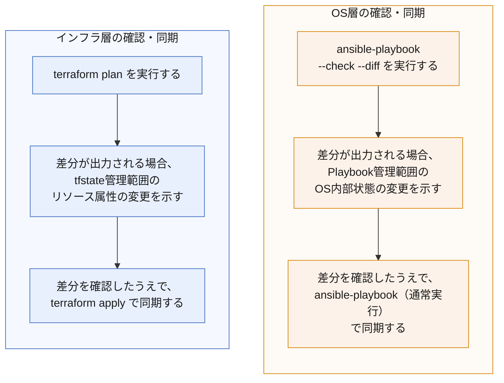

<style>
table th,
table td {
    word-break: normal;
}
table td:first-child {
    white-space: nowrap;
}
</style>


> **🗺️ 初めての方・シリーズの全体像を知りたい方はこちら**
>
> シリーズ全体については、以下のまとめブログで整理しています。
>
> → **「AnsibleとTerraformの連携が壊れる理由はライフサイクルにあった」第2部まとめブログ： TerraformとAnsibleの運用で直面する構成ズレと状態管理の問題**

---

## 📋 目次

1. [はじめに](#1-はじめに)
2. [Terraformが検知できる変更とできない変更](#2-terraformが検知できる変更とできない変更)
3. [OS層のドリフトをAnsibleで検知する](#3-os層のドリフトをansibleで検知する)
4. [インフラ層、OS層の二軸の確認、同期手順](#4-インフラ層os層の二軸の確認同期手順)
5. [同期の実行順序と設計方針](#5-同期の実行順序と設計方針)
6. [まとめ](#6-まとめ)
7. [次回予告](#7-次回予告)
8. [連載一覧：「AnsibleとTerraformの連携が壊れる理由はライフサイクルにあった」](#8-連載一覧ansibleとterraformの連携が壊れる理由はライフサイクルにあった)

---

## 1. はじめに

「Terraformでインフラを作って、Ansibleで中身を設定すれば、あとはそのまま運用していける」と考えていないでしょうか。

第1部（第1〜10回）で扱ったのは、まさにこの「作るところまで」でした。Terraformがリソースを生成し、Ansibleがその上に構成を投入する。この一連の流れがどこでつまずくかを、SSH接続のタイミング、動的インベントリ、IPアドレスの変動、sudoへの昇格エラーなど、個別のトラブルとして検証してきました。

しかし、インフラは一度構築して終わりではありません。運用が始まると、次のような場面にぶつかります。

- 障害対応で緊急にコンテナ内部の設定を変更した
- 動作確認のつもりで手動でファイルを編集し、そのまま戻し忘れた
- `terraform plan`を実行しても「No changes」と出るのに、実際のサーバの状態は変わっている

こうした問題に共通しているのは、「Terraformで管理しているのだから、`terraform plan`を実行すれば差分は全部わかるはずだ」という前提そのものにある見落としです。

正確に言うと、**Terraformが把握しているのは、あくまでtfstateに記録されたリソース属性の状態です。リソースの内部、つまりOSレイヤーで何が起きているかは、Terraformの管轄外にあります**。この管轄の外側で起きる変化をどう検知し、どう同期するかが、この回のテーマです。

第1部（第1〜10回）の処理フローを振り返ります。

```
① TerraformがインフラリソースをHCLコードで定義する
　↓
② terraform applyを実行する
　↓
③ Docker EngineにコンテナリソースのAPIリクエストを送る
　↓
④ Docker Engineがコンテナを生成する
　　├─ DockerネットワークがIPアドレスを払い出す
　　├─ ネットワークルールを適用する
　　└─ コンテナ内のプロセスが起動する
　↓
⑤ TerraformがコンテナのAPIレスポンスを受け取る
　　├─ 秘密鍵をローカルに出力する
　　└─ tfstateにリソース情報を記録する
　↓
⑥ Terraformがlocal-execでAnsibleを呼び出す
　↓
⑦ AnsibleがSSH経由でコンテナに接続する
　　├─ SSHDの起動確認
　　└─ 秘密鍵・接続ユーザーの確認
　↓
⑧ AnsibleがコンテナOS上でモジュールを実行する
　　├─ Pythonバージョンの確認
　　├─ become権限昇格
　　└─ Playbookのタスクを順に実行する
　↓
⑨ 実行結果をコントロールノードに返す
```

第1部で扱った第1〜9回のトラブルは、いずれもこの①〜⑨のどこかで発生する事象でした。第2部が扱うのは、この⑨より先です。①〜⑨の処理が一度成功し、環境が構築された後も、インフラは稼働し続けます。この稼働の中で発生する構成のずれと、その検知・同期の方法が、第2部全体のテーマになります。

なお、このシリーズはドリフトシリーズと内容的なつながりがあります。ドリフトシリーズが「Ansible単体の運用でなぜサーバがずれていくか」を扱ったのに対し、本シリーズはTerraformとの連携という条件のもとで同じ問題がどう現れるかを扱います。ドリフトシリーズを読まれた方には、そこで整理した内容がTerraformとの連携環境でどう現れるかの答え合わせとして、初めて読まれる方には、これから整理していく内容の入り口として、読み進めていただけます。

第2部の最初の回として、まず「Terraformが検知できる変更とできない変更」の境界線を整理し、そのうえでAnsibleがその境界の外側をどう補うかを見ていきます。

---

[↑ 目次に戻る](#-目次)

---

## 2. Terraformが検知できる変更とできない変更

「はじめに」で触れた通り、`terraform plan`が検知できる範囲には限界があります。この限界がどこにあるのかを、まず構造から整理します。

Terraformの差分検知は、tfstateに記録されたリソース属性と、HCLコードで定義した現在の設定を比較することで行われます。`terraform plan`が差分として出力できるのは、この比較の対象になっている属性、つまりtfstateが管理している範囲に限られます。

検知できる変更の例として、以下が挙げられます。

- コンテナが公開するポート設定の変更
- 使用するコンテナイメージの変更
- コンテナに付与するタグやラベルの変更

これらはいずれも、Terraformがリソースを生成する際にtfstateへ記録する属性です。HCLコード側でこれらの値を変更すれば、`terraform plan`は現在のtfstateとの差分を検出し、変更内容を出力します。

一方、検知できない変更の例として、以下が挙げられます。

- コンテナ内部でのファイルの追加・編集
- コンテナ内部へのパッケージのインストール・削除
- コンテナ内部で動作するサービスの起動・停止・設定変更

これらはいずれも、コンテナというリソースの「内部」で起きる変化です。Terraformが関知しているのはコンテナというリソースが存在すること、および生成時に指定した属性であり、そのコンテナの中で何が行われているかはtfstateの管理範囲に含まれていません。そのため、こうした変更が加えられても`terraform plan`は「変更なし」と出力します。

この境界を実機で確認します。

### ■ 検証内容（コンテナ内部への手動変更が`terraform plan`で検知されないことの確認）

target-node1のコンテナ内部に、Terraformが関知していないファイルを作成し、`terraform plan`コマンドで検知されるかを確認します。

**実行コマンド**

```
docker exec -it target-node1 bash -c "echo 'manual change' > /tmp/manual_test.txt"
```

target-node1のコンテナ内部に、Terraformが関知していないファイルを作成します。

**実行コマンド**

```
terraform plan
```

**▼ 実行結果**
```
(ansible-env) control@ubuntu-controller:~/iac/docker-lab$ terraform plan
tls_private_key.generated: Refreshing state... [id=01fef040852c30c6b7e1ca3cc397456584b4d7e4]
docker_image.ansible_target_deploy_passwd: Refreshing state... [id=sha256:fdb892d2ff6bdaefd48c7e674ee994458a883bea1680475802219359aa56b758ansible-target:deploy-passwd]
docker_image.ansible_target: Refreshing state... [id=sha256:3557c4c7ab005be7a378a329a5ca402ec4ae742c0b158cf872f2efe01bdb4a30ansible-target:ubuntu22.04]
docker_image.ansible_target_legacy: Refreshing state... [id=sha256:6396f6e711cb1cce4aaec489d9944bcf5f3e19997cb94345e194da7ca1b62b5aansible-target:ubuntu18.04]
docker_network.lab_net: Refreshing state... [id=261d153c5dc82cf69950a9289c1726cbde2f5a14fa9b2f395c58434d13c4a354]
docker_image.ansible_target_deploy_nopasswd: Refreshing state... [id=sha256:fdb892d2ff6bdaefd48c7e674ee994458a883bea1680475802219359aa56b758ansible-target:deploy-nopasswd]
local_file.private_key: Refreshing state... [id=7d11d7745c28bb12f23b6501732973a67553e3e1]
null_resource.fix_permission: Refreshing state... [id=4436755063213838558]
docker_container.targets["target-node3"]: Refreshing state... [id=b775be160b37ac7312676950171a5c77d4a37786d62444342a4754041f49032e]
docker_container.targets["target-node2"]: Refreshing state... [id=b3d6800ee8694dec1ee560e47404061400492a398bd18ab0421d81bb945e0509]
docker_container.targets["target-node1"]: Refreshing state... [id=f8fdc553391c6aca63db17cb5f559837b1c4a800327eb1e14727aadf238c41c1]
local_file.ansible_inventory: Refreshing state... [id=5be39bf94b8b814c5107e1a0cf2248e68b7e1ff8]
null_resource.provision: Refreshing state... [id=4730705910091877190]

No changes. Your infrastructure matches the configuration.

Terraform has compared your real infrastructure against your configuration and found no differences, so no changes are needed.
```
`/tmp/manual_test.txt`というファイルをコンテナ内部に作成したにもかかわらず、`terraform plan`は「No changes」と出力しました。これは、Terraformがコンテナというリソースの存在とその属性（イメージ、ポート設定など）のみを管理しており、コンテナ内部のファイルシステムの状態はそもそも比較対象に含んでいないためです。

この結果から分かるのは、`terraform plan`が「変更なし」と報告することは、インフラリソースの属性に変更がないことを意味するのであって、リソース内部の状態がdesired stateと一致していることを意味しないという点です。ドリフトシリーズ **[第0回](https://juehara-crypto.github.io/blog/infra/ansible/ansible-drift/ansible-drift-00/)** ・ **[第1回](https://juehara-crypto.github.io/blog/infra/ansible/ansible-drift/ansible-drift-01/)** で扱った「Ansibleが実行されていない時間に起きる手動変更」の問題は、このTerraform×Ansible環境においても同じ構造で存在しています。ただし、こちらは「Ansibleが実行されていない時間」ではなく、「Terraformの管理範囲そのものの外側」で発生するという点に違いがあります。

次のセクションでは、この検知できない領域をAnsibleがどのように補うかを見ていきます。

---

[↑ 目次に戻る](#-目次)

---

## 3. OS層のドリフトをAnsibleで検知する

前セクションで確認した通り、`terraform plan`はコンテナ内部の変更を検知しません。この検知できない領域を、Ansibleがどう補うかを整理します。

Ansibleには`--check`モードと`--diff`モードがあります。`--check`は実際の変更を加えずに、desired stateとの差分があるかどうかを判定するモードです。`--diff`はこれと組み合わせることで、差分の内容そのものを表示します。この2つを組み合わせることで、実際にファイルへの書き込みを行わずに、Playbookが管理しているOS層の状態がずれていないかを確認できます。

ただし、ここで明確にしておきたい前提があります。`--check`・`--diff`が検知できるのは、**Ansible Playbookが管理している範囲に限られます**。この点は、**[ドリフトシリーズ第2回](https://juehara-crypto.github.io/blog/infra/ansible/ansible-drift/ansible-drift-02/)** の実機検証で確認された通りです。同回では、templateモジュールが管理しているファイルの手動変更は`--check`で検知できる一方、shellモジュールが管理している処理、Ansible管理外のファイルやプロセスの変化、パッケージのマイナーアップデートは`--check`では検知できないことが示されています。「`--check`で問題が出なかった」ことは、ドリフトがないことを意味しません。この回で扱う`--check --diff`によるOS層の検知も、あくまでPlaybookが管理している範囲内での話であるという前提に立ちます。

さらにこの回では、Ansible単体の話にとどめず、この一連の変化の間、Terraform側が何を見ているかも合わせて確認します。OS層で手動変更・検知・修正という変化が起きている間、Terraformはその変化に気づいているのか、それとも一貫して無関知なのかを、実機で確認します。

```
1.【事前確認（1回目の実行）】
　↓
2.【手動設定】
　↓
3.【手動設定直後のterraform plan確認】
　↓
4.【--check --diffモードでの実行】
　↓
5.【通常実行での同期】
　↓
6.【再度 --check --diff で差分が消えることを確認】
　↓
7.【同期完了後のterraform plan確認】
```

### ■ 検証内容（templateモジュール管理下のファイルに対する手動変更が、`--check --diff`で検知できるか。あわせてTerraform側の認識も確認する）

今回の検証では、以下のPlaybookとテンプレートを使用します。

- **ファイル名：**`playbooks/configure_app_env.yml`

```yaml
---
- name: Manage app config file (drift detection demo)
  hosts: target_nodes
  become: true
  gather_facts: false
  vars:
    app_env: production
  tasks:
    - name: app.confをtemplateで配置する
      ansible.builtin.template:
        src: ../templates/app.conf.j2
        dest: /etc/app.conf
        owner: root
        group: root
        mode: '0644'
```

- **ファイル名：**`templates/app.conf.j2`

```
environment={{ app_env }}
managed_by=ansible
```

#### 1.【事前確認（1回目の実行）】

**実行コマンド**

```
ansible-playbook -i ../docker-lab/inventory.ini playbooks/configure_app_env.yml
```

**▼ 実行結果**

```
PLAY [Manage app config file (drift detection demo)] ****************************************************************************************************************************************
TASK [app.confをtemplateで配置する] *********************************************************************************************************************************************************
changed: [target-node3]
changed: [target-node1]
changed: [target-node2]
PLAY RECAP **********************************************************************************************************************************************************************************
target-node1               : ok=1    changed=1    unreachable=0    failed=0    skipped=0    rescued=0    ignored=0
target-node2               : ok=1    changed=1    unreachable=0    failed=0    skipped=0    rescued=0    ignored=0
target-node3               : ok=1    changed=1    unreachable=0    failed=0    skipped=0    rescued=0    ignored=0
```

初回実行のため、3台とも`changed=1`となり、ファイルが新規作成されます。target-node1で内容を確認します。

**実行コマンド**

```
docker exec -it target-node1 cat /etc/app.conf
```

**▼ 実行結果**

```
environment=production
managed_by=ansible
```

desired state通りに配置されていることを確認したうえで、Playbookを再実行し、`changed=0`になることを確認します。

**実行コマンド**

```
ansible-playbook -i ../docker-lab/inventory.ini playbooks/configure_app_env.yml
```

**▼ 実行結果**

```
PLAY [Manage app config file (drift detection demo)] ****************************************************************************************************************************************
TASK [app.confをtemplateで配置する] *********************************************************************************************************************************************************
ok: [target-node3]
ok: [target-node1]
ok: [target-node2]
PLAY RECAP **********************************************************************************************************************************************************************************
target-node1               : ok=1    changed=0    unreachable=0    failed=0    skipped=0    rescued=0    ignored=0
target-node2               : ok=1    changed=0    unreachable=0    failed=0    skipped=0    rescued=0    ignored=0
target-node3               : ok=1    changed=0    unreachable=0    failed=0    skipped=0    rescued=0    ignored=0
```

3台とも`changed=0`となり、desired stateへの収束が確認できました。この状態を起点として、手動変更を加えます。

---

#### 2.【手動設定】

target-node1上で、障害対応を想定し、`environment`の値を手動で書き換えます。

**実行コマンド**

```
docker exec -it target-node1 bash -c "sed -i 's/environment=production/environment=maintenance/' /etc/app.conf"
```

**実行コマンド（変更確認）**

```
docker exec -it target-node1 cat /etc/app.conf
```

**▼ 実行結果**

```
environment=maintenance
managed_by=ansible
```

target-node1のみ`environment=maintenance`に書き換わり、target-node2・target-node3は`environment=production`のまま変更していません。

---

#### 3.【手動設定直後のterraform plan確認】

OS内部でこの手動変更が発生した直後、Terraform側がこれを検知するかを確認します。

**実行コマンド**

```
terraform plan
```

**▼ 実行結果**

```
docker_image.ansible_target_deploy_nopasswd: Refreshing state... [id=sha256:fdb892d2ff6bdaefd48c7e674ee994458a883bea1680475802219359aa56b758ansible-target:deploy-nopasswd]
tls_private_key.generated: Refreshing state... [id=01fef040852c30c6b7e1ca3cc397456584b4d7e4]
docker_image.ansible_target_legacy: Refreshing state... [id=sha256:6396f6e711cb1cce4aaec489d9944bcf5f3e19997cb94345e194da7ca1b62b5aansible-target:ubuntu18.04]
docker_image.ansible_target: Refreshing state... [id=sha256:3557c4c7ab005be7a378a329a5ca402ec4ae742c0b158cf872f2efe01bdb4a30ansible-target:ubuntu22.04]
local_file.private_key: Refreshing state... [id=7d11d7745c28bb12f23b6501732973a67553e3e1]
docker_network.lab_net: Refreshing state... [id=261d153c5dc82cf69950a9289c1726cbde2f5a14fa9b2f395c58434d13c4a354]
docker_image.ansible_target_deploy_passwd: Refreshing state... [id=sha256:fdb892d2ff6bdaefd48c7e674ee994458a883bea1680475802219359aa56b758ansible-target:deploy-passwd]
null_resource.fix_permission: Refreshing state... [id=4436755063213838558]
docker_container.targets["target-node3"]: Refreshing state... [id=b775be160b37ac7312676950171a5c77d4a37786d62444342a4754041f49032e]
docker_container.targets["target-node2"]: Refreshing state... [id=b3d6800ee8694dec1ee560e47404061400492a398bd18ab0421d81bb945e0509]
docker_container.targets["target-node1"]: Refreshing state... [id=f8fdc553391c6aca63db17cb5f559837b1c4a800327eb1e14727aadf238c41c1]
local_file.ansible_inventory: Refreshing state... [id=5be39bf94b8b814c5107e1a0cf2248e68b7e1ff8]
null_resource.provision: Refreshing state... [id=4730705910091877190]
No changes. Your infrastructure matches the configuration.
Terraform has compared your real infrastructure against your configuration and found no differences, so no changes are needed.
```

target-node1のOS内部では確かに変更が発生していますが、`terraform plan`は「No changes」のままです。この時点で、Terraformがコンテナ内部の変化を一切認識していないことが確認できます。

---

#### 4.【--check --diffモードでの実行】

続いて、この手動変更をAnsible側が検知できるかを確認します。

**実行コマンド**

```
ansible-playbook -i ../docker-lab/inventory.ini playbooks/configure_app_env.yml --check --diff
```

**▼ 実行結果**

```
PLAY [Manage app config file (drift detection demo)] ****************************************************************************************************************************************
TASK [app.confをtemplateで配置する] *********************************************************************************************************************************************************
ok: [target-node2]
ok: [target-node3]
--- before: /etc/app.conf
+++ after: /home/control/.ansible/tmp/ansible-local-29428ybnoy5w/tmpa0ah8amy/app.conf.j2
@@ -1,2 +1,2 @@
-environment=maintenance
+environment=production
 managed_by=ansible
changed: [target-node1]
PLAY RECAP **********************************************************************************************************************************************************************************
target-node1               : ok=1    changed=1    unreachable=0    failed=0    skipped=0    rescued=0    ignored=0
target-node2               : ok=1    changed=0    unreachable=0    failed=0    skipped=0    rescued=0    ignored=0
target-node3               : ok=1    changed=0    unreachable=0    failed=0    skipped=0    rescued=0    ignored=0
```

手動変更を加えたtarget-node1のみ`changed=1`となり、`--diff`により変更前後の差分内容が出力されました。変更のないtarget-node2・target-node3は`changed=0`のままです。

`--check`モードでは実際の書き込みは行われないため、target-node1のファイルがまだ`maintenance`のままであることを確認します。

**実行コマンド**

```
docker exec -it target-node1 cat /etc/app.conf
```

**▼ 実行結果**

```
environment=maintenance
managed_by=ansible
```

`--check --diff`実行後もファイルの内容は変化していません。`--check`は差分の検知と内容の可視化を行うのみで、実際の書き込みは行わないことがここで確認できます。

---

#### 5.【通常実行での同期】

**実行コマンド**

```
ansible-playbook -i ../docker-lab/inventory.ini playbooks/configure_app_env.yml
```

**▼ 実行結果**

```
PLAY [Manage app config file (drift detection demo)] ****************************************************************************************************************************************
TASK [app.confをtemplateで配置する] *********************************************************************************************************************************************************
ok: [target-node3]
ok: [target-node2]
changed: [target-node1]
PLAY RECAP **********************************************************************************************************************************************************************************
target-node1               : ok=1    changed=1    unreachable=0    failed=0    skipped=0    rescued=0    ignored=0
target-node2               : ok=1    changed=0    unreachable=0    failed=0    skipped=0    rescued=0    ignored=0
target-node3               : ok=1    changed=0    unreachable=0    failed=0    skipped=0    rescued=0    ignored=0
```

**実行コマンド（変更確認）**

```
docker exec -it target-node1 cat /etc/app.conf
```

**▼ 実行結果**

```
environment=production
managed_by=ansible
```

通常実行によりtarget-node1のみ`changed=1`となり、`environment=production`に復元されました。

---

#### 6.【再度 --check --diff で差分が消えることを確認】

**実行コマンド**

```
ansible-playbook -i ../docker-lab/inventory.ini playbooks/configure_app_env.yml --check --diff
```

**▼ 実行結果**

```
PLAY [Manage app config file (drift detection demo)] ****************************************************************************************************************************************
TASK [app.confをtemplateで配置する] *********************************************************************************************************************************************************
ok: [target-node2]
ok: [target-node3]
ok: [target-node1]
PLAY RECAP **********************************************************************************************************************************************************************************
target-node1               : ok=1    changed=0    unreachable=0    failed=0    skipped=0    rescued=0    ignored=0
target-node2               : ok=1    changed=0    unreachable=0    failed=0    skipped=0    rescued=0    ignored=0
target-node3               : ok=1    changed=0    unreachable=0    failed=0    skipped=0    rescued=0    ignored=0
```

3台とも`changed=0`となり、diffの出力もありませんでした。同期後は`--check --diff`でも差分が検知されない状態に戻っていることが確認できます。

---

#### 7.【同期完了後のterraform plan確認】

最後に、この一連のOS層での変化（手動変更・検知・修正）が完了した後、Terraform側の認識に変化がないかを確認します。

**実行コマンド**

```
terraform plan
```

**▼ 実行結果**

```
docker_image.ansible_target_deploy_nopasswd: Refreshing state... [id=sha256:fdb892d2ff6bdaefd48c7e674ee994458a883bea1680475802219359aa56b758ansible-target:deploy-nopasswd]
tls_private_key.generated: Refreshing state... [id=01fef040852c30c6b7e1ca3cc397456584b4d7e4]
docker_image.ansible_target_legacy: Refreshing state... [id=sha256:6396f6e711cb1cce4aaec489d9944bcf5f3e19997cb94345e194da7ca1b62b5aansible-target:ubuntu18.04]
docker_image.ansible_target: Refreshing state... [id=sha256:3557c4c7ab005be7a378a329a5ca402ec4ae742c0b158cf872f2efe01bdb4a30ansible-target:ubuntu22.04]
local_file.private_key: Refreshing state... [id=7d11d7745c28bb12f23b6501732973a67553e3e1]
docker_network.lab_net: Refreshing state... [id=261d153c5dc82cf69950a9289c1726cbde2f5a14fa9b2f395c58434d13c4a354]
docker_image.ansible_target_deploy_passwd: Refreshing state... [id=sha256:fdb892d2ff6bdaefd48c7e674ee994458a883bea1680475802219359aa56b758ansible-target:deploy-passwd]
null_resource.fix_permission: Refreshing state... [id=4436755063213838558]
docker_container.targets["target-node3"]: Refreshing state... [id=b775be160b37ac7312676950171a5c77d4a37786d62444342a4754041f49032e]
docker_container.targets["target-node2"]: Refreshing state... [id=b3d6800ee8694dec1ee560e47404061400492a398bd18ab0421d81bb945e0509]
docker_container.targets["target-node1"]: Refreshing state... [id=f8fdc553391c6aca63db17cb5f559837b1c4a800327eb1e14727aadf238c41c1]
local_file.ansible_inventory: Refreshing state... [id=5be39bf94b8b814c5107e1a0cf2248e68b7e1ff8]
null_resource.provision: Refreshing state... [id=4730705910091877190]
No changes. Your infrastructure matches the configuration.
Terraform has compared your real infrastructure against your configuration and found no differences, so no changes are needed.
```

手動変更・検知・修正という一連の流れがOS層で確かに発生したにもかかわらず、`terraform plan`の結果はステップ3の時点から一貫して「No changes」のままでした。

---

### ■ 結果

一連の検証から、`--check --diff`はAnsible Playbookが管理しているファイルの手動変更を、実際の書き込みを行わずに検知・可視化できることが確認できました。手動変更を加えたノードのみが`changed`となり、差分の内容も`--diff`によって具体的に表示されます。同期後は`--check --diff`を実行しても差分が出なくなり、desired stateへの復帰が確認できました。

同時に、この一連の流れを通じて`terraform plan`を2回実行した結果、いずれも「No changes」であり、出力内容も完全に一致していました。手動変更が発生した直後も、Ansibleによる検知・修正が完了した後も、Terraformの状態認識は寸分たりとも変化していません。これは、TerraformとAnsibleがそれぞれ独立した状態管理の仕組みを持っていることを示しています。Ansible側でOS層のドリフトがどれだけ発生し、どれだけ正確に検知・修正されようとも、それはTerraform側のtfstateには一切反映されません。

この結果は、前セクションで確認した「Terraformが検知できる範囲はtfstateが管理している属性に限られる」という構造を裏付けると同時に、「AnsibleとTerraformの検知範囲は互いに独立しており、一方の管理範囲での変化がもう一方に伝わることはない」という、この回の核心にある構造を示しています。インフラ層とOS層、それぞれの状態を正しく把握するには、Terraformの確認とAnsibleの確認をどちらも行う必要があります。次のセクションでは、この2つを組み合わせた同期手順を整理します。

---

[↑ 目次に戻る](#-目次)

---

## 4. インフラ層、OS層の二軸の確認、同期手順

セクション2、3の検証を振り返ります。セクション2では、`terraform plan`がコンテナ内部の変更を一切検知しないことを確認しました。セクション3では、`ansible-playbook --check --diff`が、Ansible Playbookの管理範囲内であれば手動変更を検知できることを確認しました。そしてセクション3の後半では、この2つの確認手段が完全に独立していることも確認しています。OS層で手動変更、検知、修正という一連の流れが起きている間、`terraform plan`の出力は一貫して「No changes」のままでした。

この2つの検証結果が示しているのは、インフラ層の状態確認とOS層の状態確認は、それぞれ別の手段で、別々に行う必要があるという点です。`terraform plan`を実行しただけでは、OS層のドリフトの有無は分かりません。逆に`ansible-playbook --check --diff`を実行しただけでは、インフラ層のリソース属性にドリフトが起きているかどうかは分かりません。運用フェーズでこの2つを見落とさずに確認するには、確認と同期の手順そのものを二軸の構成として設計しておく必要があります。

### 二軸の確認、同期手順

セクション2、3の内容を踏まえ、インフラ層とOS層それぞれに対する確認、同期の手順を整理します。



セクション2で確認した通り、インフラ層の確認である`terraform plan`は、コンテナというリソースの属性（イメージ、ポート設定など）に対する差分しか検出しません。コンテナ内部で何が起きていても、この段階では一切表面化しません。したがって、この確認だけで運用中のドリフトを網羅的に把握しようとするのは誤りです。

同様に、セクション3で確認した通り、OS層の確認である`ansible-playbook --check --diff`も、Playbookが管理している範囲内の差分しか検出しません。この確認だけでは、インフラリソースの属性側で何が起きているかは分かりませんし、Playbookが管理していないOS内部の変化も検出できません。

この2つの確認は、互いの死角を補い合う関係にあります。インフラ層の確認がOS層を見ておらず、OS層の確認がインフラ層を見ていないという構造は、裏を返せば、両方を実施して初めて、運用中のインフラ全体の状態を一通り把握できるということです。どちらか一方の確認だけで「ドリフトがない」と判断するのは、セクション2、3で見てきた通り、確認していない領域を「問題なし」と誤認することにつながります。

### 差分があった場合の対応

`terraform plan`、`ansible-playbook --check --diff`のいずれかで差分が検出された場合、その差分をそのまま無条件に同期してよいかどうかは、別途判断が必要です。

セクション3の検証では、`environment`のようなAnsible管理下の値を手動で書き換えたケースを扱いましたが、この手動変更が「戻し忘れ」なのか、それとも「意図的な緊急対応」なのかは、`--check --diff`の出力だけからは判別できません。この点は **[ドリフトシリーズ第1回](https://juehara-crypto.github.io/blog/infra/ansible/ansible-drift/ansible-drift-01/)** でも整理された通りです。差分が検出された場合は、その差分の内容を確認し、同期してよい変更かどうかを判断したうえで、`terraform apply`、または`ansible-playbook`の実行に進む必要があります。

この判断を挟むという点では、インフラ層、OS層のどちらの同期についても同じ姿勢が求められます。差分が出たからといって機械的に同期するのではなく、差分の内容を人が確認するという工程が、この二軸の構成には組み込まれています。

次のセクションでは、この二軸の構成を実際に運用する際に、実行順序が問題になるケースを整理します。

---

[↑ 目次に戻る](#-目次)

---

## 5. 同期の実行順序と設計方針

セクション4では、インフラ層とOS層の確認、同期を二軸の構成として整理しました。この2つは通常、どちらを先に実行しても問題ありません。それぞれが独立した確認手段であり、片方の実行結果がもう片方の実行に影響を与えることは基本的にないためです。

ただし、この原則が崩れるケースがあります。Terraformによるインフラ層の変更が、Ansible側の適用対象そのものに影響を与える場合です。

### インフラ層の変更がAnsibleの適用対象を変えるケース

具体例として、リソースの再生成に伴うIPアドレスの変動を取り上げます。

`docker_container`のようなリソースは、属性の変更内容によっては、更新ではなく破棄、再生成という形で反映されることがあります。コンテナが再生成されると、新しいコンテナには新しいIPアドレスが割り当てられます。このとき、Ansibleが接続先として参照している`inventory.ini`の中身が、再生成前の古いIPアドレスのままになっていると、Ansibleは存在しないアドレス、あるいは別のホストに対して接続を試みることになります。

この場合、実行順序が次のように問題になります。

```
先にAnsibleを実行した場合：
　古いインベントリの情報で接続を試みる
　　↓
　新しいIPアドレスと一致しないため、接続に失敗する、または意図しないホストに接続する

先にTerraformを実行した場合：
　terraform applyでリソースを再生成し、インベントリファイルを新しいIPアドレスで更新する
　　↓
　Ansibleは更新済みのインベントリを参照するため、正しい接続先に到達できる
```

インフラ層の変更がAnsibleの接続情報そのものの前提を変えてしまうため、この場合はTerraform側の同期を先に完了させ、インベントリが最新の状態になってから、Ansibleを実行する必要があります。

### 順序が問題にならないケースとの違い

セクション4で扱ったOS層の手動変更（`/etc/app.conf`の`environment`値の書き換え）は、この順序の問題を持ちません。OS内部のファイルの状態は、Terraformが管理しているリソース属性やインベントリの内容に影響を与えないためです。この場合、`terraform plan`と`ansible-playbook --check --diff`のどちらを先に実行しても、確認結果は変わりません。

順序が問題になるかどうかを分けているのは、変更の内容がAnsible側の実行の前提条件（接続先ホスト、認証情報など）に影響するかどうかという点です。IPアドレスの変動のように、インフラ層の変更がAnsibleの適用対象を左右する場合は順序が重要になり、OS内部だけで完結する変更の場合は順序が問題になりません。

### 実行順序の原則

この違いを踏まえ、二軸の確認、同期を運用する際の原則を整理します。

* 通常は、インフラ層、OS層のどちらを先に確認、同期しても問題ない
* インフラ層の変更がAnsibleの適用対象（接続先、認証情報など）に影響する場合は、インフラ層の同期を先行させる必要がある
* どちらのケースに該当するか判断に迷う場合、あるいは判断コストを省きたい場合は、原則として「インフラ層（Terraform）→OS層（Ansible）」の順序で統一しておくと、実行順序に起因する問題を避けやすい

この原則で運用しておけば、インフラ層の変更がAnsible側に影響を与えるケースであっても、影響を与えないケースであっても、同じ手順で対応できます。

---

[↑ 目次に戻る](#-目次)

---

## 6. まとめ

この回で整理した内容を確認します。

* `terraform plan`が検知できるのは、tfstateが管理しているリソース属性の範囲に限られる。コンテナ内部のファイル、パッケージ、サービスといったOS層の状態は、Terraformの管理範囲に含まれず、変更が加わっても検知されない
* OS層のドリフト検知は`ansible-playbook --check --diff`で行える。ただし、これはAnsible Playbookが管理している範囲に限られる検知であり、Playbookが管理していないOS内部の変化までは検知できない
* インフラ層とOS層の確認、同期は、それぞれ独立した確認手段であり、片方の結果がもう片方に影響することはない。運用中のインフラ全体の状態を把握するには、この2つを二軸の構成として、どちらも実施する必要がある
* 差分が検出された場合、その内容を確認せずに機械的に同期するのではなく、差分の内容が意図した変更かどうかを判断したうえで同期する必要がある
* 通常はインフラ層、OS層のどちらを先に確認、同期しても問題ないが、インフラ層の変更がAnsibleの適用対象（接続先、認証情報など）に影響する場合は、インフラ層の同期を先行させる必要がある。判断に迷う場合は「インフラ層（Terraform）→OS層（Ansible）」の順序で統一しておくと、実行順序に起因する問題を避けやすい

---

[↑ 目次に戻る](#-目次)

---

## 7. 次回予告

第1部（第1〜10回）では、Terraformでリソースを生成してからAnsibleが構成管理を始めるまでの、環境構築・連携時のトラブルを扱ってきました。第2部（第11〜20回）は、視点が「構築時」から「構築後の継続運用」に移ります。今回はその最初の回として、手動変更が加わった際にTerraform、Ansibleそれぞれの管理範囲でどこまで検知できるかを整理しました。

次回は、手動変更ではなく、**Terraformの操作そのもの**が引き金となって発生するドリフトを扱います。`terraform apply`実行時に初期化スクリプトやコンテナ起動定義を書き換えて再実行すると、Ansibleがすでに設定済みだったOS内部の状態が初期化されてしまう問題を取り上げます。

**次回：第12回：`terraform apply`実行時における初期化処理とOS設定の上書き問題**

---

📑 連載の移動　**[前の記事：【Ansible×Terraform編】第10回](https://juehara-crypto.github.io/blog/infra/ansible/ansible-terraform/ansible-terraform-part1/ansible-terraform-part1-10/)　｜　次の記事：【Ansible×Terraform編】第12回**

---

> **🗺️ 初めての方・シリーズの全体像を知りたい方はこちら**
> 
> シリーズ全体については、以下のまとめブログで整理しています。
> 
> → **「AnsibleとTerraformの連携が壊れる理由はライフサイクルにあった」第2部まとめブログ： TerraformとAnsibleの運用で直面する構成ズレと状態管理の問題**

---

[↑ 目次に戻る](#-目次)

---

## 8. 連載一覧：「AnsibleとTerraformの連携が壊れる理由はライフサイクルにあった」

### 第2部：運用・ライフサイクル編

|回数|テーマ・記事タイトル|概要|
|---|---|---|
|**第11回**|手動変更による構成ドリフトの検知と同期手法|構築後に手動やAnsibleで変更したOS内部の状態を、Terraformの`plan`が検知できず、インフラの管理状態に不整合が出る問題。ドリフトシリーズとの接続を示す。|
|第12回|`terraform apply`実行時における初期化処理とOS設定の上書き問題|Terraform側で初期化スクリプトやコンテナ起動定義を書き換えて再実行した際、Ansibleによって設定済みのOS内部状態が初期化される課題。|
|第13回|コード修正に伴うリソースの強制再生成（リビルド）リスク|TerraformのHCL定義変更によって、リソースが「更新」ではなく「破棄・再生成」され、Ansibleが投入した内部データが消失する課題。|
|第14回|複数回実行時におけるAnsible Playbookの冪等性の確保|1回目の実行は成功するものの、2回目（運用フェーズ）の実行時に「ファイル重複」や「サービス重複起動」等でAnsibleが停止する問題。冪等性シリーズ・レガシーPlaybook引き継ぎの知識を実践に適用する回として位置づける。|
|第15回|チーム運用における状態管理ファイル（tfstate）の整合性維持|Ansibleを実行するオペレーターと、Terraformを管理するエンジニア間で、Terraformの状態管理ファイルに競合が発生するリスク。チーム運用での役割分担設計も整理する。|
|第16回|パッケージアップデートに伴う環境の非互換性への対応|運用中に`apt update`等を実行した結果、OSのライブラリやミドルウェアのバージョンが上がり、Terraformの定義と矛盾が生じるケース。|
|第17回|リソース再生成時におけるIPアドレス変動と接続情報の更新遅延|リソース（コンテナ/VM）の再生成に伴ってIPアドレスが変更された際、Ansible用のインベントリや各種設定ファイルの書き換えが追いつかない問題。|
|第18回|TerraformとAnsible Vaultにおける機密情報の役割分担|データベースのパスワードやAPIキーなどの機密情報を、両ツールのどちらで暗号化し、どのように管理すべきかの運用設計。Vault誤用パターンと回避策も整理する。|
|第19回|OSのメジャーバージョンアップ時におけるPlaybookの互換性検証|Terraform側でベースイメージ（例：Ubuntu 22.04→24.04）を変更した際、Ansibleの古い独自モジュールやシェルコマンドが機能しなくなる課題。|
|第20回|運用編まとめ：ミュータブル運用とイミュータブル運用の折衷案|状態（データ）を維持し続ける運用（ミュータブル）と、使い捨てる運用（イミュータブル）を、両ツールの組み合わせでどのように着地させるかの最適解。|

---

[↑ 目次に戻る](#-目次)

---
