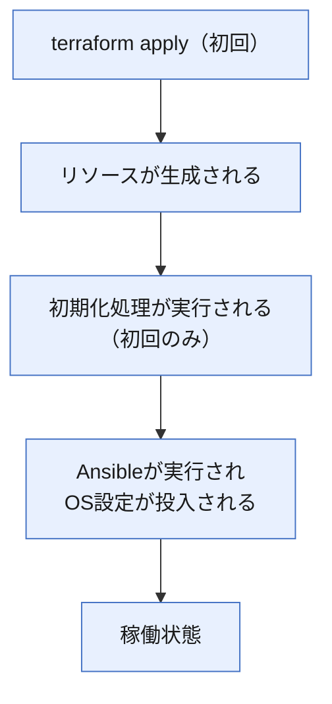

<style>
table th,
table td {
    word-break: normal;
}
table td:first-child {
    white-space: nowrap;
}
</style>


> **🗺️ 初めての方・シリーズの全体像を知りたい方はこちら**
> 
> シリーズ全体については、以下のまとめブログで整理しています。
> 
> → **「AnsibleとTerraformの連携が壊れる理由はライフサイクルにあった」第2部まとめブログ： TerraformとAnsibleの運用で直面する構成ズレと状態管理の問題** **※近日公開予定**

---

## 📋 目次

1. [はじめに](#1-はじめに)
2. [初期化処理の基本動作](#2-初期化処理の基本動作)
3. [terraform apply再実行時の連鎖構造](#3-terraform-apply再実行時の連鎖構造)
4. [初期化スクリプト以外の変更が引き起こす再生成リスク](#4-初期化スクリプト以外の変更が引き起こす再生成リスク)
5. [消失を防ぐ設計パターン](#5-消失を防ぐ設計パターン)
6. [まとめ](#6-まとめ)
7. [次回予告](#7-次回予告)
8. [連載一覧：「AnsibleとTerraformの連携が壊れる理由はライフサイクルにあった」](#8-連載一覧ansibleとterraformの連携が壊れる理由はライフサイクルにあった)

---

## 1. はじめに

「`terraform apply`を実行しただけなのに、Ansibleで設定したはずの内容が消えていた」という経験はないでしょうか。

前回、**[第11回](https://juehara-crypto.github.io/blog/infra/ansible/ansible-terraform/ansible-terraform-part2/ansible-terraform-part2-11/)** では、手動でOS内部に変更を加えた際に、`terraform plan`と`ansible-playbook --check --diff`がそれぞれ独立した検知範囲を持つことを確認しました。一方の管理範囲での変化が、もう一方に伝わることはありません。この結果から導いた結論は、インフラ層とOS層を二軸として、どちらも確認、同期する必要があるというものでした。

今回扱う問題は、この前提が崩れるケースです。前回のテーマが「手動変更」という、Terraform、Ansibleどちらの正規の操作でもない外部からの変更だったのに対し、今回のテーマは「`terraform apply`という正規の操作そのもの」がAnsibleの設定を消失させるという点にあります。

具体的には、次のような場面です。

- コンテナ起動定義に少し手を加えて`terraform apply`を再実行した
- 特にAnsible側は何も変更していないのに、再実行後にOS内部の設定が初期状態に戻っている
- `terraform plan`は差分を正しく示していたはずなのに、その差分が何を意味するかを見落としていた

この事象の原因は、初期化スクリプトやコンテナ起動定義の性質と、Terraformがリソースをどう扱うかという2つの構造が連鎖することにあります。初期化スクリプトやコンテナ起動定義は、リソースの初回起動時にのみ実行される仕組みです。この前提のもとで初期化スクリプトやコンテナ起動定義の内容を変更すると、Terraformはそれをリソース属性の変更として検知し、更新ではなく破棄、再生成という形で対応することがあります。リソースが再生成されれば、初期化処理も再実行されます。しかし、Ansibleが投入したOS内部の設定は、この初期化処理の管轄には含まれていません。結果として、リソースが新しく生成された直後の状態は、Ansible適用前の状態に戻っています。

この回では、「初期化処理とTerraformの再実行はどのように連鎖してOS層の消失を引き起こすか」という問いを軸に、この連鎖の構造を順番に整理します。まず次のセクションで、前提となる初期化処理そのものの基本動作を確認します。

---

[↑ 目次に戻る](#-目次)

---

## 2. 初期化処理の基本動作

この回の前提となる、初期化処理そのものの基本動作を整理します。

Terraformでコンテナやインスタンスといったリソースを生成する際、多くのプロバイダーには、リソースの起動と同時に何らかの初期処理を実行する仕組みが用意されています。AWSであれば`user_data`、Dockerプロバイダーであれば`upload`ブロックやエントリポイント（`CMD`、`ENTRYPOINT`）の指定がこれにあたります。この回では、こうした仕組みをまとめて「初期化スクリプト・コンテナ起動定義」と呼びます。

初期化スクリプト・コンテナ起動定義には、次のような共通した性質があります。

- リソースの初回起動時にのみ実行される
- 通常の運用でリソースが再起動されても、初期化処理そのものは再実行されない
- 実行されるタイミングは、リソースが生成された直後、つまりOSやコンテナのプロセスが起動するタイミングに限られる

この性質から、初期化スクリプト・コンテナ起動定義は、Ansibleが動き出す前の最小限の前提条件を整えるという用途で使われることが多くあります。典型的な例は、次のようなものです。

- SSH公開鍵の配置
- Ansible実行に必要なPythonランタイムのインストール
- sudoersの設定

これらはいずれも、Ansibleがそのリソースに接続し、Playbookを実行できる状態にするための準備であり、OS設定の本体そのものではありません。実際の構成管理、つまりミドルウェアの導入や設定ファイルの配置、サービスの起動といった作業は、初期化処理の後にAnsibleが担うという役割分担が一般的です。

この関係を、リソース生成からAnsible実行までの流れとして図示します。



この図が示す流れの中で、注目したいのは「初期化処理が実行される」ステップに「初回のみ」という注記が付いている点です。この一度きりという性質そのものは、SSH鍵配置のような軽い前提条件整備を行う分には問題になりません。リソースが稼働し続けている限り、その配置内容は保持されたままだからです。

しかし、この「初回のみ」という性質は、リソースが破棄され、再生成されたときには別の意味を持ちます。再生成されたリソースにとっては、それもまた「初回起動」にあたるため、初期化処理は改めて実行されます。この初期化処理の再実行と、Ansibleが投入したOS設定の関係がどうなるかが、次のセクションで扱う核心の連鎖構造です。

---

[↑ 目次に戻る](#-目次)

---

## 3. terraform apply再実行時の連鎖構造

前セクションで、初期化スクリプト・コンテナ起動定義には「リソースの初回起動時にのみ実行される」という性質があることを確認しました。この性質が、リソースの再生成というタイミングでどのような問題を引き起こすかを、実機で確認します。

まず、この連鎖の全体像を整理します。

```plaintext
初期化スクリプト・コンテナ起動定義を変更してterraform applyを再実行する
　↓
Terraformがリソースを破棄する　← Ansibleの設定がここで消える
　↓
リソースが再生成される
　↓
初期化処理が再実行される
　↓
Ansibleが再実行されない限りOS設定は投入されない　← ここが問題
```

ポイントは、Ansibleの設定が消えるタイミングが「リソースの破棄」の時点であるという点です。初期化処理の再実行はその後の話であり、初期化処理がどのような内容であっても、それによってAnsibleの設定が復元されるわけではありません。Ansibleが再実行されない限り、OS設定は空白のままになります。

この連鎖を、以下の手順で実機確認します。

```plaintext
1.【事前確認】Ansibleで設定を投入した状態のコンテナを用意する
　↓
2.【main.tfの編集】初期化スクリプト・コンテナ起動定義を変更する
　↓
3.【terraform plan】リソース再生成が予告されることを確認する
　↓
4.【terraform apply実行】リソースが再生成されAnsibleの設定が消えていることをログで確認する
　↓
5.【再生成後の状態確認】初期化処理管理下のファイルとAnsible管理下のファイルの状態を対比する
```

### ■ 検証内容（初期化スクリプト・コンテナ起動定義の変更が、Terraformによるリソース再生成とAnsible設定の消失を引き起こすことの確認）

検証には、`docker_container.targets`の`upload`ブロックを使用します。既存のSSH公開鍵投入用の`upload`ブロックとは別に、初期化処理を模したもう1つの`upload`ブロックを新たに追加します。追加するファイルは`/etc/init_marker`とし、Ansible管理下の`/etc/app.conf`とは異なり、初期化処理そのものが書き込むファイルという位置づけにします。この2つのファイルの状態を対比することで、初期化処理の管理範囲とAnsibleの管理範囲の違いを確認します。

#### 1.【事前確認】

target-node1の`/etc/app.conf`が、**[第11回](https://juehara-crypto.github.io/blog/infra/ansible/ansible-terraform/ansible-terraform-part2/ansible-terraform-part2-11/)** 完了時点のdesired state（`environment=production`）のまま残っていることを確認します。

**実行コマンド**

```plaintext
docker exec -it target-node1 cat /etc/app.conf
```

**▼ 実行結果**

```plaintext
environment=production
managed_by=ansible
```

Ansibleが投入した設定が維持されていることが確認できました。この状態を起点として、`main.tf`に変更を加えます。

#### 2.【main.tfの編集】

`docker_container.targets`リソースに、既存のSSH公開鍵投入用の`upload`ブロックはそのまま残し、初期化処理を模した2つ目の`upload`ブロックを追加します。

* **ファイル名：**`main.tf`

```hcl
resource "docker_container" "targets" {
  for_each = local.target_nodes
  name  = each.key
  image = docker_image.ansible_target.image_id
  networks_advanced {
    name = docker_network.lab_net.name
  }
  ports {
    internal = 22
    external = each.value
  }
  upload {
    file    = "/home/ansible/.ssh/authorized_keys"
    content = "${file("${path.module}/id_ed25519.pub")}\n${tls_private_key.generated.public_key_openssh}"
  }
  upload {
    file    = "/etc/init_marker"
    content = "init_version=v1\n"
  }

  lifecycle {
    ignore_changes = [network_mode]
  }
}
```

追加したのは2つ目の`upload`ブロックのみです。既存のSSH公開鍵投入用のブロック、`lifecycle`ブロックには変更を加えていません。

#### 3.【terraform plan】

編集後の`main.tf`で、`terraform plan`を実行します。

**実行コマンド**

```plaintext
terraform plan
```

**▼ 実行結果**

```plaintext
  # docker_container.targets["target-node1"] must be replaced
-/+ resource "docker_container" "targets" {
      + bridge                                      = (known after apply)
      ~ command                                     = [
          - "/usr/sbin/sshd",
          - "-D",
        ] -> (known after apply)
      + container_logs                              = (known after apply)
      - cpu_shares                                  = 0 -> null
      - dns                                         = [] -> null
      - dns_opts                                    = [] -> null
      - dns_search                                  = [] -> null
      ~ entrypoint                                  = [] -> (known after apply)
      ~ env                                         = [] -> (known after apply)
      + exit_code                                   = (known after apply)
      - group_add                                   = [] -> null
      ~ hostname                                    = "f8fdc553391c" -> (known after apply)
      ~ id                                          = "f8fdc553391c6aca63db17cb5f559837b1c4a800327eb1e14727aadf238c41c1" -> (known after apply)
      ~ init                                        = false -> (known after apply)
      ~ ipc_mode                                    = "private" -> (known after apply)
      ~ log_driver                                  = "json-file" -> (known after apply)
      - log_opts                                    = {} -> null
      - max_retry_count                             = 0 -> null
      - memory                                      = 0 -> null
      - memory_swap                                 = 0 -> null
        name                                        = "target-node1"
      ~ network_data                                = [
          - {
              - gateway                   = "172.20.0.1"
              - global_ipv6_prefix_length = 0
              - ip_address                = "172.20.0.2"
              - ip_prefix_length          = 24
              - mac_address               = "02:0d:fc:94:33:79"
              - network_name              = "ansible-lab-net"
                # (2 unchanged attributes hidden)
            },
        ] -> (known after apply)
      - network_mode                                = "bridge" -> null
      - privileged                                  = false -> null
      - publish_all_ports                           = false -> null
      ~ runtime                                     = "runc" -> (known after apply)
      ~ security_opts                               = [] -> (known after apply)
      ~ shm_size                                    = 64 -> (known after apply)
      + stop_signal                                 = (known after apply)
      ~ stop_timeout                                = 0 -> (known after apply)
      - storage_opts                                = {} -> null
      - sysctls                                     = {} -> null
      - tmpfs                                       = {} -> null
        # (20 unchanged attributes hidden)

      ~ healthcheck (known after apply)

      ~ labels (known after apply)

      + upload { # forces replacement
          + content        = <<-EOT
                init_version=v1
            EOT
          + executable     = false
          + file           = "/etc/init_marker"
            # (3 unchanged attributes hidden)
        }

        # (3 unchanged blocks hidden)
    }

（…target-node2、target-node3も同一の差分パターンのため省略…）

  # local_file.ansible_inventory must be replaced
-/+ resource "local_file" "ansible_inventory" {
      ~ content              = <<-EOT
            [target_nodes]
            target-node1 ansible_host=172.20.0.2 ansible_user=ansible
            target-node2 ansible_host=172.20.0.3 ansible_user=ansible
            target-node3 ansible_host=172.20.0.4 ansible_user=ansible
        EOT -> (known after apply) # forces replacement
      ~ content_base64sha256 = "KkhXlZx8nXgEIxclamFBSrbZuIAejMcbDM6fM1+nHzQ=" -> (known after apply)
      ~ content_base64sha512 = "JqWDZ+y9FmkNXVRT5t2BYMRUMEqmtvutqyvo6SY/UEg9IP2BonqA4BIZtAuqjjuMoJ9CTLChP+O6D8jwKAAwrQ==" -> (known after apply)
      ~ content_md5          = "04a6ce20acc9e3d6846519cf5de141d9" -> (known after apply)
      ~ content_sha1         = "5be39bf94b8b814c5107e1a0cf2248e68b7e1ff8" -> (known after apply)
      ~ content_sha256       = "2a4857959c7c9d78042317256a61414ab6d9b8801e8cc71b0cce9f335fa71f34" -> (known after apply)
      ~ content_sha512       = "26a58367ecbd16690d5d5453e6dd8160c454304aa6b6fbadab2be8e9263f50483d20fd81a27a80e01219b40baa8e3b8ca09f424cb0a13fe3ba0fc8f0280030ad" -> (known after apply)
      ~ id                   = "5be39bf94b8b814c5107e1a0cf2248e68b7e1ff8" -> (known after apply)
        # (3 unchanged attributes hidden)
    }

Plan: 4 to add, 0 to change, 4 to destroy.

Changes to Outputs:
  ~ target_nodes_ips = {
      ~ target-node1 = "172.20.0.2" -> (known after apply)
      ~ target-node2 = "172.20.0.3" -> (known after apply)
      ~ target-node3 = "172.20.0.4" -> (known after apply)
    }
```

target-node1〜3のすべてに`must be replaced`が表示され、その根拠として`+ upload { # forces replacement ... file = "/etc/init_marker" }`が明示されています。`upload`ブロックへの追加が`forces replacement`、つまり更新ではなく破棄・再生成としてTerraformに扱われることが分かります。

なお、同じ出力の中には`- network_mode = "bridge" -> null`という表示もありますが、これは **[第11回](https://juehara-crypto.github.io/blog/infra/ansible/ansible-terraform/ansible-terraform-part2/ansible-terraform-part2-11/)** で`lifecycle.ignore_changes`の対象にした属性であり、`forces replacement`のマーカーは付いていません。再生成の引き金が`upload`ブロックの変更であることは、出力上ここで明確に切り分けられます。

#### 4.【terraform apply実行】

**実行コマンド**

```plaintext
terraform apply
```

`yes`で承認すると、target-node1〜3が破棄、再生成されました。

**▼ 実行結果**

```plaintext
Do you want to perform these actions?
  Terraform will perform the actions described above.
  Only 'yes' will be accepted to approve.

  Enter a value: yes

local_file.ansible_inventory: Destroying... [id=5be39bf94b8b814c5107e1a0cf2248e68b7e1ff8]
local_file.ansible_inventory: Destruction complete after 0s
docker_container.targets["target-node2"]: Destroying... [id=b3d6800ee8694dec1ee560e47404061400492a398bd18ab0421d81bb945e0509]
docker_container.targets["target-node3"]: Destroying... [id=b775be160b37ac7312676950171a5c77d4a37786d62444342a4754041f49032e]
docker_container.targets["target-node1"]: Destroying... [id=f8fdc553391c6aca63db17cb5f559837b1c4a800327eb1e14727aadf238c41c1]
docker_container.targets["target-node1"]: Destruction complete after 2s
docker_container.targets["target-node3"]: Destruction complete after 2s
docker_container.targets["target-node3"]: Creating...
docker_container.targets["target-node1"]: Creating...
docker_container.targets["target-node2"]: Destruction complete after 2s
docker_container.targets["target-node2"]: Creating...
docker_container.targets["target-node3"]: Creation complete after 2s [id=5b821b7a628a025235fa17daf68de33590c91ebdc89c5c371e32d67d9299878b]
docker_container.targets["target-node2"]: Creation complete after 3s [id=0de2e5df61721ff60bf8afde7f9dc5d16ebeda0a9f387571efea07e1bf87d0ca]
docker_container.targets["target-node1"]: Creation complete after 3s [id=c207933bacf2af6824303c3d9f99155398618f4f89b6c3444ed0fd5436eacac6]
local_file.ansible_inventory: Creating...
local_file.ansible_inventory: Creation complete after 0s [id=733afaba17b50383acf6b02a681a2bf4379feed0]

Apply complete! Resources: 4 added, 0 changed, 4 destroyed.

Outputs:

target_nodes_ips = {
  "target-node1" = "172.20.0.4"
  "target-node2" = "172.20.0.3"
  "target-node3" = "172.20.0.2"
}
```

3台とも新しいコンテナとして再生成されました。IPアドレスも、target-node2のみ元と同じ`172.20.0.3`が割り当てられ、target-node1・target-node3は入れ替わっています。これは **[第11回](https://juehara-crypto.github.io/blog/infra/ansible/ansible-terraform/ansible-terraform-part2/ansible-terraform-part2-11/)** で触れた「IPアドレスの再利用」がここでも同じ構造で起きていることを示しています。

#### 5.【再生成後の状態確認】

再生成されたコンテナで、Ansible管理下の`/etc/app.conf`と、初期化処理管理下の`/etc/init_marker`をそれぞれ確認します。

**実行コマンド**

```plaintext
docker exec -it target-node1 cat /etc/app.conf
docker exec -it target-node2 cat /etc/app.conf
docker exec -it target-node3 cat /etc/app.conf
```

**▼ 実行結果**

```plaintext
cat: /etc/app.conf: No such file or directory
cat: /etc/app.conf: No such file or directory
cat: /etc/app.conf: No such file or directory
```

3台とも、Ansibleが投入したはずの`/etc/app.conf`が存在しなくなっています。

**実行コマンド**

```plaintext
docker exec -it target-node1 cat /etc/init_marker
```

**▼ 実行結果**

```plaintext
init_version=v1
```

一方、初期化処理が新たに書き込んだ`/etc/init_marker`は、指定した内容通りに存在しています。

### ■ 結果

この検証から、次の2点が確認できました。

1つ目は、初期化スクリプト・コンテナ起動定義への変更が、Terraformによるリソースの破棄、再生成を引き起こすという点です。`terraform plan`の出力では、この再生成の根拠が`forces replacement`という形で該当の属性に明示され、`network_mode`のような`lifecycle.ignore_changes`の対象属性とは区別されていました。

2つ目は、この破棄、再生成によって、Ansibleが投入した設定（`/etc/app.conf`）が消失する一方、初期化処理が新たに書き込んだ内容（`/etc/init_marker`）は再生成後のコンテナにそのまま反映されるという点です。この対比は、初期化処理とAnsibleがそれぞれ別のタイミング、別の管理範囲で動作していることを示しています。初期化処理は「リソースが生成された直後」という一時点のみに関与し、その後の状態を維持し続けるものではありません。一方、Ansibleが投入した設定は、リソースが存続している間は維持されますが、リソースそのものが破棄されれば、その内容も一緒に失われます。

Ansibleを再実行すれば、この`/etc/app.conf`は再び投入され、desired stateに復帰します。しかし、これは自動では起きません。リソースの再生成後、Ansibleの再実行が行われるまでの間、OS設定は空白のままになるという点が、この回の核心にある問題です。

---

[↑ 目次に戻る](#-目次)

---

## 4. 初期化スクリプト以外の変更が引き起こす再生成リスク

前セクションでは、初期化スクリプト・コンテナ起動定義そのものの変更が、リソースの破棄、再生成を引き起こす様子を実機で確認しました。ここで整理しておきたいのは、リソースが破棄、再生成される条件は、初期化スクリプト・コンテナ起動定義の変更に限られないという点です。

Terraformは、リソース定義の属性変更に対して、常に「更新」で対応するわけではありません。属性の種類によっては、更新では反映できないと判断し、リソースを一度破棄してから作り直すという形で対応します。この動作は`force_new_resource`と呼ばれます。

前セクションで確認した`upload`ブロックの変更も、この`force_new_resource`の一例でした。そして`force_new_resource`を引き起こす属性は、初期化スクリプトに相当するものだけではありません。`docker_container`リソースの場合、代表的な例として以下が挙げられます。

- コンテナイメージの変更
- ポートマッピングの変更
- ネットワーク設定の変更

これらはいずれも、コンテナというリソースの根本的な構成要素であり、稼働中のコンテナに対してその場で書き換えることができない属性です。そのため、変更が加わった場合はリソースの破棄、再生成という形でしか反映できません。

ここで重要なのは、前セクションで整理した連鎖の構造そのものは変わらないという点です。前セクションで確認した通り、Ansibleの設定が消えるのは「リソースの破棄」の時点であり、その後の初期化処理の再実行はこの連鎖の一部にすぎません。したがって、初期化スクリプト・コンテナ起動定義を一切変更していなくても、他の属性変更によって`force_new_resource`が発生すれば、リソースは同じように破棄、再生成され、Ansibleが投入したOS内部の設定は同じように消失します。

前セクションの実機検証でも、この構造の一端はすでに出力に表れていました。`terraform plan`の結果には`+ upload { # forces replacement ... }`という表示とともに、`- network_mode = "bridge" -> null`という表示も含まれていましたが、`network_mode`側には`forces replacement`のマーカーは付いていませんでした。これは、`network_mode`が`lifecycle.ignore_changes`の対象になっているため、この属性の変更自体は無視され、再生成の判断材料になっていないことを示しています。裏を返せば、もし`network_mode`が`ignore_changes`の対象になっていなければ、この属性の変更単独でも`force_new_resource`が発生し得るということです。属性ごとに「更新で反映できるか、破棄、再生成が必要か」という性質が個別に決まっている、という点がここから読み取れます。

`terraform plan`は、この`force_new_resource`が発生する場合、リソースの先頭に`-/+`という記号を表示します。これは前セクションで確認した`docker_container.targets`の出力でも同様でした。この`-/+`は、単なる属性の更新（`~`）とは明確に区別されており、`apply`を実行する前に、この記号を確認する習慣があれば、意図しないリソースの再生成を事前に把握できます。

初期化スクリプト・コンテナ起動定義の変更に限らず、どの属性が`force_new_resource`を引き起こすかを網羅的に把握することは、この回の範囲を超えます。ここで押さえておきたいのは、「初期化スクリプトを変更していないから安全」とは言えないという点です。次のセクションでは、この`force_new_resource`という構造そのものを避けることはできないという前提に立ったうえで、Ansibleの設定消失をどう防ぐかという設計パターンを整理します。

---

[↑ 目次に戻る](#-目次)

---

## 5. 消失を防ぐ設計パターン

セクション3、4で整理した内容を振り返ります。初期化スクリプト・コンテナ起動定義の変更、あるいはそれ以外の属性変更のどちらであっても、`force_new_resource`が発生すればリソースは破棄、再生成され、Ansibleが投入したOS内部の設定は消失します。この回の最後に、この消失リスクに対する設計パターンを整理します。

### 初期化スクリプト・コンテナ起動定義の役割を最小限に絞る

1つ目のパターンは、初期化スクリプト・コンテナ起動定義に書く内容そのものを見直すという考え方です。

セクション2で整理した通り、初期化スクリプト・コンテナ起動定義の典型的な用途は、SSH鍵配置やPythonインストールといった、Ansible実行前の前提条件整備でした。この役割を、文字通り「Ansibleが接続し、実行できる状態にするための最小限の準備」に絞り込み、それ以外のOS設定はすべてAnsibleに集約します。

この役割分担を徹底しておくと、リソースが再生成された場合の被害の範囲が変わります。初期化スクリプト・コンテナ起動定義の内容が最小限であれば、再生成後に失われるのは「Ansibleがまだ実行されていない」という一時的な状態だけです。Ansibleを再実行すれば、OS設定は同じ手順で同じ状態に復元されます。逆に、初期化スクリプト・コンテナ起動定義にOS設定の本体まで書き込んでしまっていると、その内容自体を前セクションで整理した属性変更のたびに書き換えることになり、`force_new_resource`を誘発する頻度そのものが増えることにもつながります。

これは新しい技術要素を導入する設計パターンではなく、初期化処理とAnsibleという2つの仕組みの役割を、それぞれの得意な範囲に収めるという整理です。セクション3の検証で使った`/etc/init_marker`と`/etc/app.conf`の対比は、この役割分担が実際に機能した場合の姿を示していました。`/etc/init_marker`側は再生成のたびに新しく作られますが、それは初期化処理の役割の範囲内であり、問題にはなりません。問題になるのは、`/etc/app.conf`のような、本来Ansibleが継続的に管理すべき内容が、初期化スクリプト・コンテナ起動定義の側に書かれてしまっているケースです。

### lifecycle設定による保護

2つ目のパターンは、`lifecycle`ブロックの`ignore_changes`を使い、特定の属性変更そのものをTerraformに無視させる方法です。

```hcl
resource "docker_container" "example" {
  # ...

  lifecycle {
    ignore_changes = [初期化スクリプトに相当する属性]
  }
}
```

この設定を加えると、指定した属性に変更が加わっても、`terraform plan`はその変更を差分として検知しません。結果として、その属性の変更を理由にした`force_new_resource`は発生せず、リソースの破棄、再生成も起きません。

この方法は、今回の検証環境ですでに実例があります。**[第11回](https://juehara-crypto.github.io/blog/infra/ansible/ansible-terraform/ansible-terraform-part2/ansible-terraform-part2-11/)** で`network_mode`の意図しないドリフトに対応するために追加した、以下の設定です。


```hcl
resource "docker_container" "targets" {
  # ...
  lifecycle {
    ignore_changes = [network_mode]
  }
}
```

この設定により、`network_mode`の変更は無視され、この属性を理由にした再生成は起きません。同じ考え方を初期化スクリプトに相当する属性（`docker_container`であれば`upload`など）に適用すれば、その属性の変更による再生成を防ぐことができます。

ただし、この方法には明確な適用範囲の限界があります。`ignore_changes`が防げるのは、あくまで「配列に指定した、その属性の変更」を理由にした再生成だけです。セクション4で整理した通り、`force_new_resource`はコンテナイメージやポートマッピング、ネットワーク設定といった、初期化スクリプトとは無関係の属性変更によっても発生します。`ignore_changes`にどれだけ属性を追加しても、指定していない属性の変更による再生成までは防げません。

さらに、`ignore_changes`で変更を無視するということは、その属性については、HCLコード側の記述と実際のリソースの状態が乖離したまま放置されるということでもあります。**[第11回](https://juehara-crypto.github.io/blog/infra/ansible/ansible-terraform/ansible-terraform-part2/ansible-terraform-part2-11/)** で整理した通り、`terraform plan`が検知する範囲はtfstateが管理する属性に限られますが、`ignore_changes`はその検知範囲の中から、意図的に一部を除外する設定です。除外した属性について、HCLコードを見ただけでは実際の値が分からなくなるという副作用は、この設定を使う際に理解しておく必要があります。

### 2つのパターンの関係

この2つのパターンは、どちらか一方を選ぶものではなく、組み合わせて運用するものです。初期化スクリプト・コンテナ起動定義の役割を最小限に絞ることは、`force_new_resource`が発生した場合の被害を小さくする設計であり、`lifecycle.ignore_changes`は、特定の属性変更について`force_new_resource`の発生そのものを防ぐ設計です。前者はリソース再生成が起きること自体を前提にした備えであり、後者は特定の条件下での再生成を未然に防ぐ備えです。

セクション4で整理した通り、`force_new_resource`を引き起こす属性は初期化スクリプトに限らず、`ignore_changes`で全ての属性をカバーすることは現実的ではありません。したがって、`ignore_changes`で防げる範囲には限界があるという前提に立ったうえで、初期化スクリプト・コンテナ起動定義の役割を最小限に絞り、OS設定の本体をAnsibleに集約しておくという設計が、この回で整理した消失リスクに対する基本的な備え方になります。

---

[↑ 目次に戻る](#-目次)

---

## 6. まとめ

この回で整理した内容を確認します。

* 初期化スクリプト・コンテナ起動定義はリソースの初回起動時にのみ実行される仕組みであり、通常の運用でリソースが再起動されても再実行されない。ただし、リソースが破棄、再生成された場合は、それも「初回起動」にあたるため、初期化処理は改めて実行される
* 初期化スクリプト・コンテナ起動定義の変更は、Terraformによるリソースの破棄、再生成（`force_new_resource`）を引き起こす。Ansibleの設定が消えるのはこの破棄の時点であり、初期化処理の再実行そのものはOS設定を復元しない
* `force_new_resource`を引き起こす属性は初期化スクリプト・コンテナ起動定義に限られない。コンテナイメージやポートマッピング、ネットワーク設定といった他の属性変更によっても同様の破棄、再生成が発生し得る
* `terraform plan`が出力する`-/+`という記号は、この`force_new_resource`が発生することを示す。`apply`前にこの記号を確認する習慣が、意図しない再生成の把握につながる
* 消失を防ぐ設計パターンとして、初期化スクリプト・コンテナ起動定義の役割をAnsible実行前の最小限の前提条件整備に絞り、OS設定の本体をAnsibleに集約する方法と、`lifecycle { ignore_changes }`で特定の属性変更を無視する方法がある。両者は組み合わせて運用するものであり、`ignore_changes`は指定した属性以外の変更による再生成までは防げない

---

[↑ 目次に戻る](#-目次)

---

## 7. 次回予告

**[第11回](https://juehara-crypto.github.io/blog/infra/ansible/ansible-terraform/ansible-terraform-part2/ansible-terraform-part2-11/)** では、手動変更によるドリフトの検知と同期を扱いました。今回はその視点を変え、`terraform apply`という正規の操作そのものが、Ansibleの設定を消失させる引き金になるという構造を整理しました。初期化スクリプト・コンテナ起動定義の変更が`force_new_resource`を引き起こし、リソースの破棄、再生成によってAnsibleの設定が消えるという連鎖、そしてこの`force_new_resource`が初期化スクリプトの変更に限らず発生し得るという点を確認しました。

次回は、この`force_new_resource`という現象そのものに焦点を絞り込みます。今回は「どのような属性変更が再生成を引き起こすか」を代表例にとどめましたが、次回はTerraformのHCL定義変更によってリソースが「更新」ではなく「破棄・再生成」として扱われる条件を整理し、Ansibleが投入した内部データが消失するリスクをより具体的に扱います。

**次回：第13回：コード修正に伴うリソースの強制再生成（リビルド）リスク**

---

📑 連載の移動　**[前の記事：【Ansible×Terraform編】第11回](https://juehara-crypto.github.io/blog/infra/ansible/ansible-terraform/ansible-terraform-part2/ansible-terraform-part2-11/)　｜　次の記事：【Ansible×Terraform編】第13回**

---

> **🗺️ 初めての方・シリーズの全体像を知りたい方はこちら**
> 
> シリーズ全体については、以下のまとめブログで整理しています。
> 
> → **「AnsibleとTerraformの連携が壊れる理由はライフサイクルにあった」第2部まとめブログ： TerraformとAnsibleの運用で直面する構成ズレと状態管理の問題** **※近日公開予定**

---

[↑ 目次に戻る](#-目次)

---

## 8. 連載一覧：「AnsibleとTerraformの連携が壊れる理由はライフサイクルにあった」

### 第2部：運用・ライフサイクル編

|回数|テーマ・記事タイトル|概要|
|---|---|---|
|**[第11回](https://juehara-crypto.github.io/blog/infra/ansible/ansible-terraform/ansible-terraform-part2/ansible-terraform-part2-11/)**|手動変更による構成ドリフトの検知と同期手法|構築後に手動やAnsibleで変更したOS内部の状態を、Terraformの`plan`が検知できず、インフラの管理状態に不整合が出る問題。ドリフトシリーズとの接続を示す。|
|**第12回**|`terraform apply`実行時における初期化処理とOS設定の上書き問題|Terraform側で初期化スクリプトやコンテナ起動定義を書き換えて再実行した際、Ansibleによって設定済みのOS内部状態が初期化される課題。|
|第13回|コード修正に伴うリソースの強制再生成（リビルド）リスク|TerraformのHCL定義変更によって、リソースが「更新」ではなく「破棄・再生成」され、Ansibleが投入した内部データが消失する課題。|
|第14回|複数回実行時におけるAnsible Playbookの冪等性の確保|1回目の実行は成功するものの、2回目（運用フェーズ）の実行時に「ファイル重複」や「サービス重複起動」等でAnsibleが停止する問題。冪等性シリーズ・レガシーPlaybook引き継ぎの知識を実践に適用する回として位置づける。|
|第15回|チーム運用における状態管理ファイル（tfstate）の整合性維持|Ansibleを実行するオペレーターと、Terraformを管理するエンジニア間で、Terraformの状態管理ファイルに競合が発生するリスク。チーム運用での役割分担設計も整理する。|
|第16回|パッケージアップデートに伴う環境の非互換性への対応|運用中に`apt update`等を実行した結果、OSのライブラリやミドルウェアのバージョンが上がり、Terraformの定義と矛盾が生じるケース。|
|第17回|リソース再生成時におけるIPアドレス変動と接続情報の更新遅延|リソース（コンテナ/VM）の再生成に伴ってIPアドレスが変更された際、Ansible用のインベントリや各種設定ファイルの書き換えが追いつかない問題。|
|第18回|TerraformとAnsible Vaultにおける機密情報の役割分担|データベースのパスワードやAPIキーなどの機密情報を、両ツールのどちらで暗号化し、どのように管理すべきかの運用設計。Vault誤用パターンと回避策も整理する。|
|第19回|OSのメジャーバージョンアップ時におけるPlaybookの互換性検証|Terraform側でベースイメージ（例：Ubuntu 22.04→24.04）を変更した際、Ansibleの古い独自モジュールやシェルコマンドが機能しなくなる課題。|
|第20回|運用編まとめ：ミュータブル運用とイミュータブル運用の折衷案|状態（データ）を維持し続ける運用（ミュータブル）と、使い捨てる運用（イミュータブル）を、両ツールの組み合わせでどのように着地させるかの最適解。|

---

[↑ 目次に戻る](#-目次)

---
